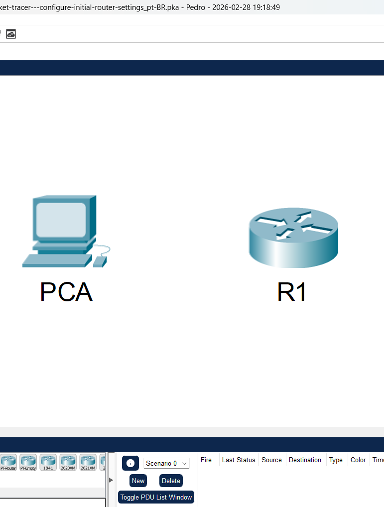
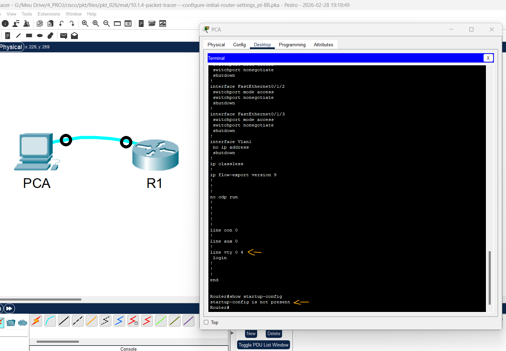
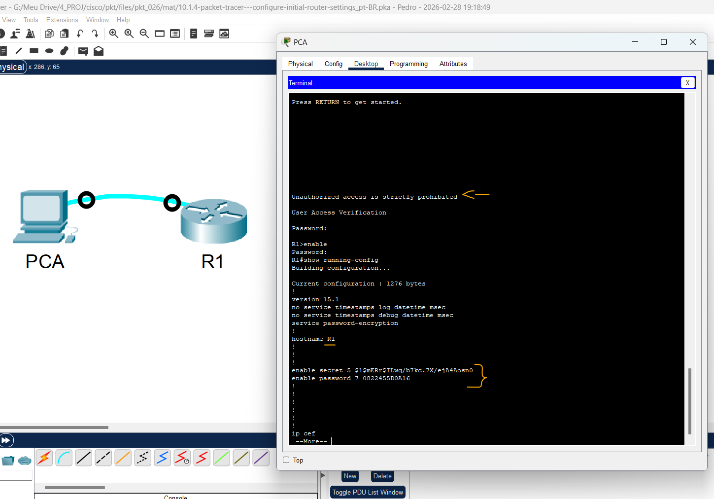
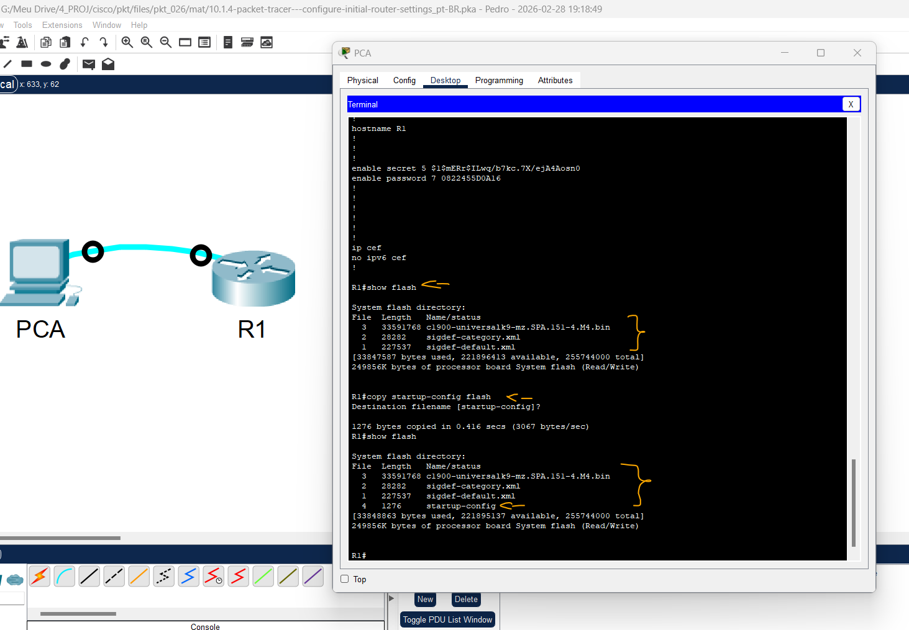

# Packet Tracer – Configurar definições iniciais do roteador   

### Cisco: <a href="../../../">cisco   </a>
### Cisco Networking Academy: cna   </a>
### Training Category: <a href="../../../pkt/">pkt</a>
### Software/Subject: network   </a>
### Course: <a href="./">pkt_026 (Packet Tracer – Configurar definições iniciais do roteador)   </a>

---

### Theme:
- Network

### Used Tools:
- Operating System (OS):
  - Cisco Internetwork Operating System (Cisco IOS)   
  - Windows 11 
- Cloud Services:
  - Google Drive 
- Language:
  - HTML   
  - Markdown   
- Integrated Development Environment (IDE) and Text Editor:
  - Visual Studio Code (VS Code)   
- Versioning: 
  - Git   
- Repository:
  - GitHub   
- Network:
  - Cisco Packet Tracer   

---

<h3><a name="item00">Course Strcuture:</a></h3>

1. <a href="#item01">Parte 1: Verificar a Configuração Padrão do Roteador</a> 
  1.1 <a href="#item01.01">Etapa 1: Estabeleça uma conexão de console com R1.</a> 
  1.2 <a href="#item01.02">Etapa 2: Entre no modo privilegiado e examine a configuração atual.</a> 
2. <a href="#item02">Parte 2: Definir e Verificar a Configuração Inicial do Roteador</a> 
  2.1 <a href="#item02.01">Etapa 1: Defina as configurações iniciais em R1.</a> 
  2.2 <a href="#item02.02">Etapa 2: Verifique as configurações iniciais em R1.</a> 
3. <a href="#item03">Parte 3: Salvar o Arquivo de Configuração Atual</a> 
  3.1 <a href="#item03.01">Etapa 1: Salve o arquivo de configuração na NVRAM.</a> 
  3.2 <a href="#item03.02">Etapa 2: Opcional: Salve o arquivo de configuração de inicialização na flash.</a> 

---

### Objective:
Esta atividade teve como objetivo realizar as configurações iniciais de um roteador, incluindo a definição do hostname, configuração de senhas de acesso, criptografia das senhas e a criação de uma mensagem de aviso (MOTD). Ao final, a configuração foi salva na NVRAM e também copiada para a memória flash, garantindo sua persistência mesmo após reinicializações do dispositivo.

### Folder Structure:
- [README.md](./README.md): Este documento de README, escrito em **Markdown**, com o conteúdo do laboratório.
- [0-aux](./0-aux/): Pasta auxiliar com imagens utilizadas na construção dos arquivos de README desse curso.

### Development:

<a name="item01"><h4>1. Parte 1: Verificar a Configuração Padrão do Roteador</h4></a>[Back to summary](#item00)

A imagem 01 mostra a topologia inicial.

<figure>
     
    <figcaption>Imagem 01.</figcaption>
</figure>
 

<a name="item01.01"><h4>1.1 Etapa 1: Estabeleça uma conexão de console com R1.</h4></a>[Back to summary](#item00)

- a. Escolha um cabo do console nas conexões disponíveis.
- b. Clique em PCA e selecione RS 232.
- c. Clique em R1 e selecione Console.
- d. Clique em PCA> guia Desktop> Terminal.
- e. Clique em OK e pressione ENTER. Agora você pode configurar R1.

<a name="item01.02"><h4>1.2 Etapa 2: Entre no modo privilegiado e examine a configuração atual.</h4></a>[Back to summary](#item00)

É possível acessar todos os comandos do roteador no modo EXEC privilegiado. No entanto, como muitos dos comandos privilegiados configuram parâmetros operacionais, o acesso privilegiado deve ser protegido por senha para evitar o uso não autorizado. 

- a. Entre no modo EXEC privilegiado inserindo o comando enable. Observe que o prompt mudou na configuração para refletir o modo EXEC privilegiado.
  - `enable`.
- b. Insira o comando show running-config. 
  - `show running-config`.
- b. Qual é o nome de host do roteador?
  - O nome de host configurado no roteador é Router.
- b. Quantas interfaces Fast Ethernet o roteador tem?
  - Este roteador possui 4 interface Fast Ethernet.
- b. Quantas interfaces Gigabit Ethernet o roteador tem?
  - Este roteador possui 2 interfaces Gigabit Ethernet.
- b. Quantas interfaces seriais o roteador tem?
  - Este roteador possui 2 interfaces serial.
- b. Qual é a faixa de valores mostrados nas linhas VTY?
  - As linhas VTY apresentam uma faixa de valores que vai de 0 a 4.
- c. Exiba o conteúdo atual da NVRAM.
  - `show startup-config`.
- c. Por que o roteador responde com a mensagem startup-config não está presente?
  - O roteador responde com essa mensagem porque a configuração ainda não foi salva na NVRAM, portanto o arquivo startup-config ainda não foi criado.

A imagem 02 exibe parte do arquivo de configuração em execução (running-config) e a mensagem indicando que o arquivo de configuração inicial (startup-config) não está presente.

<figure>
     
    <figcaption>Imagem 02.</figcaption>
</figure>
 

<a name="item02"><h4>2. Parte 2: Definir e Verificar a Configuração Inicial do Roteador</h4></a>[Back to summary](#item00)

Para configurar parâmetros em um roteador, talvez seja necessário alternar entre os diversos modos de configuração. Observe como o prompt muda à medida que você navega pelos modos de configuração do IOS.

<a name="item02.01"><h4>2.1 Etapa 1: Defina as configurações iniciais em R1.</h4></a>[Back to summary](#item00)

Nota: Se você tiver dificuldade em lembrar os comandos, consulte o conteúdo deste tópico. Os comandos são os mesmos com os quais você configurou um switch. 

- a. Configure R1 como o nome de host.
  - `configure terminal` -> `hostname R1`.
- b. Configurar Mensagem do dia - texto: acesso não autorizado é estritamente proibido.
  - `banner motd #Unauthorized access is strictly prohibited#`.
- c. Criptografe todas as senhas em texto simples. Use as seguintes senhas:
  - EXEC privilegiado, não criptografado: `cisco`: `service password-encryption` -> `enable password cisco`.
  - EXEC privilegiado, criptografado: `itsasecret`: `enable secret itsasecret`.
  - Console: `letmein`: `line console 0` -> `password letmein` -> `login` -> `exit` -> `exit`.

<a name="item02.02"><h4>2.2 Etapa 2: Verifique as configurações iniciais em R1.</h4></a>[Back to summary](#item00)

- a. Verifique as configurações iniciais visualizando a configuração de R1. Que comando você usa?
  - `show running-config`.
- b. Saia da sessão de console atual até ver a seguinte mensagem: R1 con0 is now available.
  - `exit`.
- c. Pressione Enter; você deverá ver a seguinte mensagem: Unauthorized access is strictly prohibited. (O acesso não autorizado é estritamente proibido.). Por que todos os roteadores devem ter um banner de mensagem do dia (MOTD)?
  - O banner MOTD é utilizado para alertar usuários sobre políticas de segurança e restrições de acesso ao dispositivo, deixando claro que apenas pessoas autorizadas podem utilizá-lo. Isso ajuda na segurança da rede e também pode ter finalidade legal, ao registrar que o acesso não autorizado é proibido.
- c. Se você não for solicitado uma senha antes de acessar o prompt do usuário EXEC, qual comando da linha do console você esqueceu de configurar?
  - O comando esquecido é `login`, pois ele faz com que o roteador solicite a senha configurada na linha de console antes de permitir o acesso ao modo EXEC do usuário.
- d. Insira as senhas necessárias para voltar ao modo EXEC privilegiado.
  - `enable` -> `itsasecret`.
- d. Por que o comando enable secret password permitiria acesso ao modo EXEC privilegiado e o comando enable password perderia a validade? 
  - Isso ocorre porque o comando enable secret utiliza criptografia mais segura para armazenar a senha e, quando configurado, tem prioridade sobre o comando enable password. Portanto, o roteador passa a utilizar apenas a senha definida em enable secret para acessar o modo EXEC privilegiado.
- d. Se você configurar mais alguma senha no roteador, elas serão exibidas no arquivo de configuração como texto simples ou em formato criptografado? Explique. 
  - As senhas serão exibidas em formato criptografado, pois o comando service password-encryption foi configurado no roteador. Esse comando criptografa as senhas que normalmente apareceriam em texto simples no arquivo de configuração, aumentando a segurança das informações.

A imagem 03 apresenta parte do arquivo de configuração em execução (running-config), evidenciando algumas das configurações básicas aplicadas ao dispositivo.

<figure>
     
    <figcaption>Imagem 03.</figcaption>
</figure>
 

<a name="item03"><h4>3. Parte 3: Salvar o Arquivo de Configuração Atual</h4></a>[Back to summary](#item00)

<a name="item03.01"><h4>3.1 Etapa 1: Salve o arquivo de configuração na NVRAM.</h4></a>[Back to summary](#item00)

- a. Você definiu as configurações iniciais para R1. Agora faça backup do arquivo de configuração atual na NVRAM para garantir que as alterações não sejam perdidas caso o sistema seja reinicializado ou haja queda de energia. Que comando você inseriu para salvar a configuração na NVRAM? 
  - `copy running-config startup-config`.
- b. Qual é a versão mais curta e inequívoca desse comando?
  - `copy run start`.
- c. Que comando exibe o conteúdo da NVRAM?
  - `show startup-config`
- d. Verifique se todos os parâmetros configurados foram salvos. Caso contrário, analise a saída e determine quais comandos não foram executados ou foram inseridos incorretamente. Você também pode clicar em Check Results (Verificar resultados) na janela de instruções.

<a name="item03.02"><h4>3.2 Etapa 2: Opcional: Salve o arquivo de configuração de inicialização na flash.</h4></a>[Back to summary](#item00)

Embora você aprenda mais sobre o gerenciamento do armazenamento flash em um roteador nos próximos capítulos, talvez esteja interessado em saber que, como um procedimento adicional de backup, você pode salvar o arquivo de configuração de inicialização em flash. Por padrão, o roteador carrega a configuração inicial da NVRAM. No entanto, se a NVRAM for corrompida, você poderá restaurar a configuração inicial copiando-a da memória flash. Siga estas etapas para salvar a configuração inicial na memória flash. 

- a. Examine o conteúdo do flash usando o comando show flash. 
  - `show flash`.
- a. Quantos arquivos estão armazenados na memória flash no momento?
  - Atualmente, 3 arquivos estão armazenados na memória flash do roteador.
- a. Quais desses arquivos você diria que é a imagem IOS?
  - O arquivo que corresponde à imagem IOS é `c1900-universalk9-mz.SPA.151-4.M4.bin` (`ISR4300-universalk9.03.16.05.s.155-3.s5-ext.spa.bin`).
- a. Por que você acha que esse arquivo é a imagem IOS?
  - Porque ele possui a extensão .bin, que normalmente identifica arquivos binários da imagem do sistema operacional do roteador. Além disso, o nome do arquivo inclui c1900, que corresponde à série do roteador, indicando que se trata da imagem do Cisco IOS utilizada no dispositivo.
- b. Salve o arquivo de configuração inicial na memória flash usando os seguintes comandos. 
  - `copy startup-config flash`.
- b. O roteador solicita que você armazene o arquivo em flash usando o nome entre colchetes. Se a resposta for sim, pressione ENTER; caso contrário, digite um nome adequado e pressione ENTER.
- c. Use o comando show flash para verificar se o arquivo de configuração de inicialização agora está armazenado no flash. 
  - `show flash`.

A imagem 04 mostra que o arquivo de configuração inicial (startup-config) foi copiado com sucesso para a memória flash do dispositivo.

<figure>
     
    <figcaption>Imagem 04.</figcaption>
</figure>
 