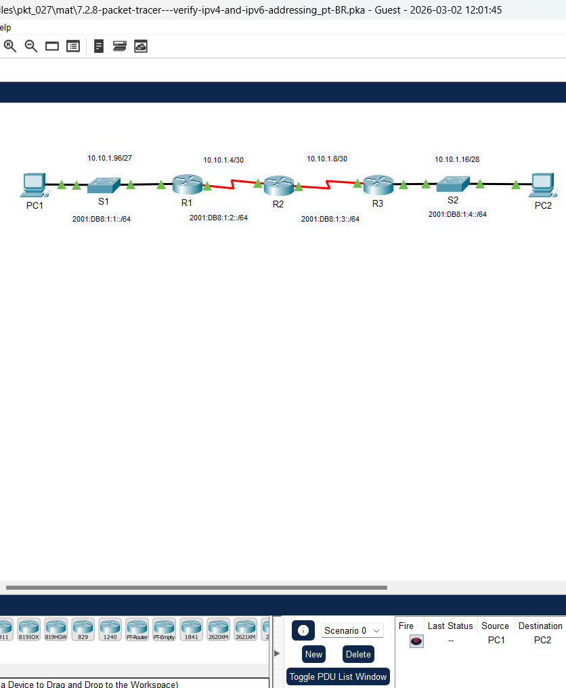
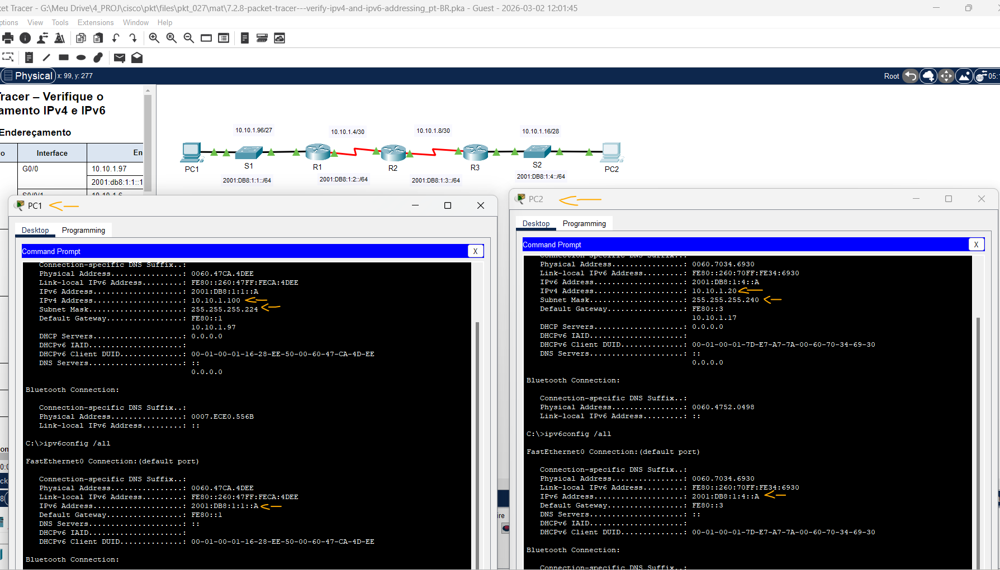
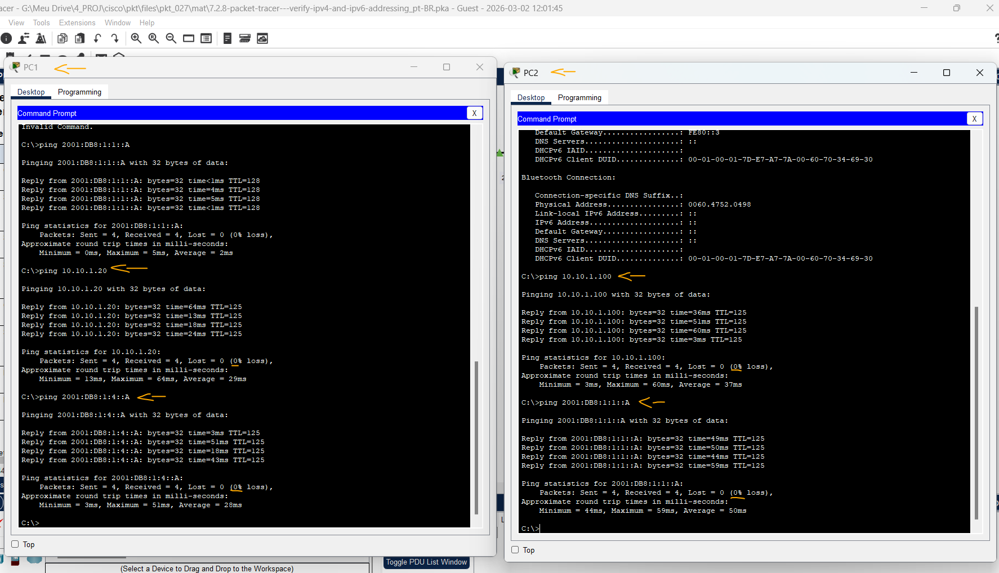
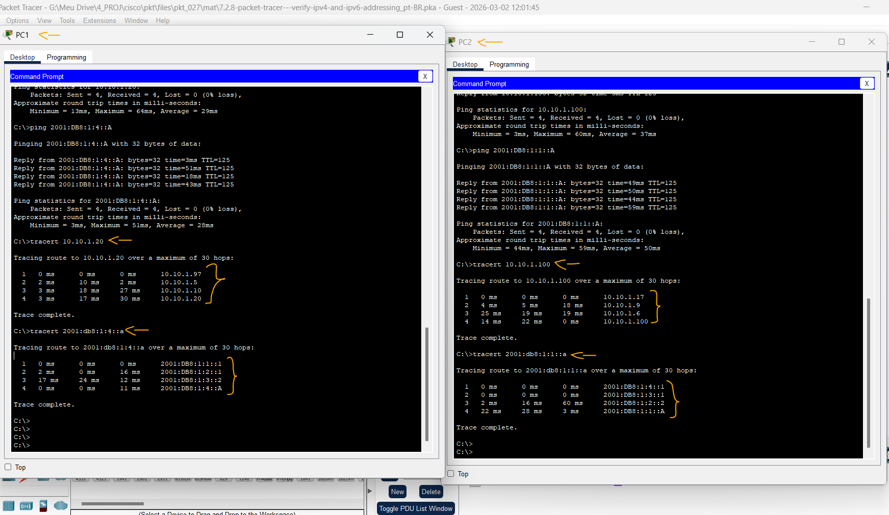

# Packet Tracer - Verificar endereçamento IPv4 e IPv6   

### Cisco: <a href="../../../">cisco   </a>
### Cisco Networking Academy: cna   </a>
### Training Category: <a href="../../../pkt/">pkt</a>
### Software/Subject: network   </a>
### Course: <a href="./">pkt_027 (Packet Tracer - Verificar endereçamento IPv4 e IPv6)   </a>

---

### Theme:
- Network

### Used Tools:
- Operating System (OS):
  - Windows 11 
- Cloud Services:
  - Google Drive 
- Language:
  - HTML   
  - Markdown   
- Integrated Development Environment (IDE) and Text Editor:
  - Visual Studio Code (VS Code)   
- Versioning: 
  - Git   
- Repository:
  - GitHub   
- Network:
  - Cisco Packet Tracer   
  - ping   
  - Trace Route (tracert)   

---

<h3><a name="item00">Course Strcuture:</a></h3>

1. <a href="#item01">Parte 1: Conclua a documentação da tabela de endereçamento.</a> 
  1.1 <a href="#item01.01">Passo 1: Use o ipconfig para verificar o endereçamento IPv4.</a> 
  1.2 <a href="#item01.02">Passo 2: Use o comando ipv6 config para verificar o endereçamento IPv6.</a> 
2. <a href="#item02">Parte 2: Testar a conectividade usando o ping</a> 
  2.1 <a href="#item02.01">Passo 1: Use o comando ping para verificar a conectividade IPv4.</a> 
  2.2 <a href="#item02.02">Passo 2: Use o comando ping para verificar a conectividade IPv6.</a> 
3. <a href="#item03">Parte 3: Descubra o caminho traçando a rota</a> 
  3.1 <a href="#item03.01">Passo 1: Use o comando tracert para descobrir o caminho IPv4.</a> 
  3.2 <a href="#item03.02">Passo 2: Use o tracert para descobrir o caminho IPv6.</a> 

---

### Objective:
O objetivo desta atividade foi verificar o endereçamento IPv4 e IPv6 de dois dispositivos, testar a conectividade entre eles e rastrear o caminho percorrido pelos pacotes na rede, analisando cada salto ao longo da rota.

### Folder Structure:
- [README.md](./README.md): Este documento de README, escrito em **Markdown**, com o conteúdo do laboratório.
- [0-aux](./0-aux/): Pasta auxiliar com imagens utilizadas na construção dos arquivos de README desse curso.

### Development:

<a name="item01"><h4>1. Parte 1: Conclua a documentação da tabela de endereçamento.</h4></a>[Back to summary](#item00)

A imagem 01 mostra a topologia inicial.

<figure>
     
    <figcaption>Imagem 01.</figcaption>
</figure>
 

<a name="item01.01"><h4>1.1 Passo 1: Use o ipconfig para verificar o endereçamento IPv4.</h4></a>[Back to summary](#item00)

- a. Clique em PC1 e abra o Prompt de Comando.
- b. Digite o comando ipconfig /all para coletar as informações de IPv4. Preencha a tabela de endereçamento com o endereço IPv4, a máscara de sub-rede e o gateway padrão.
- c. Clique em PC2 e abra o Prompt de Comando.
- d. Digite o comando ipconfig /all para coletar as informações de IPv4. Preencha a tabela de endereçamento com o endereço IPv4, a máscara de sub-rede e o gateway padrão.

<a name="item01.02"><h4>1.2 Passo 2: Use o comando ipv6 config para verificar o endereçamento IPv6.</h4></a>[Back to summary](#item00)

- a. No PC1, digite o comando ipv6config /all para coletar as informações de IPv6. Preencha a Tabela de Endereçamento com o endereço IPv6, prefixo de sub-rede e gateway padrão.
- b. No PC2, digite o comando ipv6config /all para coletar as informações de IPv6. Preencha a Tabela de Endereçamento com o endereço IPv6, prefixo de sub-rede e gateway padrão.

#### Tabela 1 — Planejamento de Endereçamento IPv4 e IPv6

| Dispositivo | Interface | Versão IP | Endereço IP / Prefixo | Gateway Padrão |
|:---:|:---:|:---:|:---:|:---:|
| R1 | G0/0 | IPv4 | 10.10.1.97 / 255.255.255.224 | N/A |
| R1 | G0/0 | IPv6 | 2001:db8:1:1::1/64 | N/A |
| R1 | S0/0/1 | IPv4 | 10.10.1.6 / 255.255.255.252 | N/A |
| R1 | S0/0/1 | IPv6 | 2001:db8:1:2::2/64 | N/A |
| R1 | S0/0/1 | IPv6 | fe80::1 | Endereço Link-Local |
| R2 | S0/0/0 | IPv4 | 10.10.1.5 / 255.255.255.252 | N/A |
| R2 | S0/0/0 | IPv6 | 2001:db8:1:2::1/64 | N/A |
| R2 | S0/0/1 | IPv4 | 10.10.1.9 / 255.255.255.252 | N/A |
| R2 | S0/0/1 | IPv6 | 2001:db8:1:3::1/64 | N/A |
| R2 | S0/0/1 | IPv6 | fe80::2 | Endereço Link-Local |
| R3 | G0/0 | IPv4 | 10.10.1.17 / 255.255.255.240 | N/A |
| R3 | G0/0 | IPv6 | 2001:db8:1:4::1/64 | N/A |
| R3 | S0/0/1 | IPv4 | 10.10.1.10 / 255.255.255.252 | N/A |
| R3 | S0/0/1 | IPv6 | 2001:db8:1:3::2/64 | N/A |
| R3 | S0/0/1 | IPv6 | fe80::3 | Endereço Link-Local |
| PC1 | NIC (Fa0) | IPv4 | 10.10.1.100 / 255.255.255.224 | 10.10.1.97 |
| PC1 | NIC (Fa0) | IPv6 | 2001:DB8:1:1::A/64 | FE80::1 |
| PC2 | NIC (Fa0) | IPv4 | 10.10.1.20 / 255.255.255.240 | 10.10.1.17 |
| PC2 | NIC (Fa0) | IPv6 | 2001:DB8:1:4::A/64 | FE80::3 |

A imagem 02 exibe a conclusão da Parte 1.

<figure>
     
    <figcaption>Imagem 02.</figcaption>
</figure>
 

<a name="item02"><h4>2. Parte 2: Testar a conectividade usando o ping</h4></a>[Back to summary](#item00)

<a name="item02.01"><h4>2.1 Passo 1: Use o comando ping para verificar a conectividade IPv4.</h4></a>[Back to summary](#item00)

- a. Do PC1, execute um ping no endereço IPv4 do PC2. O resultado foi bem-sucedido?
  - Sim, o resultado foi bem-sucedido.
- b. Do PC2, execute um ping no endereço IPv4 do PC1. O resultado foi bem-sucedido?
  - Sim, o resultado foi bem-sucedido.

<a name="item02.02"><h4>2.2 Passo 2: Use o comando ping para verificar a conectividade IPv6.</h4></a>[Back to summary](#item00)

- a. A partir do PC1, execute um ping para o endereço IPv6 do PC2. O resultado foi bem-sucedido?
  - Sim, o resultado foi bem-sucedido.
- b. Do PC2, execute um ping para o endereço IPv6 do PC1. O resultado foi bem-sucedido?
  - Sim, o resultado foi bem-sucedido.

A imagem 03 exibe a conclusão da Parte 2.

<figure>
     
    <figcaption>Imagem 03.</figcaption>
</figure>
 

<a name="item03"><h4>3. Parte 3: Descubra o caminho traçando a rota</h4></a>[Back to summary](#item00)

<a name="item03.01"><h4>3.1 Passo 1: Use o comando tracert para descobrir o caminho IPv4.</h4></a>[Back to summary](#item00)

- a. A partir do PC1, trace a rota até o PC2 (`tracert 10.10.1.20`). Quais endereços foram encontrados ao longo do caminho?
  - Os endereços encontrados ao longo do caminho foram: 10.10.1.97, 10.10.1.5, 10.10.1.10 e 10.10.1.20.
- a. Com quais interfaces os quatro endereços estão associados?
  - Esses endereços estão associados, respectivamente, às seguintes interfaces: Router R1 (G0/0), Router R2 (S0/0/0), Router R3 (S0/0/1) e PC2 (Fa0).
- b. A partir do PC2, trace o caminho até o PC1 (`tracert 10.10.1.100`). Quais endereços foram encontrados ao longo do caminho?
  - Os endereços encontrados ao longo do caminho foram: 10.10.1.17, 10.10.1.9, 10.10.1.6 e 10.10.1.100.
- b. A quais interfaces estão associados os quatro endereços?
  - Esses endereços estão associados, respectivamente, às seguintes interfaces: Router R3 (G0/0), Router R2 (S0/0/1), Router R1 (S0/0/1) e PC1 (Fa0).

<a name="item03.02"><h4>3.2 Passo 2: Use o tracert para descobrir o caminho IPv6.</h4></a>[Back to summary](#item00)

- a. A partir do PC1, rastreie a rota até o endereço IPv6 do PC2 (`tracert 2001:db8:1:4::a`). Quais endereços foram encontrados ao longo do caminho?
  - Os endereços encontrados ao longo do caminho foram: 2001:DB8:1:1::1, 2001:DB8:1:2::1, 2001:DB8:1:3::2 e 2001:DB8:1:4::A.
- a. A quais interfaces estão associados os quatro endereços?
  - Esses endereços estão associados, respectivamente, às seguintes interfaces: Router R1 (G0/0), Router R2 (S0/0/0), Router R3 (S0/0/1) e PC2 (Fa0).
- b. A partir do PC2, trace a rota até o endereço IPv6 do PC1 (`tracert 2001:db8:1:1::a`). Quais endereços foram encontrados ao longo do caminho?
  - Os endereços encontrados ao longo do caminho foram: 2001:DB8:1:4::1, 2001:DB8:1:3::1, 2001:DB8:1:2::2 e 2001:DB8:1:1::A.
- b. A quais interfaces estão associados os quatro endereços?
  - Esses endereços estão associados, respectivamente, às seguintes interfaces: Router R3 (G0/0), Router R2 (S0/0/1), Router R1 (S0/0/1) e PC1 (Fa0).

A imagem 04 exibe a conclusão da Parte 3.

<figure>
     
    <figcaption>Imagem 04.</figcaption>
</figure>
 