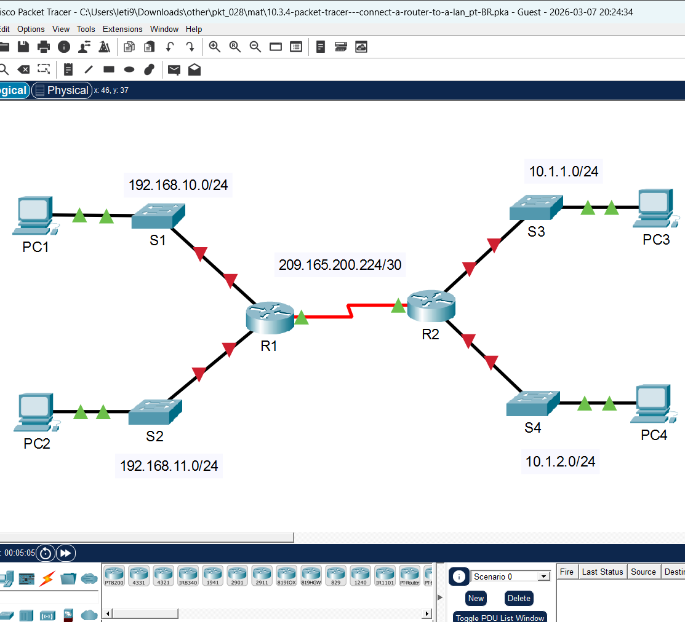
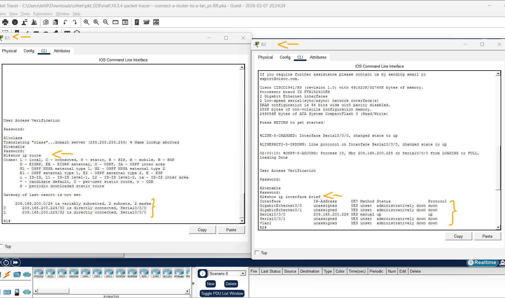
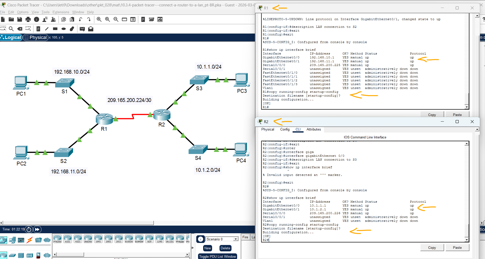
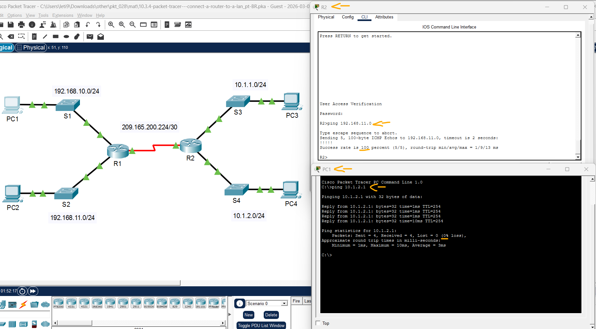

# Packet Tracer – Conexão de um Roteador a uma LAN   

### Cisco: <a href="../../../">cisco   </a>
### Cisco Networking Academy: cna   </a>
### Training Category: <a href="../../../pkt/">pkt</a>
### Software/Subject: network   </a>
### Course: <a href="./">pkt_028 (Packet Tracer – Conexão de um Roteador a uma LAN)   </a>

---

### Theme:
- Network

### Used Tools:
- Operating System (OS): 
  - Cisco Internetwork Operating System (Cisco IOS)   
  - Windows 11 
- Cloud Services:
  - Google Drive 
- Language:
  - HTML   
  - Markdown   
- Integrated Development Environment (IDE) and Text Editor:
  - Visual Studio Code (VS Code)   
- Versioning: 
  - Git   
- Repository:
  - GitHub   
- Network:
  - Cisco Packet Tracer   
  - ping   

---

<h3><a name="item00">Course Strcuture:</a></h3>

1. <a href="#item01">Parte 1: Exibir Informações do Roteador</a> 
  1.1 <a href="#item01.01">Etapa 1: Exiba informações das interfaces de R1.</a> 
  1.2 <a href="#item01.02">Etapa 2: Exiba uma lista resumida das interfaces em R1.</a> 
  1.3 <a href="#item01.03">Etapa 3: Exiba a tabela de roteamento em R1.</a> 
2. <a href="#item02">Parte 2: Configurar Interfaces do Roteador</a> 
  2.1 <a href="#item02.01">Etapa 1: Configure a interface GigabitEthernet 0/0 em R1.</a> 
  2.2 <a href="#item02.02">Etapa 2: Configure as interfaces Gigabit Ethernet restantes em R1 e R2.</a> 
  2.3 <a href="#item02.03">Etapa 3: Faça backup das configurações na NVRAM.</a> 
3. <a href="#item03">Parte 3: Verificar a Configuração</a> 
  3.1 <a href="#item03.01">Etapa 1: Utilize os comandos de verificação para verificar as configurações das interfaces.</a> 
  3.2 <a href="#item03.02">Etapa 2: Teste a conectividade de ponta a ponta da rede.</a> 

---

### Objective:
O objetivo desta atividade foi realizar a configuração e o endereçamento de interfaces em roteadores Cisco, validando a conectividade e a integridade operacional através de comandos de verificação e tabelas de roteamento.

### Folder Structure:
- [README.md](./README.md): Este documento de README, escrito em **Markdown**, com o conteúdo do laboratório.
- [0-aux](./0-aux/): Pasta auxiliar com imagens utilizadas na construção dos arquivos de README desse curso.

### Development:

<a name="item01"><h4>1. Parte 1: Exibir Informações do Roteador</h4></a>[Back to summary](#item00)

A imagem 01 mostra a topologia inicial.

<figure>
     
    <figcaption>Imagem 01.</figcaption>
</figure>
 

<a name="item01.01"><h4>1.1 Etapa 1: Exiba informações das interfaces de R1.</h4></a>[Back to summary](#item00)

Observação: para acessar diretamente a linha de comando, clique em um dispositivo e depois na guia CLI. A senha de console é cisco. A senha EXEC privilegiada é class.

- a. Que comando exibe estatísticas de todas as interfaces configuradas em um roteador?
  - `show interfaces`.
- b. Que comando exibe somente informações sobre a interface serial 0/0/0?
  - `show interfaces serial 0/0/0`.
- c. Digite o comando para exibir estatísticas da interface serial 0/0/0 em R1 e responda às seguintes perguntas. Qual é o endereço IP configurado em R1?
  - 209.165.200.225/30
- c. Qual é a largura de banda na interface serial 0/0/0?
  - 1.544 Kbit = 1.544 Kbps = 1,544 Mbps.
- d. Digite o comando para exibir estatísticas da interface GigabitEthernet 0/0 e responda às seguintes perguntas.
  - `show interfaces G0/0`.
- d. Qual é o endereço IP configurado em R1?
  - 209.165.200.225/30
- d. Qual é o endereço MAC da interface GigabitEthernet 0/0?
  - 000d.bd6c.7d01
- d. Qual é a largura de banda na interface GigabitEthernet 0/0?
  - 100.000 Kbit = 100.000 Kbps = 100 Mbps.

<a name="item01.02"><h4>1.2 Etapa 2: Exiba uma lista resumida das interfaces em R1.</h4></a>[Back to summary](#item00)

- a. Que comando exibe um breve resumo das interfaces atuais, dos status e dos endereços IP atribuídos a elas?
  - `show ip interface brief`.
- b. Digite o comando em cada roteador e responda às seguintes perguntas. Quantas interfaces seriais há em R1 e R2?
  - Ambos os roteadores possuem duas interfaces seriais físicas disponíveis em seu hardware. No entanto, apenas a interface Serial 0/0/0 está configurada com um endereço IP e operacional para o tráfego de dados.
- b. Todas as interfaces Ethernet em R1 são iguais? Em caso negativo, explique a(s) diferença(s).
  - Não, pois as interfaces possuem diferentes padrões de hardware, variando entre tecnologias FastEthernet e GigabitEthernet. Essa distinção define limites distintos de largura de banda, permitindo que as interfaces operem em velocidades máximas de 100 Mbps ou 1000 Mbps, respectivamente.

<a name="item01.03"><h4>1.3 Etapa 3: Exiba a tabela de roteamento em R1.</h4></a>[Back to summary](#item00)

- a. Que comando exibe o conteúdo da tabela de roteamento?
  - `show ip route`.
- b. Digite o comando em R1 e responda às seguintes perguntas. Quantas rotas conectadas (que usam o código C) existem?
  - Existe apenas uma rota com o código C, indicando que apenas uma rede está fisicamente ligada e ativa em uma das interfaces do roteador.
- b. Qual rota está listada?
  - A rota listada é a 209.165.200.224/30, que está diretamente conectada através da interface Serial 0/0/0.
- b. Como um roteador lida com um pacote destinado a uma rede que não está listada na tabela de roteamento?
  - Se o endereço de destino não constar na tabela de roteamento e não houver uma rota padrão (Gateway de último recurso) configurada, o roteador simplesmente descarta o pacote. Após o descarte, ele normalmente envia uma mensagem de erro ICMP do tipo "Destination Unreachable" (Destino Inalcançável) de volta à origem.

A imagem 02 exibe a conclusão da Parte 1.

<figure>
     
    <figcaption>Imagem 02.</figcaption>
</figure>
 

<a name="item02"><h4>2. Parte 2: Configurar Interfaces do Roteador</h4></a>[Back to summary](#item00)

<a name="item02.01"><h4>2.1 Etapa 1: Configure a interface GigabitEthernet 0/0 em R1.</h4></a>[Back to summary](#item00)

- a. Digite os seguintes comandos para endereçar e ativar a interface GigabitEthernet 0/0 em R1:
  - R1: `configure terminal` -> `interface gigabitethernet 0/0` -> `ip address 192.168.10.1 255.255.255.0` -> `no shutdown`.
- b. É recomendável configurar uma descrição em cada interface para ajudar a documentar as informações da rede. Configure uma descrição da interface que indique o dispositivo ao qual está conectado.
  - R1: `description LAN connection to S1`.
- c. R1 agora deve conseguir pingar PC1.
  - `end` -> `ping 192.168.10.10`.

<a name="item02.02"><h4>2.2 Etapa 2: Configure as interfaces Gigabit Ethernet restantes em R1 e R2.</h4></a>[Back to summary](#item00)

- a. Use as informações da Tabela de Endereçamento para concluir as configurações das interfaces de R1 e R2. Em cada interface, faça o seguinte. Insira o endereço IP e ative a interface.
  - R1: `configure terminal` -> `interface gigabitethernet 0/1` -> `ip address 192.168.11.1 255.255.255.0` -> `no shutdown`.
  - R2: `configure terminal` -> `interface gigabitethernet 0/0` -> `ip address 10.1.1.1 255.255.255.0` -> `no shutdown`.
  - R2: `configure terminal` -> `interface gigabitethernet 0/1` -> `ip address 10.1.2.1 255.255.255.0` -> `no shutdown`.
- a. Configure uma descrição apropriada.
  - R1: `description LAN connection to S2`.
  - R2: `description LAN connection to S3`.
  - R2: `description LAN connection to S4`.
- b. Verifique as configurações da interface.
  - `show ip interface brief`.

<a name="item02.03"><h4>2.3 Etapa 3: Faça backup das configurações na NVRAM.</h4></a>[Back to summary](#item00)

- a. Salve os arquivos de configuração em ambos os roteadores na NVRAM. Que comando você usou?
  - `copy running-config startup-config`.

A imagem 03 exibe a conclusão da Parte 2.

<figure>
     
    <figcaption>Imagem 03.</figcaption>
</figure>
 

<a name="item03"><h4>3. Parte 3: Verificar a Configuração</h4></a>[Back to summary](#item00)

<a name="item03.01"><h4>3.1 Etapa 1: Utilize os comandos de verificação para verificar as configurações das interfaces.</h4></a>[Back to summary](#item00)

- a. Use o comando show ip interface brief em R1 e R2 para verificar rapidamente se as interfaces estão configuradas com o endereço IP correto e se estão ativas. Quantas interfaces em R1 e R2 estão configuradas com endereço IP e estão ”up” e “up”?
  - Existem agora três interfaces em cada roteador que possuem endereços IP atribuídos e apresentam o status físico e o protocolo de linha como "up". Isso indica que as interfaces estão conectadas, eletricamente ativas e com a camada de enlace operacional.
- a. Que parte da configuração da interface NÃO é exibida na saída do comando?
  - A saída resumida não exibe a máscara de sub-rede (subnet mask) e nem as descrições (descriptions) que foram configuradas para identificar a finalidade de cada porta.
- a. Que comandos podem ser usados para verificar essa parte da configuração?
  - `show ip interface`.
- b. Use o comando show ip route em R1 e R2 para ver as tabelas de roteamento atuais e responder às seguintes perguntas.
  - `show ip route`.
- b. Quantas rotas conectadas (que usam o código C) você vê em cada roteador?
  - Cada roteador exibe 3 rotas conectadas, representando as redes que estão ligadas fisicamente às suas interfaces ativas.
- b. Quantas rotas OSPF (que usam o código O) você vê em cada roteador?
  - Existem 2 rotas OSPF em cada dispositivo, indicando as redes remotas que foram aprendidas dinamicamente através do protocolo de roteamento.
- b. Se o roteador conhece todas as rotas na rede, o número de rotas conectadas e rotas aprendidas dinamicamente (OSPF) deve ser igual ao número total de LANs e WANs. Quantas LANs e WANs estão na topologia?
  - Do ponto de vista geral da topologia, existem 4 LANs (duas conectadas ao R1 e duas ao R2) e 1 WAN (o link serial que une os dois roteadores).
  - Do ponto de vista individual de cada roteador (como o R1), ele identifica 3 redes diretamente conectadas (2 LANs locais + 1 WAN física) e 2 redes remotas aprendidas via OSPF (as 2 LANs do vizinho).
- b. Esse número corresponde ao número de rotas C e O exibidas na tabela de roteamento? Observação: se a resposta for “não”, uma configuração necessária foi ignorada. Analise as etapas da Parte2.
  - Sim. O total de 5 rotas (3 do tipo C e 2 do tipo O) corresponde exatamente ao somatório de LANs e WANs da topologia, confirmando que o roteador possui visibilidade completa de toda a rede.

<a name="item03.02"><h4>3.2 Etapa 2: Teste a conectividade de ponta a ponta da rede.</h4></a>[Back to summary](#item00)

- a. Agora você deve conseguir enviar ping de qualquer computador para qualquer outro computador na rede. Também deve conseguir fazer ping nas interfaces ativas nos roteadores. Por exemplo, os testes a seguir deverão ser bem-sucedidos. Na linha de comando em PC1, faça ping em PC4.
  - `ping 10.1.2.1`.
- a. Na linha de comando no R2, faça ping em PC2. Nota: Para simplificar esta atividade, os switchs não estão configurados. Você não será capaz de fazer ping neles.
  - `ping 192.168.11.0`.

A imagem 04 exibe a conclusão da Parte 3.

<figure>
     
    <figcaption>Imagem 04.</figcaption>
</figure>
 