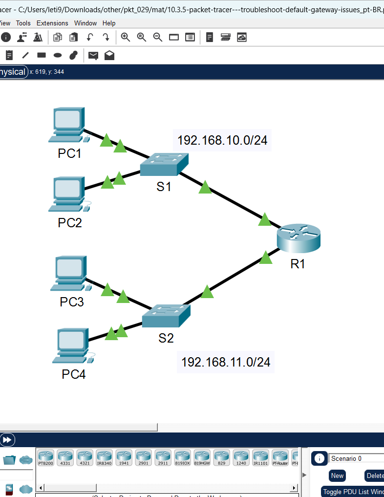
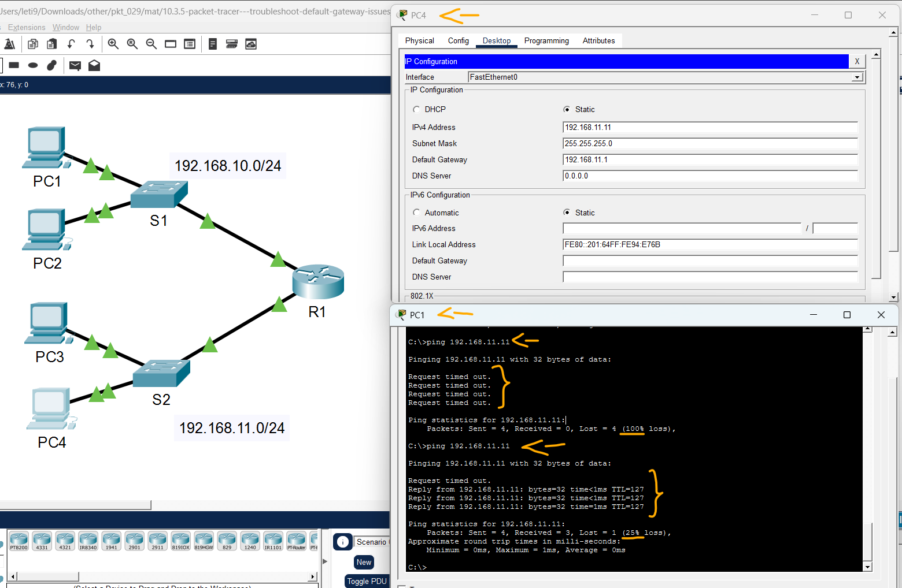
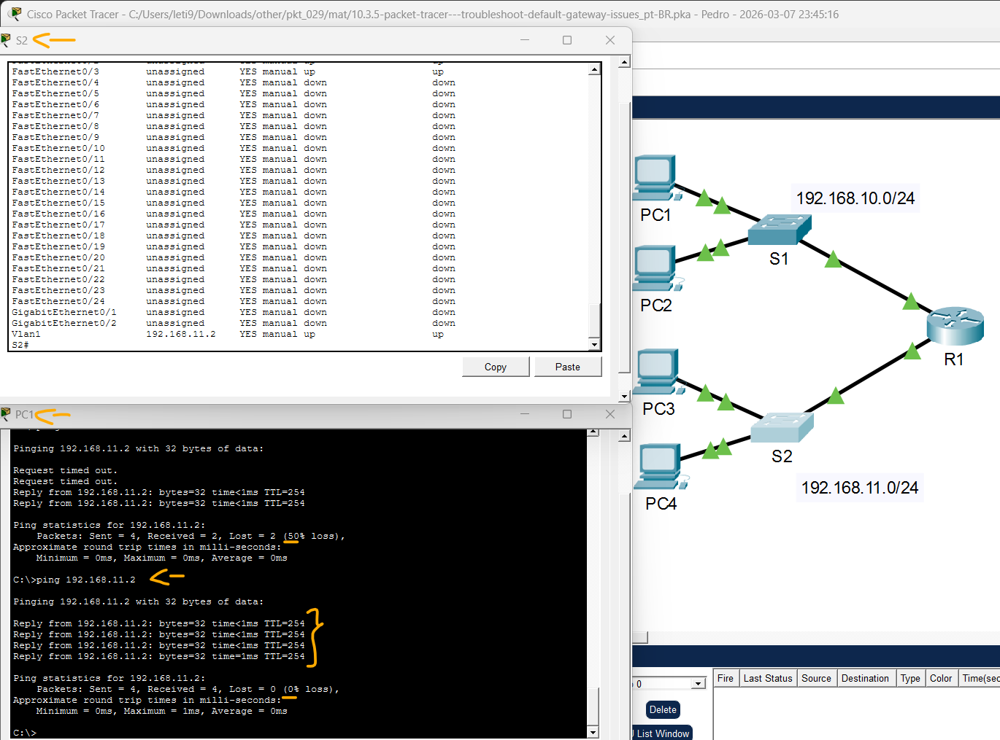

# Packet Tracer – Solucionar problemas de gateway padrão   

### Cisco: <a href="../../../">cisco   </a>
### Cisco Networking Academy: cna   </a>
### Training Category: <a href="../../../pkt/">pkt</a>
### Software/Subject: network   </a>
### Course: <a href="./">pkt_029 (Packet Tracer – Solucionar problemas de gateway padrão)   </a>

---

### Theme:
- Network

### Used Tools:
- Operating System (OS): 
  - Cisco Internetwork Operating System (Cisco IOS)   
  - Windows 11 
- Cloud Services:
  - Google Drive 
- Language:
  - HTML   
  - Markdown   
- Integrated Development Environment (IDE) and Text Editor:
  - Visual Studio Code (VS Code)   
- Versioning: 
  - Git   
- Repository:
  - GitHub   
- Network:
  - Cisco Packet Tracer   
  - ping   

---

<h3><a name="item00">Course Strcuture:</a></h3>

1. <a href="#item01">Parte 1: Verificar a Documentação de Rede e Isolar Problemas</a> 
  1.1 <a href="#item01.01">Etapa 1: Verifique a documentação de rede e isole todos os problemas.</a> 
  1.2 <a href="#item01.02">Etapa 2: Determine uma solução apropriada para o problema.</a> 
2. <a href="#item02">Parte 2: Implementar, Verificar e Documentar soluções</a> 
  2.1 <a href="#item02.01">Etapa 1: Implemente soluções relacionadas a problemas de conectividade.</a> 
  2.2 <a href="#item02.02">Etapa 2: Verifique se agora o problema está resolvido.</a> 
  2.3 <a href="#item02.03">Etapa 3: Verifique se todos os problemas foram resolvidos.</a> 

---

### Objective:
Esta atividade teve como objetivo solucionar falhas de conectividade em uma infraestrutura composta por duas sub-redes. O foco principal foi validar a comunicação entre todos os dispositivos da rede, identificar e corrigir inconsistências nos endereçamentos de gateway padrão e endereço IP e assegurar a plena troca de pacotes entre os hosts e os ativos de rede.

### Folder Structure:
- [README.md](./README.md): Este documento de README, escrito em **Markdown**, com o conteúdo do laboratório.
- [0-aux](./0-aux/): Pasta auxiliar com imagens utilizadas na construção dos arquivos de README desse curso.

### Development:

<a name="item01"><h4>1. Parte 1: Verificar a Documentação de Rede e Isolar Problemas</h4></a>[Back to summary](#item00)

Na Parte 1 desta atividade, você concluirá a documentação e executará testes de conectividade para identificar problemas. Também determinará uma solução apropriada que será implementada na Parte 2.

A imagem 01 mostra a topologia inicial.

<figure>
     
    <figcaption>Imagem 01.</figcaption>
</figure>
 

<a name="item01.01"><h4>1.1 Etapa 1: Verifique a documentação de rede e isole todos os problemas.</h4></a>[Back to summary](#item00)

- a. Para poder testar uma rede, você deve ter toda a documentação. Verifique se há alguma informação faltando na Tabela de Endereçamento. Complete a Tabela de Endereçamento preenchendo as informações de gateway padrão que estão faltando para os switches e os PCs.

#### Tabela 1 — Planejamento de Endereçamento IPv4

| Dispositivo | Interface | Endereço IP | Máscara de Sub-rede | Gateway Padrão |
| :---: | :---: | :---: | :---: | :---: |
| **R1** | G0/0 | 192.168.10.1 | 255.255.255.0 | N/D |
| **R1** | G0/1 | 192.168.11.1 | 255.255.255.0 | N/D |
| **S1** | VLAN 1 | 192.168.10.2 | 255.255.255.0 | 192.168.10.1 |
| **S2** | VLAN 1 | 192.168.11.2 | 255.255.255.0 | 192.168.11.1 |
| **PC1** | NIC | 192.168.10.10 | 255.255.255.0 | 192.168.10.1 |
| **PC2** | NIC | 192.168.10.11 | 255.255.255.0 | 192.168.10.1 |
| **PC3** | NIC | 192.168.11.10 | 255.255.255.0 | 192.168.11.1 |
| **PC4** | NIC | 192.168.11.11 | 255.255.255.0 | 192.168.11.1 |

- b. Teste a conectividade entre dispositivos da mesma rede. Ao isolar e corrigir todos os problemas de acesso local, você pode testar melhor a conectividade remota com a certeza de que a conectividade local está operacional. Um plano de verificação pode ser tão simples quanto uma lista de testes de conectividade. Utilize os testes a seguir para verificar a conectividade local e isolar todos os problemas de acesso. O primeiro 
problema já está documentado, mas você deve executar e verificar a solução durante a Parte 2. Nota: A tabela é um exemplo; você deve criar seu próprio documento. Você pode usar papel e lápis para desenhar uma tabela ou usar um editor de texto ou uma planilha. Consulte seu instrutor caso precise de orientações adicionais. 

- c. Teste a conectividade com dispositivos remotos (de PC1 a PC4, por exemplo) e documente eventuais problemas. Isso é conhecido como conectividade de ponta a ponta. Significa que todos os dispositivos em uma rede têm conectividade total permitida pela política de rede. 
Nota: O teste de conectividade remota pode ainda não ser possível, porque você deve primeiro resolver os problemas de conectividade local. Depois de resolver esses problemas, volte a esta etapa e teste a conectividade entre redes.

<a name="item01.02"><h4>1.2 Etapa 2: Determine uma solução apropriada para o problema.</h4></a>[Back to summary](#item00)

- a. Usando seu conhecimento sobre as formas como a rede opera e a capacidade de configuração do seu dispositivo, pesquise a causa do problema. Por exemplo, S1 não é a causa do problema de conectividade entre PC1 e PC2. Os leds dos links estão verdes e nenhuma configuração em S1 impediria o tráfego entre PC1 e PC2. O problema deve ser em PC1, em PC2 ou em ambos.
- b. Verifique se o endereçamento do dispositivo corresponde à documentação de rede. Por exemplo, a verificação com o comando ipconfig indicou que o endereço IP de PC1 está incorreto. 
- Sugira uma solução para resolver o problema e documente-a. Por exemplo, alterar o endereço IP de PC1 para corresponder à documentação. Nota: Geralmente, há mais de uma solução. No entanto, é uma prática recomendada para solução de problemas implementar e verificar uma solução por vez. A implementação de mais de uma solução pode introduzir a outros problemas em um cenário mais complexo. 

| Teste | Efetuado com êxito? | Problemas | Solução | Verificado |
| :---: | :---: | :---: | :---: | :---: |
| **PC1 a PC2** | Não | Endereço IP em PC1 | Alterar o endereço IP de PC1 | OK |
| **PC1 a S1** | Sim | Gateway Padrão não configurado no S1 | Configurar Gateway Padrão no S1 | OK |
| **PC1 a R1 (G0/0)** | Sim | - | - | - |
| **PC1 a R1 (G0/1)** | Sim | - | - | - |
| **PC1 a S2** | Não | Interface VLAN 1 do S2 sem IP | Configurar IP na VLAN 1 do S2 | OK |
| **PC1 a S2** | Não | Gateway Padrão não configurado no S2 | Configurar Gateway Padrão no S2 | OK |
| **PC1 a PC3** | Sim | - | - | - ||
| **PC1 a PC4** | Não | Gateway Padrão do PC4 | Alterar o Gateway Padrão do PC4 | OK |

<a name="item02"><h4>2. Parte 2: Implementar, Verificar e Documentar soluções</h4></a>[Back to summary](#item00)

Na Parte 2 desta atividade, você implementará as soluções que identificou na Parte 1. Em seguida, verificará se a solução funcionou. Talvez você precise retornar à Parte 1 para concluir o isolamento de todos os problemas.

<a name="item02.01"><h4>2.1 Etapa 1: Implemente soluções relacionadas a problemas de conectividade.</h4></a>[Back to summary](#item00)

- a. Consulte sua documentação na Parte 1. Escolha o primeiro problema e implemente a solução que você sugeriu. Por exemplo, corrija o endereço IP de PC1.
  - Soluções:
    - Alterar o endereço IP de PC1: Corrigir o endereço IP de 192.168.11.10 para 192.168.10.10, adequando o host ao endereçamento da sub-rede 192.168.10.0/24.
    - Alterar o Gateway Padrão do PC4: Alterar o Gateway Padrão para 192.168.11.1, garantindo a saída correta dos pacotes da sub-rede 192.168.11.0/24 através da interface do roteador.
    - Configurar IP na VLAN 1 do S2: `enable` -> `configure terminal` -> `interface vlan 1` -> `ip address 192.168.11.2 255.255.255.0` -> `no shutdown`.
    - Configurar Gateway Padrão no S1: `enable` -> `configure terminal` -> `ip default-gateway 192.168.10.1`.
    - Configurar Gateway Padrão no S2: `enable` -> `configure terminal` -> `ip default-gateway 192.168.11.1`.

<a name="item02.02"><h4>2.2 Etapa 2: Verifique se agora o problema está resolvido.</h4></a>[Back to summary](#item00)

- a. Confira se a sua solução resolveu o problema executando o teste que você usou para identificar o problema. Por exemplo, agora PC1 pode fazer ping em PC2?
- b. Se o problema estiver resolvido, indique isso na documentação. Por exemplo, na tabela anterior, uma simples marca de verificação na coluna "Verificado" seria suficiente.

<a name="item02.03"><h4>2.3 Etapa 3: Verifique se todos os problemas foram resolvidos.</h4></a>[Back to summary](#item00)

- a. Se você ainda tiver um problema pendente com uma solução que não tenha sido implementada, retorne à Parte 2, Etapa 1.
- b. Caso todos os problemas atuais estejam resolvidos, você também resolveu algum problema de conectividade remota (por exemplo, PC1 poder fazer ping em PC4)? Se a resposta for não, retorne à Parte 1, Etapa 1c, para testar a conectividade remota.

A imagens 02 e 03 exibem a conclusão das Partes 1 e 2.

<figure>
     
    <figcaption>Imagem 02.</figcaption>
</figure>
 

<figure>
     
    <figcaption>Imagem 03.</figcaption>
</figure>
 