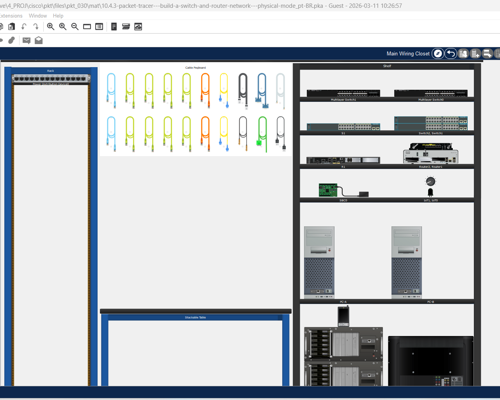
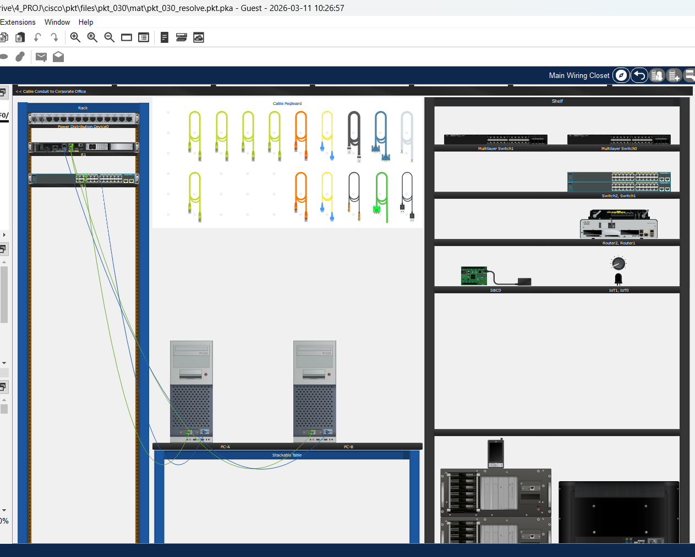
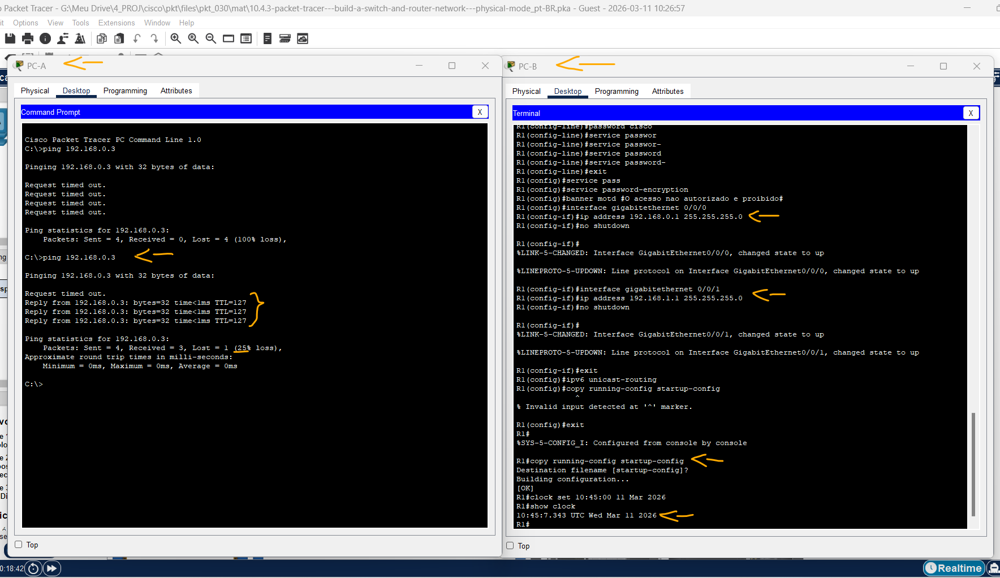
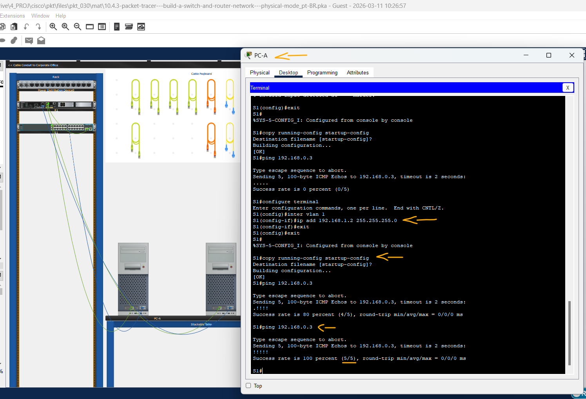
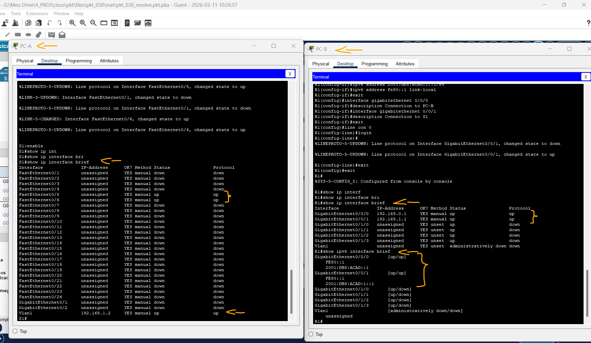

# Packet Tracer - Construir uma rede de switch e roteador - Modo Físico   

### Cisco: <a href="../../../">cisco   </a>
### Cisco Networking Academy: cna   </a>
### Training Category: <a href="../../../pkt/">pkt</a>
### Software/Subject: network   </a>
### Course: <a href="./">pkt_030 (Packet Tracer - Construir uma rede de switch e roteador - Modo Físico)   </a>

---

### Theme:
- Network

### Used Tools:
- Operating System (OS): 
  - Cisco Internetwork Operating System (Cisco IOS)   
  - Windows 11 
- Cloud Services:
  - Google Drive 
- Language:
  - HTML   
  - Markdown   
- Integrated Development Environment (IDE) and Text Editor:
  - Visual Studio Code (VS Code)   
- Versioning: 
  - Git   
- Repository:
  - GitHub   
- Network:
  - Cisco Packet Tracer   
  - ping   

---

<h3><a name="item00">Course Strcuture:</a></h3>

1. <a href="#item01">Parte 1: Configurar a topologia</a> 
2. <a href="#item02">Parte 2: Configurar os Dispositivos e Verificar a Conectividade</a> 
  2.1 <a href="#item02.01">Etapa 1: Atribuir informações como IP estático às interfaces do PC.</a> 
  2.2 <a href="#item02.02">Etapa 2: Configure o roteador.</a> 
  2.3 <a href="#item02.03">Etapa 3: Configure o switch.</a> 
  2.4 <a href="#item02.04">Etapa 4: Verifique a conectividade de ponta a ponta.</a> 
3. <a href="#item03">Parte 3: Exibir Informações dos Dispositivos</a> 
  3.1 <a href="#item03.01">Etapa 1: Exiba a tabela de roteamento no roteador.</a> 
  3.2 <a href="#item03.02">Etapa 2: Exiba informações das interfaces de R1.</a> 
  3.3 <a href="#item03.03">Etapa 3: Exiba uma lista resumida das interfaces no roteador e no switch.</a> 
4. <a href="#item04">Perguntas para reflexão</a> 

---

### Objective:
O objetivo deste atividade foi construir uma arquitetura de rede simples com dois PCs em redes diferentes, conectados por um switch e um roteador. Foram realizadas as configurações básicas de segurança e endereçamento IP em todos os dispositivos, e ao final foi verificada a comunicação entre as redes por meio de testes de conectividade.

### Folder Structure:
- [README.md](./README.md): Este documento de README, escrito em **Markdown**, com o conteúdo do laboratório.
- [0-aux](./0-aux/): Pasta auxiliar com imagens utilizadas na construção dos arquivos de README desse curso.

### Development:

<a name="item01"><h4>1. Parte 1: Configurar a topologia</h4></a>[Back to summary](#item00)

A imagem 01 mostra a topologia inicial.

<figure>
     
    <figcaption>Imagem 01.</figcaption>
</figure>
 

- a. Mova o roteador necessário e alterne da prateleira para o Rack. 
- b. Mova os PCs necessários da prateleira para a mesa.
- c. Configure os nomes de dispositivo conforme mostrado na Tabela de Endereçamento e na Topologia.
- d. Ligue todos os dispositivos.

A imagem 02 exibe a conclusão da Parte 1.

<figure>
     
    <figcaption>Imagem 02.</figcaption>
</figure>
 

<a name="item02"><h4>2. Parte 2: Configurar os Dispositivos e Verificar a Conectividade</h4></a>[Back to summary](#item00)

Na Parte 2, você vai configurar a topologia de rede e definir configurações básicas, como endereços IP das interfaces, acesso aos dispositivos e senhas. Consulte a topologia e a Tabela de Endereçamento no início deste laboratório para obter nomes de dispositivos e informações de endereço.

<a name="item02.01"><h4>2.1 Etapa 1: Atribuir informações como IP estático às interfaces do PC.</h4></a>[Back to summary](#item00)

- a. Configure o endereço IP, a máscara de sub-rede e as definições do gateway padrão em PC-A.
  - `192.168.1.3` -> `255.255.255.0` -> `192.168.1.1`.
  - `2001:db8:acad:1::3` -> `/64` -> `fe80::1`.
- b. Configure o endereço IP, a máscara de sub-rede e as definições do gateway padrão em PC-B.
  - `192.168.0.3` -> `255.255.255.0` -> `192.168.0.1`.
  - `2001:db8:acad::3` -> `/64` -> `fe80::1`.
- c. A partir de uma janela de comando prompt no PC-A, ping PC-B.
  - `ping 192.168.0.3`.
- c. Por que os pings não tiveram êxito?
  - Os pings não tiveram êxito porque, embora o Gateway Padrão tenha sido configurado nos PCs, o roteador ainda não possui endereços IP configurados em suas interfaces. Sem esses endereços, o roteador não consegue atuar como gateway da rede nem encaminhar os pacotes entre os dispositivos, impedindo a comunicação entre o PC-A e o PC-B.

<a name="item02.02"><h4>2.2 Etapa 2: Configure o roteador.</h4></a>[Back to summary](#item00)

- a. Ligue o console ao roteador e entre no modo EXEC privilegiado.
  - `enable`.
- b. Entre no modo de configuração.
  - `configure terminal`.
- c. Atribua um nome de dispositivo ao roteador.
  - `hostname R1`.
- d. Atribua class como a senha criptografada do EXEC privilegiado.
  - `enable secret class`.
- e. Atribua cisco como a senha de console e habilite o login.
  - `line console 0` -> `password cisco` -> `login` -> `exit`.
- f. Atribua cisco como a senha de vty e habilite o login.
  - `line vty 0 4` -> `password cisco` -> `exit`.
- g. Criptografe as senhas de texto sem formatação.
  - `service password-encryption`
- h. Crie um banner para avisar às pessoas que o acesso não autorizado é proibido.
  - `banner motd #O acesso nao autorizado e proibido#`
- i. Configure e ative as duas interfaces do roteador.
  - `interface gigabitethernet 0/0/0` -> `ip address 192.168.0.1 255.255.255.0` -> `ipv6 address 2001:db8:acad::1/64` -> `ipv6 address fe80::1 link-local` -> `no shutdown` -> `exit`.
  - `interface gigabitethernet 0/0/1` -> `ip address 192.168.1.1 255.255.255.0` -> `ipv6 address 2001:db8:acad:1::1/64` -> `ipv6 address fe80::1 link-local` -> `no shutdown` -> `exit`.
- j. Configure uma descrição para cada interface indicando a qual dispositivo ela está conectada.
  - `interface gigabitethernet 0/0/0` -> `description Connection to PC-B` -> `exit`.
  - `interface gigabitethernet 0/0/1` -> `description Connection to S1` -> `exit`.
- k. Para ativar o roteamento IPv6, digite o comando ipv6 unicast-routing.
  - `ipv6 unicast-routing` -> `exit`.
- l. Salve a configuração atual no arquivo de configuração inicial.
  - `copy running-config startup-config`.
- m. Configure o relógio do roteador. Observação: use o ponto de interrogação (?) para ajudar na sequência correta de parâmetros 
necessários para executar este comando.
  - `clock set 10:45:00 11 Mar 2026` -> `show clock`.
- n. A partir de uma janela de comando prompt no PC-A, ping PC-B. Observação: se os pings não forem bem-sucedidos, talvez seja necessário desativar o Firewall do 
Windows. Os pings foram bem-sucedidos? Explique. 
  - `ping 192.168.0.3`.

A imagem 03 exibe a conclusão até essa etapa da Parte 2.

<figure>
     
    <figcaption>Imagem 03.</figcaption>
</figure>
 

<a name="item02.03"><h4>2.3 Etapa 3: Configure o switch.</h4></a>[Back to summary](#item00)

Nesta etapa, você configurará o nome do host, a interface VLAN 1 e seu gateway padrão.

- a. Use o console para se conectar ao switch e ative o modo EXEC privilegiado.
  - `enable`.
- b. Entre no modo de configuração.
  - `configure terminal`.
- c. Atribua um nome de dispositivo ao comutador.
  - `hostname S1`.
- d. Configure e ative a interface VLAN no switch S1.
  - `interface vlan 1` -> `ip address 192.168.1.2 255.255.255.0` -> `no shutdown`.
- e. Configure o gateway padrão para o switch S1.
  - `ip default-gateway 192.168.1.1` -> `exit`.
- f. Salve a configuração atual no arquivo de configuração inicial.
  - `copy running-config startup-config`.

<a name="item02.04"><h4>2.4 Etapa 4: Verifique a conectividade de ponta a ponta.</h4></a>[Back to summary](#item00)

- a. De PC-A, ping PC-B.
  - `ping 192.168.0.3`.
- b. De S1, ping PC-B. Todos os pings devem ser bem sucedidos.
  - `ping 192.168.0.3`.

A imagem 04 exibe a conclusão da Parte 2.

<figure>
     
    <figcaption>Imagem 04.</figcaption>
</figure>
 

<a name="item03"><h4>3. Parte 3: Exibir Informações dos Dispositivos</h4></a>[Back to summary](#item00)

<a name="item03.01"><h4>3.1 Etapa 1: Exiba a tabela de roteamento no roteador.</h4></a>[Back to summary](#item00)

- a. Use o comando `show ip route` no roteador R1 para responder às seguintes perguntas. Qual código é usado na tabela de roteamento para indicar uma rede diretamente conectada?
  - `show ip route`.
  - O código utilizado na tabela de roteamento para indicar uma rede diretamente conectada é a letra C. Esse código significa Connected, indicando que a rede está diretamente ligada ao roteador.
- a. Quantas entradas de rotas são codificadas com um código C na tabela de roteamento?
  - Existem duas entradas de rotas marcadas com o código C na tabela de roteamento. Isso indica que o roteador possui duas redes diretamente conectadas.
- a. Que tipos de interface são associados às rotas com código C?
  - As rotas com código C estão associadas às interfaces diretamente conectadas e ativas no roteador. Neste caso, correspondem às interfaces G0/0/0 (192.168.0.0/24) e G0/0/1 (192.168.1.0/24).
- b. Use o comando `show ipv6 route` em R1 para exibir a tabela de roteamento IPv6.
  - `show ipv6 route`.

<a name="item03.02"><h4>3.2 Etapa 2: Exiba informações das interfaces de R1.</h4></a>[Back to summary](#item00)

- a. Use o `show interface g0/1` para responder às perguntas a seguir.
  - `show interface g0/0/1`.
- a. Qual é o status operacional da interface G0/0/1?
  - O status operacional da interface G0/0/1 está ativo (up). Isso indica que a interface está funcionando e pronta para transmitir dados.
- a. Qual é o endereço de controle de acesso ao meio (MAC) da interface G0/0/1?
  - O endereço MAC da interface G0/0/1 é 0060.4731.8102. Esse endereço identifica fisicamente a interface na rede.
- a. Como o endereço Internet é exibido nesse comando?
  - O endereço de Internet é exibido no formato IP/prefixo de rede. Neste caso, aparece como 192.168.1.1/24.
- b. Para obter informações sobre IPv6, insira o comando `show ipv6 interface g0/0/1`.
  - `show ipv6 interface g0/0/1`.

<a name="item03.03"><h4>3.3 Etapa 3: Exiba uma lista resumida das interfaces no roteador e no switch.</h4></a>[Back to summary](#item00)

Existem vários comandos que podem ser usados para verificar uma configuração de interface. Um dos mais úteis é o comando `show ip interface brief`. A saída do comando exibe uma lista resumida das interfaces no dispositivo e fornece feedback imediato para o status de cada interface.

- a. Digite o comando `show ip interface brief` no roteador R1.
  - `show ip interface brief`.
- b. Para ver as informações da interface IPv6, digite o comando `show ipv6 interface brief` em R1.
  - `show ipv6 interface brief`.
- c. Insira o comando `show ip interface brief` no switch S1.
  - `show ip interface brief`.

A imagem 05 exibe a conclusão da Parte 3.

<figure>
     
    <figcaption>Imagem 05.</figcaption>
</figure>
 

<a name="item04"><h4>4. Perguntas para reflexão</h4></a>[Back to summary](#item00)

- a. Se a interface G0/0/1 mostrasse que estava inativa administrativamente, qual comando de configuração de interface você usaria para ativar a interface?
  - O comando utilizado para ativar a interface seria `no shutdown` no modo de configuração da interface. Esse comando habilita a interface para que ela possa operar normalmente.
- b. O que aconteceria se você tivesse configurado incorretamente a interface G0/0/1 no roteador com um endereço IP 192.168.1.2?
  - Haveria um conflito de endereçamento ou falha de comunicação com os dispositivos da rede. Isso impediria o funcionamento correto do gateway e poderia causar falha na comunicação entre as redes.