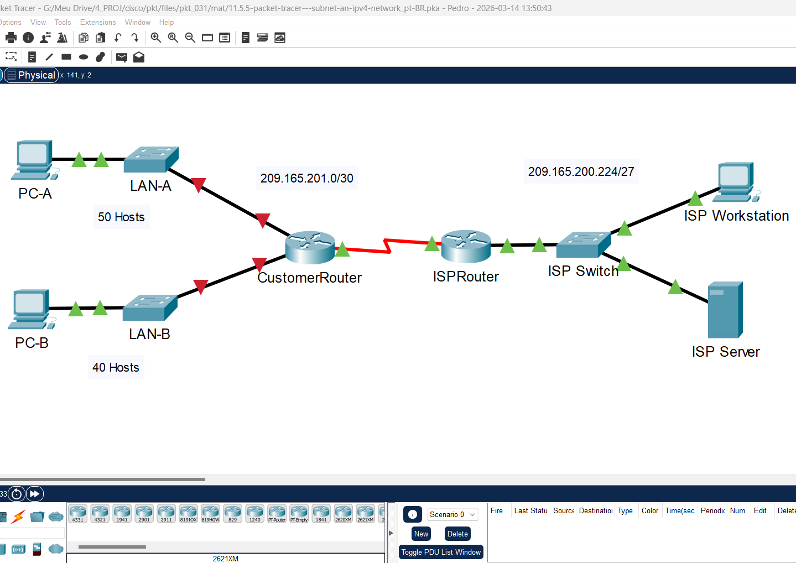
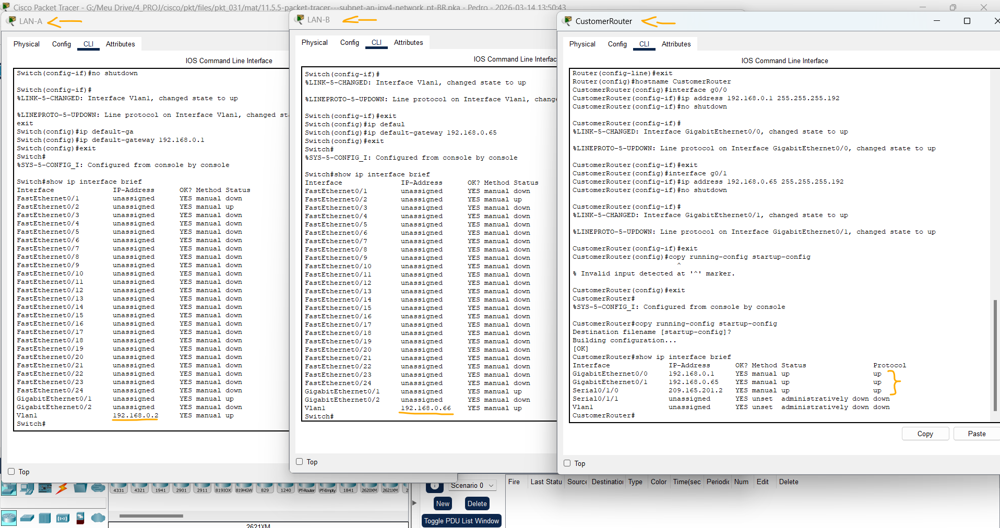
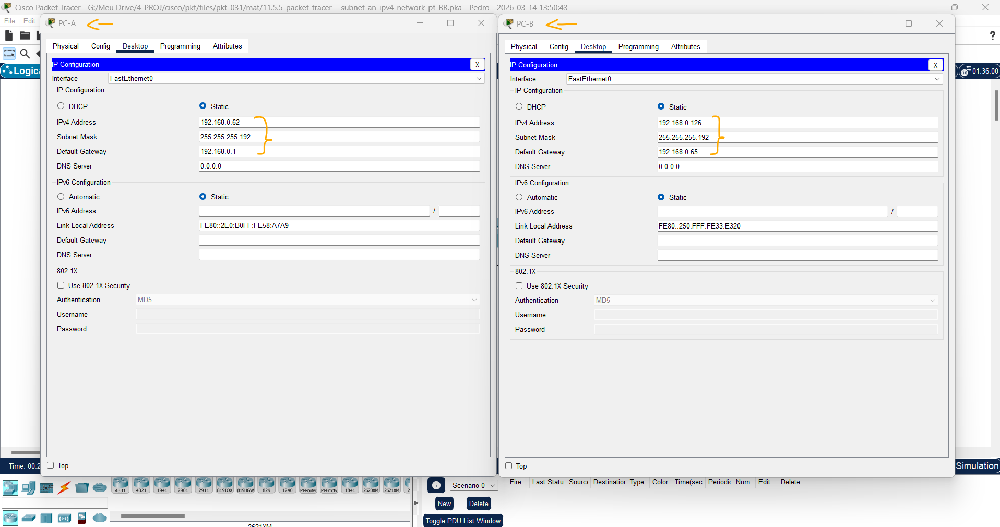
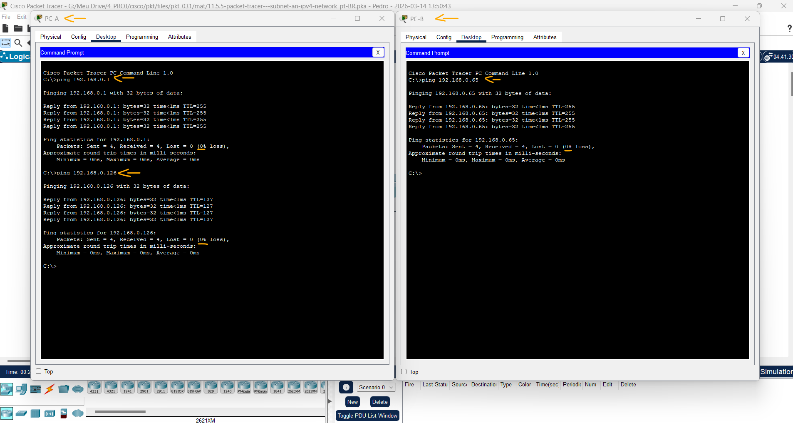

# Packet Tracer - Sub-rede uma rede IPv4   

### Cisco: <a href="../../../">cisco   </a>
### Cisco Networking Academy: cna   </a>
### Training Category: <a href="../../../pkt/">pkt</a>
### Software/Subject: network   </a>
### Course: <a href="./">pkt_031 (Packet Tracer - Sub-rede uma rede IPv4)   </a>

---

### Theme:
- Network

### Used Tools:
- Operating System (OS): 
  - Cisco Internetwork Operating System (Cisco IOS)   
  - Windows 11 
- Cloud Services:
  - Google Drive 
- Language:
  - HTML   
  - Markdown   
- Integrated Development Environment (IDE) and Text Editor:
  - Visual Studio Code (VS Code)   
- Versioning: 
  - Git   
- Repository:
  - GitHub   
- Network:
  - Cisco Packet Tracer 
  - ping   

---

<h3><a name="item00">Course Strcuture:</a></h3>

1. <a href="#item01">Parte 1: Projete um esquema de sub-rede de rede IPv4</a> 
  1.1 <a href="#item01.01">Etapa 1: Crie um esquema de divisão em sub-redes que atenda ao número necessário de sub-redes e ao número necessário de endereços de host.</a> 
  1.2 <a href="#item01.02">Etapa 2: Preencha os endereços IP ausentes na Tabela de Endereços</a> 
2. <a href="#item02">Parte 2: Configurar os Dispositivos</a> 
  2.1 <a href="#item02.01">Etapa 1: Configurar o CustomerRouter.</a> 
  2.2 <a href="#item02.02">Etapa 2: Configure os dois switches LAN do cliente.</a> 
  2.3 <a href="#item02.03">Etapa 3: Configure as interfaces do PC.</a> 
3. <a href="#item03">Parte 3: Testar e Solucionar Problemas da Rede</a> 

---

### Objective:
O objetivo desta atividade foi projetar um esquema de sub-redes IPv4, configurar o endereçamento dos dispositivos da rede e testar a comunicação entre eles, garantindo o funcionamento correto da rede.

### Folder Structure:
- [README.md](./README.md): Este documento de README, escrito em **Markdown**, com o conteúdo do laboratório.
- [0-aux](./0-aux/): Pasta auxiliar com imagens utilizadas na construção dos arquivos de README desse curso.

### Development:

<a name="item01"><h4>1. Parte 1: Projete um esquema de sub-rede de rede IPv4</h4></a>[Back to summary](#item00)

A imagem 01 mostra a topologia inicial.

<figure>
     
    <figcaption>Imagem 01.</figcaption>
</figure>
 

<a name="item01.01"><h4>1.1 Etapa 1: Crie um esquema de divisão em sub-redes que atenda ao número necessário de sub-redes e ao número necessário de endereços de host.</h4></a>[Back to summary](#item00)

Nesse cenário, você é um técnico de rede atribuído para instalar uma nova rede para um cliente. Você deve criar várias sub-redes do espaço de endereço de rede 192.168.0.0/24 para atender aos seguintes requisitos: 
- a. A primeira sub-rede é a rede LAN-A. Você precisa de um mínimo de 50 endereços IP de host.
- b. A segunda sub-rede é a rede LAN-B. Você precisa de um mínimo de 40 endereços IP de host.
- c. Você também precisa de pelo menos duas sub-redes não utilizadas adicionais para futura expansão da rede. Nota: Máscaras de sub-rede de comprimento variável não serão usadas. Todas as máscaras de sub-rede do dispositivo devem ter o mesmo comprimento.
- d. Responda às perguntas a seguir para ajudar a criar um esquema de divisão em sub-redes que atenda aos requisitos de rede estabelecidos. Quantos endereços de host são necessários na maior sub-rede necessária?
  - São necessários 50 endereços de host. Como cada sub-rede perde 2 endereços reservados (rede e broadcast), o mínimo necessário é 62 endereços de host utilizáveis.
- d. Qual é o número mínimo de sub-redes necessárias?
  - São necessárias 4 sub-redes: LAN-A, LAN-B e 2 sub-redes adicionais para expansão futura.
- d. A rede que você está encarregado de subdividir é 192.168.0.0/24. Qual é a máscara de sub-rede /24 em binário?
  - A mascára de sub-rede /24 em binário é 11111111.11111111.11111111.00000000.
- e. A máscara de sub-rede é composta por uma parte de rede e uma parte de host. Isso é representado em binário pelos valores 1 e 0 na máscara de sub-rede. Na máscara de rede, o que os valores 1 representam?
  - Os bits 1 representam a parte da rede, ou seja, identificam a rede e a sub-rede.
- e. Na máscara de rede, o que os valores 0 representam?
  - Os bits 0 representam a parte de host, utilizada para identificar os dispositivos dentro da rede.
- f. Para subdividir uma rede, os bits da parte de host da máscara de rede original são transformados em bits de sub-rede. O número de bits de sub-rede define o número de sub-redes. Considerando cada uma das possíveis máscaras de sub-rede descritas no formato binário a seguir, quantas sub-redes e quantos hosts são criados em cada exemplo? Sugestão: Lembre-se de que o número de bits do host (com potência de 2) define o número de hosts por sub-rede (menos 2) e o número de bits de sub-rede (com potência de dois) define o número de sub-redes. Os bits de sub-rede (mostrados em negrito) são os bits que foram emprestados além da máscara de rede original de /24. O /24 é a notação de prefixo e corresponde a uma máscara decimal pontilhada de 255.255.255.0. 
- f. (/25) 11111111.11111111.11111111.10000000:
  - Equivalente da máscara de sub-rede decimal pontilhada: 255.255.255.128.
  - Número de sub-redes: 2^1 = 2 sub-redes.
  - Número de hosts: (2^7) - 2 = 126.
- f. (/26) 11111111.11111111.11111111.11000000: 255.255.255.192.
  - Equivalente da máscara de sub-rede decimal pontilhada: 
  - Número de sub-redes: 2^2 = 4 sub-redes.
  - Número de hosts: (2^6) - 2 = 62.
- f. (/27) 11111111.11111111.11111111.11100000: 255.255.255.224.
  - Equivalente da máscara de sub-rede decimal pontilhada: 
  - Número de sub-redes: 2^3 = 8 sub-redes.
  - Número de hosts: (2^5) - 2 = 30.
- f. (/28) 11111111.11111111.11111111.11110000: 255.255.255.240.
  - Equivalente da máscara de sub-rede decimal pontilhada: 
  - Número de sub-redes: 2^4 = 16 sub-redes.
  - Número de hosts: (2^4) - 2 = 14.
- f. (/29) 11111111.11111111.11111111.11111000: 255.255.255.248.
  - Equivalente da máscara de sub-rede decimal pontilhada: 
  - Número de sub-redes: 2^5 = 32 sub-redes.
  - Número de hosts: (2^3) - 2 = 6.
- f. (/30) 11111111.11111111.11111111.11111100: 255.255.255.252.
  - Equivalente da máscara de sub-rede decimal pontilhada: 
  - Número de sub-redes: 2^6 = 64 sub-redes.
  - Número de hosts: (2^2) - 2 = 2.
- f. Considerando suas respostas acima, quais máscaras de sub-rede atendem ao número necessário de endereços mínimos de host?
  - A máscara /26, pois permite 62 hosts utilizáveis por sub-rede, atendendo à necessidade mínima de 50 hosts.
- f. Considerando suas respostas acima, quais máscaras de sub-rede atendem ao número mínimo de sub-redes necessárias? 
  - A máscara /26, pois permite criar 4 sub-redes, atendendo ao requisito mínimo.
- f. Considerando as respostas acima, qual máscara de sub-rede atende ao número mínimo necessário de hosts e ao número mínimo de sub-redes necessário?
  - A máscara /26, pois atende simultaneamente ao número mínimo de hosts e ao número mínimo de sub-redes exigidos.
- f. Quando você determinar qual máscara de sub-rede atende a todos os requisitos de rede declarados, derivar cada uma das sub-redes. Liste as sub-redes do primeiro ao último na tabela. Lembre-se de que a primeira sub-rede é 192.168.0.0 com a máscara de sub-rede escolhida.

| Endereço da Sub-Rede | Prefixo | Máscara de Sub-Rede | Primeiro Host | Último Host | Broadcast |
|:---:|:---:|:---:|:---:|:---:|:---:|
| 192.168.0.0 | /26 | 255.255.255.192 | 192.168.0.1 | 192.168.0.62 | 192.168.0.63 |
| 192.168.0.64 | /26 | 255.255.255.192 | 192.168.0.65 | 192.168.0.126 | 192.168.0.127 |
| 192.168.0.128 | /26 | 255.255.255.192 | 192.168.0.129 | 192.168.0.190 | 192.168.0.191 |
| 192.168.0.192 | /26 | 255.255.255.192 | 192.168.0.193 | 192.168.0.254 | 192.168.0.255 |
| 209.165.200.64 | /27 | 255.255.255.224 | 209.165.200.65 | 209.165.200.94 | 209.165.200.95 |
| 209.165.200.224 | /27 | 255.255.255.224 | 209.165.200.225 | 209.165.200.254 | 209.165.200.255 |

<a name="item01.02"><h4>1.2 Etapa 2: Preencha os endereços IP ausentes na Tabela de Endereços</h4></a>[Back to summary](#item00)

Atribuir endereços IP com base nos seguintes critérios: Use as configurações de rede ISP como exemplo. 

- a. Atribua a primeira sub-rede à LAN-A. Use o primeiro endereço de host para a interface CustomerRouter conectada ao switch LAN-A.  
- a. Use o segundo endereço de host para o switch LAN-A. Certifique-se de atribuir um endereço de gateway padrão para o switch. 
- a. Use o último endereço de host para PC-A. Certifique-se de atribuir um endereço de gateway padrão para o PC. 
- b. Atribua a segunda sub-rede à LAN-B. Use o primeiro endereço de host para a interface CustomerRouter conectada ao switch LAN-B. 
- b. Use o segundo endereço de host para o switch LAN-B. Certifique-se de atribuir um endereço de gateway padrão para o switch. 
- b. Use o último endereço de host para PC-B. Certifique-se de atribuir um endereço de gateway padrão para o PC.

| Dispositivo | Interface | Endereço IP | Máscara de sub-rede | Gateway padrão |
|:---:|:---:|:---:|:---:|:---:|
| ClienteRouter | G0/0 | 192.168.0.1 | 255.255.255.192 | N/A |
| ClienteRouter | G0/1 | 192.168.0.65 | 255.255.255.192 | N/A |
| ClienteRouter | S0/1/0 | 209.165.201.2 | 255.255.255.252 | N/A |
| LAN-A Switch | VLAN1 | 192.168.0.2 | 255.255.255.192 | 192.168.0.1 |
| LAN-B Switch | VLAN1 | 192.168.0.66 | 255.255.255.192 | 192.168.0.65 |
| PC-A | NIC | 192.168.0.62 | 255.255.255.192 | 192.168.0.1 |
| PC-B | NIC | 192.168.0.126 | 255.255.255.192 | 192.168.0.65 |
| ISPRouter | G0/0 | 209.165.200.225 | 255.255.255.224 | N/A |
| ISPRouter | S0/1/0 | 209.165.201.1 | 255.255.255.252 | N/A |
| ISPSwitch | VLAN1 | 209.165.200.66 (209.165.200.226) | 255.255.255.224 | 209.165.200.65 (209.165.200.225) |
| Estação de Trabalho ISP | Placa de rede | 209.165.200.235 | 255.255.255.224 | 209.165.200.225 |
| ISP Server | Placa de rede | 209.165.200.240 | 255.255.255.224 | 209.165.200.225 |

<a name="item02"><h4>2. Parte 2: Configurar os Dispositivos</h4></a>[Back to summary](#item00)

Defina as configurações básicas nos PCs, comutadores e roteador. Consulte a Tabela de Endereçamento para obter os nomes dos dispositivos e as informações de endereço.

<a name="item02.01"><h4>2.1 Etapa 1: Configurar o CustomerRouter.</h4></a>[Back to summary](#item00)

- a. Defina a senha secreta de habilitação no CustomerRouter para Class123.
  - `enable` -> `configure terminal` -> `enable secret Class123`.
- b. Defina a senha de login do console como Cisco123.
  - `line console 0` -> `password Cisco123` -> `login` -> `exit`.
- c. Configure o CustomerRouter como o nome do host do roteador.
  - `hostname CustomerRouter`.
- d. Configure as interfaces G0/0 e G0/1 com endereços IP e máscaras de sub-rede e ative-as. 
  - `interface g0/0` -> `ip address 192.168.0.1 255.255.255.192` -> `no shutdown` -> `exit`.
  - `interface g0/1` -> `ip address 192.168.0.65 255.255.255.192` -> `no shutdown` -> `exit`.
- e. Salve a configuração atual no arquivo de configuração inicial.
  - `copy running-config startup-config`.

<a name="item02.02"><h4>2.2 Etapa 2: Configure os dois switches LAN do cliente.</h4></a>[Back to summary](#item00)

- a. Configure os endereços IP na interface VLAN 1 nos dois switches LAN do cliente. Certifique-se de configurar o gateway padrão correto em cada switch.
  - S0: `enable` -> `configure terminal` -> `interface vlan 1` -> `ip address 192.168.0.2 255.255.255.192` -> `no shutdown` -> `exit` -> `ip default-gateway 192.168.0.1`.
  - S1: `enable` -> `configure terminal` -> `interface vlan 1` -> `ip address 192.168.0.66 255.255.255.192` -> `no shutdown` -> `exit` -> `ip default-gateway 192.168.0.65`.
  - ISP Switch: `Cisco` -> `enable` -> `class` -> `configure terminal` -> `interface vlan 1` -> `ip address 209.165.200.226 255.255.255.224` -> `no shutdown` -> `exit` -> `ip default-gateway 209.165.200.225`. Embora não fosse solicitado pela atividade, foi observado que o endereço IP configurado na interface do switch estava em uma sub-rede incorreta (209.165.200.64/27). Para manter a consistência com a rede do ISP (209.165.200.224/27), o endereço IP da interface foi ajustado para um valor pertencente à sub-rede correta (209.165.200.226/27). Após a correção, foi possível realizar o ping do PC-B para o switch com sucesso, confirmando a conectividade.

A imagem 02 exibe as configurações dos dispositivos intermediários.

<figure>
     
    <figcaption>Imagem 02.</figcaption>
</figure>
 

<a name="item02.03"><h4>2.3 Etapa 3: Configure as interfaces do PC.</h4></a>[Back to summary](#item00)

- a. Defina as configurações de endereço IP, máscara de sub-rede e gateway padrão em PC-A e PC-B.
  - PC-A: `192.168.0.62` -> `255.255.255.192` -> `192.168.0.1`.
  - PC-B: `192.168.0.126` -> `255.255.255.192` -> `192.168.0.65`.

A imagem 03 mostra a configurações de endereçamento de IP dos dispositivos finais.

<figure>
     
    <figcaption>Imagem 03.</figcaption>
</figure>
 

<a name="item03"><h4>3. Parte 3: Testar e Solucionar Problemas da Rede</h4></a>[Back to summary](#item00)

Na parte 3, você usará o comando ping para testar a conectividade de rede.
- a. Determine se o PC-A pode se comunicar com seu gateway padrão. Você recebeu resposta?
  - `ping 192.168.0.1`.
  - Sim, houve resposta, indicando que o PC-A consegue se comunicar com o gateway padrão.
- b.Determine se o PC-B pode se comunicar com seu gateway padrão. Você recebeu resposta?
  - `ping 192.168.0.65`.
  - Sim, houve resposta, confirmando a comunicação entre o PC-B e seu gateway padrão.
- c. Determine se o PC-A pode se comunicar com o PC-B. Recebes uma resposta?
  - `ping 192.168.0.126`.
  - Sim, houve resposta, indicando que há conectividade entre os dois PCs através do roteador.
- d. Se você respondeu “não” a qualquer uma das perguntas anteriores, volte e verifique as configurações de endereço IP e máscara de sub-rede e verifique se os gateways padrão foram configurados corretamente no PC-A e PC-B. 

A imagem 04 exibe a conclusão da Parte 3.

<figure>
     
    <figcaption>Imagem 04.</figcaption>
</figure>
 