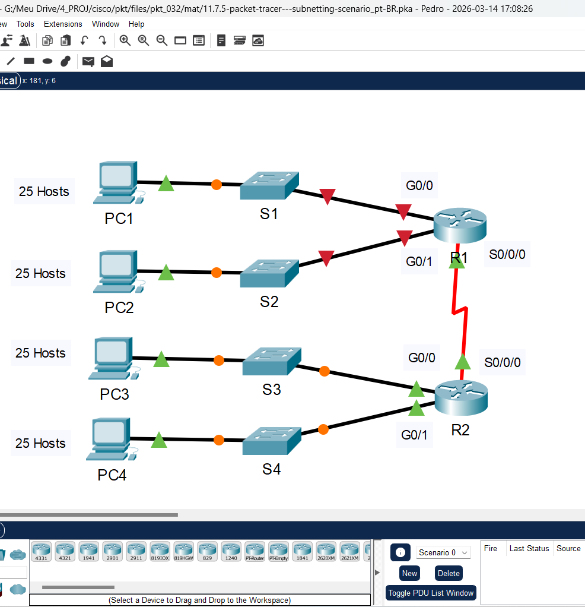
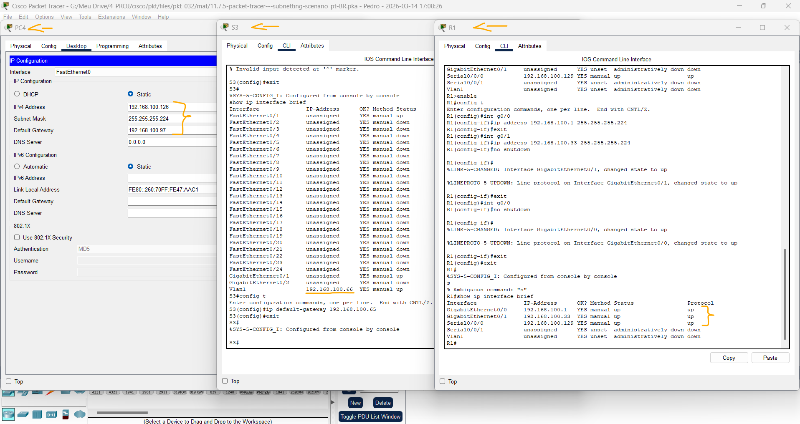
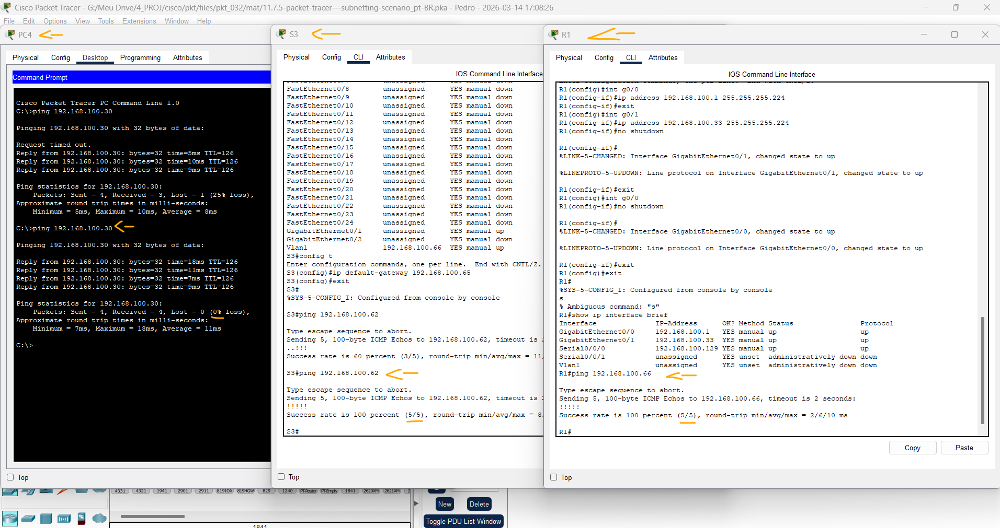

# Packet Tracer - Criação de sub-redes no cenário   

### Cisco: <a href="../../../">cisco   </a>
### Cisco Networking Academy: cna   </a>
### Training Category: <a href="../../../pkt/">pkt</a>
### Software/Subject: network   </a>
### Course: <a href="./">pkt_032 (Packet Tracer - Criação de sub-redes no cenário)   </a>

---

### Theme:
- Network

### Used Tools:
- Operating System (OS): 
  - Cisco Internetwork Operating System (Cisco IOS)   
  - Windows 11 
- Cloud Services:
  - Google Drive 
- Language:
  - HTML   
  - Markdown   
- Integrated Development Environment (IDE) and Text Editor:
  - Visual Studio Code (VS Code)   
- Versioning: 
  - Git   
- Repository:
  - GitHub   
- Network:
  - Cisco Packet Tracer   
  - ping   

---

<h3><a name="item00">Course Strcuture:</a></h3>

1. <a href="#item01">Parte 1: Projetar um Esquema de Endereçamento IP</a> 
  1.1 <a href="#item01.01">Etapa 1: Divida a rede 192.168.100.0/24 no número apropriado de sub-redes.</a> 
  1.2 <a href="#item01.02">Etapa 2: Atribua as sub-redes à rede mostrada na topologia.</a> 
  1.3 <a href="#item01.03">Etapa 3: Documente o esquema de endereçamento.</a> 
2. <a href="#item02">Parte 2: Parte 2: Atribuir Endereços IP a Dispositivos e Verificar a Conectividade</a> 
  2.1 <a href="#item02.01">Etapa 1: Configure interfaces LAN R1.</a> 
  2.2 <a href="#item02.02">Etapa 2: Configure o endereçamento IP no S3.</a> 
  2.3 <a href="#item02.03">Etapa 3: Configure PC4.</a> 
  2.4 <a href="#item02.04">Etapa 4: Verifique a conectividade.</a> 

---

### Objective:
O objetivo desta atividade foi projetar um esquema de sub-redes IPv4 a partir da rede 192.168.100.0/24, configurar o endereçamento dos dispositivos da rede e realizar testes de conectividade entre eles, a fim de garantir o correto funcionamento da rede.

### Folder Structure:
- [README.md](./README.md): Este documento de README, escrito em **Markdown**, com o conteúdo do laboratório.
- [0-aux](./0-aux/): Pasta auxiliar com imagens utilizadas na construção dos arquivos de README desse curso.

### Development:

<a name="item01"><h4>1. Parte 1: Projetar um Esquema de Endereçamento IP</h4></a>[Back to summary](#item00)

A imagem 01 mostra a topologia inicial.

<figure>
     
    <figcaption>Imagem 01.</figcaption>
</figure>
 

<a name="item01.01"><h4>1.1 Etapa 1: Divida a rede 192.168.100.0/24 no número apropriado de sub-redes.</h4></a>[Back to summary](#item00)

- a. Com base na topologia, quantas sub-redes são necessárias?
  - São necessárias 5 sub-redes para atender à topologia apresentada.
- b. Quantos bits devem ser emprestados para comportar o número de sub-redes na tabela de topologia?
  - 3 Bits devem ser emprestados.
- c. Quantas sub-redes são criadas?
  - Com 3 bits emprestados, são criadas 8 sub-redes (2³).
- d. Quantos hosts utilizáveis são criados por sub-rede? Observação: se a resposta for menos que os 25 hosts necessários, significa que você pegou emprestado bits demais. 
  - Cada sub-rede possui 30 hosts utilizáveis, quantidade suficiente para atender ao requisito mínimo de 25 hosts por rede.
- e. Calcule o valor binário das cinco primeiras sub-redes. As duas primeiras sub-redes foram feitas para você. 

#### Tabela 1 — Sub-redes e Representação Binária

| Nº Sub-rede | Endereço da Sub-Rede | Bit 7 | Bit 6 | Bit 5 | Bit 4 | Bit 3 | Bit 2 | Bit 1 | Bit 0 |
|:---:|:---:|:---:|:---:|:---:|:---:|:---:|:---:|:---:|:---:|
| 0 | 192.168.100.0 | 0 | 0 | 0 | 0 | 0 | 0 | 0 | 0 |
| 1 | 192.168.100.32 | 0 | 0 | 1 | 0 | 0 | 0 | 0 | 0 |
| 2 | 192.168.100.64 | 0 | 1 | 0 | 0 | 0 | 0 | 0 | 0 |
| 3 | 192.168.100.96 | 0 | 1 | 1 | 0 | 0 | 0 | 0 | 0 |
| 4 | 192.168.100.128 | 1 | 0 | 0 | 0 | 0 | 0 | 0 | 0 |

- f. Calcule o valor binário e o valor decimal da nova máscara de sub-rede.
  - A nova máscara de sub-rede é 255.255.255.224, que em binário corresponde a 11111111.11111111.11111111.11100000.
- g. Preencha a Tabela de Sub-Redes, listando o valor decimal de todas as sub-redes disponíveis, o primeiro e o último host utilizáveis e o endereço de broadcast. Repita até que todos os endereços estejam listados. Observação: não é necessário usar todas as linhas.

#### Tabela 2 — Planejamento das Sub-redes IPv4

| Nº Sub-rede | Endereço da Sub-Rede | Prefixo | Máscara de Sub-Rede | Primeiro Host | Último Host | Broadcast |
|:---:|:---:|:---:|:---:|:---:|:---:|:---:|
| 0 | 192.168.100.0 | /27 | 255.255.255.224 | 192.168.100.1 | 192.168.100.30 | 192.168.100.31 |
| 1 | 192.168.100.32 | /27 | 255.255.255.224 | 192.168.100.33 | 192.168.100.62 | 192.168.100.63 |
| 2 | 192.168.100.64 | /27 | 255.255.255.224 | 192.168.100.65 | 192.168.100.94 | 192.168.100.95 |
| 3 | 192.168.100.96 | /27 | 255.255.255.224 | 192.168.100.97 | 192.168.100.126 | 192.168.100.127 |
| 4 | 192.168.100.128 | /27 | 255.255.255.224 | 192.168.100.129 | 192.168.100.158 | 192.168.100.159 |

<a name="item01.02"><h4>1.2 Etapa 2: Atribua as sub-redes à rede mostrada na topologia.</h4></a>[Back to summary](#item00)

- a. Atribua a sub-Rede 0 à LAN conectada à interface GigabitEthernet 0/0 de R1: 192.168.100.0 /27 
- b. Atribua a Sub-Rede 1 à LAN conectada à interface GigabitEthernet 0/1 de R1: 192.168.100.32 /27 
- c. Atribua a Sub-Rede 2 à LAN conectada à interface GigabitEthernet 0/0 de R2: 192.168.100.64 /27 
- d. Atribua a Sub-Rede 3 à LAN conectada à interface GigabitEthernet 0/1 de R2: 192.168.100.96 /27 
- e. Atribua a Sub-Rede 4 ao link WAN entre R1 e R2: 192.168.100.128 /27

<a name="item01.03"><h4>1.3 Etapa 3: Documente o esquema de endereçamento.</h4></a>[Back to summary](#item00)

Preencha a Addressing Table utilizando as seguintes diretrizes:
- a. Atribua os primeiros endereços IP utilizáveis em cada sub-rede a R1 para os dois links de LAN e WAN.
- b. Atribua os primeiros endereços IP utilizáveis a R2 para os links LAN. Atribua o último endereço IP utilizável para o link WAN.
- c. Atribua o segundo endereço IP utilizável nas sub-redes anexadas aos comutadores.
- d. Atribua os últimos endereços IP utilizáveis aos PCs em cada sub-rede. 

#### Tabela 3 — Planejamento de Endereçamento IPv4

| Dispositivo | Interface | Endereço IP | Máscara de sub-rede | Gateway padrão |
|:---:|:---:|:---:|:---:|:---:|
| R1 | G0/0 | 192.168.100.1 | 255.255.255.224 | N/A |
| R1 | G0/1 | 192.168.100.33 | 255.255.255.224 | N/A |
| R1 | S0/0/0 | 192.168.100.129 | 255.255.255.224 | N/A |
| R2 | G0/0 | 192.168.100.65 | 255.255.255.224 | N/A |
| R2 | G0/1 | 192.168.100.97 | 255.255.255.224 | N/A |
| R2 | S0/0/0 | 192.168.100.158 | 255.255.255.224 | N/A |
| S1 | VLAN 1 | 192.168.100.2 | 255.255.255.224 | 192.168.100.1 |
| S2 | VLAN 1 | 192.168.100.34 | 255.255.255.224 | 192.168.100.33 |
| S3 | VLAN 1 | 192.168.100.66 | 255.255.255.224 | 192.168.100.65 |
| S4 | VLAN 1 | 192.168.100.98 | 255.255.255.224 | 192.168.100.97 |
| PC1 | NIC | 192.168.100.30 | 255.255.255.224 | 192.168.100.1 |
| PC2 | NIC | 192.168.100.62 | 255.255.255.224 | 192.168.100.33 |
| PC3 | NIC | 192.168.100.94 | 255.255.255.224 | 192.168.100.65 |
| PC4 | NIC | 192.168.100.126 | 255.255.255.224 | 192.168.100.97 |

<a name="item02"><h4>2. Parte 2: Parte 2: Atribuir Endereços IP a Dispositivos e Verificar a Conectividade</h4></a>[Back to summary](#item00)

A maior parte do endereçamento IP já está configurada nesta rede. Implemente as etapas a seguir para concluir a configuração do endereçamento. O roteamento dinâmico EIGRP já está configurado entre R1 e R2.

<a name="item02.01"><h4>2.1 Etapa 1: Configure interfaces LAN R1.</h4></a>[Back to summary](#item00)

- a. Configure as duas interfaces de rede local com os endereços da tabela de endereçamento.
- b. Configure as interfaces para que os hosts nas LANs tenham conectividade com o gateway padrão.
  - `enable` -> `configure terminal` -> `interface g0/0` -> `ip address 192.168.100.1 255.255.255.224` -> `no shutdown` -> `exit`.
  - `enable` -> `configure terminal` -> `interface g0/1` -> `ip address 192.168.100.33 255.255.255.224` -> `no shutdown` -> `exit`.

<a name="item02.02"><h4>2.2 Etapa 2: Configure o endereçamento IP no S3.</h4></a>[Back to summary](#item00)

- a. Configure a interface VLAN1 do switch com endereçamento.
  - `enable` -> `configure terminal` -> `interface vlan1` -> `ip address 192.168.100.66 255.255.255.224` -> `no shutdown` -> `exit`.
- b. Configure o switch com o endereço de gateway padrão.
  - `ip default-gateway 192.168.100.65` -> `exit`.

<a name="item02.03"><h4>2.3 Etapa 3: Configure PC4.</h4></a>[Back to summary](#item00)

- a. Configure o PC4 com endereços de host e gateway padrão.
  - `192.168.100.126` -> `255.255.255.224` -> `192.168.100.97`.

A imagem 02 exibe as configurações de endereçamento IP dos dispositivos solicitados.

<figure>
     
    <figcaption>Imagem 02.</figcaption>
</figure>
 

<a name="item02.04"><h4>2.4 Etapa 4: Verifique a conectividade.</h4></a>[Back to summary](#item00)

- a. Você só pode verificar a conectividade de R1, S3 e PC4. Entretanto, deve conseguir fazer ping em cada endereço IP listado na Tabela de Endereçamento.
  - PC4-PC1: `ping 192.168.100.30`.
  - S3- PC2: `ping 192.168.100.62`.
  - R1-S3: `ping 192.168.100.66`.

A imagem 03 mostra que todos os pings foram respondidos corretamente, indicando que todos os dispositivos da rede estavam se comunicando de forma adequada.

<figure>
     
    <figcaption>Imagem 03.</figcaption>
</figure>
 