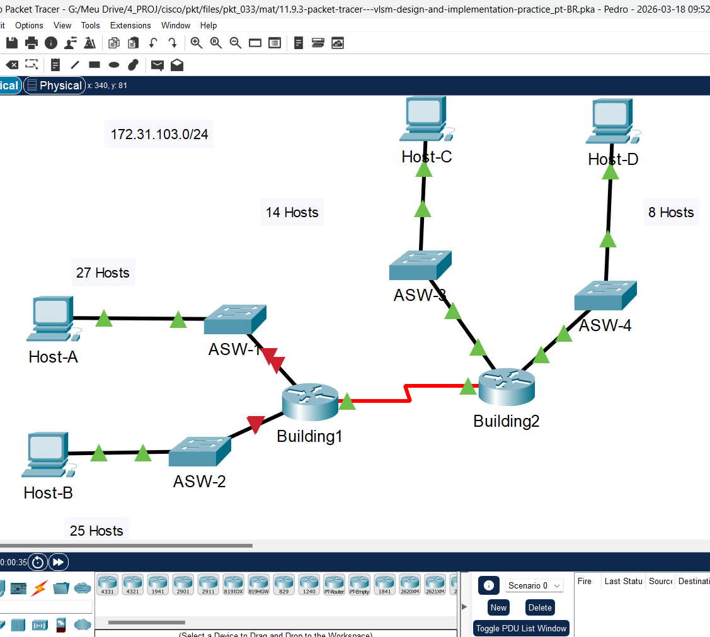
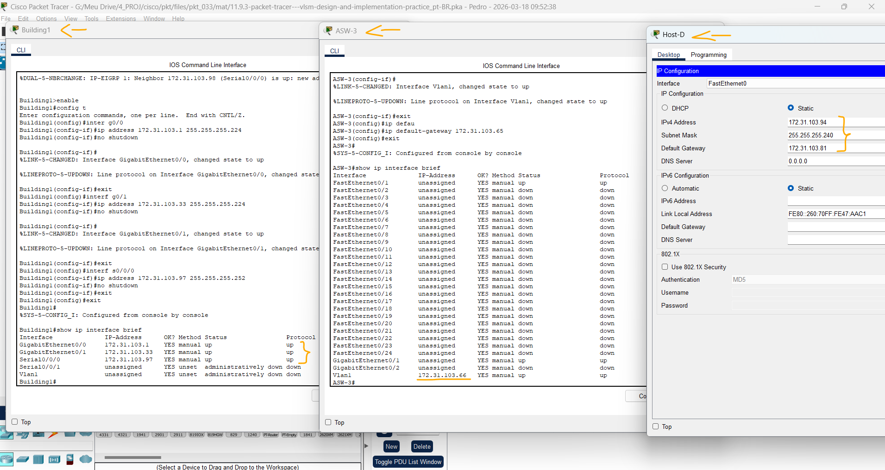
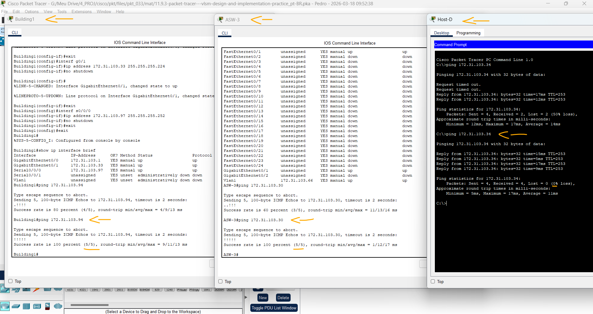

# Packet Tracer - Prática de projeto e implementação do VLSM   

### Cisco: <a href="../../../">cisco   </a>
### Cisco Networking Academy: cna   </a>
### Training Category: <a href="../../../pkt/">pkt</a>
### Software/Subject: network   </a>
### Course: <a href="./">pkt_033 (Packet Tracer - Prática de projeto e implementação do VLSM)   </a>

---

### Theme:
- Network

### Used Tools:
- Operating System (OS): 
  - Cisco Internetwork Operating System (Cisco IOS)   
  - Windows 11 
- Cloud Services:
  - Google Drive 
- Language:
  - HTML   
  - Markdown   
- Integrated Development Environment (IDE) and Text Editor:
  - Visual Studio Code (VS Code)   
- Versioning: 
  - Git   
- Repository:
  - GitHub   
- Network:
  - Cisco Packet Tracer 
  - ping   

---

<h3><a name="item00">Course Strcuture:</a></h3>

1. <a href="#item01">Parte 1: Examinar os Requisitos de Rede</a> 
  1.1 <a href="#item01.01">Etapa 1: Determine o número de sub-redes necessárias.</a> 
  1.2 <a href="#item01.02">Etapa 2: Determine as informações de máscara de sub-rede para cada sub-rede.</a> 
2. <a href="#item02">Parte 2: Projetar o Esquema de Endereçamento VLSM</a> 
  2.1 <a href="#item02.01">Etapa 1: Divida a rede [[DisplayNet]] com base no número de hosts por sub-rede.</a> 
  2.2 <a href="#item02.02">Etapa 2: Documente as sub-redes VLSM.</a> 
  2.3 <a href="#item02.03">Etapa 3: Documente o esquema de endereçamento.</a> 
3. <a href="#item03">Parte 3: Atribuir Endereços IP a Dispositivos e Verificar a Conectividade</a> 
  3.1 <a href="#item03.01">Etapa 1: Configure o endereçamento IP nas interfaces LAN do roteador [[R1Name]].</a> 
  3.2 <a href="#item03.02">Etapa 2: Configure o endereçamento IP no comutador [[S3Name]], incluindo o gateway padrão.</a> 
  3.3 <a href="#item03.03">Etapa 3: Configure o endereçamento IP em [[PC4Name]], incluindo o gateway padrão.</a> 
  3.3 <a href="#item03.03">Etapa 4: Verifique a conectividade.</a> 

---

### Objective:
O objetivo desta atividade foi projetar e implementar um esquema de endereçamento VLSM a partir de uma rede /24, realizar a configuração dos endereços IP nos dispositivos e validar a conectividade entre eles, garantindo o funcionamento adequado da rede.

### Folder Structure:
- [README.md](./README.md): Este documento de README, escrito em **Markdown**, com o conteúdo do laboratório.
- [0-aux](./0-aux/): Pasta auxiliar com imagens utilizadas na construção dos arquivos de README desse curso.

### Development:

<a name="item01"><h4>1. Parte 1: Examinar os Requisitos de Rede</h4></a>[Back to summary](#item00)

A imagem 01 mostra a topologia inicial.

<figure>
     
    <figcaption>Imagem 01.</figcaption>
</figure>
 

<a name="item01.01"><h4>1.1 Etapa 1: Determine o número de sub-redes necessárias.</h4></a>[Back to summary](#item00)

- a. Você irá sub-rede o endereço de rede DisplayNet. A rede tem os seguintes requisitos: 
  - ASW-1 LAN exigirá 27 Host-A endereços IP do host 
  - ASW-2 LAN exigirá 25 Host-B endereços IP do host 
  - ASW-3 LAN exigirá 14 Host-C endereços IP do host 
  - ASW-4 LAN exigirá 8 Host-D endereços IP do host 
- a. Quantas sub-redes são necessárias na topologia de rede?
  - Nesta topologia de rede serão necessárias 5 sub-redes.

<a name="item01.02"><h4>1.2 Etapa 2: Determine as informações de máscara de sub-rede para cada sub-rede.</h4></a>[Back to summary](#item00)

- a. Qual máscara de sub-rede acomodará o número de endereços IP necessários para ASW-1? Quantos endereços de host utilizáveis esta sub-rede suportará? 
  - Máscara /27, com 30 hosts utilizáveis, suficiente para os 27 hosts solicitados.
- b. Qual máscara de sub-rede acomodará o número de endereços IP necessários para ASW-2? Quantos endereços de host utilizáveis esta sub-rede suportará?
  - Máscara /27, com 30 hosts utilizáveis, suficiente para os 25 hosts solicitados.
- c. Qual máscara de sub-rede acomodará o número de endereços IP necessários para ASW-3? Quantos endereços de host utilizáveis esta sub-rede suportará? 
  - Máscara /28, com 14 hosts utilizáveis, atendendo exatamente os 14 hosts solicitados.
- d. Qual máscara de sub-rede acomodará o número de endereços IP necessários para ASW-4? Quantos endereços de host utilizáveis esta sub-rede suportará?
  - Máscara /28, com 14 hosts utilizáveis, suficiente para os 8 hosts solicitados.
- e. Qual máscara de sub-rede acomodará o número de endereços IP necessários para a conexão entre Building1 e Building2? 
  - Máscara /30, com 2 hosts utilizáveis, atendendo exatamente os 2 hosts da conexão ponto a ponto.

<a name="item02"><h4>2. Parte 2: Projetar o Esquema de Endereçamento VLSM</h4></a>[Back to summary](#item00)

<a name="item02.01"><h4>2.1 Etapa 1: Divida a rede DisplayNet com base no número de hosts por sub-rede.</h4></a>[Back to summary](#item00)

- a. Use a primeira sub-rede para acomodar a maior LAN.
- b. Use a segunda sub-rede para acomodar a segunda maior LAN.
- c. Use a terceira sub-rede para acomodar a terceira maior LAN.
- d. Use a quarta sub-rede para acomodar a quarta maior LAN.
- e. Use a quinta sub-rede para acomodar a conexão entre Building1 e Building2.

<a name="item02.02"><h4>2.2 Etapa 2: Documente as sub-redes VLSM.</h4></a>[Back to summary](#item00)

Preencha a Tabela de sub-rede, listando as descrições de sub-rede (por exemplo, ASW-1 LAN), número de hosts necessários e endereço de rede para a sub-rede, o primeiro endereço de host utilizável e o endereço de broadcast. Repita até que todos os endereços estejam listados.

| Nº Sub-rede | Endereço da Sub-Rede | Prefixo | Máscara de Sub-Rede | Primeiro Host | Último Host | Broadcast |
|:---:|:---:|:---:|:---:|:---:|:---:|:---:|
| 1 | 172.31.103.0 | /27 | 255.255.255.224 | 172.31.103.1 | 172.31.103.30 | 172.31.103.31 |
| 2 | 172.31.103.32 | /27 | 255.255.255.224 | 172.31.103.33 | 172.31.103.62 | 172.31.103.63 |
| 3 | 172.31.103.64 | /28 | 255.255.255.240 | 172.31.103.65 | 172.31.103.78 | 172.31.103.79 |
| 4 | 172.31.103.80 | /28 | 255.255.255.240 | 172.31.103.81 | 172.31.103.94 | 172.31.103.95 |
| 5 | 172.31.103.96 | /30 | 255.255.255.252 | 172.31.103.97 | 172.31.103.98 | 172.31.103.99 |

<a name="item02.03"><h4>2.3 Etapa 3: Documente o esquema de endereçamento.</h4></a>[Back to summary](#item00)

- a. Atribua os primeiros endereços IP utilizáveis a Building1 para os dois links LAN e WAN.
- b. Atribua os primeiros endereços IP utilizáveis a Building2 para os dois links LAN. Atribua o último endereço IP utilizável para o link WAN.
- c. Atribua os segundos endereços IP utilizáveis aos switches.
- d. Atribua os últimos endereços IP utilizáveis aos hosts.

| Dispositivo | Interface | Endereço IP | Máscara de sub-rede | Gateway padrão |
|:---:|:---:|:---:|:---:|:---:|
| R1 (Building1) | G0/0 | 172.31.103.1 | 255.255.255.224 | N/A |
| R1 (Building1) | G0/1 | 172.31.103.33 | 255.255.255.224 | N/A |
| R1 (Building1) | S0/0/0 | 172.31.103.97 | 255.255.255.252 | N/A |
| R2 (Building 2) | G0/0 | 172.31.103.65 | 255.255.255.240 | N/A |
| R2 (Building 2) | G0/1 | 172.31.103.81 | 255.255.255.240 | N/A |
| R2 (Building 2) | S0/0/0 | 172.31.103.98 | 255.255.255.252 | N/A |
| S1 (ASW-1) | VLAN 1 | 172.31.103.2 | 255.255.255.224 | 172.31.103.1 |
| S2 (ASW-2) | VLAN 1 | 172.31.103.34 | 255.255.255.224 | 172.31.103.33 |
| S3 (ASW-3) | VLAN 1 | 172.31.103.66 | 255.255.255.240 | 172.31.103.65 |
| S4 (ASW-4) | VLAN 1 | 172.31.103.82 | 255.255.255.240 | 172.31.103.81 |
| PC1 (Host-A) | NIC | 172.31.103.30 | 255.255.255.224 | 172.31.103.1 |
| PC2 (Host-B) | NIC | 172.31.103.62 | 255.255.255.224 | 172.31.103.33 |
| PC3 (Host-C) | NIC | 172.31.103.78 | 255.255.255.240 | 172.31.103.65 |
| PC4 (Host-D) | NIC | 172.31.103.94 | 255.255.255.240 | 172.31.103.81 |

<a name="item03"><h4>3. Parte 3: Atribuir Endereços IP a Dispositivos e Verificar a Conectividade</h4></a>[Back to summary](#item00)

A maior parte do endereçamento IP já está configurada nesta rede. Implemente as etapas a seguir para concluir a configuração do endereçamento.

<a name="item03.01"><h4>3.1 Etapa 1: Configure o endereçamento IP nas interfaces LAN do roteador Building1.</h4></a>[Back to summary](#item00)

- R1-G0/0: `enable` -> `configure terminal` -> `interface g0/0` -> `ip address 172.31.103.1 255.255.255.224` -> `no shutdown` -> `exit`.
- R1-G0/1: `interface g0/1` -> `ip address 172.31.103.33 255.255.255.224` -> `no shutdown` -> `exit`.
- R1-S0/0/0: `interface s0/0/0` -> `ip address 172.31.103.97 255.255.255.252` -> `no shutdown` -> `exit`.

<a name="item03.02"><h4>3.2 Etapa 2: Configure o endereçamento IP no comutador ASW-3, incluindo o gateway padrão.</h4></a>[Back to summary](#item00)

- S3: `enable` -> `configure terminal` -> `interface vlan1` -> `ip address 172.31.103.66 255.255.255.240` -> `no shutdown` -> `exit` -> `ip default-gateway 172.31.103.65`.

<a name="item03.03"><h4>3.3 Etapa 3: Configure o endereçamento IP em Host-D, incluindo o gateway padrão.</h4></a>[Back to summary](#item00)

- Host-D: `172.31.103.94` -> `255.255.255.240` -> `172.31.103.81`.

A imagem 02 exibe as configurações de endereçamento IP dos dispositivos solicitados.

<figure>
     
    <figcaption>Imagem 02.</figcaption>
</figure>
 

<a name="item03.04"><h4>3.4 Etapa 4: Verifique a conectividade.</h4></a>[Back to summary](#item00)

Você só pode verificar a conectividade de Building1, ASW-3 e Host-D. Entretanto, deve conseguir fazer ping em cada endereço IP listado na Tabela de Endereçamento.

- Building1 -> Host-D: `ping 172.31.103.94`.
- ASW-3 -> Host-A: `ping 172.31.103.30`.
- Host-D -> ASW-2: `ping 172.31.103.34`.

A imagem 03 mostra que todos os pings foram respondidos corretamente, indicando que todos os dispositivos da rede estavam se comunicando de forma adequada.

<figure>
     
    <figcaption>Imagem 03.</figcaption>
</figure>
 