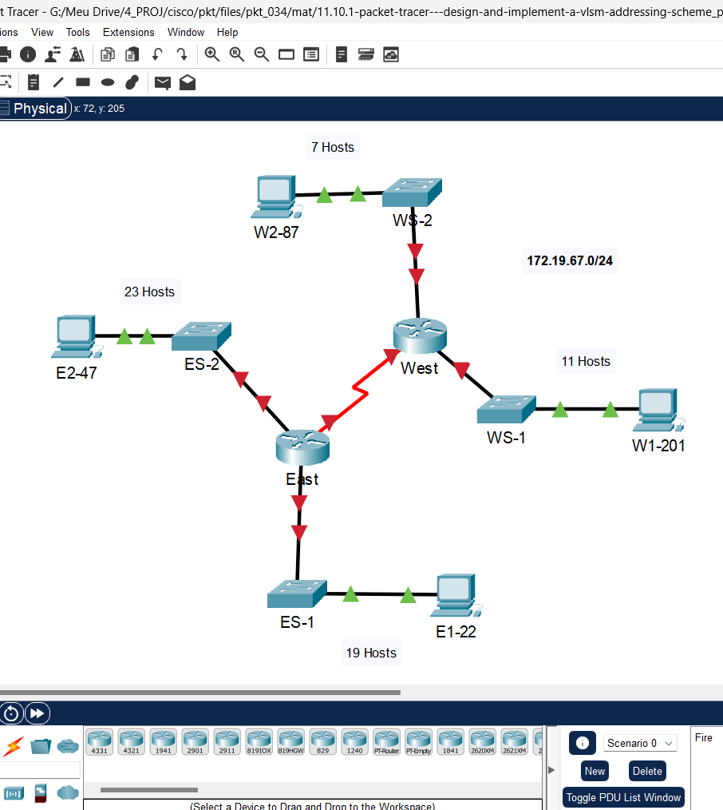
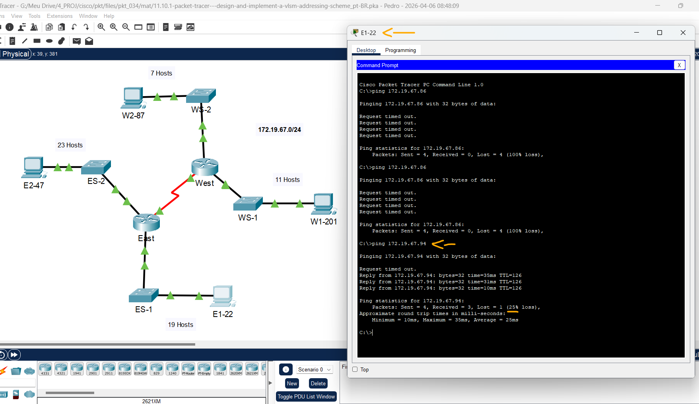

# Packet Tracer - Projete e implemente um esquema de endereçamento VLSM   

### Cisco: <a href="../../../">cisco   </a>
### Cisco Networking Academy: cna   </a>
### Training Category: <a href="../../../pkt/">pkt</a>
### Software/Subject: network   </a>
### Course: <a href="./">pkt_034 (Packet Tracer - Projete e implemente um esquema de endereçamento VLSM)   </a>

---

### Theme:
- Network

### Used Tools:
- Operating System (OS): 
  - Cisco Internetwork Operating System (Cisco IOS)   
  - Windows 11 
- Cloud Services:
  - Google Drive 
- Language:
  - HTML   
  - Markdown   
- Integrated Development Environment (IDE) and Text Editor:
  - Visual Studio Code (VS Code)   
- Versioning: 
  - Git   
- Repository:
  - GitHub   
- Network:
  - Cisco Packet Tracer 
  - ping   

---

<h3><a name="item00">Course Strcuture:</a></h3>

1. <a href="#item01">Packet Tracer - Projete e implemente um esquema de endereçamento VLSM</a> 
  1.1 <a href="#item01.01">Requisitos do host</a> 
  1.2 <a href="#item01.02">Requisitos de projeto</a> 
  1.3 <a href="#item01.03">Requisitos de Configuração</a> 
  1.4 <a href="#item01.04">Configuração</a> 

---

### Objective:
O objetivo desta atividade foi projetar e implementar um esquema de endereçamento VLSM a partir de um endereço de rede e requisitos locais, realizar a configuração dos endereços IP nos dispositivos e validar a conectividade entre eles, garantindo o funcionamento adequado da rede.

### Folder Structure:
- [README.md](./README.md): Este documento de README, escrito em **Markdown**, com o conteúdo do laboratório.
- [0-aux](./0-aux/): Pasta auxiliar com imagens utilizadas na construção dos arquivos de README desse curso.

### Development:

<a name="item01"><h4>1. Packet Tracer - Projete e implemente um esquema de endereçamento VLSM</h4></a>[Back to summary](#item00)

A imagem 01 mostra a topologia inicial.

<figure>
     
    <figcaption>Imagem 01.</figcaption>
</figure>
 

<a name="item01.01"><h4>1.1 Requisitos do host</h4></a>[Back to summary](#item00)

| Nº Sub-rede | Nome da Sub-Rede | Número de endereços necessários |
|:---:|:---:|:---:|
| 1 | ES-2 LAN | 23 |
| 2 | ES-1 LAN | 19 |
| 3 | WS-1 LAN | 11 |
| 4 | WS-2 LAN | 7 | 
| 5 | East-West LAN | 2 |

<a name="item01.02"><h4>1.2 Requisitos de projeto</h4></a>[Back to summary](#item00)

- Crie o design de endereçamento. Siga as diretrizes fornecidas no currículo sobre a ordem das sub-redes. 
- As sub-redes devem ser contíguas. Não deve haver espaço de endereço não utilizado entre sub-redes.
- Forneça a sub-rede mais eficiente possível para o link ponto a ponto entre os roteadores.
- Documente seu design em uma tabela como a abaixo.

| Nº Sub-rede | Nome da Sub-Rede | Endereço da Sub-Rede | Prefixo | Máscara de Sub-Rede | Primeiro Host | Último Host | Broadcast |
|:---:|:---:|:---:|:---:|:---:|:---:|:---:|:---:|
| 1 | ES-1 LAN | 172.19.67.0 | /27 | 255.255.255.224 | 172.19.67.1 | 172.19.67.30 | 172.19.67.31 |
| 2 | ES-2 LAN | 172.19.67.32 | /27 | 255.255.255.224 | 172.19.67.33 | 172.19.67.62 | 172.19.67.63 |
| 3 | WS-1 LAN | 172.19.67.64 | /28 | 255.255.255.240 | 172.19.67.65 | 172.19.67.78 | 172.19.67.79 |
| 4 | WS-2 LAN | 172.19.67.80 | /28 | 255.255.255.240 | 172.19.67.81 | 172.19.67.94 | 172.19.67.95 |
| 5 | East-West LAN | 172.19.67.96 | /30 | 255.255.255.252 | 172.19.67.97 | 172.19.67.98 | 172.19.67.99 |

<a name="item01.03"><h4>1.3 Requisitos de Configuração</h4></a>[Back to summary](#item00)

Observação: Você configurará o endereçamento em todos os dispositivos e hosts na rede.

- Atribua os primeiros endereços IP utilizáveis nas sub-redes apropriadas a East para os dois links LAN e WAN.
- Atribua os primeiros endereços IP utilizáveis nas sub-redes apropriadas a West para os dois links de LANs. Atribua o último endereço IP utilizável para o link WAN.
- Atribua os segundos endereços IP utilizáveis nas sub-redes apropriadas aos switches.
- A interface de gerenciamento de switch deve ser acessada a partir de hosts em todas as LANs.
- Atribua os últimos endereços IP utilizáveis nas sub-redes apropriadas aos hosts.

| Dispositivo | Interface | Endereço IP | Máscara de sub-rede | Gateway padrão |
|:---:|:---:|:---:|:---:|:---:|
| R1 (ES-1) | G0/0 | 172.19.67.1 | 255.255.255.224 | N/A |
| R1 (ES-2) | G0/1 | 172.19.67.33 | 255.255.255.224 | N/A |
| R1 (East-West) | S0/0/0 | 172.19.67.89 | 255.255.255.252 | N/A |
| R2 (WS-1) | G0/0 | 172.19.67.65 | 255.255.255.240 | N/A |
| R2 (WS-2) | G0/1 | 172.19.67.81 | 255.255.255.240 | N/A |
| R2 (East-West) | S0/0/0 | 172.19.67.98 | 255.255.255.252 | N/A |
| S1 (ES-1) | VLAN 1 | 172.19.67.2 | 255.255.255.224 | 172.19.67.1 |
| S2 (ES-2) | VLAN 1 | 172.19.67.34 | 255.255.255.224 | 172.19.67.33 |
| S3 (WS-1) | VLAN 1 | 172.19.67.66 | 255.255.255.240 | 172.19.67.65 |
| S4 (WS-2) | VLAN 1 | 172.19.67.82 | 255.255.255.240 | 172.19.67.81 |
| PC1 (E1-22) | NIC | 172.19.67.30 | 255.255.255.224 | 172.19.67.1 |
| PC2 (E2-47) | NIC | 172.19.67.62 | 255.255.255.224 | 172.19.67.33 |
| PC3 (W1-201) | NIC | 172.19.67.78 | 255.255.255.240 | 172.19.67.65 |
| PC4 (W2-87) | NIC | 172.19.67.94 | 255.255.255.240 | 172.19.67.81 |

<a name="item01.04"><h4>1.4 Configuração</h4></a>[Back to summary](#item00)

- R1-G0/0: `enable` -> `configure terminal` -> `interface g0/0` -> `ip address 172.19.67.1 255.255.255.224` -> `no shutdown` -> `exit`.
- R1-G0/1: `interface g0/1` -> `ip address 172.19.67.33 255.255.255.224` -> `no shutdown` -> `exit`.
- R1-S0/0/0: `interface s0/0/0` -> `ip address 172.19.67.97 255.255.255.252` -> `no shutdown` -> `exit`.
- R2-G0/0: `enable` -> `configure terminal` -> `interface g0/0` -> `ip address 172.19.67.65 255.255.255.240` -> `no shutdown` -> `exit`.
- R2-G0/1: `interface g0/1` -> `ip address 172.19.67.81 255.255.255.240` -> `no shutdown` -> `exit`.
- R2-S0/0/0: `interface s0/0/0` -> `ip address 172.19.67.98 255.255.255.252` -> `no shutdown` -> `exit`.
- S1: `enable` -> `configure terminal` -> `interface vlan1` -> `ip address 172.19.67.2 255.255.255.224` -> `no shutdown` -> `exit` -> `ip default-gateway 172.19.67.1`.
- S2: `enable` -> `configure terminal` -> `interface vlan1` -> `ip address 172.19.67.34 255.255.255.224` -> `no shutdown` -> `exit` -> `ip default-gateway 172.19.67.33`.
- S3: `enable` -> `configure terminal` -> `interface vlan1` -> `ip address 172.19.67.66 255.255.255.240` -> `no shutdown` -> `exit` -> `ip default-gateway 172.19.67.65`.
- S4: `enable` -> `configure terminal` -> `interface vlan1` -> `ip address 172.19.67.82 255.255.255.240` -> `no shutdown` -> `exit` -> `ip default-gateway 172.19.67.81`.
- PC1 (E1-22): `172.19.67.30` -> `255.255.255.224` -> `172.19.67.1`.
- PC2 (E2-47): `172.19.67.62` -> `255.255.255.224` -> `172.19.67.33`.
- PC3 (W1-201): `172.19.67.78` -> `255.255.255.240` -> `172.19.67.65`.
- PC4 (W2-87): `172.19.67.94` -> `255.255.255.240` -> `172.19.67.81`.

A imagem 02 comprova a comunicação do PC E1-22 com o PC da outra rede, PC W2-87.

<figure>
     
    <figcaption>Imagem 02.</figcaption>
</figure>
 