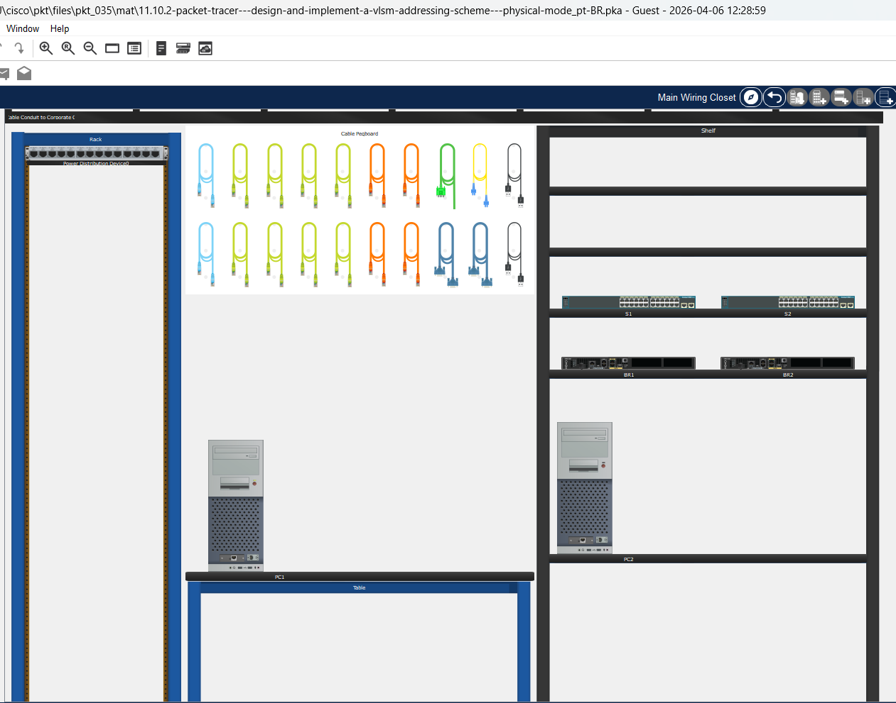
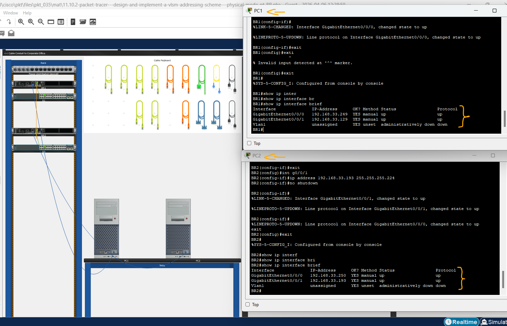
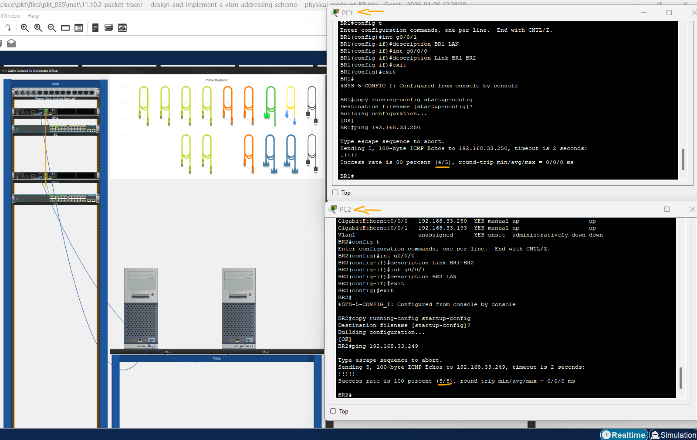

# Packet Tracer - Projetar e Implementar um Esquema de Endereçamento VLSM - Modo Físico   

### Cisco: <a href="../../../">cisco   </a>
### Cisco Networking Academy: cna   </a>
### Training Category: <a href="../../../pkt/">pkt</a>
### Software/Subject: network   </a>
### Course: <a href="./">pkt_035 (Packet Tracer - Projetar e Implementar um Esquema de Endereçamento VLSM - Modo Físico)   </a>

---

### Theme:
- Network

### Used Tools:
- Operating System (OS): 
  - Cisco Internetwork Operating System (Cisco IOS)   
  - Windows 11 
- Cloud Services:
  - Google Drive 
- Language:
  - HTML   
  - Markdown   
- Integrated Development Environment (IDE) and Text Editor:
  - Visual Studio Code (VS Code)   
- Versioning: 
  - Git   
- Repository:
  - GitHub   
- Network:
  - Cisco Packet Tracer   
  - ping   

---

<h3><a name="item00">Course Strcuture:</a></h3>

1. <a href="#item01">Parte 1: Examinar os Requisitos da Rede</a> 
  1.1 <a href="#item01.01">Etapa 1: Determine quantos endereços de host e quantas sub-redes estão disponíveis.</a> 
  1.2 <a href="#item01.02">Etapa 2: Determine a maior sub-rede.</a> 
  1.3 <a href="#item01.03">Etapa 3: Determine a segunda maior sub-rede.</a> 
  1.4 <a href="#item01.04">Etapa 4: Determine a terceira maior sub-rede.</a> 
  1.5 <a href="#item01.05">Etapa 5: Determine a quarta maior sub-rede.</a> 
2. <a href="#item02">Parte 2: Projetar o Esquema de Endereçamento VLSM</a> 
  2.1 <a href="#item02.01">Etapa 1: Calcule as informações de sub-rede.</a> 
  2.2 <a href="#item02.02">Etapa 2: Preencha a tabela de endereços das interfaces dos dispositivos.</a> 
3. <a href="#item03">Parte 3: Cabear e Configurar a rede IPv4</a> 
  3.1 <a href="#item03.01">Etapa 1: Conectar a rede.</a> 
  3.2 <a href="#item03.02">Etapa 2: Defina as configurações básicas de cada roteador.</a> 
  3.3 <a href="#item03.03">Etapa 3: Configure as interfaces em cada roteador.</a> 
  3.4 <a href="#item03.04">Etapa 4: Salve a configuração em todos os dispositivos.</a> 
  3.5 <a href="#item03.05">Etapa 5: Teste a conectividade.</a> 
4. <a href="#item04">Perguntas para reflexão</a> 

---

### Objective:
O objetivo desta atividade do modo físico foi projetar e implementar um esquema de endereçamento VLSM a partir de uma rede /25, realizando o cabeamento, a configuração dos endereços IP nos dispositivos e a validação da conectividade, a fim de garantir o funcionamento correto da rede.

### Folder Structure:
- [README.md](./README.md): Este documento de README, escrito em **Markdown**, com o conteúdo do laboratório.
- [0-aux](./0-aux/): Pasta auxiliar com imagens utilizadas na construção dos arquivos de README desse curso.

### Development:

<a name="item01"><h4>1. Parte 1: Examinar os Requisitos da Rede</h4></a>[Back to summary](#item00)

Nesta parte, você examinará os requisitos de rede para desenvolver um esquema de endereço VLSM para a rede que é exibido no diagrama de topologia usando o endereço de rede 192.168.33.128/25.  

A imagem 01 mostra a topologia inicial.

<figure>
     
    <figcaption>Imagem 01.</figcaption>
</figure>
 

<a name="item01.01"><h4>1.1 Etapa 1: Determine quantos endereços de host e quantas sub-redes estão disponíveis.</h4></a>[Back to summary](#item00)

- Quantos endereços de host estão disponíveis em uma rede /25?
  - Uma rede /25 disponibiliza 126 hosts utilizáveis.
- Qual é o total de endereços de host necessários no diagrama de topologia? 
  - A topologia requer 80 endereços de host.
- Quantas sub-redes são necessárias na topologia de rede?
  - A topologia necessita de 6 sub-redes.

<a name="item01.02"><h4>1.2 Etapa 2: Determine a maior sub-rede.</h4></a>[Back to summary](#item00)

- Qual é a descrição da sub-rede (por exemplo, link BR1 LAN ou BR1-BR2)? 
  - A maior sub-rede corresponde à BR1 LAN.
- Quantos endereços IP são necessários na maior sub-rede?
  - Para a maior sub-rede são necessários 40 endereços IP.
- Que máscara de sub-rede é capaz de comportar essa quantidade de endereços de host?
  - A máscara de sub-rede que comporta a quantidade de 40 hosts é 255.255.255.192, cujo prefixo é /26.
- Quantos endereços de host a máscara de sub-rede pode comportar no total?
  - Essa máscara suporta 62 hosts utilizáveis.
- Você pode sub-rede o endereço de rede 192.168.33.128/25 para suportar esta sub-rede?
  - Sim, é possível, utilizando uma sub-rede /26.
- Quais são os endereços de rede que resultariam dessa sub-rede?
  - Os endereços de rede resultantes são 192.168.33.128/26 e 192.168.33.192/26.
- Use o primeiro endereço de rede para essa sub-rede.
  - 192.168.33.128/26.

<a name="item01.03"><h4>1.3 Etapa 3: Determine a segunda maior sub-rede.</h4></a>[Back to summary](#item00)

- Qual é a descrição da sub-rede? 
  - A segunda maior sub-rede corresponde à BR2 LAN.
- Quantos endereços IP são necessários para a segunda maior sub-rede? 
  - Para esta sub-rede são necessários 25 endereços IP.
- Que máscara de sub-rede é capaz de comportar essa quantidade de endereços de host? 
  - A máscara de sub-rede que comporta a quantidade de 25 hosts é 255.255.255.224, cujo prefixo é /27.
- Quantos endereços de host a máscara de sub-rede pode comportar no total? 
  - Essa máscara suporta 30 hosts utilizáveis.
- É possível dividir novamente a sub-rede restante e continuar comportando essa sub-rede? 
  - Sim, é possível, utilizando uma sub-rede /27.
- Quais são os endereços de rede que resultariam dessa sub-rede? 
  - Os endereços de rede resultantes são 192.168.33.192/27 e 192.168.33.224/27.
- Use o primeiro endereço de rede para essa sub-rede. 
  - 192.168.33.192/27.

<a name="item01.04"><h4>1.4 Etapa 4: Determine a terceira maior sub-rede.</h4></a>[Back to summary](#item00)

- Qual é a descrição da sub-rede? 
  - A terceira maior sub-rede corresponde à BR2 IoT LAN, seguida pelas redes CCTV LAN e HVAC C2 LAN.
- Quantos endereços IP são necessários para a próxima sub-rede maior? 
  - Esta sub-rede requer 5 endereços IP, enquanto as demais necessitam de 4 hosts cada.
- Que máscara de sub-rede é capaz de comportar essa quantidade de endereços de host? 
  - A máscara de sub-rede que comporta a quantidade de 5 hosts é 255.255.255.248, cujo prefixo é /29.
- Quantos endereços de host a máscara de sub-rede pode comportar no total? 
  - Essa máscara suporta 6 hosts utilizáveis.
- É possível dividir novamente a sub-rede restante e continuar comportando essa sub-rede? 
  - Sim, é possível, utilizando uma sub-rede /29.
- Quais são os endereços de rede que resultariam dessa sub-rede? 
  - Os endereços resultantes são 192.168.33.224/29, 192.168.33.232/29, 192.168.33.240/29 e 192.168.33.248/29.
- Use o primeiro endereço de rede para essa sub-rede. 
  - 192.168.33.224/29.
- Use o segundo endereço de rede para a LAN CCTV. 
  - 192.168.33.232/29.
- Use o terceiro endereço de rede para a LAN HVAC C2.
  - 192.168.33.240/29.

<a name="item01.05"><h4>1.5 Etapa 5: Determine a quarta maior sub-rede.</h4></a>[Back to summary](#item00)

- Qual é a descrição da sub-rede? 
  - A última sub-rede é a Link BR1-BR2 .
- Quantos endereços IP são necessários para a próxima sub-rede maior? 
  - Para esta sub-rede são necessários 2 endereços IP.
- Que máscara de sub-rede é capaz de comportar essa quantidade de endereços de host? 
  - A máscara de sub-rede que comporta a quantidade de 2 hosts é 255.255.255.252, cujo prefixo é /30.
- Quantos endereços de host a máscara de sub-rede pode comportar no total? 
  - Essa máscara suporta 2 hosts utilizáveis.
- É possível dividir novamente a sub-rede restante e continuar comportando essa sub-rede? 
  - Sim, é possível, utilizando uma sub-rede /30.
- Quais são os endereços de rede que resultariam dessa sub-rede? 
  - Os endereços resultantes são 192.168.33.248/30 e 192.168.33.252/30.
- Use o primeiro endereço de rede para essa sub-rede.
  - 192.168.33.248/30.

<a name="item02"><h4>2. Parte 2: Projetar o Esquema de Endereçamento VLSM</h4></a>[Back to summary](#item00)

Nesta parte, você documentará o esquema de endereçamento VLSM.

<a name="item02.01"><h4>2.1 Etapa 1: Calcule as informações de sub-rede.</h4></a>[Back to summary](#item00)

Use as informações obtidas na Parte 1 para preencher a tabela a seguir.

#### Tabela 1 — Planejamento das Sub-redes IPv4

| Nº Sub-rede | Nº de Hosts Necessários | Endereço da Sub-Rede | Prefixo | Máscara de Sub-Rede | Primeiro Host | Último Host | Broadcast |
|:---:|:---:|:---:|:---:|:---:|:---:|:---:|:---:|
| 1 | 192.168.33.128 | 40 | /26 | 255.255.255.192 | 192.168.33.129 | 192.168.33.190 | 192.168.33.191 |
| 2 | 192.168.33.192 | 25 | /27 | 255.255.255.224 | 192.168.33.193 | 192.168.33.222 | 192.168.33.223 |
| 3 | 192.168.33.224 | 5 | /29 | 255.255.255.248 | 192.168.33.225 | 192.168.33.230 | 192.168.33.231 |
| 4 | 192.168.33.232 | 4 | /29 | 255.255.255.248 | 192.168.33.233 | 192.168.33.238 | 192.168.33.239 |
| 5 | 192.168.33.240 | 4 | /29 | 255.255.255.248 | 192.168.33.241 | 192.168.33.246 | 192.168.33.247 |
| 6 | 192.168.33.248 | 2 | /30 | 255.255.255.252 | 192.168.33.249 | 192.168.33.250 | 192.168.33.251 |

<a name="item02.02"><h4>2.2 Etapa 2: Preencha a tabela de endereços das interfaces dos dispositivos.</h4></a>[Back to summary](#item00)

Atribua o primeiro endereço de host válido na sub-rede às interfaces Ethernet. BR1 deve receber o primeiro endereço de host no link BR1-BR2.

#### Tabela 2 — Planejamento de Endereçamento IPv4

| Dispositivo | Interface | Endereço IP | Máscara de sub-rede | Gateway padrão |
|:---:|:---:|:---:|:---:|:---:|
| BR1 | G0/0/1 | 192.168.33.129 | 255.255.255.192 | N/A |
| BR1 | G0/0/0 | 192.168.33.249 | 255.255.255.252 | N/A |
| BR2 | G0/0/0 | 192.168.33.250 | 255.255.255.252 | N/A |
| BR2 | G0/0/1 | 192.168.33.193 | 255.255.255.224 | N/A |

<a name="item03"><h4>3. Parte 3: Cabear e Configurar a rede IPv4</h4></a>[Back to summary](#item00)

Nesta parte, você conectará a rede para combinar a topologia. Você configurará os três roteadores usando o esquema de endereço VLSM desenvolvido na Parte 2.

<a name="item03.01"><h4>3.1 Etapa 1: Conectar a rede.</h4></a>[Back to summary](#item00)

- a. No armário de fiação principal, clique e arraste os roteadores e interruptores da prateleira de inventário para o rack. 
- b. Faça o cabeamento da rede conforme mostrado na topologia e ligue os dispositivos conforme necessário. 

<a name="item03.02"><h4>3.2 Etapa 2: Defina as configurações básicas de cada roteador.</h4></a>[Back to summary](#item00)

- a. Estabeleça uma conexão de console entre um roteador e o PC na mesa. 
- b. Na janela terminal no PC, estabeleça uma sessão terminal ao roteador.
- c. Atribua o nome de dispositivo correto a cada um dos dois roteadores.
  - `enable` -> `configure terminal` -> `hostname BR1`.
  - `enable` -> `configure terminal` -> `hostname BR2`.
- d. Atribua a class como a senha criptografada EXEC privilegiada para os dois roteadores.
  - `enable secret class`.
- e. Atribua Cisco como a senha do console e ative o login para os roteadores.
  - `line console 0` -> `password cisco` -> `login` -> `exit`.
- f. Atribua cisco como a senha vty e habilite o login para os roteadores.
  - `line vty 0 4` -> `password cisco` -> `login` -> `exit`.
- g. Criptografe as senhas de texto sem formatação para os roteadores.
  - `service password-encryption`.
- h. Crie um banner que avise a todos que acessam o dispositivo que o acesso não autorizado é proibido nos dois roteadores.
  - `banner motd #Unauthorized access is prohibited.#`

<a name="item03.03"><h4>3.3 Etapa 3: Configure as interfaces em cada roteador.</h4></a>[Back to summary](#item00)

- a. Atribua um endereço IP e uma máscara de sub-rede a cada interface, usando a tabela preenchida na Parte 2.
  - BR1-G0/0/1: `enable` -> `configure terminal` -> `interface g0/0/1` -> `ip address 192.168.33.129 255.255.255.192` -> `no shutdown` -> `exit`.
  - BR1-G0/0/0: `interface g0/0/0` -> `ip address 192.168.33.249 255.255.255.252` -> `no shutdown` -> `exit`.
  - BR2-G0/0/0: `enable` -> `configure terminal` -> `interface g0/0/0` -> `ip address 192.168.33.250 255.255.255.252` -> `no shutdown` -> `exit`.
  - BR2-G0/0/1: `interface g0/0/1` -> `ip address 192.168.33.193 255.255.255.224` -> `no shutdown` -> `exit`.
- b. Configure uma descrição de interface para cada interface. 
  - BR1-G0/0/1: `enable` -> `configure terminal` -> `interface g0/0/1` -> `description BR1 LAN` -> `exit`.
  - BR1-G0/0/0: `interface g0/0/0` -> `description Link BR1-BR2` -> `exit`.
  - BR2-G0/0/0: `enable` -> `configure terminal` -> `interface g0/0/0` -> `description Link BR1-BR2` -> `exit`.
  - BR2-G0/0/1: `interface g0/0/1` -> `description BR2 LAN` -> `exit`.
- c. Ative as interfaces.
  - BR1-G0/0/1: `enable` -> `configure terminal` -> `interface g0/0/1` -> `no shutdown` -> `exit`.
  - BR1-G0/0/0: `interface g0/0/0` -> `no shutdown` -> `exit`.
  - BR2-G0/0/0: `enable` -> `configure terminal` -> `interface g0/0/0` -> `no shutdown` -> `exit`.
  - BR2-G0/0/1: `interface g0/0/1` -> `no shutdown` -> `exit`.

A imagem 02 exibe as configurações de endereçamento IP dos dispositivos solicitados.

<figure>
     
    <figcaption>Imagem 02.</figcaption>
</figure>
 

<a name="item03.04"><h4>3.4 Etapa 4: Salve a configuração em todos os dispositivos.</h4></a>[Back to summary](#item00)

- `copy running-config startup-config`.

<a name="item03.05"><h4>3.5 Etapa 5: Teste a conectividade.</h4></a>[Back to summary](#item00)

- a. Do BR1, ping para interface G0/0/0 no BR2.
  - `ping 192.168.33.250`.
- b. Do BR2, ping para interface G0/0/0 no BR1.
  - `ping 192.168.33.249`.
- c. Se os pings não forem bem-sucedidos, identifique os problemas de conectividade e solucione-os.

Nota: Pings para as interfaces de LAN GigabitEthernet em outros roteadores não serão bem-sucedidos. Um protocolo de roteamento precisa ser implementado para que outros dispositivos reconheçam essas sub-redes. As interfaces Gigabit Ethernet também precisam estar up/up para que um protocolo de roteamento possa adicionar as sub-redes à tabela de roteamento. O foco deste laboratório é o VLSM e a configuração de interfaces. 

A imagem 03 mostra que todos os pings foram respondidos corretamente.

<figure>
     
    <figcaption>Imagem 03.</figcaption>
</figure>
 

<a name="item04"><h4>4. Perguntas para reflexão</h4></a>[Back to summary](#item00)

- a. Você tem alguma sugestão de atalho para calcular os endereços de rede das sub-redes /30 consecutivas?
  - Sim. Em sub-redes /30, o bloco avança de 4 em 4 endereços. Basta somar 4 ao último octeto para encontrar a próxima rede. Exemplo: 192.168.33.248, 192.168.33.252, 192.168.34.0.