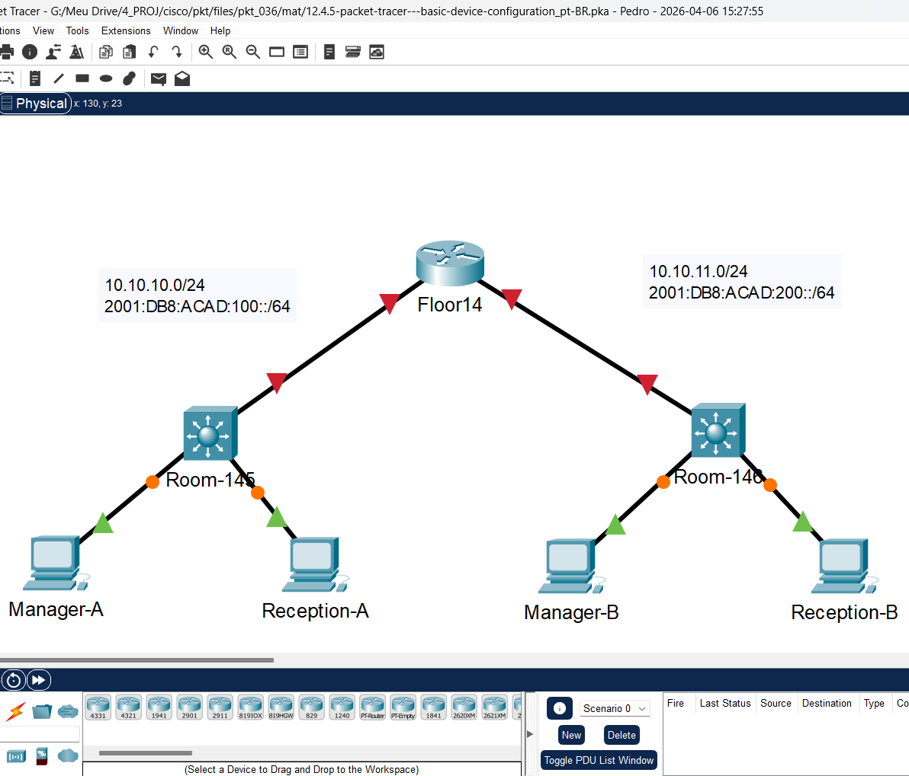
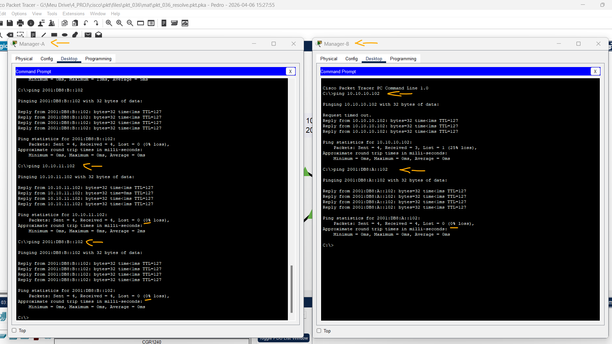

# Packet Tracer - Configuração Básica do Dispositivo   

### Cisco: <a href="../../../">cisco   </a>
### Cisco Networking Academy: cna   </a>
### Training Category: <a href="../../../pkt/">pkt</a>
### Software/Subject: network   </a>
### Course: <a href="./">pkt_036 (Packet Tracer - Configuração Básica do Dispositivo)   </a>

---

### Theme:
- Network

### Used Tools:
- Operating System (OS): 
  - Cisco Internetwork Operating System (Cisco IOS)   
  - Windows 11 
- Cloud Services:
  - Google Drive 
- Language:
  - HTML   
  - Markdown   
- Integrated Development Environment (IDE) and Text Editor:
  - Visual Studio Code (VS Code)   
- Versioning: 
  - Git   
- Repository:
  - GitHub   
- Network:
  - Cisco Packet Tracer 
  - ping   

---

<h3><a name="item00">Course Strcuture:</a></h3>

1. <a href="#item01">Packet Tracer - Projete e implemente um esquema de endereçamento VLSM</a> 
  1.1 <a href="#item01.01">Tabela de Endereçamento</a> 
  1.2 <a href="#item01.02">Requisitos</a> 
  1.3 <a href="#item01.03">Requisitos de Configuração</a> 
  1.4 <a href="#item01.04">Configuração</a> 

---

### Objective:
O objetivo desta atividade foi realizar o endereçamento dual-stack (IPv4 e IPv6) em hosts e roteadores, aplicar configurações de gerenciamento básico em dispositivos intermediários e validar a comunicação fim-a-fim através de testes de conectividade.

### Folder Structure:
- [README.md](./README.md): Este documento de README, escrito em **Markdown**, com o conteúdo do laboratório.
- [0-aux](./0-aux/): Pasta auxiliar com imagens utilizadas na construção dos arquivos de README desse curso.

### Development:

<a name="item01"><h4>1. Packet Tracer - Projete e implemente um esquema de endereçamento VLSM</h4></a>[Back to summary](#item00)

A imagem 01 mostra a topologia inicial.

<figure>
     
    <figcaption>Imagem 01.</figcaption>
</figure>
 

<a name="item01.01"><h4>1.1 Requisitos</h4></a>[Back to summary](#item00)

| Dispositivo | Interface | Tipo IP | Endereço IP | Prefixo | Gateway padrão |
|:---:|:---:|:---:|:---:|:---:|:---:|
| R1 (Floor14) | G0/0 | IPv4 | 10.10.10.1 | /24 | N/A |
| R1 (Floor14) | G0/0 | IPv6 | 2001:DB8:ACAD:100::1 (2001:DB8:A::1) | /64 | N/A |
| R1 (Floor14) | G0/0 | IPv6 (Link Local) | FE80::1 | - | N/A |
| R1 (Floor14) | G0/1 | IPv4 | 10.10.11.1 | /24 | N/A |
| R1 (Floor14) | G0/1 | IPv6 | 2001:DB8:ACAD:200::1 (2001:DB8:B::1) | /64 | N/A |
| R1 (Floor14) | G0/1 | IPv6 (Link Local) | FE80::1 | - | N/A |
| S1 (Room-145) | VLAN 1 | IPv4 | 10.10.10.2 | /24 | 10.10.10.1 |
| S1 (Room-145) | VLAN 1 | IPv6 | 2001:DB8:A::2 | /64 | 2001:DB8:A::1 |
| S2 (Room-146) | VLAN 1 | IPv4 | 10.10.11.2 | /24 | 10.10.11.1 |
| S2 (Room-146) | VLAN 1 | IPv6 | 2001:DB8:B::2 | /64 | 2001:DB8:B::1 |
| PC1 (Manager-A) | NIC | IPv4 | 10.10.10.101 | /24 | 10.10.10.1 |
| PC1 (Manager-A) | NIC | IPv6 | 2001:DB8:A::101 | /64 | 2001:DB8:A::1 |
| PC2 (Reception-A) | NIC | IPv4 | 10.10.10.102 | /24 | 10.10.10.1 |
| PC2 (Reception-A) | NIC | IPv6 | 2001:DB8:A::102 | /64 | 2001:DB8:A::1 |
| PC3 (Manager-B) | NIC | IPv4 | 10.10.11.101 | /24 | 10.10.11.1 |
| PC3 (Manager-B) | NIC | IPv6 | 2001:DB8:B::101 | /64 | 2001:DB8:B::1 |
| PC4 (Reception-B) | NIC | IPv4 | 10.10.11.102 | /24 | 10.10.11.1 |
| PC4 (Reception-B) | NIC | IPv6 | 2001:DB8:B::102 | /64 | 2001:DB8:B::1 |

<a name="item01.02"><h4>1.2 Requisitos</h4></a>[Back to summary](#item00)

- Forneça as informações que estão faltando na Tabela de Endereçamento. 
- Nomeie o roteador Floor14 e o segundo switch Room-146. Você não poderá acessar o switch Room-145. 
  - Floor14: `enable` -> `configure terminal` -> `hostname Floor14`.
  - Room-146: `enable` -> `configure terminal` -> `hostname Room-146`.
- Use cisco como a senha de EXEC usuário para todas as linhas.  
  - `line console 0` -> `password cisco` -> `login` -> `exit`.
  - `line vty 0 4` -> `password cisco` -> `login` -> `exit`.
- Use class como a senha EXEC privilegiada criptografada. 
  - `enable secret class`.
- Criptografe todas as senhas em texto simples. 
  - `service password-encryption`.
- Configure um banner apropriado. 
  - `banner motd #Unauthorized access is prohibited.#`.
- Configure o endereçamento IPv4 e IPv6 para o roteador Floor14 de acordo com a Tabela de Endereços. 
  - `enable` -> `configure terminal` -> `interface g0/0` -> `ip address 10.10.10.1 255.255.255.0` -> `ipv6 address 2001:DB8:A::1/64` -> `ipv6 address FE80::1 link-local` -> `no shutdown` -> `exit`.
  - `enable` -> `configure terminal` -> `interface g0/1` -> `ip address 10.10.11.1 255.255.255.0` -> `ipv6 address 2001:DB8:B::1/64` -> `ipv6 address FE80::1 link-local` -> `no shutdown` -> `exit`.
  - `ipv6 unicast-routing`.
- Configure o endereçamento IPv4 e IPv6 para o switch Room-146 de acordo com a Tabela de Endereços. 
  - `enable` -> `configure terminal` -> `interface vlan1` -> `ip address 10.10.11.2 255.255.255.0` -> `ipv6 address 2001:DB8:B::2/64` -> `no shutdown` -> `exit`.
  - `ip default-gateway 10.10.11.1`.
- Os hosts estão parcialmente configurados. Conclua o endereçamento IPv4 e configure completamente os endereços IPv6 de acordo com a Tabela de Endereços. 
  - Manager-A: `10.10.10.101` -> `10.10.10.1` -> `2001:DB8:A::101/64` -> `2001:DB8:A::1`.
  - Reception-A: `10.10.10.102` -> `10.10.10.1` -> `2001:DB8:A::102/64` -> `2001:DB8:A::1`.
  - Manager-B: `10.10.11.101` -> `10.10.11.1` -> `2001:DB8:B::101/64` -> `2001:DB8:B::1`.
  - Reception-B: `10.10.11.102` -> `10.10.11.1` -> `2001:DB8:B::102/64` -> `2001:DB8:B::1`.
- Documente as interfaces com descrições, inclusive a interface VLAN 1 de Room-146. 
  - Floor14: `enable` -> `configure terminal` -> `interface g0/0` -> `description Link to Room-145 LAN` -> `exit`.
  - Floor14: `enable` -> `configure terminal` -> `interface g0/1` -> `description Link to Room-146 LAN` -> `exit`.
  - Room-146: `enable` -> `configure terminal` -> `interface vlan1` -> `description anagement VLAN Room-146` -> `exit`.
- Salve as configurações. 
  - `copy running-config startup-config`.
- Verifique a conectividade entre todos os dispositivos. Todos os dispositivos devem poder executar ping em todos os outros dispositivos com IPv4 e IPv6.
  - Manager-A para Reception-B: `ping 10.10.11.102` e `ping 2001:DB8:B::102`.
  - Manager-B para Reception-A: `ping 10.10.10.102` e `ping 2001:DB8:A::102`.
- Identifique e documente possíveis problemas. 
- Implante as soluções necessárias para ativar e verificar a conectividade de ponta a ponta. 

Observação: clique no botão Check Results (Verificar Resultados) para ver seu progresso. Clique no botão Reset Activity (Reiniciar Atividade) para gerar um novo conjunto de requisitos.

A imagem 02 comprova a comunicação dois PCs tanto por IPv4 como por IPv6.

<figure>
     
    <figcaption>Imagem 02.</figcaption>
</figure>
 