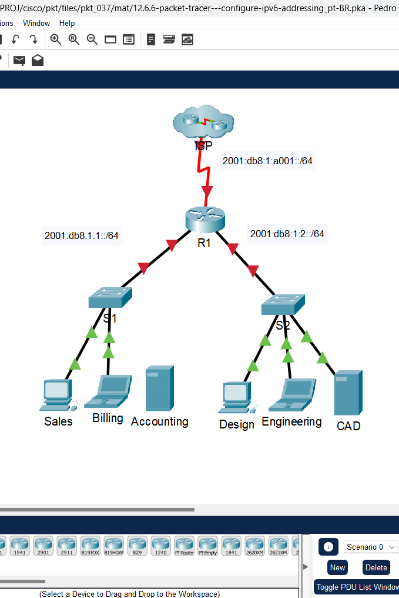
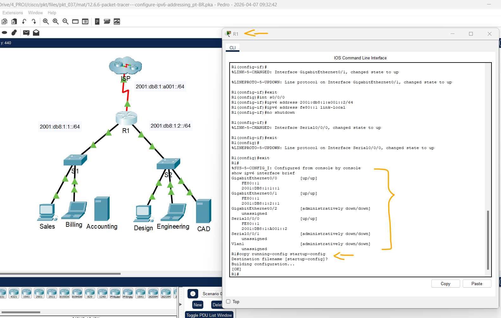
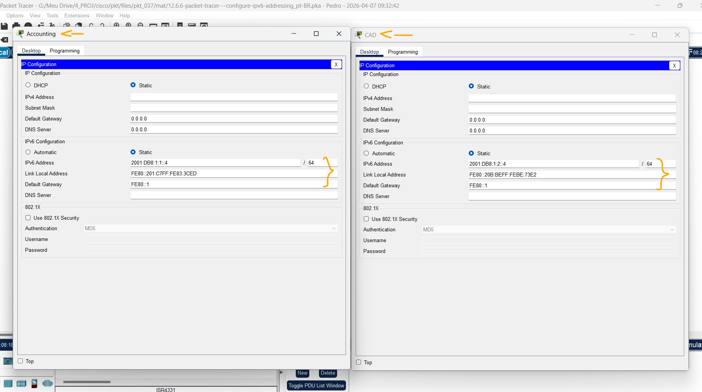
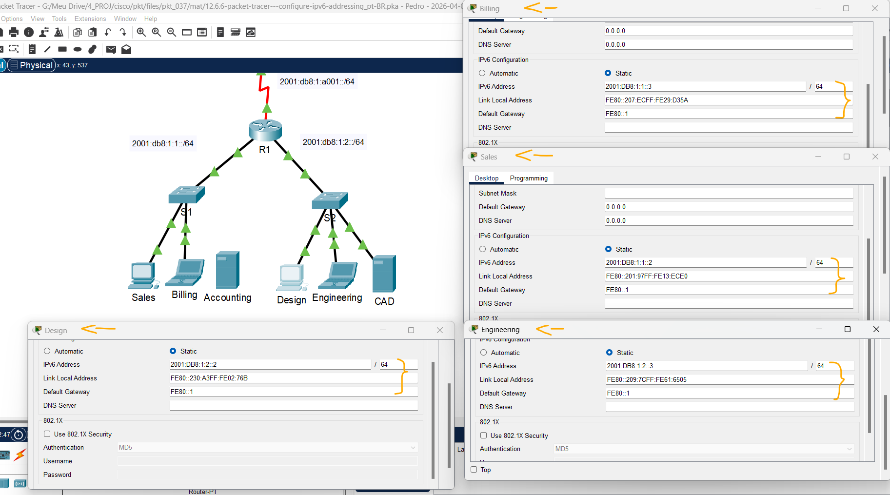
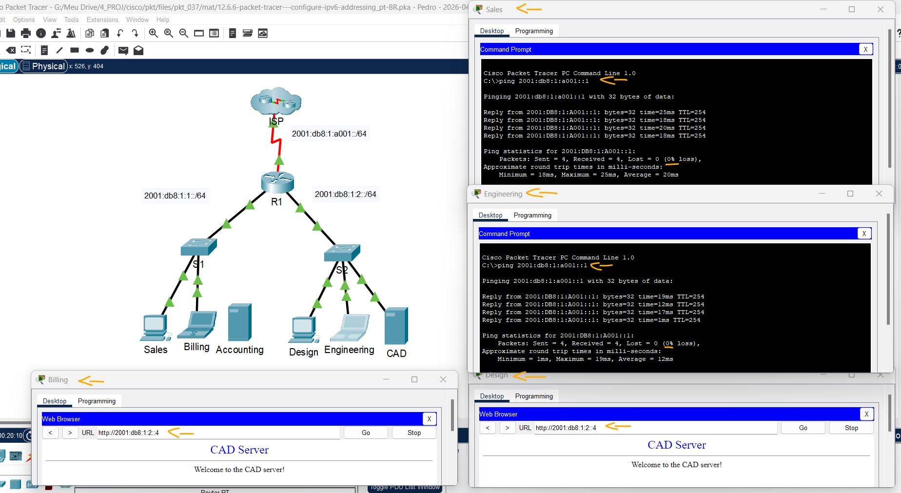

# Packet Tracer – Configurando Endereçamento IPv6   

### Cisco: <a href="../../../">cisco   </a>
### Cisco Networking Academy: cna   </a>
### Training Category: <a href="../../../pkt/">pkt</a>
### Software/Subject: network   </a>
### Course: <a href="./">pkt_037 (Packet Tracer – Configurando Endereçamento IPv6)   </a>

---

### Theme:
- Network

### Used Tools:
- Operating System (OS): 
  - Cisco Internetwork Operating System (Cisco IOS)   
  - Windows 11 
- Cloud Services:
  - Google Drive 
- Language:
  - HTML   
  - Markdown   
- Integrated Development Environment (IDE) and Text Editor:
  - Visual Studio Code (VS Code)   
- Versioning: 
  - Git   
- Repository:
  - GitHub   
- Network:
  - Cisco Packet Tracer   
  - ping   

---

<h3><a name="item00">Course Strcuture:</a></h3>

1. <a href="#item01">Parte 1: Configurar o Endereçamento IPv6 no Roteador</a> 
  1.1 <a href="#item01.01">Etapa 1: Habilite o roteador para encaminhar pacotes IPv6.</a> 
  1.2 <a href="#item01.02">Etapa 2: Configure o endereçamento IPv6 em GigabitEthernet0/0.</a> 
  1.3 <a href="#item01.03">Etapa 3: Configure o endereçamento IPv6 em GigabitEthernet0/1.</a> 
  1.4 <a href="#item01.04">Etapa 4: Configure o endereçamento IPv6 em Serial0/0/0.</a> 
  1.5 <a href="#item01.05">Etapa 5: Verifique o endereçamento IPv6 em R1.</a> 
2. <a href="#item02">Parte 2: Configurar o Endereçamento IPv6 em Servidores</a> 
  2.1 <a href="#item02.01">Etapa 1: Configure o endereçamento IPv6 no servidor Accounting (Contabilidade).</a> 
  2.2 <a href="#item02.02">Etapa 2: Configure o endereçamento IPv6 no servidor CAD.</a> 
3. <a href="#item03">Parte 3: Configurar o Endereçamento IPv6 em Clientes</a> 
  3.1 <a href="#item03.01">Etapa 1: Configure o endereçamento IPv6 nos clientes Sales (Vendas) e Billing (Cobrança).</a> 
  3.2 <a href="#item03.02">Etapa 2: Configure o endereçamento IPv6 nos clientes Design (Projeto) e Engenharia (Engenharia).</a> 
4. <a href="#item04">Parte 4: Testar e Verificar a Conectividade da Rede</a> 
  4.1 <a href="#item04.01">Etapa 1: Abra as páginas Web do servidor nos clientes.</a> 
  4.2 <a href="#item04.02">Etapa 2: Faça ping no ISP.</a> 

---

### Objective:
Esta atividade visou a configuração de endereçamento IPv6 em dispositivos finais e intermediários, seguida da verificação de conectividade fim-a-fim para garantir o pleno funcionamento da rede.

### Folder Structure:
- [README.md](./README.md): Este documento de README, escrito em **Markdown**, com o conteúdo do laboratório.
- [0-aux](./0-aux/): Pasta auxiliar com imagens utilizadas na construção dos arquivos de README desse curso.

### Development:

<a name="item01"><h4>1. Parte 1: Configurar o Endereçamento IPv6 no Roteador</h4></a>[Back to summary](#item00)

A imagem 01 mostra a topologia inicial.

<figure>
     
    <figcaption>Imagem 01.</figcaption>
</figure>
 

<a name="item01.01"><h4>1.1 Etapa 1: Habilite o roteador para encaminhar pacotes IPv6.</h4></a>[Back to summary](#item00)

- a. Clique em R1 e depois na guia CLI. Pressione Enter.
- b. Entre no modo EXEC privilegiado.
  - `enable`.
- c. Insira o comando de configuração global ipv6 unicast-routing. Este comando deve ser digitado para permitir que o roteador encaminhe pacotes IPv6.
  - `configure terminal` -> `ipv6 unicast-routing`.

<a name="item01.02"><h4>1.2 Etapa 2: Configure o endereçamento IPv6 em GigabitEthernet0/0.</h4></a>[Back to summary](#item00)

- a. Digite os comandos necessários para mover para o modo de configuração da interface para GigabiteTherNet0/0.
  - `configure terminal` -> `interface g0/0`.
- b. Configure o endereço IPv6 com o seguinte comando.
  - `ipv6 address 2001:db8:1:1::1/64`.
- c. Configure o endereço IPv6 de link local com o seguinte comando.
  - `ipv6 address fe80::1 link-local`.
- d. Ative a interface.
  - `no shutdown` -> `exit`.

<a name="item01.03"><h4>1.3 Etapa 3: Configure o endereçamento IPv6 em GigabitEthernet0/1.</h4></a>[Back to summary](#item00)

- a. Digite os comandos necessários para mover para o modo de configuração da interface para GigabitEthernet0/1.
  - `enable` -> `configure terminal` -> `interface g0/1`.
- b. Consulte o endereço IPv6 na Tabela de Endereçamento.
- c. Configure o endereço IPv6 e o endereço de link local e ative a interface.
  - `ipv6 address 2001:db8:1:2::1/64` -> `ipv6 address fe80::1 link-local` -> `no shutdown` -> `exit`.

<a name="item01.04"><h4>1.4 Etapa 4: Configure o endereçamento IPv6 em Serial0/0/0.</h4></a>[Back to summary](#item00)

- a. Digite os comandos necessários para passar para o modo de configuração de interface para Serial 0/0/0.
  - `enable` -> `configure terminal` -> `interface s0/0/0`.
- b. Consulte o endereço IPv6 na Tabela de Endereçamento.
- c. Configure o endereço IPv6 e o endereço de link local e ative a interface.
  - `ipv6 address 2001:db8:1:a001::2/64` -> `ipv6 address fe80::1 link-local` -> `no shutdown` -> `exit`.

<a name="item01.05"><h4>1.5 Etapa 5: Verifique o endereçamento IPv6 em R1.</h4></a>[Back to summary](#item00)

É uma boa prática verificar o endereçamento quando estiver concluído, comparando valores configurados com os valores na tabela de endereçamento.

- a. Sair do modo de configuração em R1.
  - `exit`.
- b. Verifique o endereçamento configurado emitindo o seguinte comando.
  - `show ipv6 interface brief`.
- c. Se algum endereço estiver incorreto, repita as etapas acima conforme necessário para fazer qualquer correção. Observação: Para fazer uma alteração no endereçamento com IPv6, você deve remover o endereço incorreto ou então o endereço correto e o endereço incorreto permanecerão configurados na interface. Exemplo: `no ipv6 address 2001:db8:1:5::1/64`.
- d. Salve a configuração do roteador na NVRAM.
  - `copy running-config startup-config`.

A imagem 02 mostra o roteador com suas interfaces devidamente configuradas, além da confirmação de que a configuração foi salva na memória NVRAM.

<figure>
     
    <figcaption>Imagem 02.</figcaption>
</figure>
 

<a name="item02"><h4>2. Parte 2: Configurar o Endereçamento IPv6 em Servidores</h4></a>[Back to summary](#item00)

<a name="item02.01"><h4>2.1 Etapa 1: Configure o endereçamento IPv6 no servidor Accounting (Contabilidade).</h4></a>[Back to summary](#item00)

- a. Clique em Accounting e clique na guia Desktop > IP Configuration.
- b. Defina o Endereço IPv6 como 2001:db8:1:1::4 com o prefixo /64.
  - `2001:db8:1:1::4` -> `/64`.
- c. Defina o Gateway IPv6 como o endereço de link local, fe80::1.
  - `fe80::1`.

<a name="item02.02"><h4>2.2 Etapa 2: Configure o endereçamento IPv6 no servidor CAD.</h4></a>[Back to summary](#item00)

- a. Configure o servidor CAD com endereços como foi feito na Etapa 1. Consulte o endereço IPv6 na Tabela de Endereçamento.
  - `2001:db8:1:2::4` -> `/64` -> `fe80::1`.

A imagem 03 comprova que os endereçamentos IPv6 foram devidamente configurados nos servidores.

<figure>
     
    <figcaption>Imagem 03.</figcaption>
</figure>
 

<a name="item03"><h4>3. Parte 3: Configurar o Endereçamento IPv6 em Clientes</h4></a>[Back to summary](#item00)

<a name="item03.01"><h4>3.1 Etapa 1: Configure o endereçamento IPv6 nos clientes Sales (Vendas) e Billing (Cobrança).</h4></a>[Back to summary](#item00)

- a. Clique em Cobrança e selecione a guia Desktop seguida de Configuração de IP.
- b. Defina o Endereço IPv6 como 2001:db8:1:1::3 com o prefixo /64.
  - `2001:db8:1:1::3` -> `/64`.
- c. Defina o Gateway IPv6 como o endereço de link local, fe80::1.
  - `fe80::1`.
- d. Repita as etapas 1a a 1c para Vendas. Consulte o endereço IPv6 na Tabela de Endereçamento.
  - `2001:db8:1:1::2` -> `/64` -> `fe80::1`.

<a name="item03.02"><h4>3.2 Etapa 2: Configure o endereçamento IPv6 nos clientes Design (Projeto) e Engenharia (Engenharia).</h4></a>[Back to summary](#item00)

- a. Clique em Engineering e selecione a guia Desktop seguida de IP Configuration.
- b. Defina IPv6 Address (Endereço IPv6) como 2001:db8:1:2::3 com o prefixo /64.
  - `2001:db8:1:2::3` -> `/64`.
- c. Defina o Gateway IPv6 como o endereço de link local, fe80::1.
  - `fe80::1`.
- d. Repita as etapas 2a a 2c para Design. Consulte o endereço IPv6 na Tabela de Endereçamento.
  - `2001:db8:1:2::2` -> `/64` -> `fe80::1`.

A imagem 04 exibe os dispositivos clientes com endereçamento IPv6 configurados conforme solicitado.

<figure>
     
    <figcaption>Imagem 04.</figcaption>
</figure>
 

<a name="item04"><h4>4. Parte 4: Testar e Verificar a Conectividade da Rede</h4></a>[Back to summary](#item00)

<a name="item04.01"><h4>4.1 Etapa 1: Abra as páginas Web do servidor nos clientes.</h4></a>[Back to summary](#item00)

- a. Clique em Sales e na guia Desktop. Feche a janela IP Configuration (Configuração de IP), se necessário. 
- b. Clique em Web Browser. Digite 2001:db8:1:1::4 na caixa URL e clique em Go. O site Accounting (Contabilidade) será exibido. Observação: Este não funcionou, pois na estrutura inicial da atividade não foi realizada a conexão de Accounting (Contabilidade) com o switch S1 e também não era permitido fazer conexões.
  - `2001:db8:1:1::4`.
- c. Digite 2001:db8:1:2::4 na caixa URL e clique em Go. O site CAD será exibido.
  - `2001:db8:1:2::4`.
- d. Repita as etapas 1a a 1d para o restante dos clientes.

<a name="item04.02"><h4>4.2 Etapa 2: Faça ping no ISP.</h4></a>[Back to summary](#item00)

- a. Clique em qualquer cliente. 
- b. Clique na guia Desktop > Command Prompt (Prompt de comando).
- c. Teste a conectividade com o ISP inserindo o seguinte comando: 
  - `ping 2001:db8:1:a001::1`.
- d. Repita o comando ping com outros clientes até que toda conectividade seja verificada.
  - `ping 2001:db8:1:a001::1`.

A imagem 05 mostra o acesso as páginas do servidor pelos clientes e também a conexão bem sucedida com o ISP.

<figure>
     
    <figcaption>Imagem 05.</figcaption>
</figure>
 