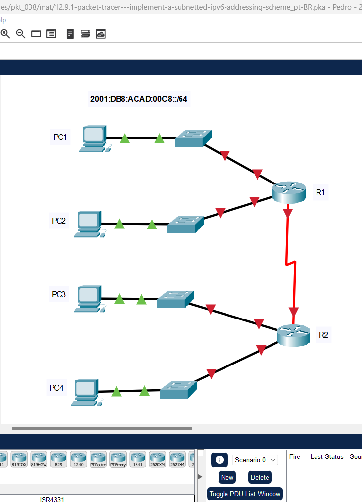
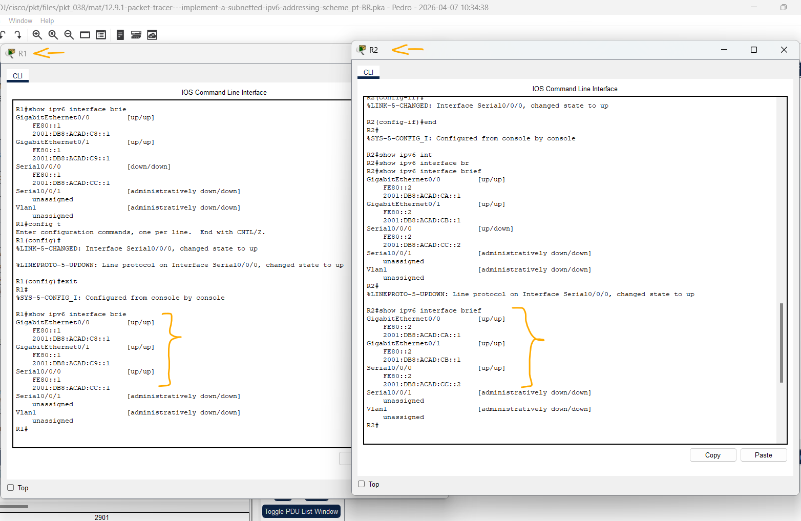
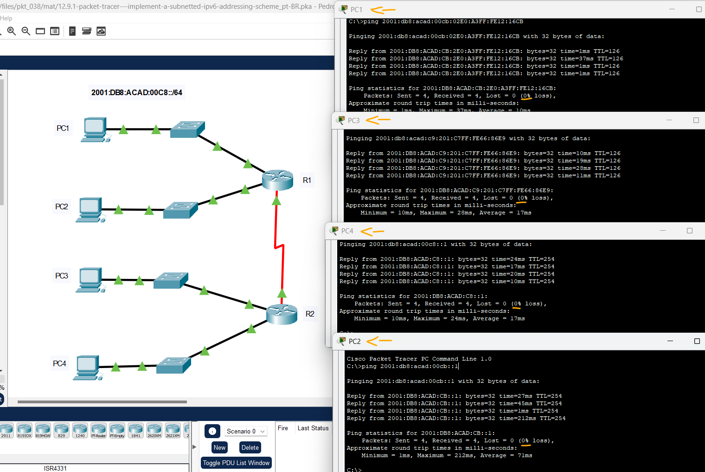

# Packet Tracer – Implementando um Esquema de Endereçamento IPv6 com Sub-Redes   

### Cisco: <a href="../../../">cisco   </a>
### Cisco Networking Academy: cna   </a>
### Training Category: <a href="../../../pkt/">pkt</a>
### Software/Subject: network   </a>
### Course: <a href="./">pkt_038 (Packet Tracer – Implementando um Esquema de Endereçamento IPv6 com Sub-Redes)   </a>

---

### Theme:
- Network

### Used Tools:
- Operating System (OS): 
  - Cisco Internetwork Operating System (Cisco IOS)   
  - Windows 11 
- Cloud Services:
  - Google Drive 
- Language:
  - HTML   
  - Markdown   
- Integrated Development Environment (IDE) and Text Editor:
  - Visual Studio Code (VS Code)   
- Versioning: 
  - Git   
- Repository:
  - GitHub   
- Network:
  - Cisco Packet Tracer 
  - ping   

---

<h3><a name="item00">Course Strcuture:</a></h3>

1. <a href="#item01">Packet Tracer – Implementando um Esquema de Endereçamento IPv6 com Sub-Redes</a> 
  1.1 <a href="#item01.01">Etapa 1: Determinar as Sub-Redes IPv6 e o Esquema de Endereçamento</a> 
  1.2 <a href="#item01.02">Etapa 2: Configurar o endereçamento IPv6 em roteadores e PCs.</a> 
  1.3 <a href="#item01.03">Etapa 3: Verificar a conectividade IPv6.</a> 

---

### Objective:
O objetivo desta atividade consistiu no planejamento e implementação de um esquema de endereçamento IPv6 a partir de um prefixo determinado, visando a segmentação eficiente e a plena conectividade da infraestrutura de rede.

### Folder Structure:
- [README.md](./README.md): Este documento de README, escrito em **Markdown**, com o conteúdo do laboratório.
- [0-aux](./0-aux/): Pasta auxiliar com imagens utilizadas na construção dos arquivos de README desse curso.

### Development:

<a name="item01"><h4>1. Packet Tracer – Implementando um Esquema de Endereçamento IPv6 com Sub-Redes</h4></a>[Back to summary](#item00)

A imagem 01 mostra a topologia inicial.

<figure>
     
    <figcaption>Imagem 01.</figcaption>
</figure>
 

<a name="item01.01"><h4>1.1 Etapa 1: Determinar as Sub-Redes IPv6 e o Esquema de Endereçamento</h4></a>[Back to summary](#item00)

Você recebeu a sub-rede IPv6 2001:db8:acad:00c8::/64 como sub-rede inicial. Você precisará de mais quatro sub-redes para cada rede necessária. Incrementar os endereços de sub-rede consecutivamente por um para chegar às quatro sub-redes necessárias. Preencha a tabela abaixo.

#### Tabela 1 — Planejamento das Sub-redes IPv6

| Nº Sub-rede | Nome da Sub-Rede | Endereço da Sub-Rede | Prefixo |
|:---:|:---:|:---:|:---:|
| 1 | R1 G0/0/ LAN | 2001:db8:acad:00c8:: | /64 |
| 2 | R1 G0/1 LAN | 2001:db8:acad:00c9:: | /64 |
| 3 | R2 G0/0 LAN | 2001:db8:acad:00ca:: | /64 |
| 4 | R2 G0/1 LAN | 2001:db8:acad:00cb:: | /64 |
| 5 | Link R1-R2 LAN | 2001:db8:acad:00cc:: | /64 |

<a name="item01.02"><h4>1.2 Etapa 2: Configure o endereçamento IPv6 em roteadores e PCs.</h4></a>[Back to summary](#item00)

Preencha a tabela de endereçamento acima para usar como guia para configurar os dispositivos.

- a. Atribua o primeiro endereço IP na sub-rede às interfaces LAN do roteador.
- b. Atribua os endereços de link local conforme designado na tabela de endereçamento.
- c. Para a conexão entre os roteadores, atribua o primeiro endereço na sub-rede a R1.
- d. Para a conexão entre os roteadores, atribua o segundo endereço na sub-rede ao R2.
- e. Defina todos os quatro hosts para configurar automaticamente com endereços IPv6.

#### Tabela 2 — Planejamento de Endereçamento IPv6

| Dispositivo | Interface | Endereço IP | Endereço Link-Local |
|:---:|:---:|:---:|:---:|
| R1 | G0/0 | 2001:db8:acad:00c8::1/64 | FE80::1 |
| R1 | G0/1 | 2001:db8:acad:00c9::1/64 | FE80::1 |
| R1 | S0/0/0 | 2001:db8:acad:00cc::1/64 | FE80::1 |
| R2 | G0/0 | 2001:db8:acad:00ca::1/64 | FE80::2 |
| R2 | G0/1 | 2001:db8:acad:00cb::1/64 | FE80::2 |
| R2 | S0/0/0 | 2001:db8:acad:00cc::2/64 | FE80::2 |
| S1 | VLAN 1 | 2001:db8:acad:00c8::2/64 | FE80::1 |
| S2 | VLAN 1 | 2001:db8:acad:00c9::2/64 | FE80::1 |
| S3 | VLAN 1 | 2001:db8:acad:00ca::2/64 | FE80::2 |
| S4 | VLAN 1 | 2001:db8:acad:00cb::2/64 | FE80::2 |
| PC1 | NIC | Configuração Automática | FE80::1 |
| PC2 | NIC | Configuração Automática | FE80::1 |
| PC3 | NIC | Configuração Automática | FE80::2 |
| PC4 | NIC | Configuração Automática | FE80::2 |

- R1-G0/0: `enable` -> `configure terminal` -> `ipv6 unicast-routing` -> `interface g0/0` -> `ipv6 address 2001:db8:acad:00c8::1/64` -> `ipv6 address FE80::1 link-local` -> `no shutdown` -> `exit`.
- R1-G0/1: `interface g0/1` -> `ipv6 address 2001:db8:acad:00c9::1/64` -> `ipv6 address FE80::1 link-local` -> `no shutdown` -> `exit`.
- R1-S0/0/0: `interface s0/0/0` -> `ipv6 address 2001:db8:acad:00cc::1/64` -> `ipv6 address FE80::1 link-local` -> `no shutdown` -> `exit`.
- R2-G0/0: `enable` -> `configure terminal` -> `ipv6 unicast-routing` -> `interface g0/0` -> `ipv6 address 2001:db8:acad:00ca::1/64` -> `ipv6 address FE80::2 link-local` -> `no shutdown` -> `exit`.
- R2-G0/1: `interface g0/1` -> `ipv6 address 2001:db8:acad:00cb::1/64` -> `ipv6 address FE80::2 link-local` -> `no shutdown` -> `exit`.
- R2-S0/0/0: `interface s0/0/0` -> `ipv6 address 2001:db8:acad:00cc::2/64` -> `ipv6 address FE80::2 link-local` -> `no shutdown` -> `exit`.

A imagem 02 exibe as interfaces dos roteadores devidamente configuradas.

<figure>
     
    <figcaption>Imagem 02.</figcaption>
</figure>
 

<a name="item01.03"><h4>1.3 Etapa 3: Verificar a conectividade IPv6.</h4></a>[Back to summary](#item00)

Os PCs devem ser capazes de efetuar ping uns aos outros se o endereçamento tiver sido configurado corretamente.

- PC1-PC4: `ping 2001:db8:acad:00cb:02E0:A3FF:FE12:16CB`.
- PC3-PC2: `ping 2001:db8:acad:c9:201:C7FF:FE66:86E9`.
- PC4-R1: `ping 2001:db8:acad:00c8::1`.
- PC2-R2: `ping 2001:db8:acad:00cb::1`.

A imagem 03 evidencia a comunicação entre os dispositivos configurados.

<figure>
     
    <figcaption>Imagem 03.</figcaption>
</figure>
 