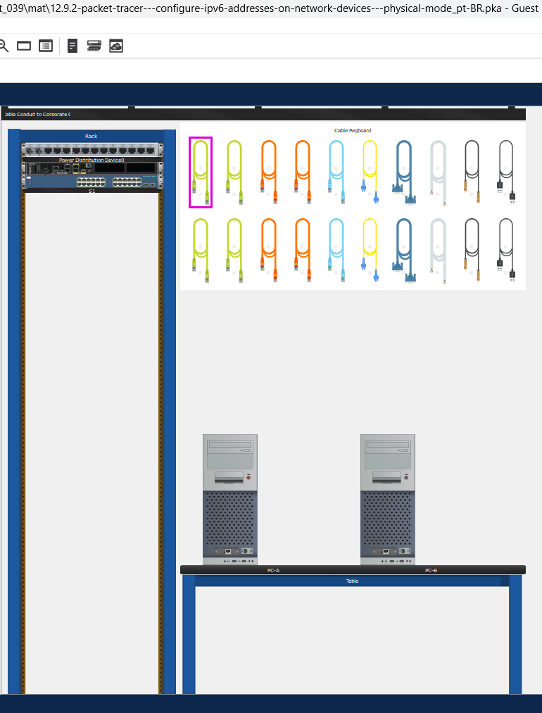
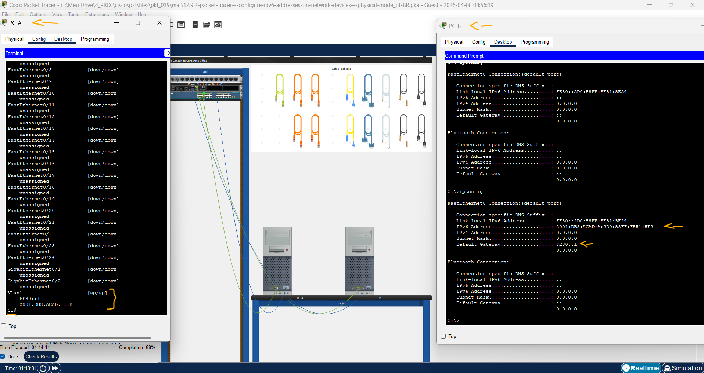
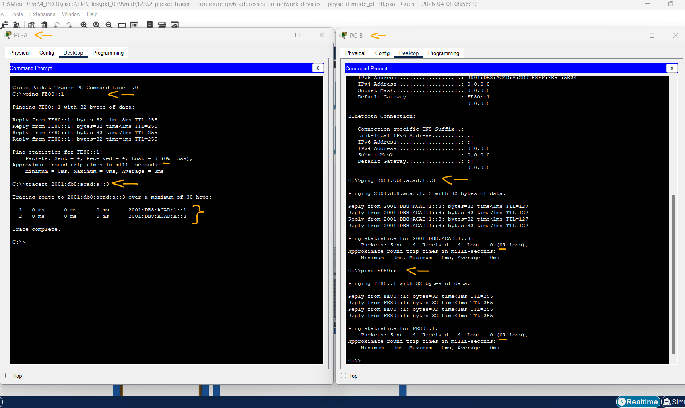

# Packet Tracer - Configurar Endereços IPv6 em Dispositivos de Rede - Modo Físico   

### Cisco: <a href="../../../">cisco   </a>
### Cisco Networking Academy: cna   </a>
### Training Category: <a href="../../../pkt/">pkt</a>
### Software/Subject: network   </a>
### Course: <a href="./">pkt_039 (Packet Tracer - Configurar Endereços IPv6 em Dispositivos de Rede - Modo Físico)   </a>

---

### Theme:
- Network

### Used Tools:
- Operating System (OS): 
  - Cisco Internetwork Operating System (Cisco IOS)   
  - Windows 11 
- Cloud Services:
  - Google Drive 
- Language:
  - HTML   
  - Markdown   
- Integrated Development Environment (IDE) and Text Editor:
  - Visual Studio Code (VS Code)   
- Versioning: 
  - Git   
- Repository:
  - GitHub   
- Network:
  - Cisco Packet Tracer 
  - ipconfig   
  - ping   
  - Trace Route (tracert)   

---

<h3><a name="item00">Course Strcuture:</a></h3>

1. <a href="#item01">Parte 1: Configurar a Topologia e Definir as Configurações Básicas de Roteadores e Switches</a> 
  1.1 <a href="#item01.01">Etapa 1: Ligue a rede e ligue os dispositivos.</a> 
  1.2 <a href="#item01.02">Etapa 2: Configurar o roteador.</a> 
  1.3 <a href="#item01.03">Etapa 3: Configure o switch.</a> 
2. <a href="#item02">Parte 2: Configurar Endereços IPv6 Manualmente</a> 
  2.1 <a href="#item02.01">Etapa 1: Atribua endereços IPv6 às interfaces Ethernet do R1.</a> 
  2.2 <a href="#item02.02">Etapa 2: Ative o roteamento IPv6 em R1.</a> 
  2.3 <a href="#item02.03">Etapa 3: Atribua endereços IPv6 à interface de gerenciamento (SVI) em S1.</a> 
  2.4 <a href="#item02.04">Etapa 4: Atribua endereços IPv6 estáticos aos computadores.</a> 
3. <a href="#item03">Parte 3: Verificar a Conectividade de Ponta a Ponta</a> 
4. <a href="#item04">Perguntas para reflexão</a> 

---

### Objective:
O objetivo desta atividade do modo físico ffoi configurar o endereçamento IPv6 nos dispositivos, realizando o cabeamento, a configuração básica nos ativos de rede e os testes de conectividade, a fim de garantir a plena operacionalidade da infraestrutura.

### Folder Structure:
- [README.md](./README.md): Este documento de README, escrito em **Markdown**, com o conteúdo do laboratório.
- [0-aux](./0-aux/): Pasta auxiliar com imagens utilizadas na construção dos arquivos de README desse curso.

### Development:

<a name="item01"><h4>1. Parte 1: Configurar a Topologia e Definir as Configurações Básicas de Roteadores e Switches</h4></a>[Back to summary](#item00)

Nesta parte, você conectará a rede, alimentará os dispositivos e, em seguida, configurará o roteador e alternará com as configurações básicas do dispositivo.

A imagem 01 mostra a topologia inicial.

<figure>
     
    <figcaption>Imagem 01.</figcaption>
</figure>
 

<a name="item01.01"><h4>1.1 Etapa 1: Ligue a rede e ligue os dispositivos.</h4></a>[Back to summary](#item00)

- a. Instalar os cabos da rede de acordo com a topologia. Ligue os dispositivos conforme necessário.

<a name="item01.02"><h4>1.2 Etapa 2: Configurar o roteador.</h4></a>[Back to summary](#item00)

- a. Atribua o nome do host e configure as configurações básicas do dispositivo.
  - `enable` -> `configure terminal` -> `hostname R1` -> `enable secret class`.
  - `line console 0` -> `password cisco` -> `login` -> `exit`.
  - `line vty 0 4` -> `password cisco` -> `login` -> `exit`.
  - `service password-encryption`.
  - `banner motd # Unauthorized access is prohibited. #`

<a name="item01.03"><h4>1.3 Etapa 3: Configure o switch.</h4></a>[Back to summary](#item00)

- a. Atribua o nome do host e configure as configurações básicas do dispositivo.
  - `enable` -> `configure terminal` -> `hostname S1` -> `enable secret class`.
  - `line console 0` -> `password cisco` -> `login` -> `exit`.
  - `line vty 0 4` -> `password cisco` -> `login` -> `exit`.
  - `service password-encryption`.
  - `banner motd # Unauthorized access is prohibited. #`

<a name="item02"><h4>2. Parte 2: Configurar Endereços IPv6 Manualmente</h4></a>[Back to summary](#item00)

Nesta parte, você configurará manualmente o endereçamento IPv6 em todos os dispositivos na rede.

<a name="item02.01"><h4>2.1 Etapa 1: Atribua endereços IPv6 às interfaces Ethernet do R1.</h4></a>[Back to summary](#item00)

- a. Atribua os endereços IPv6 unicast globais, listados na Tabela de Endereçamento, às duas interfaces Ethernet do R1.
  - G0/0/0: `enable` -> `configure terminal` -> `interface g0/0/0` -> `ipv6 address 2001:db8:acad:a::1/64` -> `no shutdown` -> `exit`.
  - G0/0/1: `enable` -> `configure terminal` -> `interface g0/0/1` -> `ipv6 address 2001:db8:acad:1::1/64` -> `no shutdown` -> `exit`.
- b. Verifique se o endereço unicast IPv6 correto está atribuído a cada interface. Nota: O endereço local do link (fe80::) exibido é baseado no endereçamento EUI-64, que usa 
automaticamente o endereço MAC (Media Access Control) da interface para criar um endereço local local do link IPv6 de 128 bits.
  - `exit` -> `show ipv6 interface brief`.
- c. Para que o endereço local do link corresponda ao endereço unicast global na interface, insira manualmente os endereços locais do link em cada uma das interfaces Ethernet em R1. Nota: Cada interface do roteador pertence a uma rede separada. Os pacotes com um endereço de link local nunca deixam a rede local; portanto, você pode usar o mesmo endereço de link local nas duas interfaces. 
  - G0/0/0: `enable` -> `configure terminal` -> `interface g0/0/0` -> `ipv6 address FE80::1 link-local` -> `exit`.
  - G0/0/1: `enable` -> `configure terminal` -> `interface g0/0/1` -> `ipv6 address FE80::1 link-local` -> `exit`.
- d. Use um comando de sua escolha para verificar se o endereço de link local foi alterado para fe80::1. Fechar janela de configuração.
  - `exit` -> `show ipv6 interface brief`.
- d. Quais dois grupos multicast foram atribuídos à interface G0/0/0?
  - Utilizando o comando `show ipv6 interface g0/0/0`, foi identificado os grupos FF02::1 (All-Nodes) e FF02::1:FF00:1 (Solicited-Node). Esses endereços são gerados automaticamente para permitir que o roteador se comunique com outros dispositivos no link local. A presença desses grupos confirma que a interface está pronta para realizar a descoberta de vizinhos e o roteamento IPv6.

<a name="item02.02"><h4>2.2 Etapa 2: Ative o roteamento IPv6 em R1.</h4></a>[Back to summary](#item00)

- a. Em um prompt de comando do PC-B, digite o comando ipconfig para examinar as informações de endereço IPv6 atribuídas à interface do PC. Um endereço IPv6 unicast foi atribuído à placa de interface de rede (NIC) do PC-B?
  - Não, a execução do comando ipconfig no PC-B confirma a ausência de um endereço IPv6 unicast global, limitando-se ao endereço Link-Local (fe80::). Essa condição decorre da falta do comando ipv6 unicast-routing no roteador, impedindo o envio de mensagens Router Advertisement (RA). Sem o anúncio do prefixo pela rede, a autoconfiguração via SLAAC permanece inativa no dispositivo final.
- b. Ative o roteamento IPv6 no R1 usando o comando IPv6 unicast-routing.
  - `enable` -> `configure terminal` -> `ipv6 unicast-routing`.
- c. Use um comando para verificar se o novo grupo de multicast está atribuído à interface G0/0/0. Observe que o grupo multicast de todos os roteadores (ff02::2) agora aparece para a interface G0/0/0. Nota: Isso permitirá que os PCs obtenham automaticamente o endereço IP e as informações padrão do gateway usando a Configuração automática de endereços sem estado (SLAAC).
  - `show ipv6 interface g0/0/0`.
- d. Agora que R1 faz parte do grupo de difusão seletiva de todos os roteadores FF02::2, emita novamente o comando ipconfig do PC-B e examine as informações de endereço IPv6. Por que PC-B recebeu o prefixo de roteamento global e a ID de sub-rede que você configurou em R1?
  - Ao ativar o roteamento IPv6, o roteador R1 passou a integrar o grupo multicast FF02::2 e começou a enviar mensagens Router Advertisement (RA) pela interface. O PC-B recebeu essas mensagens e utilizou o prefixo e a ID de sub-rede anunciados para gerar automaticamente seu endereço global via SLAAC. Esse processo de autoconfiguração permite que o host obtenha informações da rede sem a necessidade de um servidor DHCPv6.

<a name="item02.03"><h4>2.3 Etapa 3: Atribua endereços IPv6 à interface de gerenciamento (SVI) em S1.</h4></a>[Back to summary](#item00)

- a. Atribua o endereço IPv6 para S1. Além disso, atribua um endereço de link local para esta interface. Nota: O switch receberá automaticamente seu gateway padrão da mensagem de anúncio do roteador ICMPv6 do roteador. Ele usará o endereço IPv6 de origem da mensagem RA, que é o endereço local de link do roteador. Contudo, sua versão do Packet Tracer pode ainda não dar suporte a esse switch.
  - `enable` -> `configure terminal` -> `interface vlan1` -> `ipv6 address 2001:db8:acad:1::b/64` -> `ipv6 address FE80::1 link-local` -> `no shutdown` -> `exit`.
- b. Use um comando de sua escolha para verificar se os endereços IPv6 estão atribuídos corretamente à interface de gerenciamento.
  - `show ipv6 interface brief`.

A imagem 02 exibe o swtich configurado manualmente com endereço de IP, enquanto o PC-B gerou automaticamente seu endereço global via SLAAC.

<figure>
     
    <figcaption>Imagem 02.</figcaption>
</figure>
 

<a name="item02.04"><h4>2.4 Etapa 4: Atribua endereços IPv6 estáticos aos computadores.</h4></a>[Back to summary](#item00)

- a. Abra a janela Configuração IP em cada PC e atribua endereçamento IPv6.
- b. Verifique se ambos os PCs têm as informações de endereço IPv6 corretas. Cada PC deve ter dois endereços IPv6 globais: um estático e um SLACC.
  - PC-A: `2001:db8:acad:1::3` -> `64` -> `FE80::1`.
  - PC-B: `2001:db8:acad:a::3` -> `64` -> `FE80::1`.

<a name="item03"><h4>3. Parte 3: Verificar a Conectividade de Ponta a Ponta</h4></a>[Back to summary](#item00)

- a. No PC-A, execute ping fe80::1. Este é o endereço local do link atribuído a G0/0/1 no R1.
  - `ping FE80::1`.
- b. Use o comando tracert no PC-A para verificar se você possui conectividade de ponta a ponta com o PC B.
  - `tracert 2001:db8:acad:a::3`.
- c. De PC-B, faça ping em PC-A.
  - `ping 2001:db8:acad:1::3`.
- d. No PC-B, execute ping no endereço local do link para G0/0/0 no R1. Nota: Se a conectividade ponto a ponto não estiver estabelecida, solucione o problema de suas atribuições de endereços IPv6 para verificar se você inseriu os endereços corretamente em todos os dispositivos.
  - `ping FE80::1`.

A imagem 03 mostra que todos os testes de conectividade foram atendidos.

<figure>
     
    <figcaption>Imagem 03.</figcaption>
</figure>
 

<a name="item04"><h4>4. Perguntas para reflexão</h4></a>[Back to summary](#item00)

- a. Por que o mesmo endereço local de link, fe80::1, pode ser atribuído às duas interfaces Ethernet no R1?
  - O endereço Link-Local fe80::1 pode ser repetido em múltiplas interfaces porque seu escopo de validade é restrito ao link físico local. Como o roteador não encaminha tráfego com esse prefixo para outras redes, não há conflito de endereçamento entre os diferentes segmentos conectados. Essa prática simplifica a administração da rede, permitindo o uso do mesmo endereço de gateway em todas as interfaces do roteador.
- b. Que é o ID da sub-rede do endereço unicast 2001:db8:acad::aaaa:1234/64 do IPv6, se o prefixo de roteamento global é um /48? 
  - O ID da sub-rede é 0000. Em um prefixo /64 onde o roteamento global ocupa os primeiros 48 bits, o ID da sub-rede corresponde ao quarto quarteto hexadecimal (bits 49 a 64). No endereço fornecido, os três primeiros quartetos formam o prefixo (2001:db8:acad) e, como não há um quarto valor explícito antes dos dois pontos duplos, ele é representado por zeros ocultos.