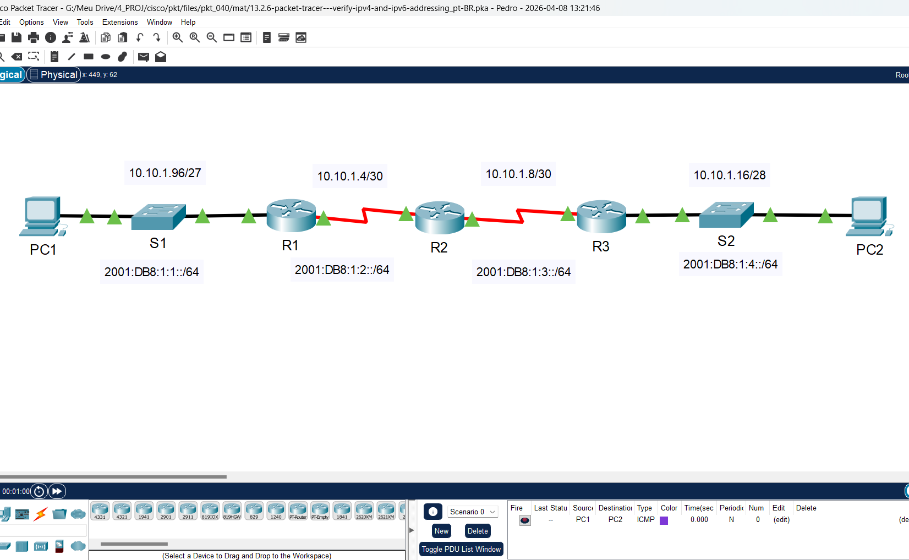
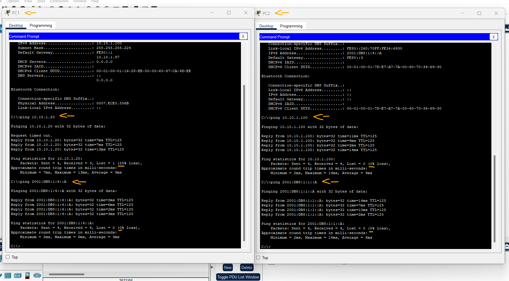
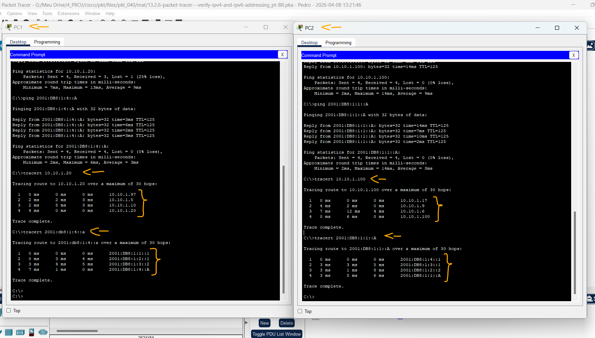

# Packet Tracer – Verifique o endereçamento IPv4 e IPv6   

### Cisco: <a href="../../../">cisco   </a>
### Cisco Networking Academy: cna   </a>
### Training Category: <a href="../../../pkt/">pkt</a>
### Software/Subject: network   </a>
### Course: <a href="./">pkt_040 (Packet Tracer – Verifique o endereçamento IPv4 e IPv6)   </a>

---

### Theme:
- Network

### Used Tools:
- Operating System (OS): 
  - Windows 11 
- Cloud Services:
  - Google Drive 
- Language:
  - HTML   
  - Markdown   
- Integrated Development Environment (IDE) and Text Editor:
  - Visual Studio Code (VS Code)   
- Versioning: 
  - Git   
- Repository:
  - GitHub   
- Network:
  - Cisco Packet Tracer   
  - ipconfig   
  - ping   
  - Trace Route (tracert)   

---

<h3><a name="item00">Course Strcuture:</a></h3>

1. <a href="#item01">Parte 1: Completar a Documentação da Tabela de Endereçamento</a> 
  1.1 <a href="#item01.01">Etapa 1: Use ipconfig para verificar o endereçamento IPv4.</a> 
  1.2 <a href="#item01.02">Etapa 2: Use o ipv6config para verificar o endereçamento IPv6.</a> 
2. <a href="#item02">Parte 2: Testar a Conectividade Usando Ping</a> 
  2.1 <a href="#item02.01">Etapa 1: Use ping para verificar a conectividade IPv4.</a> 
  2.2 <a href="#item02.02">Etapa 2: Use ping para verificar a conectividade IPv6.</a> 
3. <a href="#item03">Parte 3: Descobrir o Caminho Rastreando a Rota</a> 
  3.1 <a href="#item03.01">Etapa 1: Use tracert para descobrir o caminho IPv4.</a> 
  3.2 <a href="#item03.02">Etapa 2: Use tracert para descobrir o caminho IPv6.</a> 

---

### Objective:
O objetivo desta atividade foi mapear os endereços IPv4 e IPv6 dos hosts, validar a conectividade entre as estações de trabalho e realizar o rastreamento da rota percorrida pelas PDUs, identificando tecnicamente cada salto (hop) e as respectivas interfaces de gateway ao longo do caminho.

### Folder Structure:
- [README.md](./README.md): Este documento de README, escrito em **Markdown**, com o conteúdo do laboratório.
- [0-aux](./0-aux/): Pasta auxiliar com imagens utilizadas na construção dos arquivos de README desse curso.

### Development:

<a name="item01"><h4>1. Parte 1: Completar a Documentação da Tabela de Endereçamento</h4></a>[Back to summary](#item00)

A imagem 01 mostra a topologia inicial.

<figure>
     
    <figcaption>Imagem 01.</figcaption>
</figure>
 

<a name="item01.01"><h4>1.1 Etapa 1: Use ipconfig para verificar o endereçamento IPv4.</h4></a>[Back to summary](#item00)

- a. Clique em PC1 e abra o prompt de comando.
- b. Insira o comando ipconfig /all para coletar informações do IPv4. Preencha a Tabela de Endereçamento com o endereço IPv4, a máscara de sub-rede e o gateway padrão.
  - `ipconfig /all`.
- c. Clique em PC2 e abra o prompt de comando.
- d. Insira o comando ipconfig /all para coletar informações do IPv4. Preencha a Tabela de Endereçamento com o endereço IPv4, a máscara de sub-rede e o gateway padrão.
  - `ipconfig /all`.

<a name="item01.02"><h4>1.2 Etapa 2: Use o ipv6config para verificar o endereçamento IPv6.</h4></a>[Back to summary](#item00)

- a. Em PC1, insira o comando ipv6config /all para coletar informações de IPv6. Preencha a Tabela de Endereçamento com o endereço IPv6, o prefixo da sub-rede e o gateway padrão.
  - `ipv6config /all`.
- b. Em PC2, insira o comando ipv6config /all para coletar informações de IPv6. Preencha a Tabela de Endereçamento com o endereço IPv6, o prefixo da sub-rede e o gateway padrão.
  - `ipv6config /all`.

#### Tabela 1 — Planejamento de Endereçamento IPv4 e IPv6

| Dispositivo | Interface | Tipo IP           | Endereço IP     | Prefixo               | Gateway Padrão |
|:-----------:|:---------:|:-----------------:|:---------------:|:---------------------:|:--------------:|
| R1          | G0/0      | IPv4              | 10.10.1.97      | /27 (255.255.255.224) | N/A            |
| R1          | G0/0      | IPv6              | 2001:DB8:1:1::1 | /64                   | N/A            |
| R1          | S0/0/1    | IPv4              | 10.10.1.6       | /30 (255.255.255.252) | N/A            |
| R1          | S0/0/1    | IPv6              | 2001:DB8:1:2::2 | /64                   | N/A            |
| R1          | S0/0/1    | IPv6 (Link Local) | FE80::1         | -                     | N/A            |
| R2          | S0/0/0    | IPv4              | 10.10.1.5       | /30 (255.255.255.252) | N/A            |
| R2          | S0/0/0    | IPv6              | 2001:DB8:1:2::1 | /64                   | N/A            |
| R2          | S0/0/1    | IPv4              | 10.10.1.9       | /30 (255.255.255.252) | N/A            |
| R2          | S0/0/1    | IPv6              | 2001:DB8:1:3::1 | /64                   | N/A            |
| R2          | S0/0/1    | IPv6 (Link Local) | FE80::2         | -                     | N/A            |
| R3          | G0/0      | IPv4              | 10.10.1.17      | /28 (255.255.255.240) | N/A            |
| R3          | G0/0      | IPv6              | 2001:DB8:1:4::1 | /64                   | N/A            |
| R3          | S0/0/1    | IPv4              | 10.10.1.10      | /30 (255.255.255.252) | N/A            |
| R3          | S0/0/1    | IPv6              | 2001:DB8:1:3::2 | /64                   | N/A            |
| R3          | S0/0/1    | IPv6 (Link Local) | FE80::3         | -                     | N/A            |
| PC1         | NIC       | IPv4              | 10.10.1.100     | /27 (255.255.255.224) | 10.10.1.97     |
| PC1         | NIC       | IPv6              | 2001:DB8:1:1::A | /64                   | FE80::1        |
| PC2         | NIC       | IPv4              | 10.10.1.20      | /28 (255.255.255.240) | 10.10.1.17     |
| PC2         | NIC       | IPv6              | 2001:DB8:1:4::A | /64                   | FE80::3        |

<a name="item02"><h4>2. Parte 2: Testar a Conectividade Usando Ping</h4></a>[Back to summary](#item00)

<a name="item02.01"><h4>2.1 Etapa 1: Use ping para verificar a conectividade IPv4.</h4></a>[Back to summary](#item00)

- a. Em PC1, envie ping para o endereço IPv4 de PC2.
  - `ping 10.10.1.20`.
- a. O resultado foi bem-sucedido?
  - Sim, o comando foi concluído com sucesso, indicando que o PC2 está acessível.
- b. Em PC2, envie ping para o endereço IPv4 de PC1.
  - `ping 10.10.1.100`.
- b. O resultado foi bem-sucedido?
  - Sim, o comando foi concluído com sucesso, indicando que o PC1 está acessível.

<a name="item02.02"><h4>2.2 Etapa 2: Use ping para verificar a conectividade IPv6.</h4></a>[Back to summary](#item00)

- a. Em PC1, envie ping para o endereço IPv6 de PC2.
  - `ping 2001:DB8:1:4::A`.
- a. O resultado foi bem-sucedido?
  - Sim, o comando foi concluído com sucesso, indicando que o PC2 está acessível.
- b. No PC2, execute ping no endereço IPv4 do PC1.
  - `ping 2001:DB8:1:1::A`.
- b. O resultado foi bem-sucedido?
  - Sim, o comando foi concluído com sucesso, indicando que o PC1 está acessível.

A imagem 02 apresenta os resultados do teste de conectividade (ping) entre os hosts, validando a plena comunicação entre eles.

<figure>
     
    <figcaption>Imagem 02.</figcaption>
</figure>
 

<a name="item03"><h4>3. Parte 3: Descobrir o Caminho Rastreando a Rota</h4></a>[Back to summary](#item00)

<a name="item03.01"><h4>3.1 Etapa 1: Use tracert para descobrir o caminho IPv4.</h4></a>[Back to summary](#item00)

- a. De PC1, rastreie a rota para PC2. 
  - `tracert 10.10.1.20`.
- a. Quais endereços foram encontrados no caminho?
  - Os saltos identificados no rastreamento de rota foram os IPs 10.10.1.97, 10.10.1.5, 10.10.1.10 e o destino final 10.10.1.20.
- a. A que interfaces estão associados os quatro endereços?
  - O endereço 10.10.1.97 pertence à interface G0/0 do roteador R1 (Gateway Padrão); 10.10.1.5 refere-se à interface serial S0/0/0 do roteador R2; 10.10.1.10 está atribuído à interface serial S0/0/1 do roteador R3 e, por fim, 10.10.1.20 identifica a interface de rede do PC2.
- b. De PC2, rastreie a rota para PC1.
  - `tracert 10.10.1.100`.
- b. Quais endereços foram encontrados no caminho?
  - Os saltos identificados no rastreamento de rota foram os IPs 10.10.1.17, 10.10.1.9, 10.10.1.6 e o destino final 10.10.1.100.
- b. A que interfaces estão associados os quatro endereços?
  - O endereço 10.10.1.17 pertence à interface G0/0 do roteador R3 (Gateway Padrão); 10.10.1.9 refere-se à interface serial S0/0/1 do roteador R2; 10.10.1.6 está atribuído à interface serial S0/0/1 do roteador R1 e, por fim, 10.10.1.100 identifica a interface de rede do PC1.

<a name="item03.02"><h4>3.2 Etapa 2: Use tracert para descobrir o caminho IPv6.</h4></a>[Back to summary](#item00)

- a. De PC1, rastreie a rota para o endereço IPv6 de PC2.
  - `tracert 2001:db8:1:4::a`.
- a. Quais endereços foram encontrados no caminho?
  - Os saltos identificados no rastreamento de rota foram os IPs 2001:DB8:1:1::1, 2001:DB8:1:2::1, 2001:DB8:1:3::2 e o destino final 2001:DB8:1:4::A.
- a. A que interfaces estão associados os quatro endereços? 
  - O endereço 2001:DB8:1:1::1 pertence à interface G0/0 do roteador R1 (Gateway Padrão); 2001:DB8:1:2::1 refere-se à interface serial S0/0/0 do roteador R2; 2001:DB8:1:3::2 está atribuído à interface serial S0/0/1 do roteador R3 e, por fim, 2001:DB8:1:4::A identifica a interface de rede do PC2.
- b. De PC2, rastreie a rota para o endereço IPv6 de PC1.
  - `tracert 2001:DB8:1:1::A`.
- b. Quais endereços foram encontrados no caminho?
  - Os saltos identificados no rastreamento de rota foram os IPs 2001:DB8:1:4::1, 2001:DB8:1:3::1, 2001:DB8:1:2::2 e o destino final 2001:DB8:1:1::A.
- b. A que interfaces estão associados os quatro endereços?
  - O endereço 2001:DB8:1:4::1 pertence à interface G0/0 do roteador R3 (Gateway Padrão); 2001:DB8:1:3::1 refere-se à interface serial S0/0/1 do roteador R2; 2001:DB8:1:2::2 está atribuído à interface serial S0/0/1 do roteador R1 e, por fim, 2001:DB8:1:1::A identifica a interface de rede do PC1.

A imagem 03 mostra os quatro rastreamentos de rotas realizados, tanto por IPv4 como por IPv6.

<figure>
     
    <figcaption>Imagem 03.</figcaption>
</figure>
 