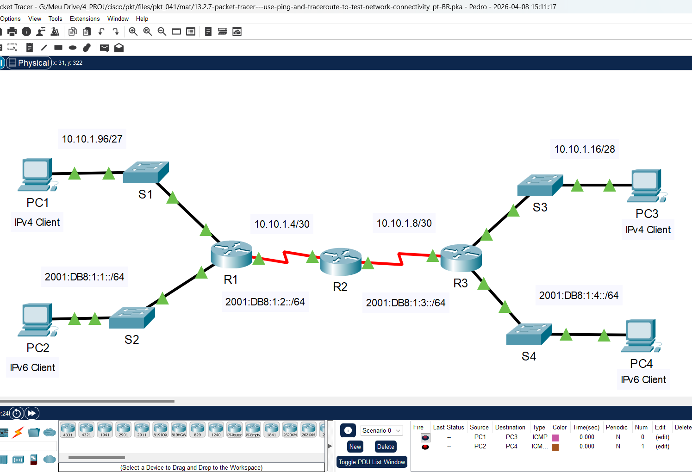
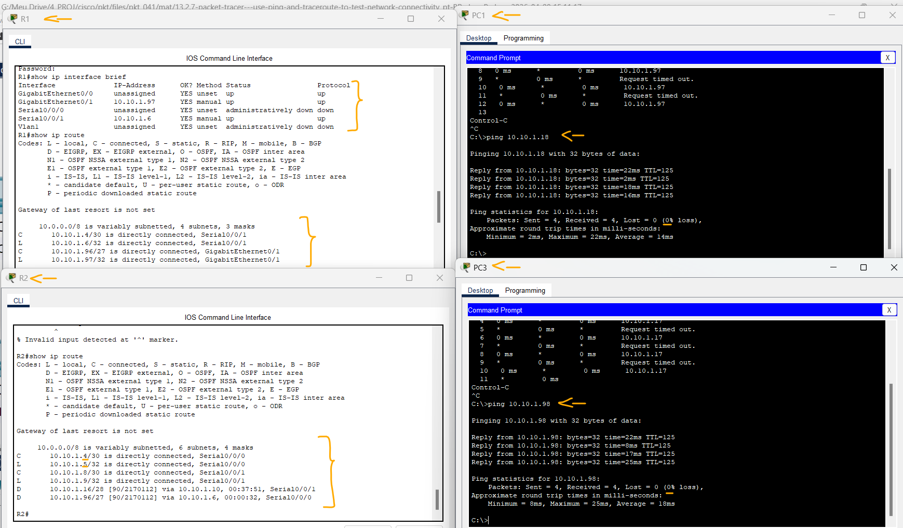
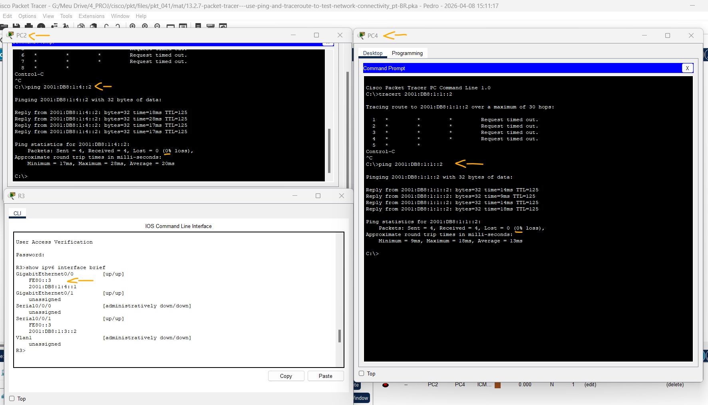

# Packet Tracer - Use Ping e Traceroute para testar a conectividade de rede   

### Cisco: <a href="../../../">cisco   </a>
### Cisco Networking Academy: cna   </a>
### Training Category: <a href="../../../pkt/">pkt</a>
### Software/Subject: network   </a>
### Course: <a href="./">pkt_041 (Packet Tracer - Use Ping e Traceroute para testar a conectividade de rede)   </a>

---

### Theme:
- Network

### Used Tools:
- Operating System (OS): 
  - Cisco Internetwork Operating System (Cisco IOS)   
  - Windows 11 
- Cloud Services:
  - Google Drive 
- Language:
  - HTML   
  - Markdown   
- Integrated Development Environment (IDE) and Text Editor:
  - Visual Studio Code (VS Code)   
- Versioning: 
  - Git   
- Repository:
  - GitHub   
- Network:
  - Cisco Packet Tracer 
  - ipconfig   
  - ping   
  - Trace Route (tracert)   

---

<h3><a name="item00">Course Strcuture:</a></h3>

1. <a href="#item01">Parte 1: Testar e Restaurar a Conectividade IPv4</a> 
  1.1 <a href="#item01.01">Etapa 1: Use ipconfig e ping para verificar a conectividade.</a> 
  1.2 <a href="#item01.02">Etapa 2: Localize a origem da falha de conectividade.</a> 
  1.3 <a href="#item01.03">Etapa 3: Proponha uma solução para resolver o problema.</a> 
  1.4 <a href="#item01.04">Etapa 4: Implemente o plano.</a> 
  1.5 <a href="#item01.05">Etapa 5: Verifique se a conectividade foi restaurada.</a> 
  1.6 <a href="#item01.06">Etapa 6: Documente a solução.</a> 
2. <a href="#item02">Parte 2: Testar e Restaurar a Conectividade IPv6</a> 
  2.1 <a href="#item02.01">Etapa 1: Use ipv6config e ping para verificar a conectividade.</a> 
  2.2 <a href="#item02.02">Etapa 2: Localize a origem da falha de conectividade.</a> 
  2.3 <a href="#item02.03">Etapa 3: Proponha uma solução para resolver o problema.</a> 
  2.4 <a href="#item02.04">Etapa 4: Implemente o plano.</a> 
  2.5 <a href="#item02.05">Etapa 5: Verifique se a conectividade foi restaurada.</a> 
  2.6 <a href="#item02.06">Etapa 6: Documente a solução.</a> 

---

### Objective:
O objetivo desta atividade foi realizar o troubleshooting em redes IPv4 e IPv6, utilizando ferramentas de diagnóstico como **ping** e **Trace Route** para localizar falhas de conectividade e restabelecer a comunicação entre os dispositivos.

### Folder Structure:
- [README.md](./README.md): Este documento de README, escrito em **Markdown**, com o conteúdo do laboratório.
- [0-aux](./0-aux/): Pasta auxiliar com imagens utilizadas na construção dos arquivos de README desse curso.

### Development:

<a name="item01"><h4>1. Parte 1: Testar e Restaurar a Conectividade IPv4</h4></a>[Back to summary](#item00)

A imagem 01 mostra a topologia inicial.

<figure>
     
    <figcaption>Imagem 01.</figcaption>
</figure>
 

<a name="item01.01"><h4>1.1 Etapa 1: Use ipconfig e ping para verificar a conectividade.</h4></a>[Back to summary](#item00)

- a. Clique em PC1 e abra o Prompt de Comando.
- b. Insira o comando ipconfig /all para coletar informações do IPv4. Preencha a Tabela de Endereçamento com o endereço IPv4, a máscara de sub-rede e o gateway padrão.
  - `ipconfig /all`.
- c. Clique em PC3 e abra o prompt de comando.
- d. Insira o comando ipconfig /all para coletar informações do IPv4. Preencha a Tabela de Endereçamento com o endereço IPv4, a máscara de sub-rede e o gateway padrão.
  - `ipconfig /all`.
- e. Use o comando ping para testar a conectividade entre PC1 e PC3. O ping falhará.
  - `ping 10.10.1.18`.

| Dispositivo | Interface | Tipo IP | Endereço IP | Prefixo | Gateway padrão |
|:---:|:---:|:---:|:---:|:---:|:---:|
| R1 | G0/1 | IPv4 | 10.10.1.97 | /27 (255.255.255.224) | N/A |
| R1 | G0/0 | IPv6 | 2001:DB8:1:1::1 | /64 | N/A |
| R1 | S0/0/1 | IPv4 | 10.10.1.6 | /30 (255.255.255.252) | N/A |
| R1 | S0/0/1 | IPv6 | 2001:DB8:1:2::2 | /64 | N/A |
| R1 | S0/0/1 | IPv6 (Link Local) | FE80::1 | - | N/A |
| R2 | S0/0/0 | IPv4 | 10.10.1.5 | /30 (255.255.255.252) | N/A |
| R2 | S0/0/0 | IPv6 | 2001:DB8:1:2::1 | /64 | N/A |
| R2 | S0/0/1 | IPv4 | 10.10.1.9 | /30 (255.255.255.252) | N/A |
| R2 | S0/0/1 | IPv6 | 2001:DB8:1:3::1 | /64 | N/A |
| R2 | S0/0/1 | IPv6 (Link Local) | FE80::2 | - | N/A |
| R3 | S0/0/1 | IPv4 | 10.10.1.10 | /30 (255.255.255.252) | N/A |
| R3 | S0/0/1 | IPv6 | 2001:DB8:1:3::2 | /64 | N/A |
| R3 | S0/0/1 | IPv6 (Link Local) | FE80::3 | - | N/A |
| R3 | G0/1 | IPv4 | 10.10.1.17 | /28 (255.255.255.240) | N/A |
| R3 | G0/0 | IPv6 | 2001:DB8:1:4::1 | /64 | N/A |
| PC1 | NIC | IPv4 | 10.10.1.98 | /27 (255.255.255.224) | 10.10.1.97 |
| PC3 | NIC | IPv4 | 10.10.1.18 | /28 (255.255.255.240) | 10.10.1.17 |
| PC2 | NIC | IPv6 | 2001:DB8:1:1::2 | /64 | FE80::1 |
| PC4 | NIC | IPv6 | 2001:DB8:1:4::2 | /64 | FE80::2 |

<a name="item01.02"><h4>1.2 Etapa 2: Localize a origem da falha de conectividade.</h4></a>[Back to summary](#item00)

- a. Em PC1, digite o comando necessário para rastrear a rota para PC3.
  - `tracert 10.10.1.18`.
- a. Qual é o último endereço IPv4 que foi alcançado com sucesso?
  - O último e único endereço alcançado é do Gateway padrão (10.10.1.97), que é a interface G0/1 do roteador R1.
- b. O trace será encerrado após 30 tentativas. Digite Ctrl+C para parar o trace antes de 30 tentativas.
- c. Em PC3, digite o comando necessário para rastrear a rota para PC1.
  - `tracert 10.10.1.98`.
- c. Qual é o último endereço IPv4 que foi alcançado com sucesso?
  - O último e único endereço alcançado é do Gateway padrão (10.10.1.17), que é a interface G0/1 do roteador R3.
- d. Digite Ctrl+C para parar o trace.
- e. Clique em R1. Pressione ENTER e faça login no roteador.
- f. Insira o comando show ip interface brief para listar as interfaces e o status. Há dois endereços IPv4 no roteador. Um deve ter sido registrado na Etapa 2a.
  - `show ip interface brief`.
- f. Qual é o outro?
  - Além do endereço 10.10.1.97 da interface GigabitEthernet 0/1 (previamente identificado), foi listado o IP 10.10.1.6 associado à interface Serial 0/0/1, que atua como o link de conexão para o próximo salto na rede.
- g. Digite o comando show ip route para listar as redes a que o roteador está conectado. Observe que há duas redes conectadas à interface Serial0/0/1.
  - `show ip route`.
- g. Quais são?
  - As redes associadas à interface Serial0/0/1 são a sub-rede 10.10.1.4/30 (indicada pelo código C, referindo-se à rede conectada) e o endereço de host 10.10.1.6/32 (indicado pelo código L, referindo-se ao IP local da interface).
- h. Repita as etapas 2e a 2g com R3 e registre suas respostas.
  - `show ip route`.
  - Além do endereço 10.10.1.17 da interface GigabitEthernet 0/1 (previamente identificado), foi listado o IP 10.10.1.10 associado à interface Serial 0/0/1, que atua como o link de conexão para o próximo salto na rede.
  - As redes associadas à interface Serial0/0/1 são a sub-rede 10.10.1.8/30 (indicada pelo código C, referindo-se à rede conectada) e o endereço de host 10.10.1.10/32 (indicado pelo código L, referindo-se ao IP local da interface).
- i. Clique em R2. Pressione ENTER e faça o login no roteador.
- j. Digite o comando show ip interface brief e grave seus endereços.
  - `show ip interface brief`.
- k. Execute mais testes se isso ajudar a visualizar o problema. O modo de simulação está disponível.

<a name="item01.03"><h4>1.3 Etapa 3: Proponha uma solução para resolver o problema.</h4></a>[Back to summary](#item00)

- a. Compare suas respostas na Etapa 2 com a documentação que está disponível para a rede. Qual é o erro?
  - O erro identificado consiste em um descasque de sub-redes no link serial entre R1 e R2. Enquanto a interface S0/0/1 do R1 está configurada na rede 10.10.1.4/30, a interface S0/0/0 do R2 pertence à rede 10.10.1.0/30. Essa falta de continuidade lógica na camada 3 impede o estabelecimento de adjacência entre os roteadores e, consequentemente, inviabiliza a troca de tráfego e de rotas dinâmicas.
- a. Que solução você sugeriria para corrigir o problema?
  - A solução consiste em reconfigurar a interface Serial 0/0/0 do roteador R2 para que pertença à mesma sub-rede do R1. Sugiro aplicar o endereço IP 10.10.1.5 com a máscara 255.255.255.252 (/30), garantindo a continuidade lógica necessária para o roteamento no link serial.

<a name="item01.04"><h4>1.4 Etapa 4: Implemente o plano.</h4></a>[Back to summary](#item00)

- a. Execute a solução que você propôs na Etapa 3b.
  - `cisco` -> `enable` -> `class` -> `configure terminal` -> `interface s0/0/0` -> `ip address 10.10.1.5 255.255.255.252` -> `exit`.

<a name="item01.05"><h4>1.5 Etapa 5: Verifique se a conectividade foi restaurada.</h4></a>[Back to summary](#item00)

- a. No PC1 teste a conectividade com o PC3.
  - `ping 10.10.1.18`.
- b. No PC3 teste a conectividade com o PC1.
  - `ping 10.10.1.98`.
- b. O problema está resolvido?
  - Sim. Após a reconfiguração do endereçamento, a adjacência entre os roteadores foi estabelecida, permitindo a convergência do protocolo de roteamento e a conectividade ponta a ponta.

<a name="item01.06"><h4>1.6 Etapa 6: Documente a solução.</h4></a>[Back to summary](#item00)

A imagem 02 exibe a conclusão da Parte 1.

<figure>
     
    <figcaption>Imagem 02.</figcaption>
</figure>
 

<a name="item02"><h4>2. Parte 2: Testar e Restaurar a Conectividade IPv6</h4></a>[Back to summary](#item00)

<a name="item02.01"><h4>2.1 Etapa 1: Use ipv6config e ping para verificar a conectividade.</h4></a>[Back to summary](#item00)

- a. Clique em PC2 e abra o prompt de comando.
- b. Insira o comando ipv6config /all para coletar informações do IPv6. Preencha a Tabela de Endereçamento com o endereço IPv6, o prefixo da sub-rede e o gateway padrão.
  - `ipv6config /all`.
- c. Clique em PC4 e abra o prompt de comando.
- d. Insira o comando ipv6config /all para coletar informações do IPv6. Preencha a Tabela de Endereçamento com o endereço IPv6, o prefixo da sub-rede e o gateway padrão.
  - `ipv6config /all`.
- e. Teste a conectividade entre PC2 e PC4. O ping falhará.
  - `ping 2001:DB8:1:4::2`.

<a name="item02.02"><h4>2.2 Etapa 2: Localize a origem da falha de conectividade.</h4></a>[Back to summary](#item00)

- a. No PC2, digite o comando necessário para rastrear a rota para PC4.
  - `tracert 2001:DB8:1:4::2`.
- a. Qual é o último endereço IPv6 que foi alcançado com sucesso?
  - O último endereço IPv6 alcaçado foi 2001:DB8:1:3::2, que corresponde a interface S0/0/1 do roteador R3.
- b. O trace será encerrado após 30 tentativas. Digite Ctrl+C para parar o trace antes de 30 tentativas.
- c. No PC4, digite o comando necessário para rastrear a rota para PC2.
 - `tracert 2001:DB8:1:1::2`.
- c. Qual é o último endereço IPv6 que foi alcançado com sucesso? 
  - Nenhum endereço de IPv6 é alcançado.
- d. Digite Ctrl+C para parar o trace.
- e. Clique em R3. Pressione ENTER e faça login no roteador.
- f. Insira o comando show ipv6 interface brief para listar as interfaces e o status. Há dois endereços IPv6 no roteador. Um deles deve corresponder ao endereço de gateway registrado na Etapa 1d.
  - `show ipv6 interface brief`.
- f. Há alguma discrepância?
  - Aparentemente não há discrepâncias no roteador R3. O problema deve está no Gateway Default configurado no PC4.
- g. Execute mais testes se isso ajudar a visualizar o problema. O modo de simulação está disponível.

<a name="item02.03"><h4>2.3 Etapa 3: Proponha uma solução para resolver o problema.</h4></a>[Back to summary](#item00)

- a. Compare suas respostas na Etapa 2 com a documentação que está disponível para a rede. Qual é o erro?
  - Ao comparar as configurações, foi identificado que o gateway padrão no PC4 estava incorreto. O host estava configurado com o endereço de link-local fe80::2, enquanto a interface G0/0 do roteador R3 (seu gateway real) utiliza o endereço fe80::3. Essa divergência impedia o host de encaminhar pacotes para fora de sua rede local."
- b. Que solução você sugeriria para corrigir o problema?
  - A solução é atualizar o gateway padrão do PC4, alterando o endereço de link-local de fe80::2 para fe80::3. Isso garante que o host aponte corretamente para a interface do roteador R3, restabelecendo a saída de dados para outras redes.

<a name="item02.04"><h4>2.4 Etapa 4: Implemente o plano.</h4></a>[Back to summary](#item00)

- a. Execute a solução que você propôs na Etapa 3b.
  - `FE80::3`.

<a name="item02.05"><h4>2.5 Etapa 5: Verifique se a conectividade foi restaurada.</h4></a>[Back to summary](#item00)

- a. Em PC2, teste a conectividade com PC4.
  - `ping 2001:DB8:1:4::2`.
- b. Em PC4, teste a conectividade com PC2.
  - `ping 2001:DB8:1:1::2`.
- b. O problema está resolvido?
  - Sim. Após a correção do gateway padrão no host, a rota foi restabelecida e os testes de conectividade confirmaram que o tráfego agora flui corretamente entre as sub-redes.

<a name="item02.06"><h4>2.6 Etapa 6: Documente a solução.</h4></a>[Back to summary](#item00)

A imagem 03 exibe a conclusão da Parte 2.

<figure>
     
    <figcaption>Imagem 03.</figcaption>
</figure>
 