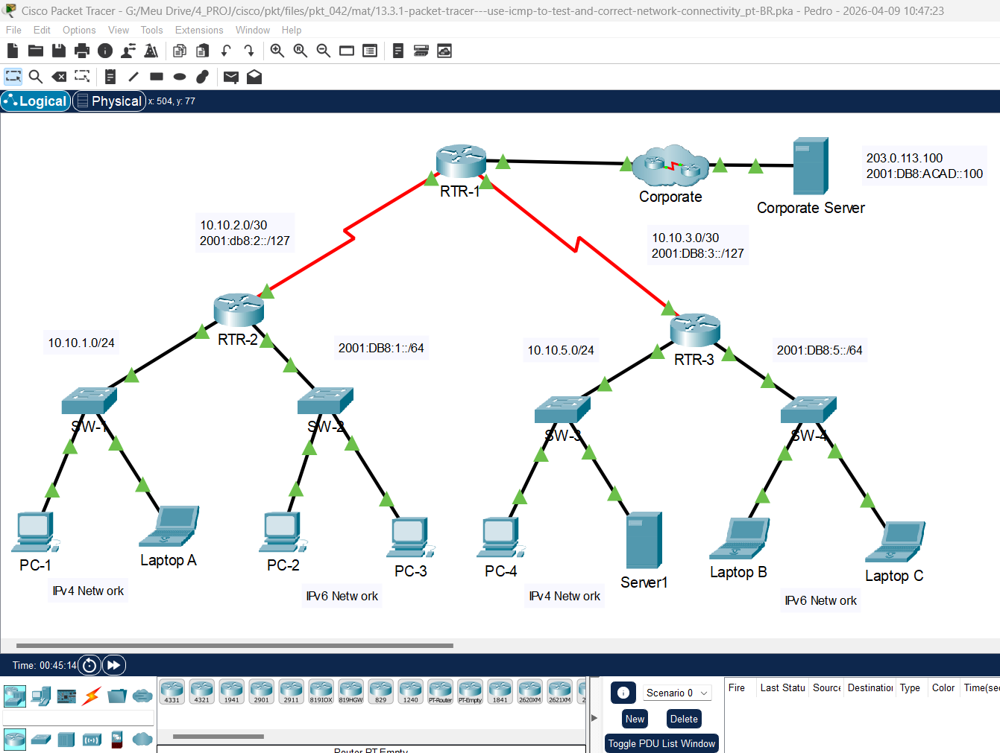
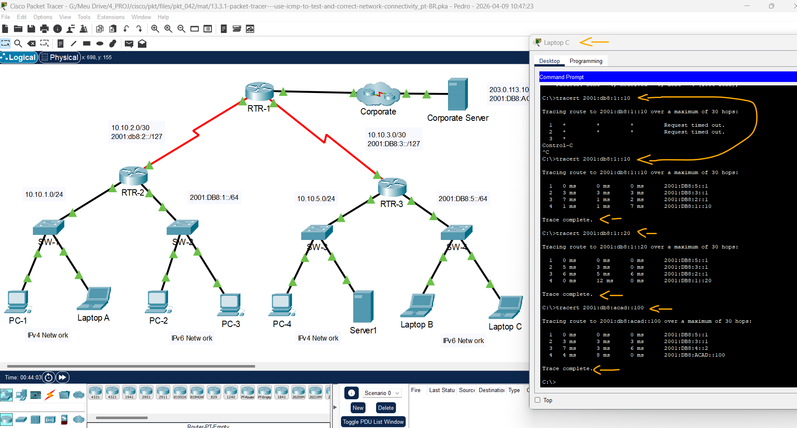

# Packet Tracer - Use o ICMP para testar e corrigir a conectividade de rede   

### Cisco: <a href="../../../">cisco   </a>
### Cisco Networking Academy: cna   </a>
### Training Category: <a href="../../../pkt/">pkt</a>
### Software/Subject: network   </a>
### Course: <a href="./">pkt_042 (Packet Tracer - Use o ICMP para testar e corrigir a conectividade de rede)   </a>

---

### Theme:
- Network

### Used Tools:
- Operating System (OS): 
  - Cisco Internetwork Operating System (Cisco IOS)   
  - Windows 11 
- Cloud Services:
  - Google Drive 
- Language:
  - HTML   
  - Markdown   
- Integrated Development Environment (IDE) and Text Editor:
  - Visual Studio Code (VS Code)   
- Versioning: 
  - Git   
- Repository:
  - GitHub   
- Network:
  - Cisco Packet Tracer 
  - ping   
  - Trace Route (tracert)   

---

<h3><a name="item00">Course Strcuture:</a></h3>

1. <a href="#item01">Packet Tracer - Use o ICMP para testar e corrigir a conectividade de rede</a> 
  1.1 <a href="#item01.01">Instruções</a> 
  1.2 <a href="#item01.02">Identificação</a> 
  1.3 <a href="#item01.03">Correção</a> 

---

### Objective:
O objetivo desta atividade foi realizar o troubleshooting de rede para identificar e corrigir falhas de comunicação. Através de testes de conectividade ICMP e da análise minuciosa das configurações nos dispositivos, foi possível localizar os pontos de erro e restabelecer o funcionamento adequado da infraestrutura.

### Folder Structure:
- [README.md](./README.md): Este documento de README, escrito em **Markdown**, com o conteúdo do laboratório.
- [0-aux](./0-aux/): Pasta auxiliar com imagens utilizadas na construção dos arquivos de README desse curso.

### Development:

<a name="item01"><h4>1. Packet Tracer - Use o ICMP para testar e corrigir a conectividade de rede</h4></a>[Back to summary](#item00)

A imagem 01 mostra a topologia inicial.

<figure>
     
    <figcaption>Imagem 01.</figcaption>
</figure>
 

<a name="item01.01"><h4>1.1 Instruções</h4></a>[Back to summary](#item00)

- Todos os hosts devem ter conectividade com todos os outros hosts e o servidor corporativo.
- Aguarde até que todas as luzes estejam verdes.
- Selecione um host e use ping ICMP para determinar quais hosts podem ser acessados a partir desse host. 
- Se for encontrado um host inacessível, use o rastreamento ICMP para localizar o local geral dos erros de rede. 
- Localize os erros específicos e corrija-os. 

<a name="item01.02"><h4>1.2 Identificação</h4></a>[Back to summary](#item00)

#### Tabela 1 — Teste de Conectividade

| Origem | Destino | Comando | Status |
| :---: | :---: | :---: | :---: |
| PC-1 | PC-1 | `ping 10.10.1.10` | Sucesso |
| PC-1 | Laptop A | `ping 10.10.1.20` | Sucesso |
| PC-1 | PC-4 | `ping 10.10.5.10` | Inacessível |
| PC-1 | Server 1 | `ping 10.10.5.20` | Inacessível |
| PC-1 | Servidor Corporativo | `ping 203.0.113.100` | Sucesso |
| Laptop C | PC-2 | `ping 2001:db8:1::10` | Inacessível |
| Laptop C | PC-3 | `ping 2001:db8:1::20` | Inacessível |
| Laptop C | Laptop B | `ping 2001:db8:5::10` | Sucesso |
| Laptop C | Laptop C | `ping 2001:db8:5::20` | Sucesso |
| Laptop C | Servidor Corporativo | `ping 2001:db8:acad::100` | Inacessível |

#### Tabela 2 — Rastreio de Conectividade

| Ordem | Origem | Destino | Comando | Salto | Dispositivo | Problema | 
| :---: | :---: | :---: | :---: | :---: | :---: | :---: |
| 1 | PC-1 | PC-4 | `tracert 10.10.5.10` | 3º Salto | PC-4 | Gateway Padrão incorreto (não aponta para RTR-3) |
| 2 | PC-1 | Server 1 | `tracert 10.10.5.20` | 3º Salto | Server 1 | Falha na atribuição de IP (serviço DHCP não configurado) |
| 3 | Laptop C | PC-2 | `tracert 2001:db8:1::10` | 1º Salto | RTR-3 G0/0/1 | Interface com endereço de IP incorreto |
| 4 | Laptop C | PC-3 | `tracert 2001:db8:1::20` | 1º Salto | RTR-3 G0/0/1 | Interface com endereço de IP incorreto |
| 5 | Laptop C | Servidor Corporativo | `tracert 2001:db8:acad::100` | 1º Salto | RTR-3 G0/0/1 | Interface com endereço de IP incorreto |

<a name="item01.03"><h4>1.3 Correção</h4></a>[Back to summary](#item00)

- 1 - Alterar o Gateway padrão do PC-4 para o IP da interface G0/0/0 do roteador RTR-3: `10.10.5.1`.
- 2 - Alterar para endereçamento IP estático: `10.10.5.20` -> `255.255.255.0` -> `10.10.5.1`.
- 3, 4 e 5 - Alterar o endereço de IP da interface G0/0/1 do roteador RTR-3: `enable` -> `configure terminal` -> `interface g0/0/1` -> `no ipv6 address 2001:db8:6::1/64` -> `ipv6 address 2001:db8:5::1/64` -> `exit`.

A imagem 02 mostra que os últimos três erros foram corrigidos.

<figure>
     
    <figcaption>Imagem 02.</figcaption>
</figure>
 