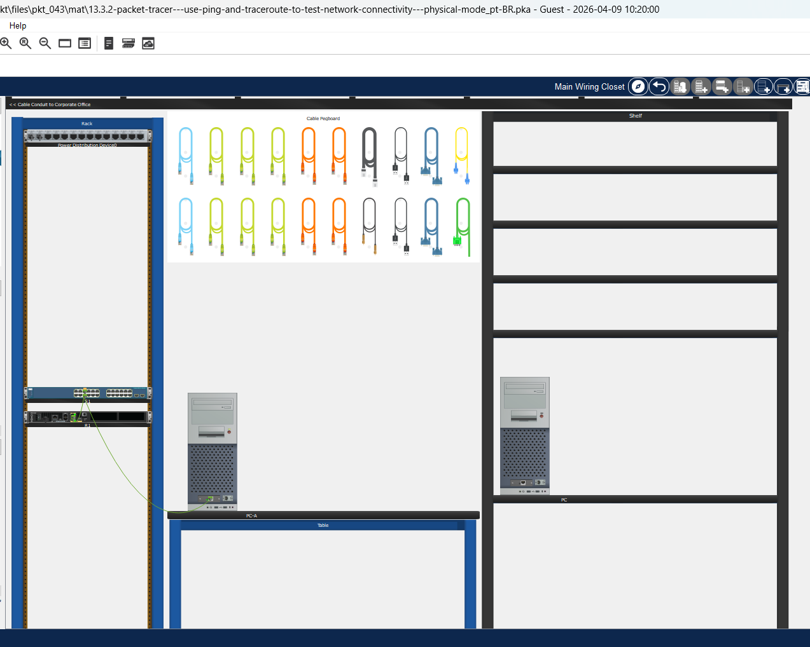
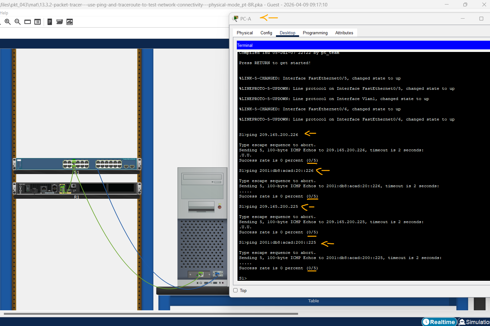
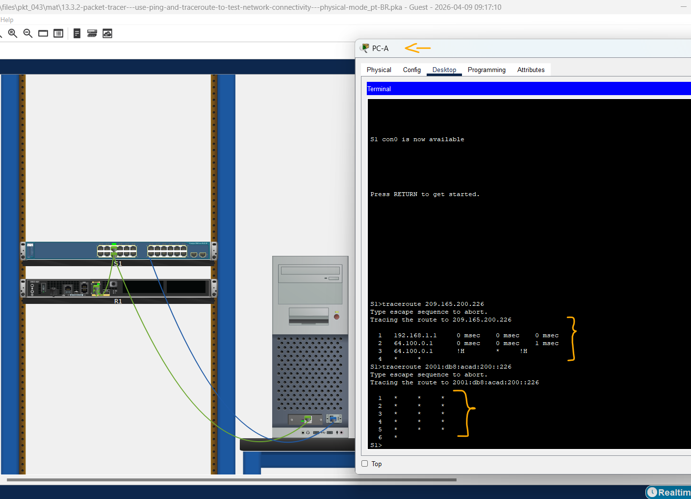
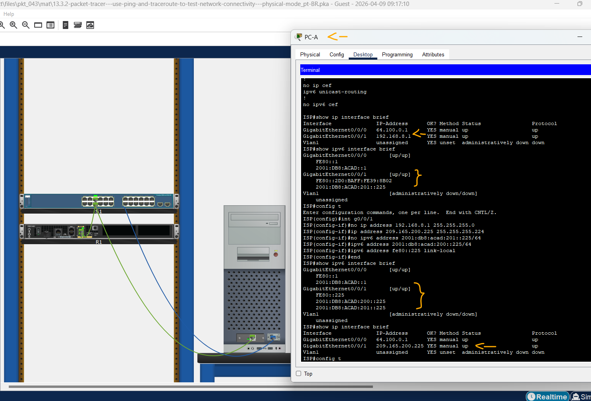
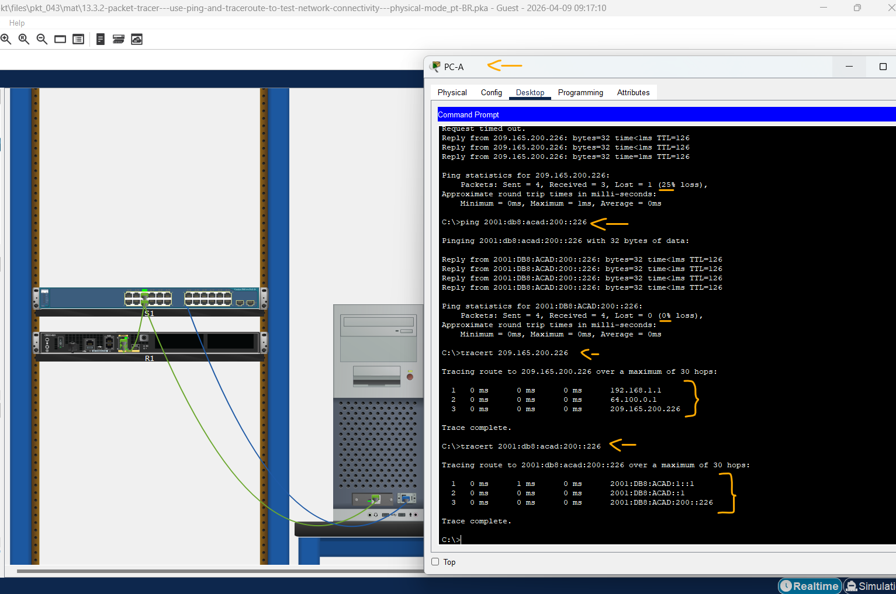
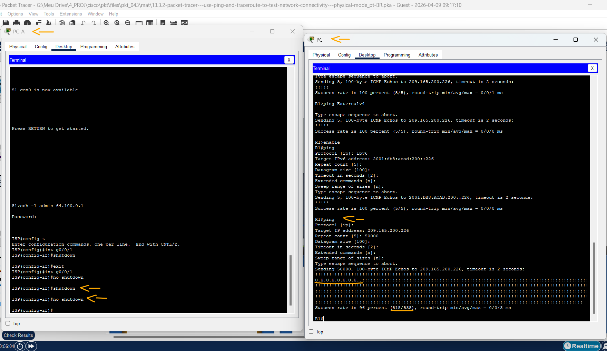

# Packet Tracer - Use Ping e Traceroute para Testar Conectividade de Rede - Modo Físico   

### Cisco: <a href="../../../">cisco   </a>
### Cisco Networking Academy: cna   </a>
### Training Category: <a href="../../../pkt/">pkt</a>
### Software/Subject: network   </a>
### Course: <a href="./">pkt_043 (Packet Tracer - Use Ping e Traceroute para Testar Conectividade de Rede - Modo Físico)   </a>

---

### Theme:
- Network

### Used Tools:
- Operating System (OS): 
  - Cisco Internetwork Operating System (Cisco IOS)   
  - Windows 11 
- Cloud Services:
  - Google Drive 
- Language:
  - HTML   
  - Markdown   
- Integrated Development Environment (IDE) and Text Editor:
  - Visual Studio Code (VS Code)   
- Versioning: 
  - Git   
- Repository:
  - GitHub   
- Network:
  - Cisco Packet Tracer   
  - ping   
  - traceroute   
  - Trace Route (tracert)   

---

<h3><a name="item00">Course Strcuture:</a></h3>

1. <a href="#item01">Parte 1: Usar o Comando Ping para Testes Básicos de Rede</a> 
  1.1 <a href="#item01.01">Etapa 1: Testar a conectividade para R1 usando PC-A</a> 
  1.2 <a href="#item01.02">Etapa 2: Execute pings de S1 para Externo.</a> 
2. <a href="#item02">Parte 2: Usar os Comandos Tracert e Traceroute para Testes Básicos de Rede</a> 
  2.1 <a href="#item02.01">Etapa 1: No PC-A, use o comando tracert para Externo.</a> 
  2.2 <a href="#item02.02">Etapa 2: Em S1, use o comando traceroute para Externo.</a> 
3. <a href="#item03">Parte 3: Solucionar Problemas da Topologia</a> 
  3.1 <a href="#item03.01">Etapa 1: Acesse o local de rede onde o problema de conectividade está ocorrendo.</a> 
  3.2 <a href="#item03.02">Etapa 2: Verifique a conectividade ponta a ponta.</a> 
4. <a href="#item04">Parte 4: Use comandos de ping estendidos no PC-A.</a> 
  4.1 <a href="#item04.01">Etapa 1: Use comandos de ping estendidos no PC-A.</a> 
  4.2 <a href="#item04.02">Etapa 2: Teste a conectividade de rede da rede R1 usando dispositivos Cisco.</a> 
5. <a href="#item05">Perguntas para reflexão</a> 

---

### Objective:
O objetivo desta atividade no modo físico foi realizar o troubleshooting no roteador ISP a partir da rede local, utilizando comandos de diagnóstico como ping e traceroute. Além da resolução de falhas, foi explorado o uso dessas ferramentas de forma estendida para verificar as diversas possibilidades de análise de conectividade.

### Folder Structure:
- [README.md](./README.md): Este documento de README, escrito em **Markdown**, com o conteúdo do laboratório.
- [0-aux](./0-aux/): Pasta auxiliar com imagens utilizadas na construção dos arquivos de README desse curso.

### Development:

<a name="item01"><h4>1. Parte 1: Usar o Comando Ping para Testes Básicos de Rede</h4></a>[Back to summary](#item00)

Na parte 1 deste laboratório, use o comando ping para verificar a conectividade de ponta a ponta. Ping opera enviando pacotes de solicitação de eco do protocolo ICMP (Internet Control Message Protocol) para o host destino e aguardando uma resposta ICMP. Ele pode registrar o tempo de ida e volta e qualquer perda de pacote ou loops de roteamento.

Os pacotes IP têm uma vida útil limitada na rede. Os pacotes IPv4 usam um tempo para viver de 8 bits (TTL). Os pacotes do IPv6 usam um valor do campo do cabeçalho do limite de salto. O TTL e o limite de salto especificam o número máximo de saltos da camada 3 que podem ser atravessados no trajeto para seu destino. Hosts em uma rede definirá seu próprio valor de 8 bits com um valor máximo de 255.

Portanto, cada vez que um pacote IP chega a um dispositivo de rede de camada três, esse valor é reduzido em um antes de ser encaminhado para seu destino. Portanto, se esse valor eventualmente atingir zero, o pacote IP é descartado. 

Você examinará os resultados com o comando ping e as opções adicionais de ping disponíveis nos PCs com Windows e nos dispositivos Cisco. 

A imagem 01 mostra a topologia inicial.

<figure>
     
    <figcaption>Imagem 01.</figcaption>
</figure>
 

<a name="item01.01"><h4>1.1 Etapa 1: Testar a conectividade para R1 usando PC-A</h4></a>[Back to summary](#item00)

Todos os pings de PC-A para outros dispositivos na topologia devem ser bem-sucedidos. Se não forem, verifique a topologia e o cabeamento, bem como a configuração dos computadores e dos dispositivos Cisco.

- a. Faça ping do PC-A para o gateway padrão usando o endereço IPv4 (interface GigabitEthernet 0/0/1 de R1).
  - `ping 192.168.1.1`.
- a. Neste exemplo, quatro pedidos ICMP que têm 32 bytes cada, foram enviados. As respostas foram recebidas em menos de um milissegundo sem perda de pacote. O tempo de transmissão e resposta pode aumentar à medida que as solicitações e respostas do ICMP são processadas por mais dispositivos durante a viagem de e para o destino final. 
- a. Isso também pode ser feito usando o endereço IPv6 do gateway padrão (interface GigabitEthernet 0/0/1 do R1).
  - `ping 2001:db8:acad:1::1`.
- b. No PC-A, execute ping nos endereços listados na tabela a seguir e registre o tempo médio de ida e volta e o tempo de vida do IPv4 (TTL) ou o limite de salto do IPv6.
  - PC-A: `ping 192.168.1.10` -> `ping 2001:db8:acad:1::10`.
  - S1: `ping 192.168.1.2` -> `ping 2001:db8:acad:1::2`.
  - R1-G0/0/1: `ping 192.168.1.1` -> `ping 2001:db8:acad:1::1`.
  - R1-G0/0/0: `ping 64.100.0.2` -> `ping 2001:db8:acad::2`.
  - ISP-G0/0/0: `ping 64.100.0.1` -> `ping 2001:db8:acad::1`.
  - ISP-G0/0/1: `ping 209.165.200.225` -> `ping 2001:db8:acad:200::225`.
  - External: `ping 209.165.200.226` -> `ping 2001:db8:acad:20::226`.

#### Tabela 1 — Teste de Conectividade

| Dispositivo | Destino | Tempo Médio de Ida e Volta (ms) | TTL/Limite de salto  | Versão IP |
|:---:|:---:|:---:|:---:|:---:|
| PC-A | 192.168.1.10 | 1 | 128 | IPv4 |
| PC-A | 2001:db8:acad:1::10 | 4 | 128 | IPv6 |
| S1| 192.168.1.2 | 0 | 255 | IPv4 |
| S1 | 2001:db8:acad:1::2  | 0 | 255 | IPv6 |
| R1-G0/0/1 | 192.168.1.1 | 0 | 255 | IPv4 |
| R1-G0/0/1 | 2001:db8:acad:::1 | 0 | 255 | IPv6 |
| R1-G0/0/0 | 64.100.0.2 | 0 | 255 | IPv4 |
| R1-G0/0/0 | 2001:db8:aca::2 | 0 | 255 | IPv6 |
| ISP-G0/0/0 | 64.100.0.1 | 0 | 254 | IPv4 |
| ISP-G0/0/0 | 2001:db8:acad::1 | 0 | 254 | IPv6 |
| ISP-G0/0/1 | 209.165.200.225 | X | X | IPv4 |
| ISP-G0/0/1 | 2001:db8:acad:200::225 | X | X | IPv6 |
| External | 209.165.200.226 | X | X | IPv4 |
| External | 2001:db8:acad:20::226 | X | X | IPv6 |

<a name="item01.02"><h4>1.2 Etapa 2: Execute pings de S1 para Externo.</h4></a>[Back to summary](#item00)

- a. De S1, tente ping ISP e externo usando endereços IPv4 e IPv6. 
  - Conectar cabo console no PC-A e R1.
  - `ping 209.165.200.225` -> `ping 2001:db8:acad:200::225`.
  - `ping 209.165.200.226` -> `ping 2001:db8:acad:20::226`.
- a. Quais são os resultados de ping de S1 para ISP e externo?
  - Os testes realizados a partir do S1 replicaram o comportamento observado no PC-A: a conectividade com o ISP e o servidor Externo falhou. O diagnóstico confirmou que a interrupção ocorre na interface G0/0/1 do roteador ISP, impedindo que o tráfego de gerenciamento do switch alcance redes externas.

A imagem 02 exibe os resultados do teste de conectividade entre os dispositivos.

<figure>
     
    <figcaption>Imagem 02.</figcaption>
</figure>
 

<a name="item02"><h4>2. Parte 2: Usar os Comandos Tracert e Traceroute para Testes Básicos de Rede</h4></a>[Back to summary](#item00)

Os comandos para rastrear rotas podem ser encontrados em computadores e dispositivos de rede. Para um PC com Windows, o comando Tracert usa mensagens ICMP para rastrear o caminho até o destino final. O comando traceroute utiliza os datagramas UDP (User Datagram Protocol) para rastrear rotas até o destino final para dispositivos Cisco e outros PCs semelhantes ao Unix.

Nesta parte, você examinará os comandos traceroute e determinará o caminho que um pacote viaja até o destino. Você usará o comando tracert dos PCs com Windows e o comando traceroute dos dispositivos Cisco. Também examinará as opções disponíveis para ajustar os resultados do traceroute. 

<a name="item02.01"><h4>2.1 Etapa 1: No PC-A, use o comando tracert para Externo.</h4></a>[Back to summary](#item00)

- a. No prompt de comando do PC-A, digite tracert 209.165.200.226.
  - `tracert 209.165.200.226`.
- a. Nota: Você pode parar a rota do traço pressionando Ctrl-C. Os resultados do tracert indicam que o caminho de PC-A para EXTERNO é de PC-A para R1 para ISP para EXTERNO. Os resultados do tracert indicam um problema no roteador ISP.
- b. Repita o comando tracert usando o endereço IPv6. No prompt de comando, digite tracert 2001:db8:acad:200::226.
  - `tracert 2001:db8:acad:200::226`.

<a name="item02.02"><h4>2.2 Etapa 2: Em S1, use o comando traceroute para Externo.</h4></a>[Back to summary](#item00)

- a. No switch S1, digite traceroute 209.165.200.226 ou traceroute 2001:db8:acad:200::226. 
  - `traceroute 209.165.200.226` -> `traceroute 2001:db8:acad:200::226`.
- a. Nota: Para parar o traceroute, pressione Ctrl-Shift-6.
- a. O comando traceroute possui opções adicionais. Você pode usar o ? ou apenas pressione Enter após digitar traceroute no prompt para explorar essas opções. Nota: As opções disponíveis são limitadas em Packet Tracer.  

A imagem 03 mostra a trajetória da PDU entre os dispositivos de origem e destino, evidenciando um problema no ISP.

<figure>
     
    <figcaption>Imagem 03.</figcaption>
</figure>
 

<a name="item03"><h4>3. Parte 3: Solucionar Problemas da Topologia</h4></a>[Back to summary](#item00)

<a name="item03.01"><h4>3.1 Etapa 1: Acesse o local de rede onde o problema de conectividade está ocorrendo.</h4></a>[Back to summary](#item00)

Das etapas anteriores, você determinou que há uma problema no roteador ISP usando os comandos ping e traceroute. Você tem acesso remoto SSH a todos os dispositivos de rede usando o nome de usuário admin e a senha class.

- a. Do terminal de S1, SSH no roteador ISP usando a interface G0/0/0 para corrigir o problema.
  - `ssh -l admin 64.100.0.1` -> `class`.
- b. Use os comandos show para examinar as configurações em execução para o roteador ISP. 
  - `show ip interface brief`.
- b. As saídas dos comandos show run e show ip interface brief indicam que a interface GigabitEthernet 0/0/1 está ativa/ativa, mas foi configurada com um endereço IP incorreto, tanto IPv4 (192.168.8.1) como IPv6 (2001:db8:acad:201::225/64).
- c. Corrija os problemas encontrados. Do prompt de comando no PC-A, copie e cole a seguinte configuração no roteador ISP para corrigir a edição na sessão SSH ao roteador ISP.
  - `configure terminal` -> `interface g0/0/1` -> `no ip address 192.168.8.1 255.255.255.0` -> `ip address 209.165.200.225 255.255.255.224` -> `no ipv6 address 2001:db8:acad:201::225/64` -> `ipv6 address 2001:db8:acad:200::225/64` -> `ipv6 address fe80::225 link-local` -> `no shutdown` -> `exit`.
- d. Saia da sessão SSH quando terminar. 
  - `exit`.

A imagem 04 exibe que a correção de endereçamento IP na interface do ISP foi realizada com sucesso.

<figure>
     
    <figcaption>Imagem 04.</figcaption>
</figure>
 
  
<a name="item03.02"><h4>3.2 Etapa 2: Verifique a conectividade ponta a ponta.</h4></a>[Back to summary](#item00)

- a. No prompt de comando PC-A, use os comandos ping and tracert verificar a conectividade de ponta a ponta ao servidor externo em 209.165.200.226 e 2001:db8:acad:200::226.
  - `ping 209.165.200.226` -> `ping 2001:db8:acad:200::226`.
  - `tracert 209.165.200.226` -> `tracert 2001:db8:acad:200::226`.

A imagem 05 valida que agora o servidor External foi alcançado corretamente.

<figure>
     
    <figcaption>Imagem 05.</figcaption>
</figure>
 

<a name="item04"><h4>4. Parte 4: Use comandos de ping estendidos no PC-A.</h4></a>[Back to summary](#item00)

<a name="item04.01"><h4>4.1 Etapa 1: Use comandos de ping estendidos no PC-A.</h4></a>[Back to summary](#item00)

O comando ping padrão envia quatro solicitações a 32 bytes cada. Ele espera 4.000 milissegundos (4 segundos) para que cada resposta seja retornada antes de exibir a mensagem “Request timed out" (Tempo de requisição esgotado). O comando ping pode ser ajustado para solucionar problemas de uma rede.

- a. No prompt de comando, digite ping e pressione Enter.
  - `ping`
- b. Usando a opção –t, execute ping em External para verificar se External está acessível. A opção -t irá continuamente pingar o alvo até parar. Use Ctrl+C para parar a sequência de pings.
  - `ping -t 209.165.200.226`.
- c. Para ilustrar os resultados quando um host estiver inacessível, desconecte o cabo entre o roteador ISP e o Externo ou desligue a interface GigabitEthernet 0/0/1 no roteador ISP. Do interruptor S1, use SSH no ISP G0/0/0 com a senha class. 
  - `ssh -l admin 64.100.0.1` -> `class`.
- d. Use o comando shutdown desabilitar a interface GigabiteEthernet 0/0/1 no comando ISP router. 
  - `configure terminal` -> `interface g0/0/1` -> `shutdown` -> `exit`.
- d. Enquanto a rede está funcionando corretamente, o comando ping pode determinar se o destino respondeu e quanto tempo levou para receber uma resposta do destino. Se houver um problema de conectividade de rede, o comando ping exibirá uma mensagem de erro.
- e. Reative a interface GigabitEthernet 0/0/1 no roteador ISP (usando o comando no shutdown) antes de passar para a próxima etapa. Depois de 30 segundos, o ping deverá ser bem-sucedido novamente.
  - `configure terminal` -> `interface g0/0/1` -> `no shutdown`.
- f. Pressione Ctrl + C para interromper o comando ping.
- g. As etapas acima podem ser repetidas para o endereço IPv6 para obter a mensagem de erro ICMP.
  - `ping -t 2001:DB8:ACAD:200::226/64`.
  - `configure terminal` -> `interface g0/0/1` -> `shutdown` -> `exit`.
- g. Quais mensagens de erro do ICMP você recebeu?
  - As mensagens recebidas foram "Destination host unreachable" (indicando falta de rota para o destino) e "Request timed out" (indicando ausência de resposta dentro do tempo limite).
- h. Habilite a interface GigabitEthernet 0/0/1 no roteador ISP (usando o comando no shutdown) antes de passar para a próxima etapa. Depois de 30 segundos, o ping deverá ser bem-sucedido novamente.
  - `configure terminal` -> `interface g0/0/1` -> `no shutdown` -> `exit`.

<a name="item04.02"><h4>4.2 Etapa 2: Teste a conectividade de rede da rede R1 usando dispositivos Cisco.</h4></a>[Back to summary](#item00)

O comando ping também está disponível em dispositivos Cisco. Nesta etapa, o comando ping é examinado usando o roteador R1 e o comutador S1. 

- a. Em R1, execute ping para External na rede externa usando o endereço IP de 209.165.200.226.
  - Conectar cabo console no PC e R1 -> Ligar o PC.
  - `ping 209.165.200.226`.
- a. O ponto de exclamação (!) indica que o ping foi bem-sucedido do roteador R1 para Externo. A viagem de ida e volta leva uma média de 1 ms sem perda de pacotes, conforme indicado por uma taxa de sucesso de 100%.
- b. Como uma tabela de host local foi configurada no roteador R1, é possível executar ping no Externalv4 na rede externa usando o nome do host configurado no roteador R1.
  - `ping Externalv4`.
- b. Qual é o endereço IP usado?
  - O endereço de IPv4 do destino (209.165.200.226), que é do servidor External.
- c. No modo EXEC privilegiado, há mais opções disponíveis para o comando ping. Na linha de comando, digite ping e pressione Enter. Use ipv6 como protocolo. Entrada 2001:DB8:ACAD:200::226 ou externa para o endereço IPv6 de destino. Pressione Enter para aceitar o valor padrão para outras opções.
  - `enable` -> `ping` -> `ipv6` -> `2001:db8:acad:200::226`.
- d. Você pode usar um ping estendido para observar quando houver um problema de rede. Inicie o comando ping em 209.165.200.226 repetindo uma contagem de 50000. Então, desligue a interface GigabiteEthernet 0/0/1 no roteador ISP.
  - `ping` -> `209.165.200.226` -> `50000`.
- d. Da sessão SSH ao ISP no interruptor S1, desabilite a relação GigabiteEthernet 0/0/1 no ISP.
  - `ssh -l admin 64.100.0.1` -> `class`.
  - `configure terminal` -> `interface g0/0/1` -> `shutdown` -> `exit`.
- e. Na sessão SSH, ative a interface GigabitEthernet 0/0/1 no ISP depois que os pontos de exclamação (!) forem substituídos pela letra U e pontos (.). Depois de 30 segundos, o ping deverá ser bem-sucedido novamente. Pressione Ctrl + Shift + 6 para interromper o comando ping. 
  - `configure terminal` -> `interface g0/0/1` -> `shutdown` -> `exit`.
- e. A presença da letra U nos resultados indica que se trata de um destino inalcançável. Uma PDU de erro foi recebida pelo R1. Cada período (.) na saída indica que o ping expirou enquanto aguardava uma resposta de Externo. Neste exemplo, 1% dos pacotes foram perdidos durante a paralisação de rede simulada. 
- e. O comando ping é extremamente útil na correção de problemas de conectividade de rede. No entanto, se não for bem-sucedido, o ping não poderá indicar o local do problema. O comando tracert (ou traceroute) pode exibir informações de latência e caminho da rede.
- f. Na janela Atividade PT, clique em Verificar Resultados para verificar que todos os itens de avaliação e testes de conectividade estão corretos.

A imagem 06 exibe a conclusão da parte 4.

<figure>
     
    <figcaption>Imagem 06.</figcaption>
</figure>
 

<a name="item05"><h4>5. Perguntas para reflexão</h4></a>[Back to summary](#item00)

- a. O que poderia impedir que as respostas de ping ou traceroute alcancem o dispositivo de origem ao lado de problemas de conectividade de rede?
  - Além de falhas físicas, a causa mais comum para o bloqueio dessas respostas é a presença de firewalls ou listas de controle de acesso (ACLs), que podem estar configurados para filtrar pacotes do protocolo ICMP. Além disso, o próprio sistema operacional do destino pode estar configurado para não responder a solicitações de eco por motivos de segurança, fazendo com que o dispositivo ignore o ping mesmo estando operacional e conectado à rede.
- b. Se você executar ping em um endereço inexistente na rede remota, como 209.165.200.227, qual é a mensagem exibida pelo comando ping? O que quer dizer isso?
  - A mensagem exibida geralmente é "Destination host unreachable" (Host de destino inacessível) ou "Request timed out" (Esgotado o tempo limite do pedido). Isso indica que o roteador não possui uma rota para a rede de destino ou que o pacote foi enviado, mas nenhum dispositivo respondeu dentro do tempo esperado, sugerindo que o endereço não está ativo ou não existe naquela sub-rede.
- b. Se você fizer ping em um host válido e receber esta resposta, o que você deverá verificar?
  - Deve-se verificar se há algum firewall ou ACL bloqueando o tráfego ICMP, se o endereço do gateway padrão está configurado corretamente no host de origem e se as tabelas de roteamento dos dispositivos intermediários possuem o caminho de volta para a rede de origem. Também é importante confirmar se o host de destino está realmente ligado e com a interface de rede operacional.
- c. Se você executar ping em um endereço que não existe em nenhuma rede em sua topologia, como 192.168.5.3, de um PC com Windows, qual é a mensagem exibida pelo comando ping? O que essa mensagem indica? 
  - A mensagem exibida será "Request timed out" (Esgotado o tempo limite do pedido). Isso indica que o computador conseguiu enviar o pacote para a rede, mas não recebeu nenhuma resposta de volta dentro do tempo limite, pois não existe nenhum dispositivo com esse IP para processar e responder à solicitação.