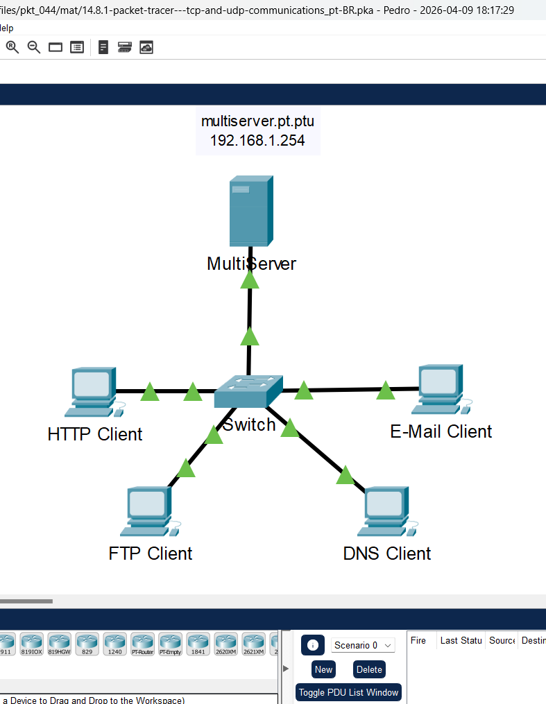
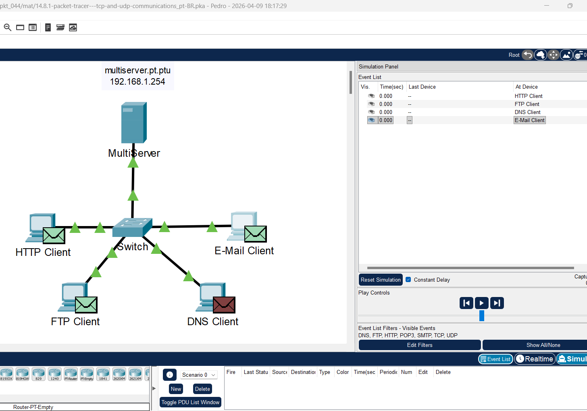
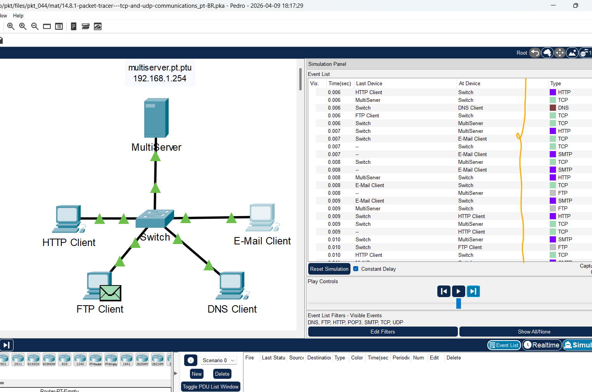
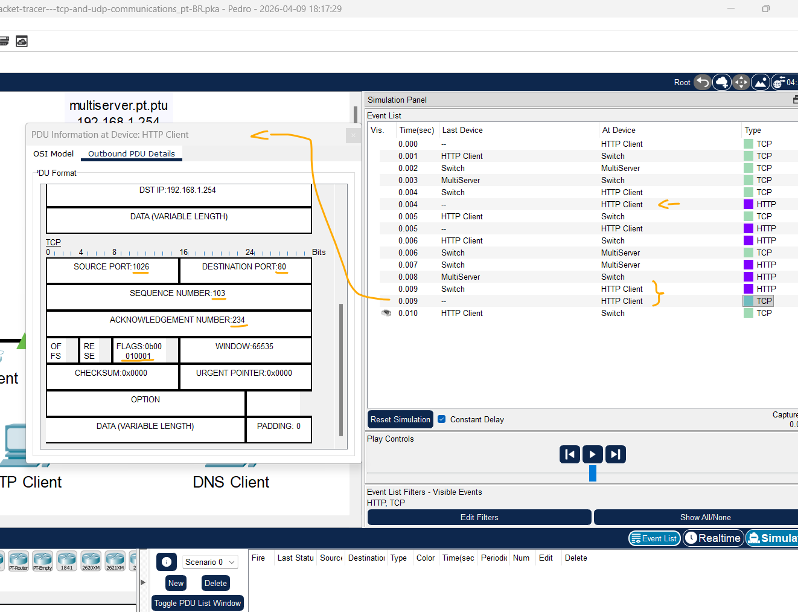
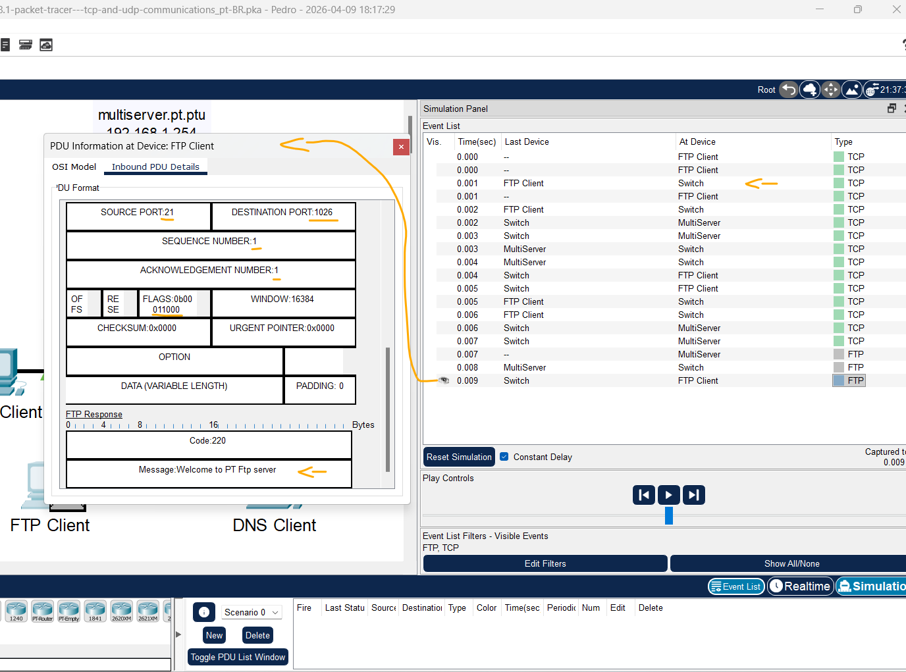
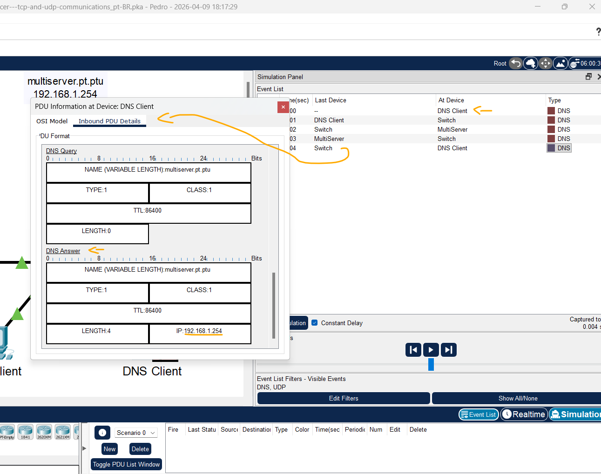
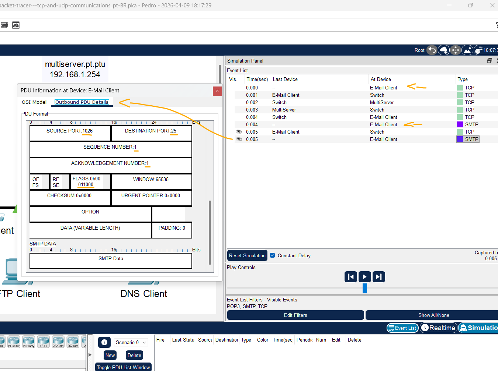

# Packet Tracer: Comunicações TCP e UDP   

### Cisco: <a href="../../../">cisco   </a>
### Cisco Networking Academy: cna   </a>
### Training Category: <a href="../../../pkt/">pkt</a>
### Software/Subject: network   </a>
### Course: <a href="./">pkt_044 (Packet Tracer: Comunicações TCP e UDP)   </a>

---

### Theme:
- Network

### Used Tools:
- Operating System (OS): 
  - Windows 11 
- Cloud Services:
  - Google Drive 
- Language:
  - HTML   
  - Markdown   
- Integrated Development Environment (IDE) and Text Editor:
  - Visual Studio Code (VS Code)   
- Versioning: 
  - Git   
- Repository:
  - GitHub   
- Network:
  - Cisco Packet Tracer   
  - ping   

---

<h3><a name="item00">Course Strcuture:</a></h3>

1. <a href="#item01">Parte 1: Gerar Tráfego de Rede no Modo de Simulação</a> 
  1.1 <a href="#item01.01">Etapa 1: Gerar tráfego para preencher as tabelas do protocolo ARP.</a> 
  1.2 <a href="#item01.02">Etapa 2: Gerar tráfego Web (HTTP).</a> 
  1.3 <a href="#item01.03">Etapa 3: Gerar tráfego FTP.</a> 
  1.4 <a href="#item01.04">Etapa 4: Gerar tráfego DNS.</a> 
  1.5 <a href="#item01.05">Etapa 5: Gerar tráfego de e-mail.</a> 
  1.6 <a href="#item01.06">Etapa 6: Verificar se o tráfego é gerado e está pronto para a simulação.</a> 
  1.7 <a href="#item01.07">Etapa 7: Examine a multiplexação conforme o tráfego atravessa a rede.</a> 
2. <a href="#item02">Parte 2: Examinar a Funcionalidade dos Protocolos TCP e UDP</a> 
  2.1 <a href="#item02.01">Etapa 1: Examinar o tráfego HTTP quando os clientes se comunicam com o servidor.</a> 
  2.2 <a href="#item02.02">Etapa 2: Examinar o tráfego FTP quando os clientes se comunicam com o servidor.</a> 
  2.3 <a href="#item02.03">Etapa 3: Examinar o tráfego DNS quando os clientes se comunicam com o servidor.</a> 
  2.4 <a href="#item02.04">Etapa 4: Examinar o tráfego de e-mail quando os clientes se comunicam com o servidor.</a> 

---

### Objective:
O objetivo desta atividade foi analisar o comportamento dos protocolos da camada de transporte (TCP e UDP) através da geração de tráfego de diferentes serviços (HTTP, FTP, DNS e SMTP). A atividade visou compreender o encapsulamento, o endereçamento de portas e os mecanismos de controle de fluxo e confiabilidade por meio da inspeção de PDUs no modo de simulação.

### Folder Structure:
- [README.md](./README.md): Este documento de README, escrito em **Markdown**, com o conteúdo do laboratório.
- [0-aux](./0-aux/): Pasta auxiliar com imagens utilizadas na construção dos arquivos de README desse curso.

### Development:

<a name="item01"><h4>1. Parte 1: Gerar Tráfego de Rede no Modo de Simulação</h4></a>[Back to summary](#item00)

A imagem 01 mostra a topologia inicial.

<figure>
     
    <figcaption>Imagem 01.</figcaption>
</figure>
 

<a name="item01.01"><h4>1.1 Etapa 1: Gerar tráfego para preencher as tabelas do protocolo ARP.</h4></a>[Back to summary](#item00)

Execute a tarefa a seguir para reduzir a quantidade de tráfego de rede visualizado na simulação.

- a. Clique em MultiServer e clique na guia Desktop> Prompt de Comando.
- b. Digite o comando ping -n 1 192.168.1.255. Você está fazendo ping no endereço de difusão para a LAN cliente. A opção de comando enviará apenas uma solicitação de ping em vez dos quatro habituais. Isso levará alguns segundos, pois todos os dispositivos da rede respondem à solicitação de ping do MultiServer.
  - `ping -n 1 192.168.1.255`.
- c. Feche a janela MultiServer.

<a name="item01.02"><h4>1.2 Etapa 2: Gerar tráfego Web (HTTP).</h4></a>[Back to summary](#item00)

- a. Mude para o modo de Simulação.
- b. Clique em Cliente HTTP e abra o navegador da Web na área de trabalho.
- c. No campo URL, insira 192.168.1.254 e clique em Ir. Envelopes (PDUs) aparecerão na janela de topologia.
  - `192.168.1.254`.
- d. Minimize, mas não feche, a janela de configuração do Cliente HTTP.

<a name="item01.03"><h4>1.3 Etapa 3: Gerar tráfego FTP.</h4></a>[Back to summary](#item00)

- a. Clique em Cliente FTP e abra o prompt de comando na área de trabalho.
- b. Digite o comando ftp 192.168.1.254. As PDUs aparecerão na janela de simulação.
  - `ftp 192.168.1.254`.
- c. Minimize, mas não feche, a janela de configuração do Cliente FTP.

<a name="item01.04"><h4>1.4 Etapa 4: Gerar tráfego DNS.</h4></a>[Back to summary](#item00)

- a. Clique em cliente DNS e abra o prompt de comando.
- b. Insira o comando nslookup multiserver.pt.ptu. Uma PDU aparecerá na janela de simulação.
  - `nslookup multiserver.pt.ptu`.
- c. Minimize, mas não feche, a janela de configuração do cliente DNS.

<a name="item01.05"><h4>1.5 Etapa 5: Gerar tráfego de e-mail.</h4></a>[Back to summary](#item00)

- a. Clique em Cliente de email e abra a ferramenta Email na área de trabalho.
- b. Clique em Escrever e insira as seguintes informações: Para: user@multiserver.pt.ptu; Assunto: personalize a linha de assunto; Corpo do email: personalize o email.
  - `user@multiserver.pt.ptu` -> `Ney na Copa` -> `Caro Ancelotti,   Informo que Neymar precisa ir para a copa do mundo.`.
- c. Clique em Send (Enviar).
- d. Minimize, mas não feche, a janela de configuração do Cliente de E-Mail.

<a name="item01.06"><h4>1.6 Etapa 6: Verificar se o tráfego é gerado e está pronto para a simulação.</h4></a>[Back to summary](#item00)

Agora deve haver entradas de PDU no painel de simulação para cada um dos computadores cliente.

A imagem 02 ilustra as quatro entradas de PDU geradas no painel de simulação após a configuração dos disparos.

<figure>
     
    <figcaption>Imagem 02.</figcaption>
</figure>
 

<a name="item01.07"><h4>1.7 Etapa 7: Examine a multiplexação conforme o tráfego atravessa a rede.</h4></a>[Back to summary](#item00)

Agora você usará o botão Capturar/Avançar no Painel de Simulação para observar os diferentes protocolos que viajam na rede. Nota: O botão Capturar/Avançar ">|" é uma pequena seta apontando para a direita com uma barra vertical ao lado.

- a. Clique em Capturar/Encaminhar uma vez. Todas as PDUs viajam para o comutador.
- b. Clique em Capturar/Encaminhar seis vezes e assista às PDUs dos diferentes hosts à medida que viajam na rede. Observe que apenas uma PDU pode atravessar um fio em cada direção em um dado momento.
- b. Como isso se chama?
  - Essa situação se chama Multiplexação por Divisão de Tempo (ou apenas compartilhamento do meio), onde o switch gerencia o fluxo de dados para que apenas um quadro transite pelo fio por vez, evitando colisões e garantindo a integridade da transmissão em redes modernas.
- b. Uma variedade de PDUs aparece na lista de eventos no Painel de Simulação. Qual é o significado das diferentes cores?
  - As diferentes cores das PDUs representam os diferentes protocolos de rede que estão sendo transmitidos (como TCP, HTTP, FTP, DNS e SMTP), facilitando a identificação visual e a distinção de cada tipo de tráfego enquanto ele atravessa os dispositivos no simulador.

A imagem 03 exibe a conclusão da Parte 1.

<figure>
     
    <figcaption>Imagem 03.</figcaption>
</figure>
 

<a name="item02"><h4>2. Parte 2: Examinar a Funcionalidade dos Protocolos TCP e UDP</h4></a>[Back to summary](#item00)

<a name="item02.01"><h4>2.1 Etapa 1: Examinar o tráfego HTTP quando os clientes se comunicam com o servidor.</h4></a>[Back to summary](#item00)

- a. Clique em Reset Simulation (Reiniciar simulação).
- b. Filtrar o tráfego atualmente exibido apenas para HTTP e TCP PDUs. Para filtrar o tráfego exibido no momento:
- b. Clique em Editar filtros e alterne o botão Mostrar tudo/nenhum.
- b. Selecione HTTP e TCP. Clique no “x” vermelho no canto superior direito da caixa Editar filtros para fechá-lo. Eventos visíveis agora devem exibir apenas PDUs HTTP e TCP.
- c. Abra o navegador no Cliente HTTP e digite 192.168.1.254 no campo URL. Clique em Ir para conectar-se ao servidor por HTTP. Minimize a janela do cliente HTTP.
- d. Clique em Capturar/Encaminhar até ver uma PDU aparecer para HTTP. Observe que a cor do envelope na janela de topologia corresponde ao código de cor da PDU HTTP no Painel de simulação.
- d. Por que demorou tanto para a PDU HTTP aparecer?
  - A demora ocorre porque o protocolo TCP precisa estabelecer uma conexão confiável antes de enviar os dados do HTTP. Esse processo é chamado de Three-Way Handshake (Sincronização de Três Vias), onde PDUs de controle (SYN, SYN-ACK e ACK) são trocadas entre o cliente e o servidor para abrir a sessão, e somente após essa etapa o protocolo HTTP pode iniciar a transferência da página web.
- e. Clique no envelope da PDU para mostrar os detalhes da PDU. Clique na guia Detalhes da PDU de saída e role para baixo até a segunda e a última seção. Qual o rótulo da seção?
  - A segunda seção é rotulada como IP (Internet Protocol) e a última seção é rotulada como HTTP Request.
- e. Essas comunicações são consideradas confiáveis?
  - Sim, pois utilizam o protocolo TCP na camada de transporte, que garante a entrega dos dados por meio de confirmações de recebimento (ACK), controle de fluxo e retransmissão de pacotes caso ocorra alguma perda durante o trajeto.
- e. Registre os valores SRC PORT, DEST PORT, SEQUENCE NUM e ACK NUM.
  - SRC PORT: 1026, DEST PORT: 80, SEQUENCE NUM: 1, ACK NUM: 1.
- f. Observe o valor no campo Sinalizadores, que está localizado ao lado do campo Janela. Os valores à direita do “b” representam os sinalizadores TCP definidos para esta fase da conversa de dados. Cada um dos seis lugares corresponde a uma bandeira. A presença de um “1” em qualquer lugar indica que a bandeira está definida. Mais de um sinalizador pode ser definido de cada vez. Os valores para as bandeiras são mostrados abaixo. 
  - Lugar das Flags (Sinalizadores) TCP: URG: 6; ACK: 5; PSH: 4; RST: 3; SYN: 2; FIN: 1.
- f. Quais sinalizadores TCP são definidos nesta PDU? 
  - As flags definidas são ACK (Acknowledgment) e PSH (Push), indicando que o pacote está confirmando o recebimento de dados anteriores e solicitando que os dados atuais sejam processados imediatamente pela camada de aplicação.
- g. Feche a PDU e clique em Capturar/Encaminhar até que uma PDU com uma marca de seleção retorne ao Cliente HTTP.
- h. Clique no envelope da PDU e selecione Detalhes da PDU de entrada. Que diferença há nos números de porta e de sequência?
  - As portas foram invertidas: a porta de origem passou a ser a 80 (HTTP), indicando que o servidor está respondendo, e a porta de destino tornou-se a 1026, que identifica o processo de origem no cliente. O número de sequência permaneceu em 1, indicando que este é o início da transmissão de dados do servidor.
- i. Clique na PDU HTTP que o cliente HTTP preparou para enviar ao MultiServer. Este é o começo da comunicação HTTP. Clique neste segundo envelope de PDU e selecione Outbound PDU Details (Detalhes da PDU de Saída). Quais informações estão contidas agora na seção TCP? 
  - As portas retornaram à configuração original (Origem 1026 e Destino 80). O número de sequência avançou para 103 e o número de confirmação (ACK Number) mudou para 234, indicando que o cliente recebeu e confirmou com sucesso todos os dados enviados pelo servidor na etapa anterior.
- i. Que diferença há entre os números de porta e de sequência com relação às duas PDUs anteriores?
  - As portas de origem e destino retornaram à ordem original (1026 e 80), após terem sido invertidas na resposta do servidor. O número de sequência avançou para 103 (após o envio da requisição inicial), e o número de confirmação (ACK) subiu para 234, confirmando que o cliente recebeu com sucesso todos os bytes de dados enviados pelo servidor na PDU anterior.
- j. Redefina a simulação.

A imagem 04 mostra a análise do tráfego HTTP.

<figure>
     
    <figcaption>Imagem 04.</figcaption>
</figure>
 

<a name="item02.02"><h4>2.2 Etapa 2: Examinar o tráfego FTP quando os clientes se comunicam com o servidor.</h4></a>[Back to summary](#item00)

- a. Abra o prompt de comando na área de trabalho do cliente FTP. Inicie uma conexão FTP inserindo ftp 192.168.1.254.
  - `ftp 192.168.1.254`.
- b. No Painel de Simulação, altere Editar Filtros para exibir apenas FTP e TCP.
- c. Clique em Capture/Forward (Capturar/Encaminhar). Clique no segundo envelope da PDU para abri-lo. Clique na guia Detalhes da PDU de saída e role para baixo até a seção TCP. Essas comunicações são consideradas confiáveis?
  - Sim, essas comunicações são consideradas confiáveis porque o FTP utiliza o protocolo TCP na camada de transporte, o qual garante a entrega dos dados por meio de números de sequência, confirmações de recebimento (ACK) e retransmissão em caso de perda de pacotes.
- d. Registre os valores SRC PORT, DEST PORT, SEQUENCE NUM e ACK NUM.
  - SRC PORT: 1025, DEST PORT: 21, SEQUENCE NUM: 1, ACK NUM: 53.
- e. Feche a PDU e clique em Capture/Forward (Capturar/Avançar) até que uma PDU retorne ao FTP Client (Cliente FTP) com um sinal.
- f. Clique no envelope da PDU e selecione Detalhes da PDU de entrada. Que diferença há nos números de porta e de sequência?
  - Houve a inversão das portas para o tráfego de retorno: a porta de origem passou a ser a 21 (servidor FTP) e a de destino a 1025 (cliente). O número de sequência avançou para 53, confirmando o envio dos dados que o cliente havia reconhecido anteriormente, enquanto o número de confirmação (ACK) mudou para 2, indicando que o servidor recebeu o primeiro byte de dados enviado pelo cliente.
- g. Clique na guia Outbound PDU Details (Detalhes da PDU de Saída). Como os números de porta e sequência são diferentes dos resultados anteriores?
  - As portas retornaram à configuração inicial da sessão (Origem: 1025, Destino: 21). O número de sequência avançou para 2, refletindo que o cliente está enviando seu próximo segmento de dados, enquanto o número de confirmação (ACK) permaneceu em 53, indicando que o cliente já reconheceu os dados recebidos do servidor e aguarda o próximo segmento a partir dessa posição.
- h. Feche a PDU e clique em Capturar/Encaminhar até que uma segunda PDU retorne ao cliente FTP. A cor da PDU é diferente.
- i. Abra a PDU e selecione Detalhes da PDU de entrada. Role para baixo após a seção TCP. Qual é a mensagem do servidor?
  - A mensagem contida na camada de aplicação é "Welcome to PT FTP Server". Este texto faz parte do banner de boas-vindas enviado pelo servidor logo após o estabelecimento da conexão, indicando que o serviço está pronto para receber comandos do cliente.
- j. Clique em Reset Simulation (Reiniciar simulação).

A imagem 05 mostra a análise do tráfego FTP.

<figure>
     
    <figcaption>Imagem 05.</figcaption>
</figure>
 

<a name="item02.03"><h4>2.3 Etapa 3: Examinar o tráfego DNS quando os clientes se comunicam com o servidor.</h4></a>[Back to summary](#item00)

- a. Repita as etapas na Parte 1 para criar tráfego DNS.
- b. No painel de simulação, altere Edit Filters (Editar Filtros) para exibir apenas o DNS e o UDP.
- c. Clique no envelope de PDU para abri-lo.
- d. Veja os detalhes do modelo OSI para a PDU de saída. O que é o protocolo da Camada 4? 
  - O protocolo da Camada 4 (Transporte) identificado é o UDP (User Datagram Protocol). Ao contrário do TCP, ele é um protocolo "sem conexão", focado na velocidade e baixa latência para serviços que não exigem verificação de entrega.
- d. Essas comunicações são consideradas confiáveis?
  - Não, as comunicações via UDP não são consideradas confiáveis. Diferente do TCP, o UDP não utiliza mecanismos de confirmação de recebimento (ACK), controle de fluxo ou retransmissão de dados perdidos; ele simplesmente envia os pacotes para o destino sem garantir que foram recebidos ou que chegarão na ordem correta.
- e. Abra a guia Detalhes da PDU de saída e localize a seção UDP dos formatos de PDU. Registre os valores SRC PORT e DEST PORT.
  - SRC PORT: 1026 e DEST PORT: 53.
- e. Por que não há números de sequência e reconhecimento? 
  - Não há números de sequência ou de reconhecimento (ACK) porque o UDP é um protocolo sem conexão (connectionless). Ele não rastreia o estado da comunicação nem garante a entrega ou a ordem dos pacotes; seu objetivo é apenas encaminhar os dados da forma mais rápida possível, deixando qualquer controle de erro para ser tratado, se necessário, pela própria aplicação.
- f. Feche a PDU e clique em Capturar/Encaminhar até que uma PDU com uma marca de seleção retorne ao cliente DNS.
- g. Clique no envelope da PDU e selecione Detalhes da PDU de entrada. Que diferença há nos números de porta e de sequência?
  - As portas foram invertidas (Origem: 53, Destino: 1026). Como o protocolo utilizado é o UDP, não existem campos de número de sequência ou de confirmação.
- g. Como é chamada a última seção da PDU?
  - A seção final é rotulada como DNS Answer, contendo a resolução do nome de domínio solicitado pelo cliente.
- g.  Qual é o endereço IP do nome multiserver.pt.ptu?
  - O endereço IP resolvido é 192.168.1.254. Esta informação é extraída da seção DNS Answer (ou Resposta DNS), onde o servidor mapeia o nome de domínio ao seu respectivo endereço IP.
- h. Clique em Reset Simulation (Reiniciar simulação).

A imagem 06 exibe a análise do tráfego DNS.

<figure>
     
    <figcaption>Imagem 06.</figcaption>
</figure>
 

<a name="item02.04"><h4>2.4 Etapa 4: Examinar o tráfego de e-mail quando os clientes se comunicam com o servidor.</h4></a>[Back to summary](#item00)

- a. Repita as etapas na Parte 1 para enviar um email para user@multiserver.pt.ptu.
- b. No painel de simulação, altere Edit Filters (Editar Filtros) para exibir apenas POP3, SMTP e o TCP.
- c. Clique no primeiro envelope da PDU para abri-lo.
- d. Clique na guia Detalhes da PDU de Saída e role para baixo até a última seção. Qual protocolo de camada de transporte o tráfego de e-mail utiliza?
  - O tráfego de e-mail utiliza o protocolo TCP. Isso ocorre porque serviços de e-mail (como SMTP, POP3 ou IMAP) exigem que as mensagens cheguem completas e sem erros, o que demanda o controle de fluxo oferecido por este protocolo.
- d. Essas comunicações são consideradas confiáveis?
  - Sim, são consideradas confiáveis. Por utilizar o TCP na Camada 4, a comunicação conta com o estabelecimento de conexão, numeração de pacotes e confirmações de recebimento (ACK), garantindo que nenhum fragmento do e-mail seja perdido durante a transmissão.
- e. Registre os valores SRC PORT, DEST PORT, SEQUENCE NUM e ACK NUM. Qual é o valor do campo de sinalização?
  - SRC PORT: 1026, DEST PORT: 25, SEQUENCE NUM: 0, ACK NUM: 0.
- f. Feche a PDU e clique em Capturar/Encaminhar até que uma PDU retorne ao Client de E-Mail com uma marca de seleção.
- g. Clique no envelope da PDU TCP e selecione Detalhes da PDU de Entrada. Que diferença há nos números de porta e de sequência?
  - Nesta PDU de entrada, as portas permanecem conforme o envio do servidor (Origem 25, Destino 1026). O número de sequência permanece em 0, enquanto o número de confirmação (ACK) avançou para 1, confirmando que o servidor recebeu a solicitação inicial do cliente.
- h. Clique na guia Outbound PDU Details (Detalhes da PDU de Saída). Que diferença há entre os números de porta e de sequência e os dois resultados anteriores?
  - Houve a inversão das portas em relação à PDU de saída, com a origem passando a ser a 25 (porta padrão do servidor SMTP) e o destino a 1026. O número de sequência e o de confirmação (ACK) foram ambos definidos como 1, marcando o início da sincronização de dados após o estabelecimento da conexão.
- i. Há uma segunda PDU de uma cor diferente que o Cliente de E-Mail preparou para enviar ao MultiServer. Este é o começo da comunicação de e-mail. Clique neste segundo envelope de PDU e selecione Outbound PDU Details (Detalhes da PDU de Saída). Que diferença há entre os números de porta e de sequência em relação às duas PDUs anteriores?
  - As portas retornaram à configuração original de origem (1026) e destino (25). Os números de sequência e de confirmação (ACK) permanecem em 1, indicando que o "handshake" TCP foi concluído com sucesso e que esta nova PDU (geralmente de cor diferente por ser do protocolo SMTP) está iniciando a transferência efetiva dos dados de e-mail na camada de aplicação.
- i. Que protocolo de e-mail está associado à porta 25 do TCP?
  - O protocolo associado à porta 25 do TCP é o SMTP (Simple Mail Transfer Protocol), utilizado para o envio e transferência de e-mails entre servidores.
- i. Que protocolo de e-mail está associado à porta 110 do TCP?
  - O protocolo associado à porta 110 do TCP é o POP3 (Post Office Protocol version 3), utilizado pelos clientes de e-mail para baixar mensagens de um servidor remoto.

A imagem 07 exibe a análise do tráfego e-mail (SMTP).

<figure>
     
    <figcaption>Imagem 07.</figcaption>
</figure>
 