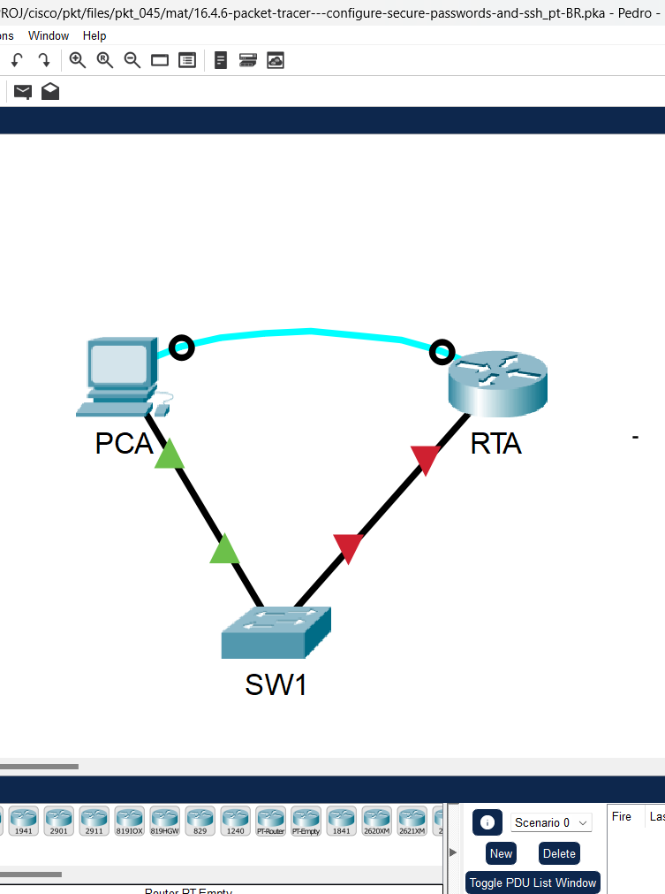
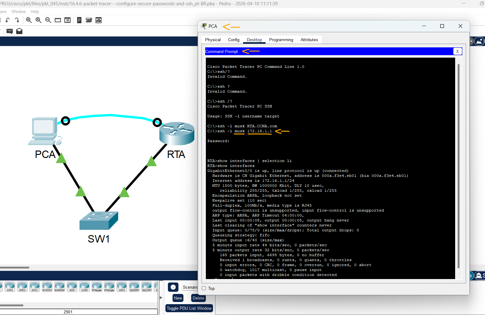
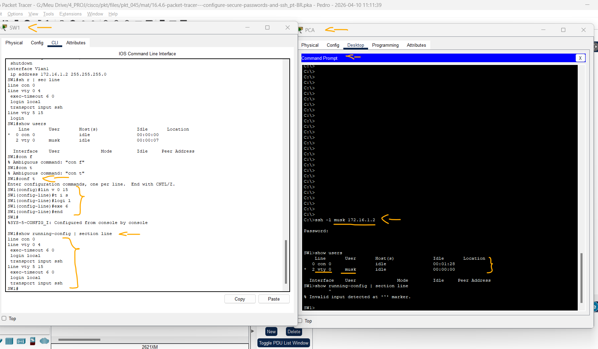

# Packet Tracer - Configurar Senhas Seguras e SSH   

### Cisco: <a href="../../../">cisco   </a>
### Cisco Networking Academy: cna   </a>
### Training Category: <a href="../../../pkt/">pkt</a>
### Software/Subject: network   </a>
### Course: <a href="./">pkt_045 (Packet Tracer - Configurar Senhas Seguras e SSH)   </a>

---

### Theme:
- Network

### Used Tools:
- Operating System (OS): 
  - Cisco Internetwork Operating System (Cisco IOS)   
  - Windows 11 
- Cloud Services:
  - Google Drive 
- Language:
  - HTML   
  - Markdown   
- Integrated Development Environment (IDE) and Text Editor:
  - Visual Studio Code (VS Code)   
- Versioning: 
  - Git   
- Repository:
  - GitHub   
- Network:
  - Cisco Packet Tracer 
  - OpenSSH   
  
---

<h3><a name="item00">Course Strcuture:</a></h3>

1. <a href="#item01">Packet Tracer - Configurar Senhas Seguras e SSH</a> 
  1.1 <a href="#item01.01">Etapa 1: Implementar as Medidas Básicas de Segurança no Roteador</a> 
  1.2 <a href="#item01.02">Etapa 2: Implementar as Medidas Básicas de Segurança no Switch</a> 

---

### Objective:
O objetivo desta atividade foi configurar os parâmetros de segurança e o acesso via SSH em roteadores e switches, realizando posteriormente os testes de acesso remoto para validar a integridade da gerência desses dispositivos.

### Folder Structure:
- [README.md](./README.md): Este documento de README, escrito em **Markdown**, com o conteúdo do laboratório.
- [0-aux](./0-aux/): Pasta auxiliar com imagens utilizadas na construção dos arquivos de README desse curso.

### Development:

<a name="item01"><h4>1. Packet Tracer - Configurar Senhas Seguras e SSH</h4></a>[Back to summary](#item00)

A imagem 01 mostra a topologia inicial.

<figure>
     
    <figcaption>Imagem 01.</figcaption>
</figure>
 

<a name="item01.01"><h4>1.1 Etapa 1: Implementar as Medidas Básicas de Segurança no Roteador</h4></a>[Back to summary](#item00)

- a. Configurar o endereçamento IP em PCA de acordo com a Tabela de Endereçamento.
  - `172.16.1.10` -> `255.255.255.0` -> `172.16.1.1`.
- b. Acesse o console de RTA com o terminal em PC-A.
- c. Configure o nome do host como RTA.
  - `enable` -> `configure terminal` -> `hostname RTA`.
- d. Configure o endereçamento IP em RTA e ative a interface.
  - `interface g0/0` -> `ip address 172.16.1.1 255.255.255.0` -> `no shutdown` -> `exit`.
- e. Criptografe todas as senhas em texto simples.
  - `service password-encryption`.
- f. Configure o comprimento mínimo para senhas para 10:
  - `security passwords min-length 10`.
- g. Configure uma senha secreta forte de sua escolha. Observação: escolha uma senha que você se lembre ou você precisará redefinir a atividade se estiver bloqueado no dispositivo.
  - `enable secret RTA@123456`.
- h. Desative a pesquisa de DNS.
  - `no ip domain-lookup`.
- i. Configure o nome de domínio como CCNA.com (diferencie maiúsculas e minúsculas para pontuar no PT). 
  - `ip domain-name CCNA.com`.
- j. Crie um usuário da escolha com uma senha forte.
  - `username musk secret tesla12345`.
- k. Gere chaves RSA de 1024 bits. Observação: no Packet Tracer, insira o comando crypto key generate rsa, e pressione Enter para continuar.
  - `crypto key generate rsa` -> `RTA.CCNA.com` -> `1024`.
- l. Bloqueie durante três minutos qualquer pessoa que não conseguiu fazer log in depois de quatro tentativas em um período de dois minutos.
  - `login block-for 180 attempts 4 within 120`.
- m. Configure as linhas VTY para o acesso por SSH e use os perfis locais de usuário local para autenticação.
  - `line vty 0 4 ` -> `transport input ssh` -> `login local`.
- n. Defina o tempo limite do modo EXEC para 6 minutos nas linhas VTY.
  - `exec-timeout 6` -> `end`.
- o. Salve a configuração na NVRAM.
  - `copy running-config startup-config`.
- p. Acesse o prompt de comando na área de trabalho do PCA para estabelecer uma conexão SSH com o RTA.
  - `ssh /?` -> `ssh -l musk 172.16.1.1`.

A imagem 02 comprova o acesso remoto via SSH realizado com sucesso na linha vty através das credenciais do usuário criado.

<figure>
     
    <figcaption>Imagem 02.</figcaption>
</figure>
 

<a name="item01.02"><h4>1.2 Etapa 2: Implementar as Medidas Básicas de Segurança no Switch</h4></a>[Back to summary](#item00)

Configure o switch SW1 com as medidas de segurança correspondentes. Consulte as etapas de configuração no roteador se precisar de assistência adicional.

- a. Clique em SW1 e selecione a guia CLI.
- b. Configure o nome de host como SW1.
  - `enable` -> `configure terminal` -> `hostname SW1`.
- c. Configure o endereçamento IP em SW1 VLAN1 e ative a interface.
  - `interface vlan1` -> `ip address 172.16.1.2 255.255.255.0` -> `no shutdown` -> `exit`.
- d. Configure o endereço de gateway padrão.
  - `ip default-gateway 172.16.1.1`.
- e. Desative todas as portas não utilizadas. Observação: Em um switch, é uma boa prática de segurança desabilitar portas não utilizadas. Um método para fazer isso é simplesmente desligar cada porta com o comando 'shutdown'. Isso exigiria acessar cada porta individualmente. Existe um método de atalho para fazer modificações em várias 
portas ao mesmo tempo usando o comando interface range. No SW1, todas as portas, exceto FastEtherNet0/1 e GigabiteTherNet0/1, podem ser desativadas com o seguinte comando:
  - `interface range f0/2-24, g0/2` -> `shutdown` -> `exit`.
- e. O comando usou o intervalo de portas de 2-24 para as portas FastEthernet e, em seguida, um único intervalo de porta de GigabiteTherNet0/2.
- f. Criptografe todas as senhas em texto simples.
  - `service password-encryption`.
- g. Configure uma senha secreta forte de sua escolha.
  - `enable secret cisco`.
- h. Desative a pesquisa de DNS.
  - `no ip domain-lookup`.
- i. Configure o nome de domínio como CCNA.com (diferencie maiúsculas e minúsculas para pontuar no PT).
  - `ip domain-name CCNA.com`.
- j. Crie um usuário da escolha com uma senha forte.
  - `username musk secret tesla`.
- k. Gere chaves RSA de 1024 bits.
  - `crypto key generate rsa` -> `SW1.CCNA.com` -> `1024`.
- l. Configure as linhas VTY para o acesso por SSH e use os perfis locais de usuário local para autenticação.
  - `line vty 0 15 ` -> `transport input ssh` -> `login local`.
- m. Defina o tempo limite do modo EXEC para 6 minutos em todas as linhas VTY.
  - `exec-timeout 6` -> `end`.
- n. Salve a configuração na NVRAM.
  - `copy running-config startup-config`.

A imagem 03 detalha as configurações do switch e o acesso remoto bem-sucedido via VTY, utilizando as credenciais de usuário previamente estabelecidas.

<figure>
     
    <figcaption>Imagem 03.</figcaption>
</figure>
 