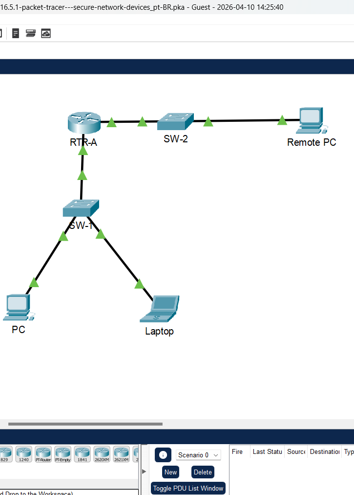
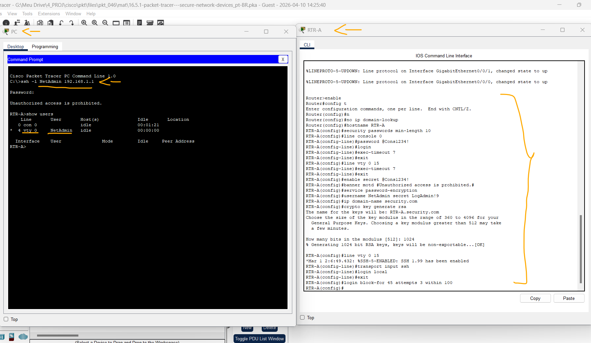
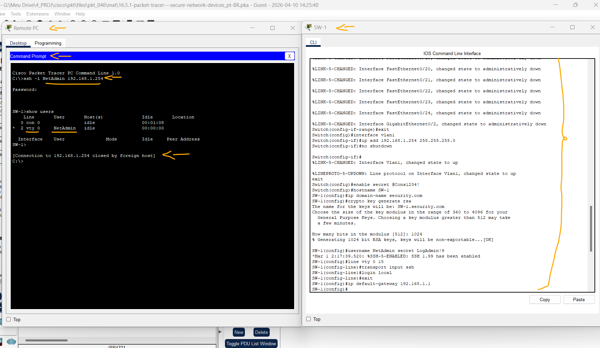

# Packet Tracer - Dispositivos de Rede Segura   

### Cisco: <a href="../../../">cisco   </a>
### Cisco Networking Academy: cna   </a>
### Training Category: <a href="../../../pkt/">pkt</a>
### Software/Subject: network   </a>
### Course: <a href="./">pkt_046 (Packet Tracer - Dispositivos de Rede Segura)   </a>

---

### Theme:
- Network

### Used Tools:
- Operating System (OS): 
  - Cisco Internetwork Operating System (Cisco IOS)   
  - Windows 11 
- Cloud Services:
  - Google Drive 
- Language:
  - HTML   
  - Markdown   
- Integrated Development Environment (IDE) and Text Editor:
  - Visual Studio Code (VS Code)   
- Versioning: 
  - Git   
- Repository:
  - GitHub   
- Network:
  - Cisco Packet Tracer 
  - OpenSSH   
  
---

<h3><a name="item00">Course Strcuture:</a></h3>

1. <a href="#item01">Packet Tracer - Dispositivos de Rede Segura</a> 
  1.1 <a href="#item01.01">Etapa 1: Documentar a rede</a> 
  1.2 <a href="#item01.02">Etapa 2: Requisitos de configuração do roteador</a> 
  1.3 <a href="#item01.03">Etapa 3: Requisitos de configuração do switch</a> 

---

### Objective:
O objetivo desta atividade foi configurar os parâmetros de segurança e o acesso via SSH em roteadores e switches, realizando posteriormente os testes de acesso remoto para validar a integridade da gerência desses dispositivos.

### Folder Structure:
- [README.md](./README.md): Este documento de README, escrito em **Markdown**, com o conteúdo do laboratório.
- [0-aux](./0-aux/): Pasta auxiliar com imagens utilizadas na construção dos arquivos de README desse curso.

### Development:

<a name="item01"><h4>1. Packet Tracer - Dispositivos de Rede Segura</h4></a>[Back to summary](#item00)

A imagem 01 mostra a topologia inicial.

<figure>
     
    <figcaption>Imagem 01.</figcaption>
</figure>
 

<a name="item01.01"><h4>1.1 Etapa 1: Documentar a rede</h4></a>[Back to summary](#item00)

- a. Preencha a tabela de endereçamento com as informações ausentes.

#### Tabela 1 — Planejamento de Endereçamento IPv4

| Dispositivo | Interface | Endereço IP | Máscara de Sub-Rede | Gateway Padrão |
|:---:|:---:|:---:|:---:|:---:|
| RTR | G0/0 | 192.168.1.1 | 255.255.255.0 | N/A |
| RTR | G0/1 | 192.168.2.1 | 255.255.255.0 | N/A |
| SW-1 | SVI | 192.168.1.254 | 255.255.255.0 | 192.168.1.1 |
| PC | NIC | 192.168.1.2 | 255.255.255.0 | 192.168.1.1 |
| Laptop | NIC | 192.168.1.10 | 255.255.255.0 | 192.168.1.1 |
| Remote PC | NIC | 192.168.2.10 | 255.255.255.0 | 192.168.2.1 |

<a name="item01.02"><h4>1.2 Etapa 2: Requisitos de configuração do roteador</h4></a>[Back to summary](#item00)

- a. Impedir que o IOS tente resolver comandos digitados incorretamente para nomes de domínio. 
  - `enable` -> `configure terminal` -> `no ip domain-lookup`.
- b. Nomes de host que correspondem aos valores na tabela de endereçamento.
  - `hostname RTR-A`.
- c. Exigir que as senhas recém-criadas tenham pelo menos 10 caracteres de comprimento.
  - `security passwords min-length 10`.
- d. Uma senha forte de dez caracteres para a linha do console. Use @Cons1234!
  - `line console 0` -> `password @Cons1234!` -> `login`.
- e. Certifique-se de que as sessões do console e do VTY sejam fechadas após 7 minutos exatamente.
  - `exec-timeout 7` -> `exit` -> `line vty 0 15` -> `exec-timeout 7` -> `exit`.
- f. Uma senha forte e criptografada de dez caracteres para o modo EXEC privilegiado. Para esta atividade, é permitido usar a mesma senha que a linha do console.
  - `enable secret @Cons1234!`.
- g. Um banner MOTD que avisa sobre acesso não autorizado aos dispositivos.
  - `banner motd #Unauthorized access is prohibited.#`.
- h. Criptografia de senha para todas as senhas.
  - `service password-encryption`.
- i. Um nome de usuário de NetAdmin com senha criptografada LogAdmin!9.
  - `username NetAdmin secret LogAdmin!9`.
- j. Ative o SSH. Use security.com como nome de domínio.
  - `ip domain-name security.com`.
- j. Use um módulo de 1024.
  - `crypto key generate rsa` -> `1024`.
- k. As linhas VTY devem usar SSH para conexões de entrada. 
  - `line vty 0 15` -> `transport input ssh`.
- l. As linhas VTY devem usar o nome de usuário e a senha que foram configurados para autenticar logins.
  - `login local` -> `exit`.
- m. Impede tentativas de login de força bruta usando um comando que bloqueia tentativas de login por 45 segundos se alguém falhar três tentativas dentro de 100 segundos. 
  - `login block-for 45 attempts 3 within 100`.
- n. Acesso SSH.
  - `ssh -l NetAdmin 192.168.1.1` -> `LogAdmin!9`.

A imagem 02 apresenta as configurações de segurança aplicadas ao roteador e a validação da conectividade remota via SSH, demonstrando o acesso bem-sucedido a uma linha VTY através do PC.

<figure>
     
    <figcaption>Imagem 02.</figcaption>
</figure>
 

<a name="item01.03"><h4>1.3 Etapa 3: Requisitos de configuração do switch</h4></a>[Back to summary](#item00)

- a. Todas as portas de switch não utilizadas estão desativadas administrativamente.
  - `enable` -> `configure terminal` -> `interface range f0/1, f0/3-9, f0/11-24, g0/2` -> `shutdown` -> `exit`.
- b. A interface de gerenciamento padrão SW-1 deve aceitar conexões pela rede. Use as informações mostradas na tabela de endereçamento. O switch deve estar acessível a partir de redes remotas.
  - `interface vlan1` -> `ip address 192.168.1.254 255.255.255.0` -> `no shutdown` -> `exit`.
- c. Use @Cons1234! como a senha para o modo EXEC privilegiado.
  - `enable secret @Cons1234!`.
- d. Configure o SSH como foi feito para o roteador.
  - `hostname SW-1`.
  - `ip domain-name security.com`.
  - `crypto key generate rsa` -> `1024`.
- e. Crie um nome de usuário de NetAdmin com senha secreta criptografada LogAdmin!9.
  - `username NetAdmin secret LogAdmin!9`.
- f. As linhas VTY só devem aceitar conexões via SSH.
  - `line vty 0 15` -> `transport input ssh`.
- g. As linhas VTY só devem permitir que a conta de administrador de rede acesse a interface de gerenciamento de switch.
  - `login local` -> `exit`.
- h. Os hosts em ambas as LANs devem ser capazes de efetuar ping na interface de gerenciamento do switch.
  - `ip default-gateway 192.168.1.1`.
- n. Acesso SSH.
  - `ssh -l NetAdmin 192.168.1.254` -> `LogAdmin!9`.

A imagem 03 mostra as configurações realizadas no switch e o acesso remoto a linha vty via SSH pelo Remote PC.

<figure>
     
    <figcaption>Imagem 03.</figcaption>
</figure>
 