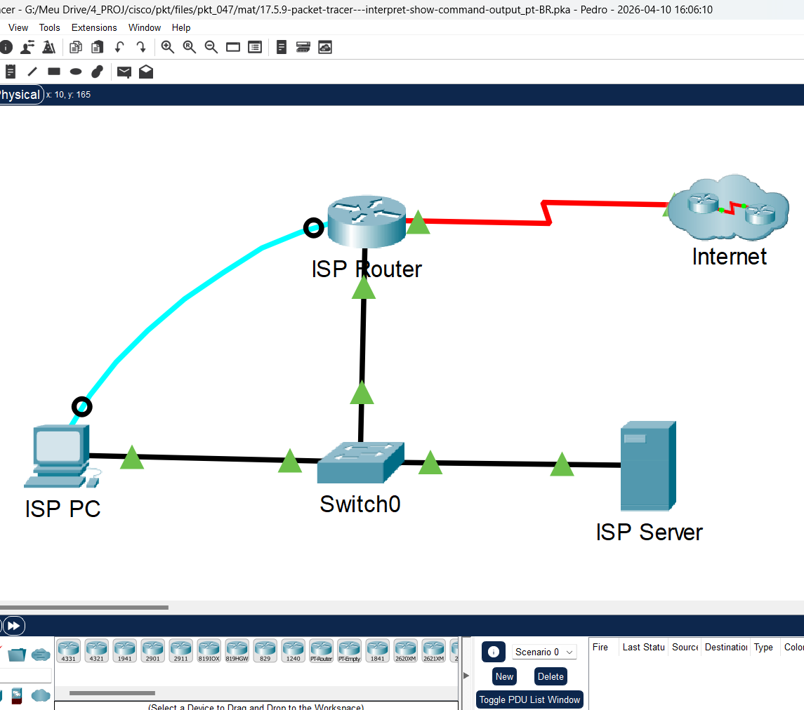
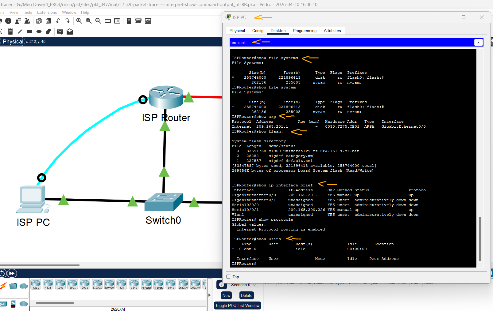

# Packet Tracer - Interpretar a saída do comando show   

### Cisco: <a href="../../../">cisco   </a>
### Cisco Networking Academy: cna   </a>
### Training Category: <a href="../../../pkt/">pkt</a>
### Software/Subject: network   </a>
### Course: <a href="./">pkt_047 (Packet Tracer - Interpretar a saída do comando show)   </a>

---

### Theme:
- Network

### Used Tools:
- Operating System (OS): 
  - Cisco Internetwork Operating System (Cisco IOS)   
  - Windows 11 
- Cloud Services:
  - Google Drive 
- Language:
  - HTML   
  - Markdown   
- Integrated Development Environment (IDE) and Text Editor:
  - Visual Studio Code (VS Code)   
- Versioning: 
  - Git   
- Repository:
  - GitHub   
- Network:
  - Cisco Packet Tracer 

---

<h3><a name="item00">Course Strcuture:</a></h3>

1. <a href="#item01">Parte 1: analisar as saídas de dados do comando show</a> 
2. <a href="#item02">Parte 2: Perguntas para reflexão</a> 

---

### Objective:
O objetivo desta atividade foi analisar as saídas de diferentes variações do comando show no **Cisco IOS**, visando identificar as informações específicas fornecidas por cada comando para o monitoramento e gerenciamento de dispositivos de rede.

### Folder Structure:
- [README.md](./README.md): Este documento de README, escrito em **Markdown**, com o conteúdo do laboratório.
- [0-aux](./0-aux/): Pasta auxiliar com imagens utilizadas na construção dos arquivos de README desse curso.

### Development:

<a name="item01"><h4>1. Parte 1: analisar as saídas de dados do comando show</h4></a>[Back to summary](#item00)

A imagem 01 mostra a topologia inicial.

<figure>
     
    <figcaption>Imagem 01.</figcaption>
</figure>
 

- a. Para conectar-se ao ISPRouter, clique em ISP PC, em seguida na guia Desktop, seguido por Terminal.
- b. Entre no modo EXEC privilegiado.
  - `enable`.
- c. Use os seguintes comandos show para responder às perguntas de reflexão na parte 2. Observação: Se um comando pausar com o prompt -—more—, certifique-se de que aperta a barra de espaços até que o  prompt IsProuter# apareça para obter toda a saída do comando. 
  - `show arp` -> `show flash:` -> `show ip route` -> `show interface` -> `show ip interface brief` -> `show protocols` -> `show users` -> `show version`.

<a name="item02"><h4>2. Parte 2: Perguntas para reflexão</h4></a>[Back to summary](#item00)

- a. Quais comandos você pode usar para determinar o endereço IP e o prefixo de rede das interfaces?
  - Resumidos: `show ip interface brief` e `show protocols`. Completos: `show ip interface`, `show interfaces` e `show running-config`.
- b. Qual comando fornece o endereço IP e a atribuição da interface, mas não o prefixo da rede?
  - `show ip interface brief`.
- c. Quais comandos você usaria para determinar se uma interface está ativa?
  - Resumidos: `show ip interface brief` e `show protocols`. Completos: `show ip interface`, `show interfaces` e `show running-config`.
- d. Você precisa determinar a versão do IOS que está sendo executada em um roteador. Que comando lhe dará essa informação?
  - `show version`.
- e. Quais comandos mostram informações sobre os endereços de interface do roteador?
  - Resumidos: `show ip interface brief` e `show protocols`. Completos: `show ip interface`, `show interfaces` e `show running-config`.
- f. Você está considerando uma atualização do IOS e precisa determinar se o flash do roteador pode conter o novo IOS. Quais comandos fornecem informações sobre a quantidade de memória Flash disponível?
  - `show flash:`, `dir flash:` e `show file systems`.
- g. Você precisa ajustar uma configuração do roteador, mas suspeita que um colega também esteja trabalhando no roteador de outro local. Qual comando fornece informações sobre as linhas que estão sendo usadas para configuração ou monitoramento de dispositivo?
  - `show users`.
- h. Você foi solicitado a verificar o desempenho de uma interface de dispositivo. Qual comando fornece estatísticas de tráfego para interfaces de roteador?
  - `show ip interface` e `show interfaces`.
- i. Os clientes reclamam que não conseguem alcançar um servidor que usam para armazenamento de arquivos. Você suspeita que a rede pode ter se tornado inacessível devido a uma atualização recente. Qual comando fornece informações sobre os caminhos disponíveis para o tráfego de rede?
  - `show ip route`.
- j. Quais interfaces estão atualmente ativas no roteador ISP?
  - Resumidos: `show ip interface brief` e `show protocols`. Completos: `show ip interface` e `show interfaces`.

A imagem 02 exibe alguns comandos usados.

<figure>
     
    <figcaption>Imagem 02.</figcaption>
</figure>
 