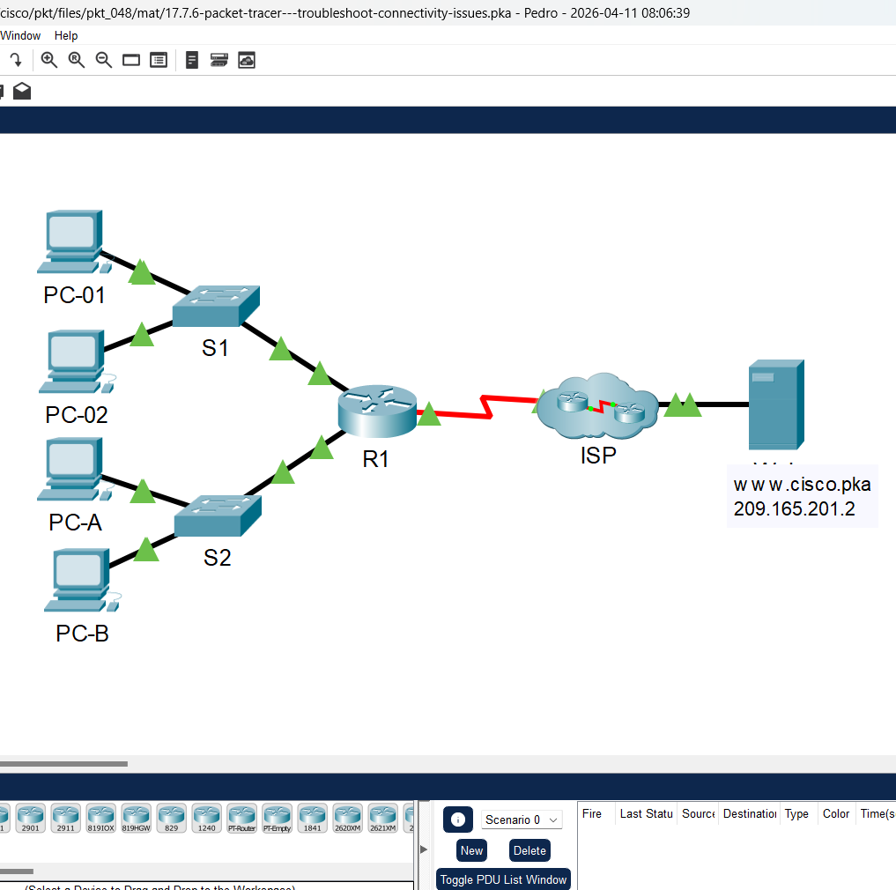
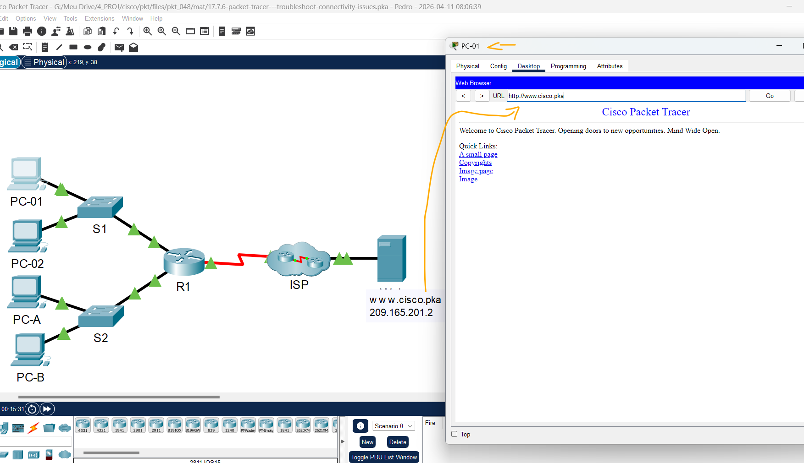
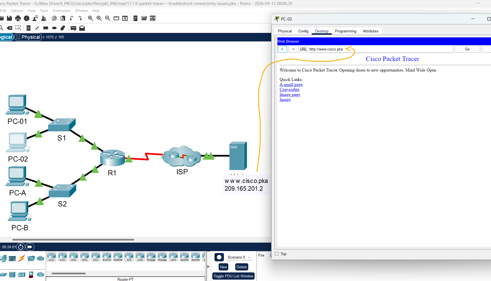
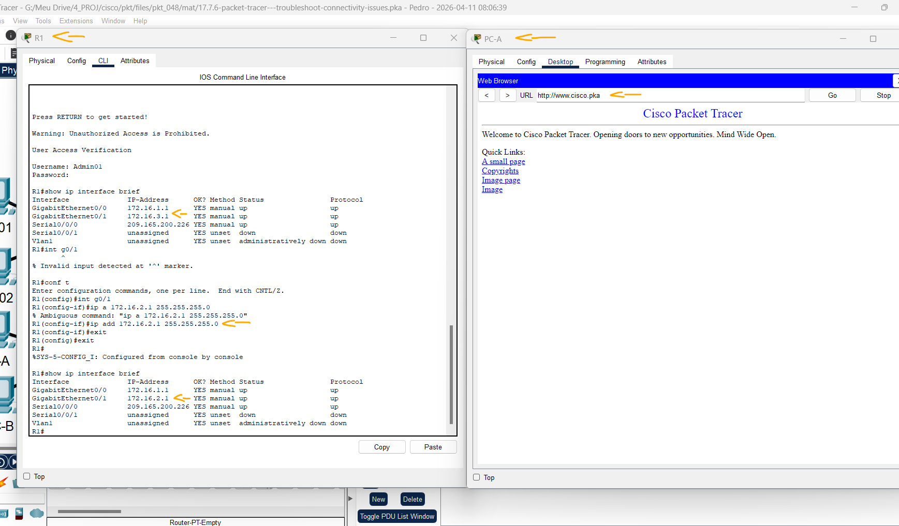
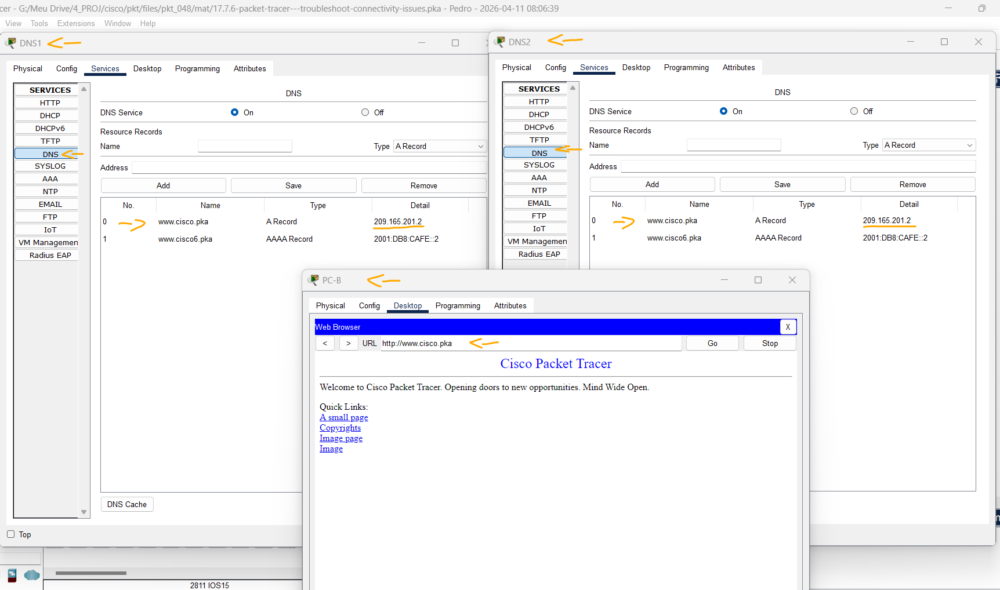
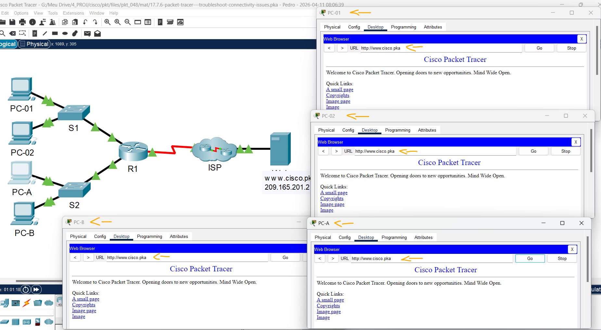

# Packet Tracer - Solucionar problemas de conectividade   

### Cisco: <a href="../../../">cisco   </a>
### Cisco Networking Academy: cna   </a>
### Training Category: <a href="../../../pkt/">pkt</a>
### Software/Subject: network   </a>
### Course: <a href="./">pkt_048 (Packet Tracer - Solucionar problemas de conectividade)   </a>

---

### Theme:
- Network

### Used Tools:
- Operating System (OS): 
  - Cisco Internetwork Operating System (Cisco IOS)   
  - Windows 11 
- Cloud Services:
  - Google Drive 
- Language:
  - HTML   
  - Markdown   
- Integrated Development Environment (IDE) and Text Editor:
  - Visual Studio Code (VS Code)   
- Versioning: 
  - Git   
- Repository:
  - GitHub   
- Network:
  - Cisco Packet Tracer 
  - ipconfig   
  - ping   
  
---

<h3><a name="item00">Course Strcuture:</a></h3>

1. <a href="#item01">Packet Tracer - Solucionar problemas de conectividade</a> 
  1.1 <a href="#item01.01">Etapa 1: Determine problemas de conectividade do PC-01.</a> 
  1.2 <a href="#item01.02">Etapa 2: Determine problemas de conectividade do PC-02.</a> 
  1.3 <a href="#item01.03">Etapa 3: Determine problemas de conectividade do PC-0A.</a> 
  1.4 <a href="#item01.04">Etapa 4: Determine problemas de conectividade do PC-B.</a> 
  1.5 <a href="#item01.05">Etapa 5: Verifique a conectividade.</a> 

---

### Objective:
O objetivo desta atividade foi realizar troubleshooting de conectividade de rede, garantindo que todos os hosts conseguissem acessar o servidor Web na Internet. Para isso, foram identificados e corrigidos diferentes problemas em cada host, incluindo configurações de endereço IP, gateway padrão, interface do roteador e servidor DNS.

### Folder Structure:
- [README.md](./README.md): Este documento de README, escrito em **Markdown**, com o conteúdo do laboratório.
- [0-aux](./0-aux/): Pasta auxiliar com imagens utilizadas na construção dos arquivos de README desse curso.

### Development:

<a name="item01"><h4>1. Packet Tracer - Solucionar problemas de conectividade</h4></a>[Back to summary](#item00)

A imagem 01 mostra a topologia inicial.

<figure>
     
    <figcaption>Imagem 01.</figcaption>
</figure>
 

<a name="item01.01"><h4>1.1 Etapa 1: Determine problemas de conectividade do PC-01.</h4></a>[Back to summary](#item00)

- a. Em PC-01, abra o prompt de comando. Insira o comando ipconfig para verificar que endereço IP e gateway padrão foi atribuído para PC-01. Corrigir conforme necessário de acordo com a Tabela de Endereçamento.
  - `ipconfig`.
  - Foi necessário corrigir o IP de 172.168.1.3 para 172.16.1.3, adequando-o à sub-rede correspondente.
- b. Depois de verificar / corrigir os problemas de endereçamento IP no PC-01, emita pings para o gateway padrão, servidor da web e outros PCs. Faça um ping no gateway padrão (172.16.1.1).
  - `ping 172.16.1.1`.
- b. Ao servidor da Web (209.165.201.2).
  - `ping 209.165.201.2`.
- b. Ping para PC-02?
  - `ping 172.16.1.4`.
- b. Para PC-A?
  - `ping 172.16.2.3`.
- b. Para o PC-B.
  - `ping 172.16.2.4`.
- b. Os pings foram bem-sucedidos? Anotar os resultados.
  - Parcialmente. Após a correção do endereçamento IP do PC-01, foi possível alcançar o PC-02, o roteador R1 e o servidor Web. Contudo, não houve comunicação com os PCs A e B, indicando provável problema de configuração na sub-rede correspondente ou nos próprios hosts.
- c. Use o navegador da Web para acessar o servidor da Web no PC-01. Acesse o servidor web inserindo primeiro o URL http://www.cisco.pka e, em seguida, usando o endereço IP 209.165.201.2. Anotar os resultados.
  - `www.cisco.pka`.
- c. O PC-01 consegue acessar www.cisco.pka?
  - Sim, após a correção do endereçamento IP, foi possível acessar o servidor.
- c. Usando o endereço IP do servidor da Web.
  - `209.165.201.2`.
  - Da mesma forma que com o DNS, foi possível acessar o servidor.
- d. Documente os problemas e forneça soluções. Corrija os problemas, se possível.
  - O único problema identificado foi o endereçamento IP incorreto do PC-01, que foi devidamente corrigido.

A imagem 02 demonstra que o servidor foi acessado por meio do nome de domínio, evidenciando que a comunicação do PC-01 com os servidores Web e DNS estava correta.

<figure>
     
    <figcaption>Imagem 02.</figcaption>
</figure>
 

<a name="item01.02"><h4>1.2 Etapa 2: Determine problemas de conectividade do PC-02.</h4></a>[Back to summary](#item00)

- a. Em PC-02, abra o prompt de comando. Insira o comando ipconfig para verificar a configuração para o endereço IP e gateway padrão. Corrija, se for necessário. 
  - `ipconfig`.
  - Diferente do PC-01, o problema estava no gateway padrão, configurado como 172.16.1.11, sendo corrigido para 172.16.1.1.
- b. Após verificar / corrigir os problemas de endereçamento IP no PC-02, emita pings para o gateway padrão, servidor da web e outros PCs. Faça um ping no gateway padrão (172.16.1.1).
  - `ping 172.16.1.1`.
- b. Ao servidor da Web (209.165.201.2).
  - `ping 209.165.201.2`.
- b. Ping para PC-01?
  - `ping 172.16.1.3`.
- b. Para PC-A?
  - `ping 172.16.2.3`.
- b. Para o PC-B.
  - `ping 172.16.2.4`.
- b. Os pings foram bem-sucedidos? Anotar os resultados.
  - Resultado semelhante ao do PC-01: apenas os pings para os PCs A e B não foram bem-sucedidos. Isso indica possível problema de configuração na sub-rede correspondente ou nos próprios hosts.
- c. Acesse www.cisco.pka utilizando o navegador da Web em PC-02. Anotar os resultados.
  - `www.cisco.pka`.
- c. Usando o endereço IP do servidor da Web?
  - `209.165.201.2`.
- c. O PC-02 consegue acessar www.cisco.pka?
  - Sim, o acesso ao servidor ocorreu normalmente, tanto por nome de domínio quanto por endereço IP.
- d. Documente os problemas e forneça soluções. Corrija os problemas, se possível.
  - O único problema identificado foi o gateway padrão do PC-02, que estava configurado incorretamente e foi corrigido.

A imagem 03 exibe o acesso ao servidor web pelo PC-02 por meio do nome de domínio.

<figure>
     
    <figcaption>Imagem 03.</figcaption>
</figure>
 

<a name="item01.03"><h4>1.3 Etapa 3: Determine problemas de conectividade do PC-A.</h4></a>[Back to summary](#item00)

- a. Em PC-A, abra o prompt de comando. Insira o comando ipconfig para verificar a configuração para o endereço IP e gateway padrão. Corrija, se for necessário.
  - `ipconfig`.
  - Não foi identificado erro de endereçamento neste PC, estando a configuração de acordo com a Tabela de Endereçamento.
- b. Após corrigir os problemas de endereçamento IP no PC-A, emita os pings para o servidor web, gateway padrão e outros PCs. Ao servidor da Web (209.165.201.2).
  - `ping 209.165.201.2`.
- b. Faça um ping no gateway padrão (172.16.2.1).
  - `ping 172.16.2.1`.
- b. Ping para PC-B?
  - `ping 172.16.2.4`.
- b. Para PC-01?
  - `ping 172.16.1.3`
- b. Para PC-02?
  - `ping 172.16.1.4`.
- b. Os pings foram bem-sucedidos? Anotar os resultados.
  - Apenas o ping para o PC-B (mesma rede) foi bem-sucedido. Os demais testes falharam, incluindo o gateway padrão.
- c. Acesse www.cisco.pka usando o navegador da Web em PC-A. Registre os resultados.
  - `www.cisco.pka`.
- c. Usando o endereço IP do servidor da Web?
  - `209.165.201.2`.
- c. O PC-A consegue acessar www.cisco.pka?
  - Não. O PC-A não consegue alcançar nem o gateway padrão, impossibilitando o acesso ao servidor Web, tanto por nome de domínio quanto por endereço IP.
- d. Documente os problemas e forneça soluções. Corrija os problemas, se possível.
  - `Admin01` -> `cisco12345` -> `show ip interface brief` -> `interface g0/1` -> `ip address 172.16.2.1 255.255.255.0` -> `end` -> `show ip interface brief`.
  - Não foi identificado problema no host, indicando falha provável na interface do roteador. Ao acessar o equipamento, foi constatado que o endereço IP da interface da sub-rede estava incorreto (172.16.3.1). Após a correção para 172.16.2.1, a comunicação foi restabelecida.

A imagem 04 mostra as configurações realizadas no roteador, bem como o acesso ao servidor web pelo PC-A via nome de domínio.

<figure>
     
    <figcaption>Imagem 04.</figcaption>
</figure>
 

<a name="item01.04"><h4>1.4 Etapa 4: Determine problemas de conectividade do PC-B.</h4></a>[Back to summary](#item00)

- a. Em PC-B, abra o prompt de comando. Insira o comando ipconfig para verificar a configuração para o endereço IP e gateway padrão. Corrija, se for necessário.
  - `ipconfig`.
  - Da mesma forma que no PC-A, não foram identificados erros na configuração de endereçamento deste host.
- b. Após corrigir os problemas de endereçamento IP no PC-B, emita os pings ao gateway padrão, ao servidor da Web e a outros PCs. Os pings foram bem-sucedidos? Anotar os resultados. Ao servidor da Web (209.165.201.2).
  - `ping 209.165.201.2`.
- b. Faça um ping no gateway padrão (172.16.2.1).
  - `ping 172.16.2.1`.
- b. Ping para PC-A?
  - `ping 172.16.2.3`.
- b. Para PC-01?
  - `ping 172.16.1.3`.
- b. Para PC-02?
  - `ping 172.16.1.4`.
- c. Acesse www.cisco.pka utilizando o navegador da Web. Anotar os resultados.
  - `www.cisco.pka`.
- c. Usando o endereço IP do servidor da Web?
  - `209.165.201.2`
- c. O PC-B consegue acessar www.cisco.pka?
  - Não, esse host só consegue acessar o servidor web pelo endereço IP, ele não consegue resolver nomes de domínio.
- d. Documente os problemas e forneça soluções. Corrija os problemas, se possível.
  - O problema identificado está relacionado à configuração de DNS. O PC-B estava configurado para utilizar o servidor DNS2, enquanto os demais hosts utilizavam o DNS1. Embora o DNS2 constasse na Tabela de Endereçamento, apenas o DNS1 estava corretamente configurado no servidor, impossibilitando a resolução de nomes pelo PC-B.
- e. Todos os problemas poderiam ser resolvidos no PC-B e ainda fazer uso do DNS2? Se não, o que você precisa fazer?
  - Sim. Ao analisar os servidores do ISP, foi identificado que cada um correspondia a um serviço DNS distinto. Na comparação entre as configurações, verificou-se que o DNS2 possuía apenas um registro AAAA (IPv6), sem o registro A necessário para IPv4. Dessa forma, foi preciso adicionar o registro A no DNS2, apontando para o endereço correto do servidor Web (209.165.201.2), permitindo a resolução de nomes no PC-B sem necessidade de alteração no host.
  - `www.cisco.pka` -> `A Record` -> `209.165.201.2`.

A imagem 05 apresenta as configurações de DNS nos dois servidores de nomes, bem como o acesso ao servidor web pelo PC-B.

<figure>
     
    <figcaption>Imagem 05.</figcaption>
</figure>
 

<a name="item01.05"><h4>1.5 Etapa 5: Verifique a conectividade.</h4></a>[Back to summary](#item00)

- a. Verifique se todos os PCs podem acessar o Servidor da Web www.cisco.pka.
  - `www.cisco.pka`.
- a. O percentual de conclusão deve ser 100%. Caso contrário, verifique se as informações de configuração IP estão corretas em todos os dispositivos e se correspondem ao que é mostrado na tabela de endereçamento. 

A imagem 06 comprova que todos os quatro PCs conseguiram acessar o servidor web por meio do nome de domínio.

<figure>
     
    <figcaption>Imagem 06.</figcaption>
</figure>
 