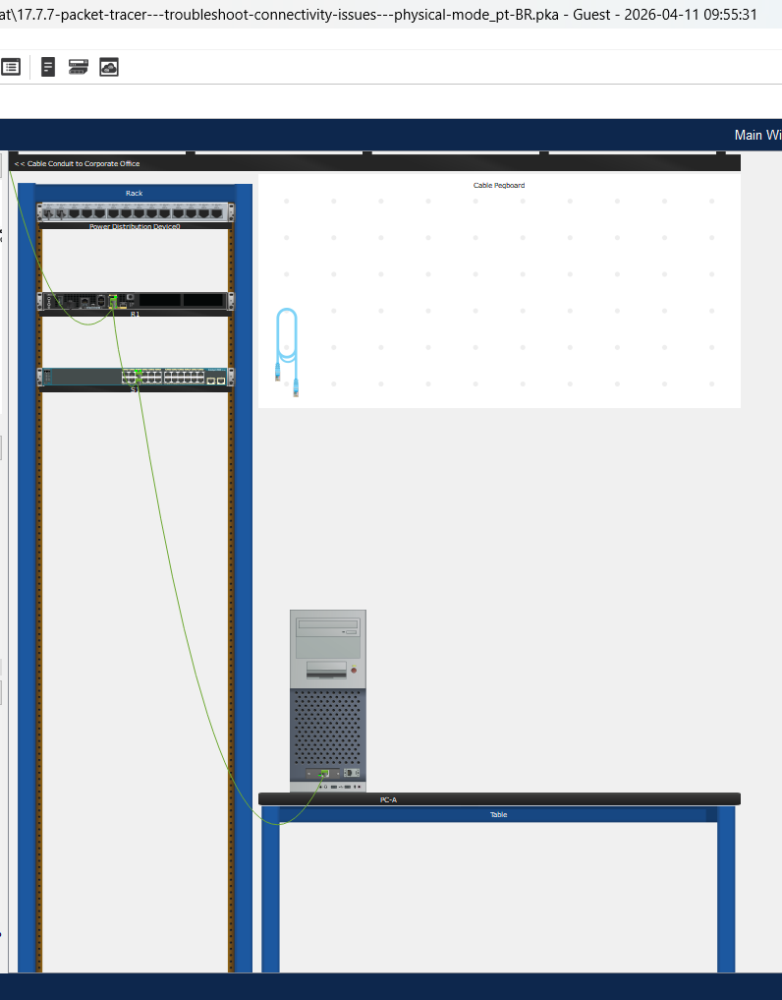
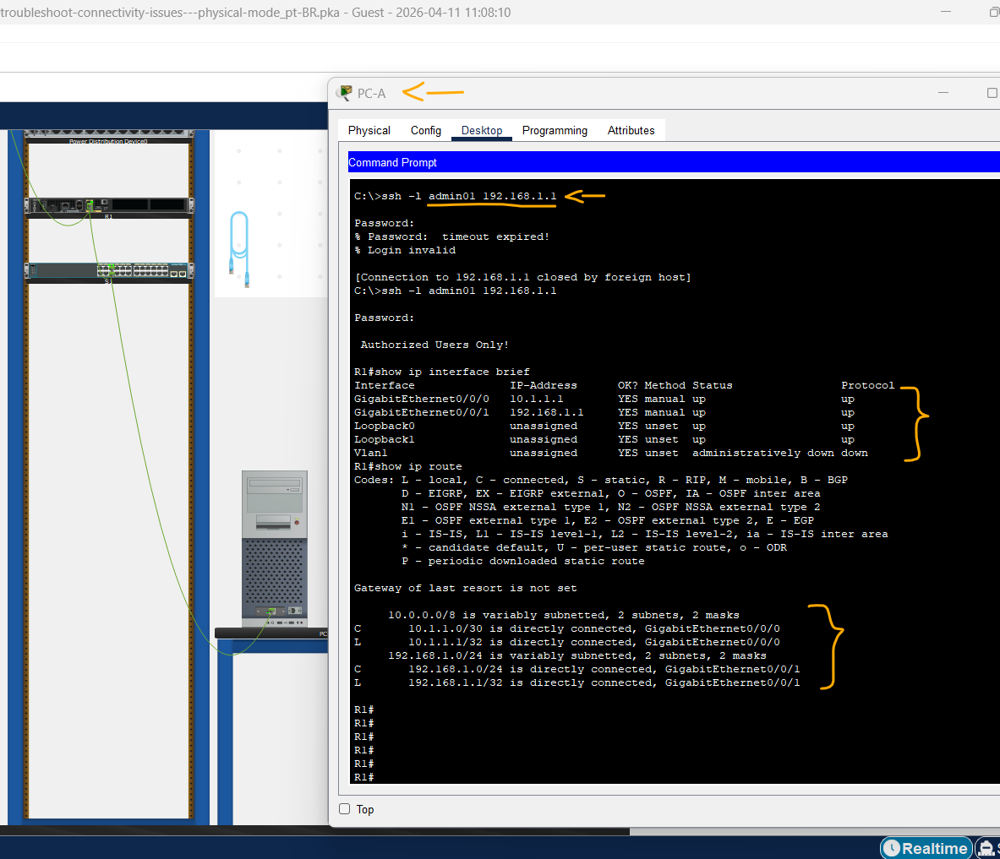
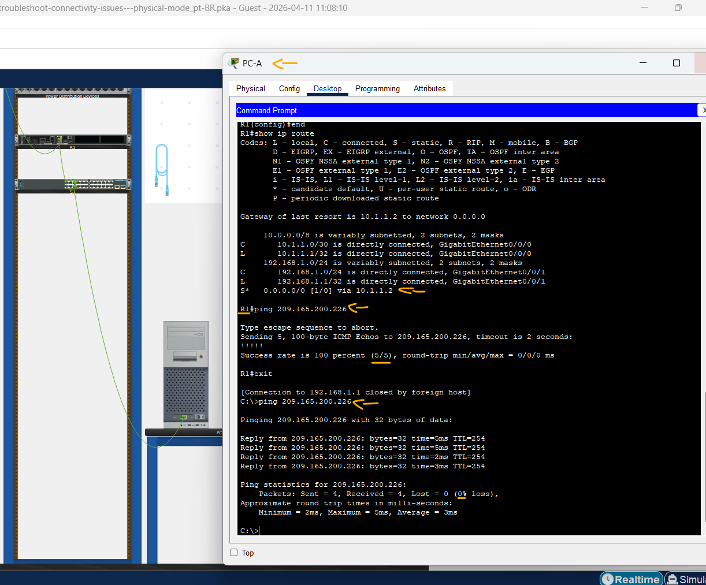
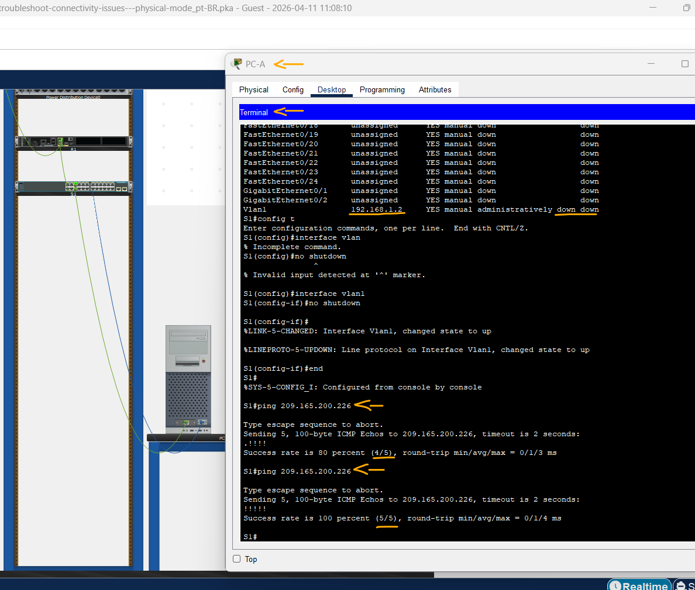
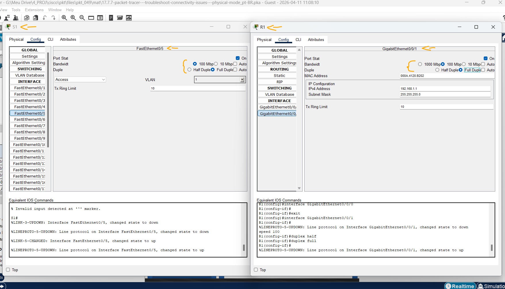

# Packet Tracer - Solucione Problemas de Conectividade - Modo Físico   

### Cisco: <a href="../../../">cisco   </a>
### Cisco Networking Academy: cna   </a>
### Training Category: <a href="../../../pkt/">pkt</a>
### Software/Subject: network   </a>
### Course: <a href="./">pkt_049 (Packet Tracer - Solucione Problemas de Conectividade - Modo Físico)   </a>

---

### Theme:
- Network

### Used Tools:
- Operating System (OS): 
  - Cisco Internetwork Operating System (Cisco IOS)   
  - Windows 11 
- Cloud Services:
  - Google Drive 
- Language:
  - HTML   
  - Markdown   
- Integrated Development Environment (IDE) and Text Editor:
  - Visual Studio Code (VS Code)   
- Versioning: 
  - Git   
- Repository:
  - GitHub   
- Network:
  - Cisco Packet Tracer 
  - ping   
  - Trace Route (tracert)   

---

<h3><a name="item00">Course Strcuture:</a></h3>

1. <a href="#item01">Parte 1: Identificar o Problema</a> 
  1.1 <a href="#item01.01">Etapa 1: Solucionar problemas da Rede.</a> 
  1.2 <a href="#item01.02">Etapa 2: Documente as causas prováveis.</a> 
2. <a href="#item02">Parte 2: Implementar Alterações de Rede</a> 
3. <a href="#item03">Parte 3: Verificar a Funcionalidade Total</a> 
4. <a href="#item04">Parte 4: Documentar descobertas e alterações de configuração</a> 
5. <a href="#item05">Perguntas para reflexão</a> 

---

### Objective:
O objetivo desta atividade no modo físico foi realizar o troubleshooting de conectividade, identificando e corrigindo problemas de configuração de rede para que todos os dispositivos da LAN pudessem alcançar o servidor externo no ISP.

### Folder Structure:
- [README.md](./README.md): Este documento de README, escrito em **Markdown**, com o conteúdo do laboratório.
- [0-aux](./0-aux/): Pasta auxiliar com imagens utilizadas na construção dos arquivos de README desse curso.

### Development:

<a name="item01"><h4>1. Parte 1: Identificar o Problema</h4></a>[Back to summary](#item00)

As únicas informações disponíveis sobre o problema da rede mostram que os usuários estão encontrando tempos de resposta altos e que você não consegue se conectar a um dispositivo externo na Internet no endereço IP 209.165.200.226. Para determinar provável causa(s) para esses problemas de rede, você precisará utilizar comandos e ferramentas de rede no equipamento LAN.

Observação: O usuário admin01 com uma senha de cisco12345 será obrigado a fazer logon no equipamento de rede.

A imagem 01 mostra a topologia inicial.

<figure>
     
    <figcaption>Imagem 01.</figcaption>
</figure>
 

<a name="item01.01"><h4>1.1 Etapa 1: Solucionar problemas da Rede.</h4></a>[Back to summary](#item00)

Use as ferramentas disponíveis para solucionar problemas na rede, tendo em mente que o requisito é restaurar a conectividade para o servidor externo e eliminar tempos de resposta lentos. 

#### Tabela 1 — Teste de Conectividade

| Ordem | Origem | Destino | Comando | Status |
| :---: | :---: | :---: | :---: | :---: |
| 1 | PC-A | PC-A | `ping 192.168.1.10` | Sucesso |
| 2 | PC-A | S1 | `ping 192.168.1.2` | Inacessível |
| 3 | PC-A | R1-G0/0/1 | `ping 192.168.1.1` | Sucesso |
| 4 | PC-A | R1-G0/0/0 | `ping 10.1.1.1` | Inacessível |
| 5 | PC-A | ISP-G0/0/0 | `ping 10.1.1.2` | Inacessível |
| 6 | PC-A | ISP-L0/External | `ping 209.165.200.226` | Inacessível |
| 7 | Swtich | ISP-L0/External | `ping 209.165.200.226` | Inacessível |

<a name="item01.02"><h4>1.2 Etapa 2: Documente as causas prováveis.</h4></a>[Back to summary](#item00)

Liste as causas prováveis para os problemas de rede que os funcionários estão tendo.

- Causas:
  - 2 - Falha de comunicação entre PC-A e a VLAN 1 do switch:
    -  Possível erro na configuração da interface VLAN 1 do switch.
  - 4 - O tráfego chega ao R1, mas não é encaminhado para outras redes:
    - O PC-A consegue alcançar a interface LAN do R1 (G0/0/1), porém não consegue acessar a interface WAN (10.1.1.1) nem redes externas.
    - O problema estava relacionado ao gateway padrão do PC-A configurado incorretamente, impedindo o envio de tráfego destinado a redes remotas para o roteador.
  - 5 e 6 - Falha nas comunicações após o roteador R1: 
    - Todas as tentativas de comunicação após o R1 falhavam inicialmente em decorrência do problema identificado no item anterior.
    - Como o gateway padrão do PC-A estava configurado incorretamente, o tráfego destinado a redes externas não era enviado corretamente ao roteador R1. Em consequência, a comunicação com a interface do ISP, loopback do ISP e servidor externo não era possível.
  - 6 - Falha de acesso ao servidor externo:
    - O roteador R1 conhecia apenas duas redes em sua tabela de roteamento: 192.168.1.0/24 (LAN) e 10.1.1.0/30 (link com o ISP). Como o endereço de destino 209.165.200.226 pertencia a uma rede não presente na tabela, o roteador não possuía uma rota específica nem uma rota padrão para encaminhar pacotes destinados a redes desconhecidas, impedindo assim o acesso ao servidor externo.
  - 7 - Falha de comunicação entre o switch e o servidor externo:
    - Possível erro na configuração do gateway padrão do switch.
  - 7 - Lentidão na comunicação entre o switch e o servidor externo:
    - Foi identificado um desajuste na configuração de largura de banda e duplex entre a interface F0/5 do switch e a interface G0/0/1 do roteador R1. Ambas estavam configuradas manualmente com 10 Mbps e half-duplex, ocasionando aumento no tempo de resposta, colisões e degradação no desempenho da comunicação.

- Verificações:
  - PC-A -> R1:
    - `ssh -l admin01 192.168.1.1` -> `cisco12345`
    - `show ip interface brief` -> `show ip route`.
    - `show running-config`. 
  - PC-A -> Switch:
    - Conexão de cabo console entre PC-A e Swtich. Ligar o PC-A.
    - `enable` -> `show running-config | include default-gateway`. 
    - `show ip interface brief`.
    - `show running-config`. 

A imagem 02 apresenta as interfaces e a tabela de roteamento do roteador R1, evidenciando a ausência de uma rota padrão para o encaminhamento de pacotes destinados a redes externas.

<figure>
     
    <figcaption>Imagem 02.</figcaption>
</figure>
 

<a name="item02"><h4>2. Parte 2: Implementar Alterações de Rede</h4></a>[Back to summary](#item00)

Você comunicou ao seu supervisor os problemas que descobriu na Parte 1. Ela aprovou essas alterações e solicitou que você as implementasse.

- 2 - Ativação da vlan1 no switch: `enable` -> `configure terminal` -> `interface vlan1` -> `no shutdown` -> `end`.
- 4 - Correção de Gateway padrão no PC-A: `192.168.1.1`.
- 6 - Adição da rota padrão para endereços desconhecidos: `configure terminal` -> `ip route 0.0.0.0 0.0.0.0 10.1.1.2` -> `end`.
- 7 - Correção de Gateway padrão no Switch: `enable` -> `configure terminal` -> `ip default-gateway 192.168.1.1` -> `exit`.
- 7 - Correção da configuração de largura de banda e duplex na interface F0/5 do switch: `configure terminal` -> `interface f0/5` -> `speed 100` -> `duplex full` -> `end`.
- 7 - Correção da configuração de largura de banda e duplex na interface G0/0/1 do R1: `configure terminal` -> `interface g0/0/1` -> `speed 100` -> `duplex full` -> `end`.

A imagem 03 mostra que, após a correção realizada, o roteador R1 e o PC-A passaram a responder com sucesso ao ping do servidor externo.

<figure>
     
    <figcaption>Imagem 03.</figcaption>
</figure>
 

A imagem 04 comprova que, após as correções realizadas, o switch também passou a acessar o servidor externo com sucesso.

<figure>
     
    <figcaption>Imagem 04.</figcaption>
</figure>
 

A imagem 05 exibe a correção da configuração de velocidade e duplex no link entre a interface F0/5 do switch e a G0/0/1 do roteador.

<figure>
     
    <figcaption>Imagem 05.</figcaption>
</figure>
 

<a name="item03"><h4>3. Parte 3: Verificar a Funcionalidade Total</h4></a>[Back to summary](#item00)

Verifique se a funcionalidade completa foi restaurada. PC-A, S1, e R1 devem ser capazes de atingir o servidor externo, e os Ping Respostas do PC-A para o servidor externo devem exibir uma variação significativa nos tempos de resposta.
- Todos os dispositivos foram capazes de acessar o servidor externo com sucesso.

<a name="item04"><h4>4. Parte 4: Documentar descobertas e alterações de configuração</h4></a>[Back to summary](#item00)

Use o espaço fornecido abaixo para documentar os problemas encontrados durante a solução de problemas e as alterações de configuração feitas para resolver esses problemas.
- Todos os problemas identificados durante o processo de troubleshooting, bem como as alterações de configuração realizadas para sua correção, já foram devidamente documentados nas partes anteriores desta atividade.

<a name="item05"><h4>5. Perguntas para reflexão</h4></a>[Back to summary](#item00)

- a. Este companheiro de laboratório de TRACER PACKET teve você solucionar todos os dispositivos antes de fazer qualquer alteração. Há outra forma de aplicar a metodologia de solução de problemas?
  - Sim. Outra forma de aplicar a metodologia de troubleshooting é identificar e corrigir um problema por vez, validando a conectividade após cada alteração realizada. Essa abordagem facilita o isolamento da causa raiz e reduz o risco de introduzir novos erros na rede.