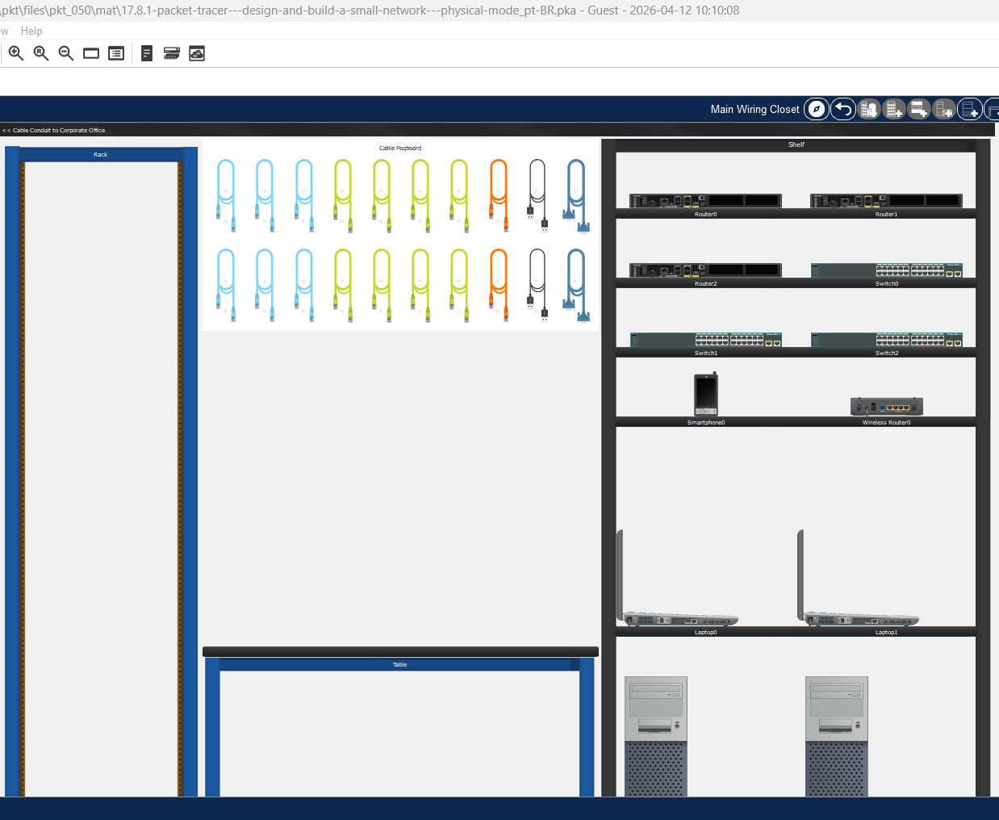
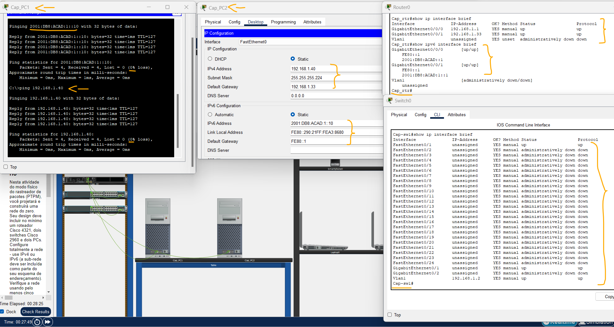
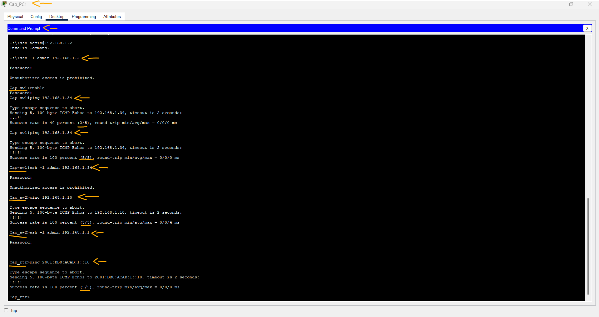

# Packet Tracer - Projete e Construa uma Rede Pequena - Modo Físico   

### Cisco: <a href="../../../">cisco   </a>
### Cisco Networking Academy: cna   </a>
### Training Category: <a href="../../../pkt/">pkt</a>
### Software/Subject: network   </a>
### Course: <a href="./">pkt_050 (Packet Tracer - Projete e Construa uma Rede Pequena - Modo Físico)   </a>

---

### Theme:
- Network

### Used Tools:
- Operating System (OS): 
  - Cisco Internetwork Operating System (Cisco IOS)   
  - Windows 11 
- Cloud Services:
  - Google Drive 
- Language:
  - HTML   
  - Markdown   
- Integrated Development Environment (IDE) and Text Editor:
  - Visual Studio Code (VS Code)   
- Versioning: 
  - Git   
- Repository:
  - GitHub   
- Network:
  - Cisco Packet Tracer 
  - ping   

---

<h3><a name="item00">Course Strcuture:</a></h3>

1. <a href="#item01">Packet Tracer - Projete e Construa uma Rede Pequena - Modo Físico</a> 
  1.1 <a href="#item01.01">Endereçamento</a> 
  1.2 <a href="#item01.02">Resolução</a> 
  1.3 <a href="#item01.03">Perguntas para reflexão</a> 

---

### Objective:
O objetivo desta atividade no modo físico foi construir, do zero, uma pequena rede composta por dois dispositivos finais e três dispositivos intermediários, realizando a configuração de segurança em switches e roteador, além de todo o planejamento e endereçamento IP em IPv4 e IPv6, incluindo a prática de subnetting.

### Folder Structure:
- [README.md](./README.md): Este documento de README, escrito em **Markdown**, com o conteúdo do laboratório.
- [0-aux](./0-aux/): Pasta auxiliar com imagens utilizadas na construção dos arquivos de README desse curso.

### Development:

<a name="item01"><h4>1. Packet Tracer - Projete e Construa uma Rede Pequena - Modo Físico</h4></a>[Back to summary](#item00)

A imagem 01 mostra a topologia inicial.

<figure>
     
    <figcaption>Imagem 01.</figcaption>
</figure>
 

<a name="item01.01"><h4>1.1 Endereçamento</h4></a>[Back to summary](#item00)

#### Tabela 1 — Planejamento das Sub-redes IPv4 e IPv6

| Nº Sub-rede | Endereço de Sub-Rede | Prefixo | Máscara de Sub-Rede | Primeiro Host | Último Host | Broadcast | Endereço de Sub-Rede IPv6 |
|:---:|:---:|:---:|:---:|:---:|:---:|:---:|:---:|
| 0 | 192.168.1.0 | /24 | 255.255.255.0 | 192.168.1.1 | 192.168.1.254 | 192.168.1.255 | 2001:DB8:ACAD::/48 |
| 1 | 192.168.1.0 | /27 | 255.255.255.224 | 192.168.1.1 | 192.168.1.30 | 192.168.1.31 | 2001:DB8:ACAD:0::/64 |
| 2 | 192.168.1.32 | /27 | 255.255.255.224 | 192.168.1.33 | 192.168.1.62 | 192.168.1.63 | 2001:DB8:ACAD:1::/64 |

#### Tabela 2 — Planejamento de Endereçamento IPv4 e IPv6

| Dispositivo | Interface | Tipo IP | Endereço IP | Prefixo | Gateway Padrão |
|:---:|:---:|:---:|:---:|:---:|:---:|
| R1 (Cap_rtr) | G0/0/0 | IPv4 | 192.168.1.1 | /27 | N/A |
| R1 (Cap_rtr) | G0/0/0 | IPv6 | 2001:DB8:ACAD:0::1 | /64 | N/A |
| R1 (Cap_rtr) | G0/0/0 | IPv6 (Link Local) | FE80::1 | /64 | N/A |
| R1 (Cap_rtr) | G0/0/1 | IPv4 | 192.168.1.33 | /27 | N/A |
| R1 (Cap_rtr) | G0/0/1 | IPv6 | 2001:DB8:ACAD:1::1 | /64 | N/A |
| R1 (Cap_rtr) | G0/0/1 | IPv6 (Link Local) | FE80::1 | /64 | N/A |
| S1 (Cap_sw1) | VLAN 1 | IPv4 | 192.168.1.2 | /27 | 192.168.1.1 |
| S1 (Cap_sw1) | VLAN 1 | IPv6 | 2001:DB8:ACAD:0::2 | /64 | FE80::1 |
| S2 (Cap_sw2) | VLAN 1 | IPv4 | 192.168.1.34 | /27 | 192.168.1.33 |
| S2 (Cap_sw2) | VLAN 1 | IPv6 | 2001:DB8:ACAD:1::2 | /64 | FE80::1 |
| PC1 (Cap_PC1) | NIC | IPv4 | 192.168.1.10 | /27 | 192.168.1.1 |
| PC1 (Cap_PC1) | NIC | IPv6 | 2001:DB8:ACAD:0::10 | /64 | FE80::1 |
| PC2 (Cap_PC2) | NIC | IPv4 | 192.168.1.40 | /27 | 192.168.1.33 |
| PC2 (Cap_PC2) | NIC | IPv6 | 2001:DB8:ACAD:1::10 | /64 | FE80::1 |

<a name="item01.02"><h4>1.2 Resolução</h4></a>[Back to summary](#item00)

- Colocar os seguintes dispositivos no locais devidos: Router0, Switch0, Switch1, PC0 e PC1.
- Conectar os dispositivos, usar cabo console para conectar o Cap_PC1 ao Cap_rtr.
- Configurar o Router0:
  - `enable` -> `configure terminal` -> `hostname Cap_rtr`.
  - `enable secret class` -> `service password-encryption`.
  - `banner motd #Unauthorized access is prohibited.#`.
  - `ipv6 unicast-routing` -> `no ip domain-lookup`.
  - `interface g0/0/0` -> `ip address 192.168.1.1 255.255.255.224` -> `ipv6 address 2001:DB8:ACAD:0::1/64` -> `ipv6 address FE80::1 link-local` -> `no shutdown` -> `exit`.
  - `interface g0/0/1` -> `ip address 192.168.1.33 255.255.255.224` -> `ipv6 address 2001:DB8:ACAD:1::1/64` -> `ipv6 address FE80::1 link-local` -> `no shutdown` -> `exit`.
  - `line console 0` -> `password cisco` -> `login` -> `exec-timeout 5 0` -> `exit`.
  - `line vty 0 4` -> `login local` -> `exec-timeout 5 0` -> `transport input ssh` -> `exit`.
  - `line vty 5 15` -> `transport input none` -> `exit`.
  - `username admin secret admin@123`.
  - `ip domain-name cisco.com` -> `crypto key generate rsa` -> `1024` -> `end`.
  - `show ip interface brief` -> `show ipv6 interface brief` -> `show running-config`.
- Configurar o Switch0:
  - `enable` -> `configure terminal` -> `hostname Cap_sw1`.
  - `enable secret class` -> `service password-encryption`.
  - `banner motd #Unauthorized access is prohibited.#`.
  - `no ip domain-lookup` -> `ip default-gateway 192.168.1.1`.
  - `interface vlan1` -> `ip address 192.168.1.2 255.255.255.224` -> `no shutdown` -> `exit`.
  - `interface range f0/2-24, g0/2` -> `shutdown` -> `exit`.
  - `line console 0` -> `password cisco` -> `login` -> `exec-timeout 5 0` -> `exit`.
  - `line vty 0 4` -> `login local` -> `exec-timeout 5 0` -> `transport input ssh` -> `exit`.
  - `line vty 5 15` -> `transport input none` -> `exit`.
  - `username admin secret admin@123`.
  - `ip domain-name cisco.com` -> `crypto key generate rsa` -> `1024` -> `end`.
  - `show ip interface brief` -> `show running-config`.
- Configurar o Switch1:
  - `enable` -> `configure terminal` -> `hostname Cap_sw2`.
  - `enable secret class` -> `service password-encryption`.
  - `banner motd #Unauthorized access is prohibited.#`.
  - `no ip domain-lookup` -> `ip default-gateway 192.168.1.33`.
  - `interface vlan1` -> `ip address 192.168.1.34 255.255.255.224` -> `no shutdown` -> `exit`.
  - `interface range f0/2-24, g0/2` -> `shutdown` -> `exit`.
  - `line console 0` -> `password cisco` -> `login` -> `exec-timeout 5 0` -> `exit`.
  - `line vty 0 4` -> `login local` -> `exec-timeout 5 0` -> `transport input ssh` -> `exit`.
  - `line vty 5 15` -> `transport input none` -> `exit`.
  - `username admin secret admin@123`.
  - `ip domain-name cisco.com` -> `crypto key generate rsa` -> `1024` -> `end`.
  - `show ip interface brief` -> `show running-config`.
- Configurar o PC0:
  - Nome: `Cap_PC1`.
  - IPv4: `192.168.1.10`.
  - Máscara de Sub-Rede: `255.255.255.224`.
  - IPv4-Gateway Padrão: `192.168.1.1`.
  - IPv6: `2001:DB8:ACAD:0::10/64`.
  - IPv6-Gateway Padrão: `FE80::1`.
- Configurar o PC1:
  - Nome: `Cap_PC2`.
  - IPv4: `192.168.1.40`.
  - Máscara de Sub-Rede: `255.255.255.224`.
  - IPv4-Gateway Padrão: `192.168.1.33`.
  - IPv6: `2001:DB8:ACAD:1::10/64`.
  - IPv6-Gateway Padrão: `FE80::1`.

A imagem 02 apresenta parte das configurações aplicadas nos dispositivos (PCs, switch e roteador), além dos testes de conectividade entre os dois PCs utilizando IPv4 e IPv6.

<figure>
     
    <figcaption>Imagem 02.</figcaption>
</figure>
 

A imagem 03 evidencia as sequências de acesso remoto via SSH realizadas a partir do Cap_PC1 para o Cap_sw1, o Cap_sw2 e o Cap_rtr, validando a conectividade e o gerenciamento remoto entre os dispositivos.

<figure>
     
    <figcaption>Imagem 03.</figcaption>
</figure>
 

<a name="item01.03"><h4>1.3 Perguntas para reflexão</h4></a>[Back to summary](#item00)

- a. Qual foi a parte mais difícil desta atividade?
  - A elaboração da atividade não apresentou dificuldades significativas, pois a documentação prévia permitiu organizar todos os processos, tornando a execução no Packet Tracer mais simples e objetiva.
  - Nenhuma. Ao escrever essa documentação, todos os processos ficaram organizados que foi só executar o Packet Tracer.
- b. Por que você considera a documentação de rede tão importante para esta atividade e para as situações reais?
  - A documentação é fundamental, pois serve como base para o planejamento, a implementação e a manutenção da rede. Quando bem estruturada, facilita a execução das tarefas, reduz erros e torna o gerenciamento mais eficiente tanto em atividades acadêmicas quanto em ambientes reais.