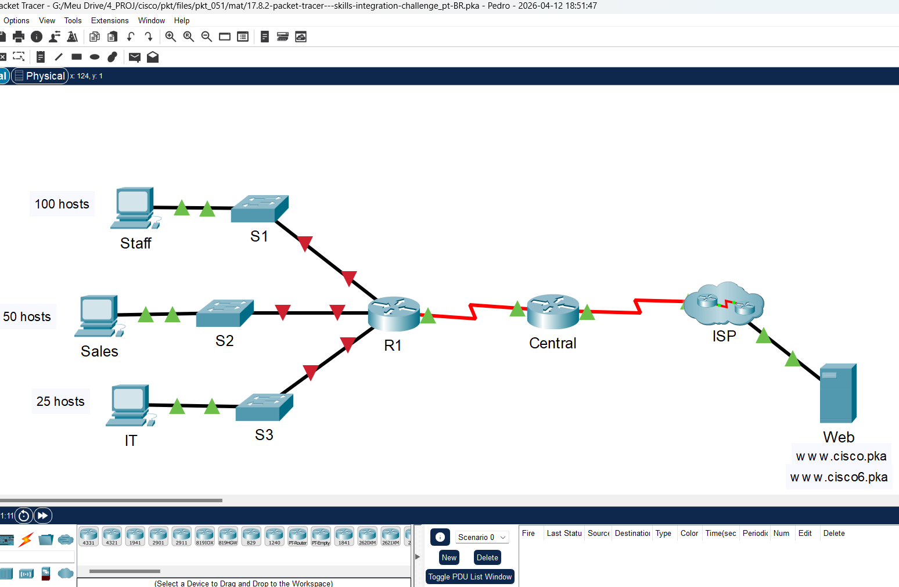
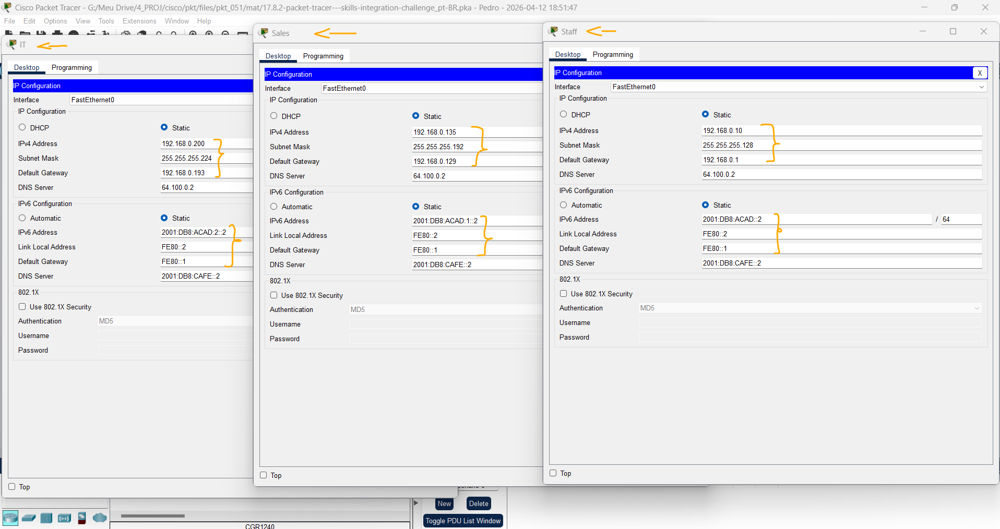
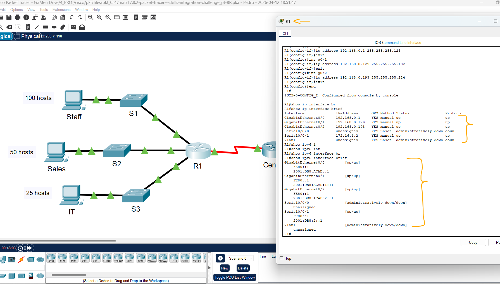
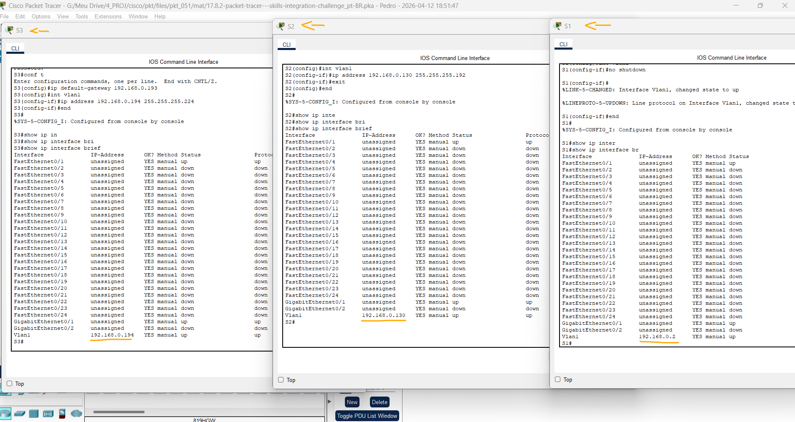
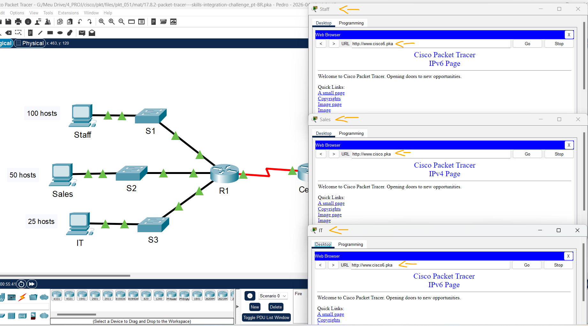
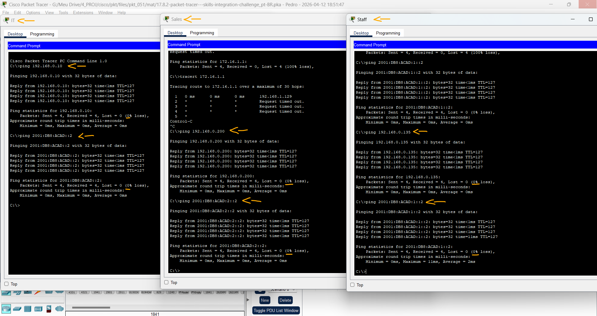

# Packet Tracer – Desafio de Integração de Habilidades   

### Cisco: <a href="../../../">cisco   </a>
### Cisco Networking Academy: cna   </a>
### Training Category: <a href="../../../pkt/">pkt</a>
### Software/Subject: network   </a>
### Course: <a href="./">pkt_051 (Packet Tracer – Desafio de Integração de Habilidades)   </a>

---

### Theme:
- Network

### Used Tools:
- Operating System (OS): 
  - Cisco Internetwork Operating System (Cisco IOS)   
  - Windows 11 
- Cloud Services:
  - Google Drive 
- Language:
  - HTML   
  - Markdown   
- Integrated Development Environment (IDE) and Text Editor:
  - Visual Studio Code (VS Code)   
- Versioning: 
  - Git   
- Repository:
  - GitHub   
- Network:
  - Cisco Packet Tracer   
  - ping   

---

<h3><a name="item00">Course Strcuture:</a></h3>

1. <a href="#item01">Packet Tracer – Desafio de Integração de Habilidades</a> 
  1.1 <a href="#item01.01">Endereçamento</a> 
  1.2 <a href="#item01.02">Configurações dos computadores</a> 
  1.3 <a href="#item01.03">Configurações de R1</a> 
  1.4 <a href="#item01.04">Configuração de switches</a> 
  1.5 <a href="#item01.05">Requisitos de conectividade</a> 

---

### Objective:
O objetivo desta atividade foi realizar o planejamento e a configuração do endereçamento IPv4 e IPv6 utilizando VLSM em quatro sub-redes da LAN, bem como configurar todos os dispositivos intermediários e finais da rede, de modo a garantir que todos os hosts conseguissem acessar o servidor web localizado na rede remota.

### Folder Structure:
- [README.md](./README.md): Este documento de README, escrito em **Markdown**, com o conteúdo do laboratório.
- [0-aux](./0-aux/): Pasta auxiliar com imagens utilizadas na construção dos arquivos de README desse curso.

### Development:

<a name="item01"><h4>1. Packet Tracer – Desafio de Integração de Habilidades</h4></a>[Back to summary](#item00)

A imagem 01 mostra a topologia inicial.

<figure>
     
    <figcaption>Imagem 01.</figcaption>
</figure>
 

<a name="item01.01"><h4>1.1 Endereçamento</h4></a>[Back to summary](#item00)

- Endereçamento IPv4:
  - Use 192.168.0.0/24 para criar sub-redes que atendem aos requisitos do host.  
    - Equipe (Staff): 100 hosts.
    - Departamento de Vendas (Sales): 50 hosts.
    - TI: 25 hosts.
    - Sub-rede de convidados (Guest) futuramente adicionada: 25 hosts .
  - Documente os endereços IPv4 que foram atribuídos na Tabela de Endereçamento. 
  - Registre a sub-rede da rede Convidado.

#### Tabela 1 — Planejamento das Sub-redes IPv4 e IPv6

| Nº Sub-rede | Endereço de Sub-Rede | Prefixo | Máscara de Sub-Rede | Primeiro Host | Último Host | Broadcast | Endereço de Sub-Rede IPv6 |
|:---:|:---:|:---:|:---:|:---:|:---:|:---:|:---:|
| 0 | 192.168.1.0 | /24 | 255.255.255.0 | 192.168.1.1 | 192.168.1.254 | 192.168.1.255 | 2001:DB8:ACAD::/48 |
| 1 | 192.168.1.0 | /25 | 255.255.255.128 | 192.168.1.1 | 192.168.1.126 | 192.168.1.127 | 2001:DB8:ACAD::/64 |
| 2 | 192.168.1.128 | /26 | 255.255.255.192 | 192.168.1.129 | 192.168.1.190 | 192.168.1.191 | 2001:DB8:ACAD:1::/64 |
| 3 | 192.168.1.192 | /27 | 255.255.255.224 | 192.168.1.193 | 192.168.1.222 | 192.168.1.223 | 2001:DB8:ACAD:2::/64 |
| 4 | 192.168.1.224 | /27 | 255.255.255.224 | 192.168.1.225 | 192.168.1.254 | 192.168.1.255 | 2001:DB8:ACAD:3::/64 |
| 5 | 172.16.1.0 | /30 | 255.255.255.252 | 172.16.1.1 | 172.16.1.2 | 172.16.1.3 | 2001:DB8:2::/64 |
| 6 | 209.165.200.224 | /30 | 255.255.255.252 | 209.165.200.225 | 209.165.200.226 | 209.165.200.227 | 2001:DB8:1::/64 |

#### Tabela 2 — Planejamento de Endereçamento IPv4 e IPv6

| Dispositivo | Interface | Tipo IP | Endereço IP | Prefixo | Gateway Padrão |
|:---:|:---:|:---:|:---:|:---:|:---:|
| R1 | G0/0 | IPv4 | 192.168.0.1 | /25 | N/A |
| R1 | G0/0 | IPv6 | 2001:DB8:ACAD::1 | /64 | N/A |
| R1 | G0/0 | IPv6 (Link Local) | FE80::1 | /64 | N/A |
| R1 | G0/1 | IPv4 | 192.168.0.129 | /26 | N/A |
| R1 | G0/1 | IPv6 | 2001:DB8:ACAD:1::1 | /64 | N/A |
| R1 | G0/1 | IPv6 (Link Local) | FE80::1 | /64 | N/A |
| R1 | G0/2 | IPv4 | 192.168.0.193 | /27 | N/A |
| R1 | G0/2 | IPv6 | 2001:DB8:ACAD:2::1 | /64 | N/A |
| R1 | G0/2 | IPv6 (Link Local) | FE80::1 | /64 | N/A |
| R1 | S0/0/1 | IPv4 | 172.16.1.2 | /30 | N/A |
| R1 | S0/0/1 | IPv6 | 2001:DB8:2::1 | /64 | N/A |
| R1 | S0/0/1 | IPv6 (Link Local) | FE80::1 | /64 | N/A |
| Central | S0/0/1 | IPv4 | 172.16.1.1 | /30 | N/A |
| Central | S0/0/1 | IPv6 | 2001:DB8:2::2 | /64 | N/A |
| Central | S0/0/1 | IPv6 (Link Local) | FE80::2 | /64 | N/A |
| Central | S0/0/0 | IPv4 | 209.165.200.226 | /30 | N/A |
| Central | S0/0/0 | IPv6 | 2001:DB8:1::1 | /64 | N/A |
| Central | S0/0/0 | IPv6 (Link Local) | FE80::2 | /64 | N/A |
| S1 | VLAN 1 | IPv4 | 192.168.0.2 | /25 | 192.168.0.1 |
| S2 | VLAN 1 | IPv4 | 192.168.0.130 | /26 | 192.168.0.129 |
| S3 | VLAN 1 | IPv4 | 192.168.0.194 | /27 | 192.168.0.193 |
| Staff | NIC | IPv4 | 192.168.0.10 | /25 | 192.168.0.1 |
| Staff | NIC | IPv6 | 2001:DB8:ACAD::2 | /64 | FE80::1 |
| Staff | NIC | IPv6 (Link Local) | FE80::2 | /64 | FE80::1 |
| Sales | NIC | IPv4 | 192.168.0.135 | /26 | 192.168.0.129 |
| Sales | NIC | IPv6 | 2001:DB8:ACAD:1::2 | /64 | FE80::1 |
| Sales | NIC | IPv6 (Link Local) | FE80::2 | /64 | FE80::1 |
| IT | NIC | IPv4 | 192.168.0.200 | /27 | 192.168.0.193 |
| IT | NIC | IPv6 | 2001:DB8:ACAD:2::2 | /64 | FE80::1 |
| IT | NIC | IPv6 (Link Local) | FE80::2 | /64 | FE80::1 |
| Web | NIC | IPv4 | 64.100.0.3 | /29 | 64.100.0.1 |
| Web | NIC | IPv6 | 2001:DB8:cafe::3 | /64 | FE80::1 |
| Web | NIC | IPv6 (Link Local) | FE80::2 | /64 | FE80::1 |

<a name="item01.02"><h4>1.2 Configurações dos computadores</h4></a>[Back to summary](#item00)

- Defina as configurações de endereço IPv4, máscara de sub-rede e gateway padrão atribuídos nos staff, vendas e TI, usando seu esquema de endereçamento.
  - Staff: IPv4: `192.168.0.10`; Máscara de Sub-Rede: `255.255.255.128`; IPv4-Gateway Padrão: `192.168.0.1`.
  - Sales: IPv4: `192.168.0.135`; Máscara de Sub-Rede: `255.255.255.192`; IPv4-Gateway Padrão: `192.168.0.129`.
  - IT: IPv4: `192.168.0.200`; Máscara de Sub-Rede: `255.255.255.224`; IPv4-Gateway Padrão: `192.168.0.193`.
- Atribua o unicast IPv6 e vincule os endereços locais e os gateways padrão à staff, sales e IT, de acordo com a Tabela de endereçamento.
  - Staff: IPv6: `2001:DB8:ACAD::2`; Prefixo: `/64`; Gateway Padrão: `FE80::1`; Link Local: `FE80::2`.
  - Sales: IPv6: `2001:DB8:ACAD:1::2`; Prefixo: `/64`; Gateway Padrão: `FE80::1`; Link Local: `FE80::2`.
  - IT: IPv6: `2001:DB8:ACAD:2::2`; Prefixo: `/64`; Gateway Padrão: `FE80::1`; Link Local: `FE80::2`.

A imagem 02 apresenta as configurações de endereçamento IPv4 e IPv6 dos hosts.

<figure>
     
    <figcaption>Imagem 02.</figcaption>
</figure>
 

<a name="item01.03"><h4>1.3 Configurações de R1</h4></a>[Back to summary](#item00)

- a. Configure o nome do dispositivo conforme a Tabela de Endereçamento.
  - `enable` -> `configure terminal` -> `hostname R1`.
- b. Desative a pesquisa do DNS.
  - `no ip domain-lookup`.
- c. Atribua Ciscoenpa55 como a senha criptografada do modo EXEC privilegiado.
  - `enable secret Ciscoenpa55`.
- d. Atribua Ciscoconpa55 como a senha de console e habilite o login.
  - `line console 0` -> `password Ciscoconpa55` -> `login` -> `exit`.
- e. Exija que um mínimo de 10 caracteres seja usado para todas as senhas.
  - `security passwords min-length 10`.
- f. Criptografe todas as senhas em texto simples.
  - `service password-encryption`.
- g. Crie um banner para avisar às pessoas que o acesso não autorizado é proibido.
  - `banner motd #Unauthorized access is prohibited.#`.
- h. Configure e ative todas as interfaces Gigabit Ethernet. Configure endereços IPv4 de acordo com seu esquema de endereçamento.
  - `interface g0/0` -> `ip address 192.168.0.1 255.255.255.128` -> `no shutdown` -> `exit`.
  - `interface g0/1` -> `ip address 192.168.0.129 255.255.255.192` -> `no shutdown` -> `exit`.
  - `interface g0/2` -> `ip address 192.168.0.193 255.255.255.224` -> `no shutdown` -> `exit`.
- h. Configure endereços IPv6 de acordo com a Tabela de Endereçamento.
  - `interface g0/0` -> `ipv6 address 2001:DB8:ACAD::1/64` -> `ipv6 address FE80::1 link-local` -> `exit`.
  - `interface g0/1` -> `ipv6 address 2001:DB8:ACAD:1::1/64` -> `ipv6 address FE80::1 link-local` -> `exit`.
  - `interface g0/2` -> `ipv6 address 2001:DB8:ACAD:2::1/64` -> `ipv6 address FE80::1 link-local` -> `exit`.
- i. Configure o SSH em R1. Defina o nome de domínio como CCNA-lab.com.
  - `ip domain-name CCNA-lab.com`.
- i. Gere uma chave RSA de 1024 bits.
  - `crypto key generate rsa` -> `1024`.
- i. Configure as linhas VTY para acesso SSH.
  - `line vty 0 15` -> `transport input ssh`.
- i. Use perfis de usuário local para autenticação.
  - `login local` -> `exit`.
- i. Crie um usuário Admin1 com um privilégio de nível 15 usando a senha criptografada para Admin1pa55.
  - `username Admin1 privilege 15 secret Admin1pa55`.
- j. Configure o console e as linhas VTY para encerrar sessão após cinco minutos de inatividade.
  - `line console 0` -> `exec-timeout 5 0` -> `exit`.
  - `line vty 0 15` -> `exec-timeout 5 0` -> `exit`.
- k. Bloqueie durante três minutos qualquer pessoa que não conseguiu fazer log in depois de quatro tentativas em um período de dois minutos.
  - `login block-for 180 attempts 4 within 120`.
- l. Hablitar roteamento IPv6.
  - `ipv6 unicast-routing`.

A imagem 03 exibe as configurações realizadas no roteador R1.

<figure>
     
    <figcaption>Imagem 03.</figcaption>
</figure>
 

<a name="item01.04"><h4>1.4 Configuração de switches</h4></a>[Back to summary](#item00)

- a. Configure o nome do dispositivo conforme a Tabela de Endereçamento.
  - S1: `enable` -> `configure terminal` -> `hostname S1`.
  - S2: `enable` -> `configure terminal` -> `hostname S2`.
  - S3: `enable` -> `configure terminal` -> `hostname S3`.
- b. Configure a interface SVI com endereço e máscara de sub-rede IPv4 de acordo com o seu esquema de endereçamento.
  - S1: `interface vlan1` -> `ip address 192.168.0.2 255.255.255.128` -> `no shutdown` -> `exit`.
  - S2: `interface vlan1` -> `ip address 192.168.0.130 255.255.255.192` -> `no shutdown` -> `exit`.
  - S3: `interface vlan1` -> `ip address 192.168.0.194 255.255.255.224` -> `no shutdown` -> `exit`.
- Configure o gateway padrão.
  - S1: `ip default-gateway 192.168.0.1`.
  - S2: `ip default-gateway 192.168.0.129`.
  - S3: `ip default-gateway 192.168.0.193`.
- Desative a pesquisa do DNS.
  - `no ip domain-lookup`.
- Atribua Ciscoenpa55 como a senha criptografada do modo EXEC privilegiado.
  - `enable secret Ciscoenpa55`.
- Atribua Ciscoconpa55 como a senha de console e habilite o login.
  - `line console 0` -> `password Ciscoconpa55` -> `login` -> `exit`.
- Configure o console e as linhas VTY para encerrar a sessão após cinco minutos de inatividade.
  - `line console 0` -> `exec-timeout 5 0` -> `exit`.
  - `line vty 0 15` -> `exec-timeout 5 0` -> `exit`.
- Criptografe todas as senhas em texto simples.
  - `service password-encryption`.

A imagem 04 exibe as configurações realizadas nos três switches.

<figure>
     
    <figcaption>Imagem 04.</figcaption>
</figure>
 

<a name="item01.05"><h4>1.5 Requisitos de conectividade</h4></a>[Back to summary](#item00)

- Usando navegadores Web nos computadores Staff, Sales e TI, navegue para `www.cisco.pka`.
  - `www.cisco.pka`.
- Usando navegadores Web nos computadores Staff, Sales e TI, navegue para `www.cisco6.pka`.
  - `www.cisco6.pka`.
- Todos os PCs devem poder executar ping em todos os outros dispositivos.
  - Staff -> Sales: `ping 192.168.0.135` -> `ping 2001:DB8:ACAD:1::2`.
  - Sales -> TI: `ping 192.168.0.200` -> `ping 2001:DB8:ACAD:2::2`.
  - TI -> Staff: `ping 192.168.0.10` -> `ping 2001:DB8:ACAD::2`.

A imagem 05 comprova que todos os hosts conseguiram acessar o servidor web por meio do nome de domínio, utilizando conectividade IPv4 e IPv6.

<figure>
     
    <figcaption>Imagem 05.</figcaption>
</figure>
 

A imagem 06 evidencia que todos os PCs conseguem se comunicar entre si com sucesso.

<figure>
     
    <figcaption>Imagem 06.</figcaption>
</figure>
 