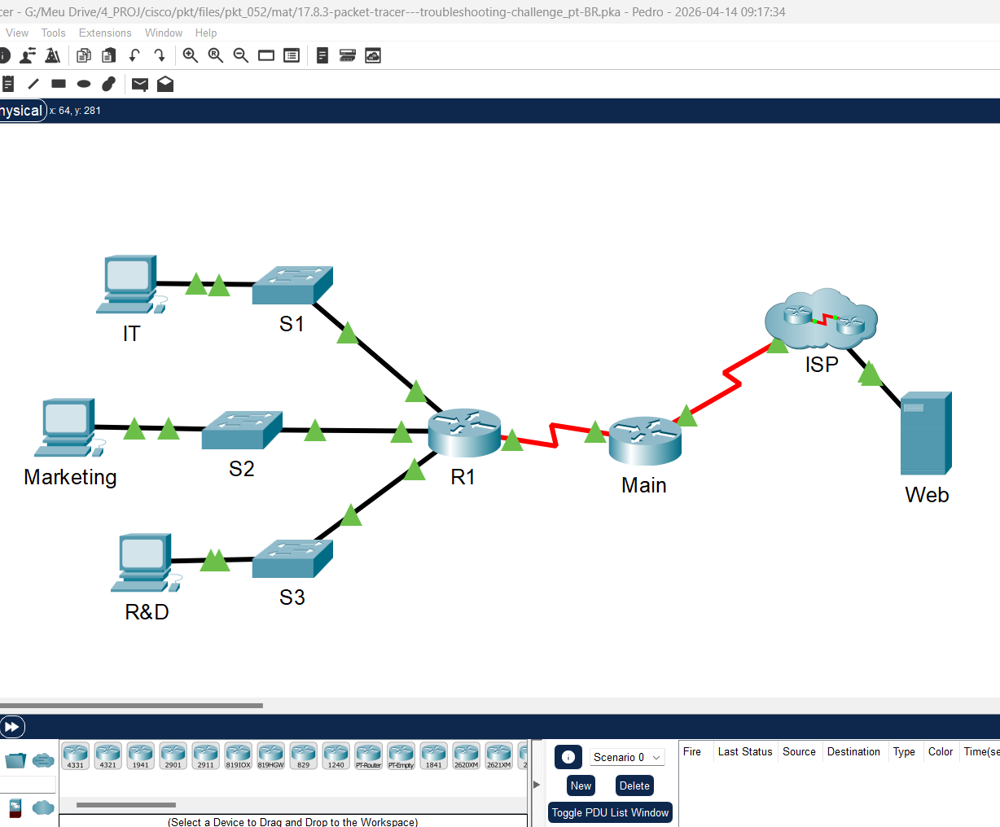
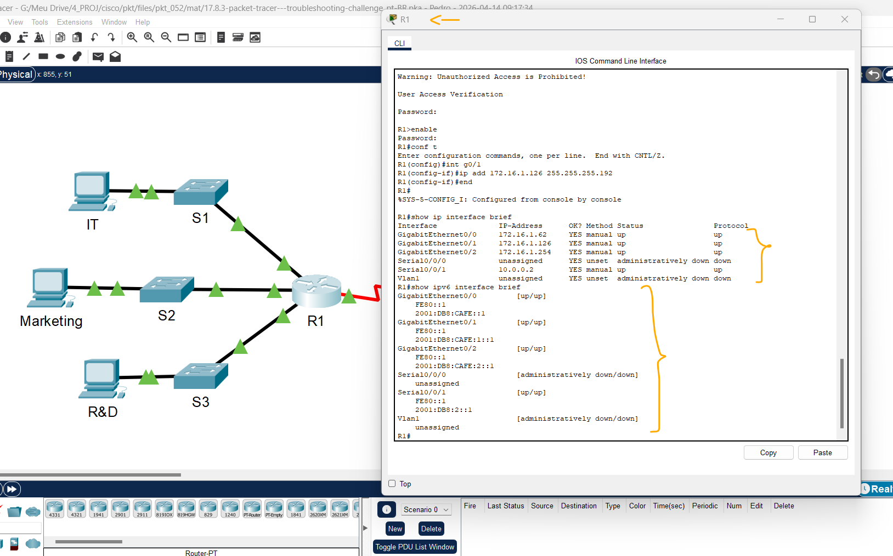
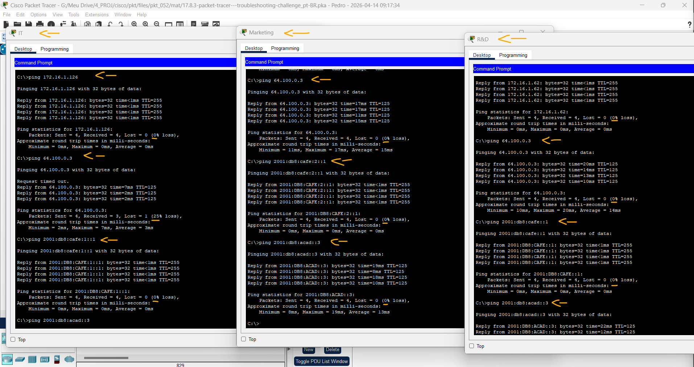
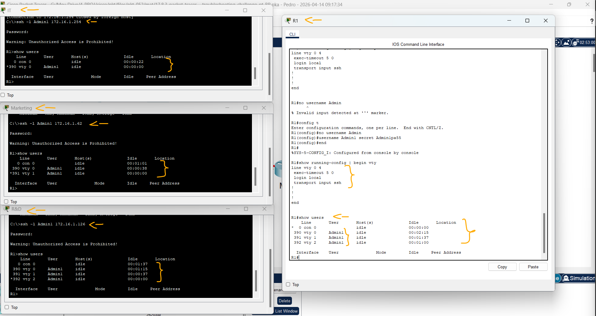

# Packet Tracer – Desafio de Solução de Problemas   

### Cisco: <a href="../../../">cisco   </a>
### Cisco Networking Academy: cna   </a>
### Training Category: <a href="../../../pkt/">pkt</a>
### Software/Subject: network   </a>
### Course: <a href="./">pkt_052 (Packet Tracer – Desafio de Solução de Problemas)   </a>

---

### Theme:
- Network

### Used Tools:
- Operating System (OS): 
  - Cisco Internetwork Operating System (Cisco IOS)   
  - Windows 11 
- Cloud Services:
  - Google Drive 
- Language:
  - HTML   
  - Markdown   
- Integrated Development Environment (IDE) and Text Editor:
  - Visual Studio Code (VS Code)   
- Versioning: 
  - Git   
- Repository:
  - GitHub   
- Network:
  - Cisco Packet Tracer   
  - OpenSSH   
  - ping   

---

<h3><a name="item00">Course Strcuture:</a></h3>

1. <a href="#item01">Packet Tracer – Desafio de Solução de Problemas</a> 
  1.1 <a href="#item01.01">Instruções</a> 
  1.2 <a href="#item01.02">Endereçamento</a> 
  1.3 <a href="#item01.03">Correções</a> 
  1.4 <a href="#item01.04">Teste de Conectividade</a> 
  1.5 <a href="#item01.05">Acesso SSH ao R1</a> 

---

### Objective:
O objetivo desta atividade foi realizar troubleshooting de problemas comuns em uma LAN, de modo a garantir que todos os hosts pudessem se comunicar dentro da rede local e alcançar o servidor web localizado na rede remota. Além disso, buscou-se assegurar que os hosts obtivessem acesso ao roteador por meio do protocolo SSH.

### Folder Structure:
- [README.md](./README.md): Este documento de README, escrito em **Markdown**, com o conteúdo do laboratório.
- [0-aux](./0-aux/): Pasta auxiliar com imagens utilizadas na construção dos arquivos de README desse curso.

### Development:

<a name="item01"><h4>1. Packet Tracer – Desafio de Integração de Habilidades</h4></a>[Back to summary](#item00)

A imagem 01 mostra a topologia inicial.

<figure>
     
    <figcaption>Imagem 01.</figcaption>
</figure>
 

<a name="item01.01"><h4>1.1 Instruções</h4></a>[Back to summary](#item00)

- O roteador R1 e todos os switches foram pré-configurados da seguinte forma: 
  - Senha de ativação: Ciscoenpa55 
  - Senha do console: Ciscoconpa55 
  - Nome de usuário e senha do administrador para SSH: Admin1/Admin1pa55 
- Número de hosts necessários por sub-rede: 
  - TI: 50 hosts 
  - Marketing: 50 hosts 
  - R&D: 100 hosts 
- Se todos os problemas de configuração foram corrigidos, todos os dispositivos devem ser capazes de executar ping entre si e o servidor web. 

<a name="item01.02"><h4>1.2 Endereçamento</h4></a>[Back to summary](#item00)

#### Tabela 1 — Planejamento das Sub-redes IPv4 e IPv6

| Nº Sub-rede | Endereço de Sub-Rede | Prefixo | Máscara de Sub-Rede | Primeiro Host | Último Host | Broadcast | Endereço de Sub-Rede IPv6 |
|:---:|:---:|:---:|:---:|:---:|:---:|:---:|:---:|
| 0 | 172.16.1.0 | /24 | 255.255.255.0 | 172.16.1.1 | 172.16.1.254 | 172.16.1.255 | 2001:DB8:CAFE::/48 |
| 1 | 172.16.1.0 | /26 | 255.255.255.192 | 172.16.1.1 | 172.16.1.62 | 172.16.1.63 | 2001:DB8:CAFE::/64 |
| 2 | 172.16.1.64 | /26 | 255.255.255.192 | 172.16.1.65 | 172.16.1.126 | 172.16.1.127 | 2001:DB8:CAFE:1::/64 |
| 3 | 172.16.1.128 | /25 | 255.255.255.128 | 172.16.1.129 | 172.16.1.254 | 172.16.1.255 | 2001:DB8:CAFE:2::/64 |
| 4 | 10.0.0.0 | /30 | 255.255.255.252 | 10.0.0.1 | 10.0.0.2 | 10.0.0.3 | 2001:DB8:2::/64 |
| 5 | 209.165.200.224 | /30 | 255.255.255.252 | 209.165.200.225 | 209.165.200.226 | 209.165.200.227 | 2001:DB8:1::/64 |

#### Tabela 2 — Planejamento de Endereçamento IPv4 e IPv6

| Dispositivo | Interface | Tipo IP | Endereço IP | Prefixo | Gateway Padrão |
|:---:|:---:|:---:|:---:|:---:|:---:|
| R1 | G0/0 | IPv4 | 172.16.1.62 | /26 | N/A |
| R1 | G0/0 | IPv6 | 2001:DB8:CAFE::1 | /64 | N/A |
| R1 | G0/0 | IPv6 (Link Local) | FE80::1 | /64 | N/A |
| R1 | G0/1 | IPv4 | 172.16.1.126 | /26 | N/A |
| R1 | G0/1 | IPv6 | 2001:DB8:CAFE:1::1 | /64 | N/A |
| R1 | G0/1 | IPv6 (Link Local) | FE80::1 | /64 | N/A |
| R1 | G0/2 | IPv4 | 172.16.1.254 | /25 | N/A |
| R1 | G0/2 | IPv6 | 2001:DB8:CAFE:2::1 | /64 | N/A |
| R1 | G0/2 | IPv6 (Link Local) | FE80::1 | /64 | N/A |
| R1 | S0/0/1 | IPv4 | 10.0.0.2 | /30 | N/A |
| R1 | S0/0/1 | IPv6 | 2001:DB8:2::1 | /64 | N/A |
| R1 | S0/0/1 | IPv6 (Link Local) | FE80::1 | /64 | N/A |
| Central | S0/0/1 | IPv4 | 10.0.0.1 | /30 | N/A |
| Central | S0/0/1 | IPv6 | 2001:DB8:2::2 | /64 | N/A |
| Central | S0/0/1 | IPv6 (Link Local) | FE80::2 | /64 | N/A |
| Central | S0/0/0 | IPv4 | 209.165.200.226 | /30 | N/A |
| Central | S0/0/0 | IPv6 | 2001:DB8:1::1 | /64 | N/A |
| Central | S0/0/0 | IPv6 (Link Local) | FE80::2 | /64 | N/A |
| S1 | VLAN 1 | IPv4 | 172.16.1.61 | /26 | 172.16.1.62 |
| S2 | VLAN 1 | IPv4 | 172.16.1.125 | /26 | 172.16.1.126 |
| S3 | VLAN 1 | IPv4 | 172.16.1.253 | /25 | 172.16.1.254 |
| IT | NIC | IPv4 | 172.16.1.1 | /26 | 172.16.1.62 |
| IT | NIC | IPv6 | 2001:DB8:CAFE::2 | /64 | FE80::1 |
| IT | NIC | IPv6 (Link Local) | FE80::2 | /64 | N/A |
| Marketing | NIC | IPv4 | 172.16.1.65 | /26 | 172.16.1.126 |
| Marketing | NIC | IPv6 | 2001:DB8:CAFE:1::2 | /64 | FE80::1 |
| Marketing | NIC | IPv6 (Link Local) | FE80::2 | /64 | N/A |
| R&D | NIC | IPv4 | 172.16.1.129 | /25 | 172.16.1.254 |
| R&D | NIC | IPv6 | 2001:DB8:CAFE:2::2 | /64 | FE80::1 |
| R&D | NIC | IPv6 (Link Local) | FE80::2 | /64 | N/A |
| Web | NIC | IPv4 | 64.100.0.3 | /29 | 64.100.0.1 |
| Web | NIC | IPv6 | 2001:DB8:ACAD::3 | /64 | FE80::1 |
| Web | NIC | IPv6 (Link Local) | FE80::2 | /64 | N/A |

<a name="item01.03"><h4>1.3 Correções</h4></a>[Back to summary](#item00)

- Hosts:
  - IT: IPv4: `172.16.1.1`; Gateway Padrão: `172.16.1.62`.
  - Marketing: OK.
  - R&D: IPv6: `2001:DB8:CAFE:2::2`.
- Switches: `Ciscoconpa55` -> `enable` -> `Ciscoenpa55` -> `show running-config | begin interface Vlan1`.
  - S1: OK.
  - S2: `Ciscoconpa55` -> `enable` -> `Ciscoenpa55` -> `configure terminal` -> `interface vlan1` -> `ip address 172.16.1.125 255.255.255.192` -> `end`.
  - S3: OK.
- Roteador: `Ciscoconpa55` -> `enable` -> `Ciscoenpa55` -> `show running-config | begin interface`.
  - R1-G0/0: OK.
  - R1-G0/1: `Ciscoconpa55` -> `enable` -> `Ciscoenpa55` -> `configure terminal` -> `interface g0/1` -> `ip address 172.16.1.126 255.255.255.192` -> `end`.
  - R1-G0/2: OK.
  - R1-S0/0/1: OK.

A imagem 02 mostra as configurações de endereçamento IP corretas em todas interfaces do roteador R1.

<figure>
     
    <figcaption>Imagem 02.</figcaption>
</figure>
 

<a name="item01.04"><h4>1.4 Teste de Conectividade</h4></a>[Back to summary](#item00)

#### Tabela 3 — Teste de Conectividade

| Ordem | Origem | Destino | Comando | Status |
| :---: | :---: | :---: | :---: | :---: |
| 1 | IT | S2 | `ping 172.16.1.125` | Sucesso |
| 2 | IT | R1-G0/1 | `ping 172.16.1.126` | Inacessível |
| 3 | IT | Web | `ping 64.100.0.3` | Sucesso |
| 4 | Marketing | S3 | `ping 172.16.1.253` | Inacessível |
| 5 | Marketing | R1-G0/2 | `ping 172.16.1.254` | Inacessível |
| 6 | Marketing | Web | `ping 64.100.0.3` | Inacessível |
| 7 | R&D | S1 | `ping 172.16.1.61` | Inacessível |
| 8 | R&D | R1-G0/0 | `ping 172.16.1.62` | Inacessível |
| 9 | R&D | Web | `ping 64.100.0.3` | Inacessível |
| 10 | IT | R1-G0/1 | `ping 2001:db8:cafe:1::1` | Inacessível |
| 11 | Marketing | R1-G0/2 | `ping 2001:db8:cafe:2::1` | Inacessível |
| 12 | R&D | R1-G0/0 | `ping 2001:db8:cafe::1` | Inacessível |
| 13 | IT | Web | `ping 2001:db8:acad::3` | Sucesso |
| 14 | Marketing | Web | `ping 2001:db8:acad::3` | Inacessível |
| 15 | R&D | Web | `ping 2001:db8:acad::3` | Inacessível |

A imagem 03 apresenta diversos testes de conectividade IPv4 e IPv6, realizados por meio do comando ping, a partir de cada host em direção ao switch, à interface do roteador da rede vizinha e ao servidor web.

<figure>
     
    <figcaption>Imagem 03.</figcaption>
</figure>
 

<a name="item01.05"><h4>1.5 Acesso SSH ao R1</h4></a>[Back to summary](#item00)

- R1: `Ciscoconpa55` -> `enable` -> `Ciscoenpa55` -> `configure terminal` -> `line vty 0 4` -> `transport input ssh` -> `login local` -> `exit` -> `username Admin1 secret Admin1pa55`.
- IT - R1-G0/2: `ssh -l Admin1 172.16.1.254` -> `Admin1pa55`.
- Marketing - R1-G0/0: `ssh -l Admin1 172.16.1.62` -> `Admin1pa55`.
- R&D - R1-G0/1: `ssh -l Admin1 172.16.1.126` -> `Admin1pa55`.

A imagem 04 evidencia a configuração do acesso SSH, com a criação do usuário especificado, e demonstra que todos os hosts conseguiram acessar o roteador por meio das credenciais definidas.

<figure>
     
    <figcaption>Imagem 04.</figcaption>
</figure>
 