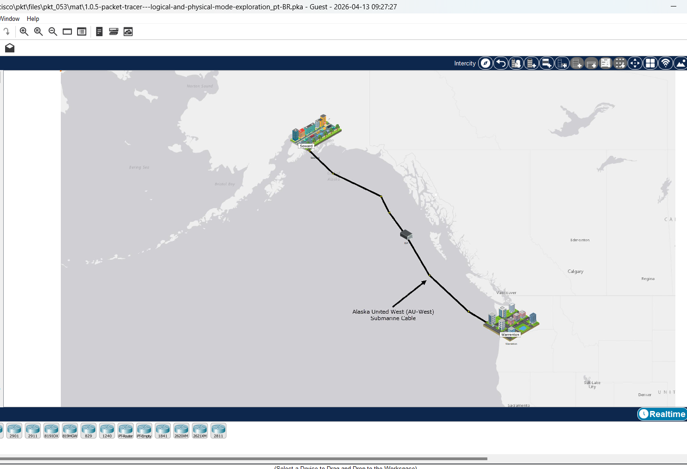
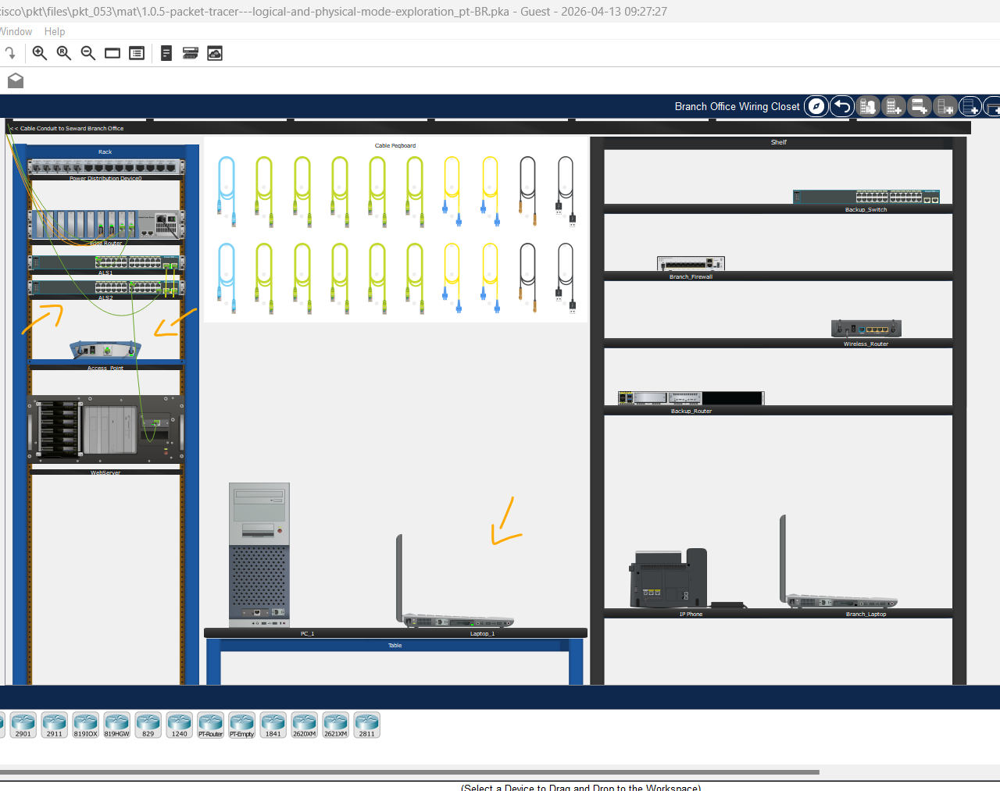
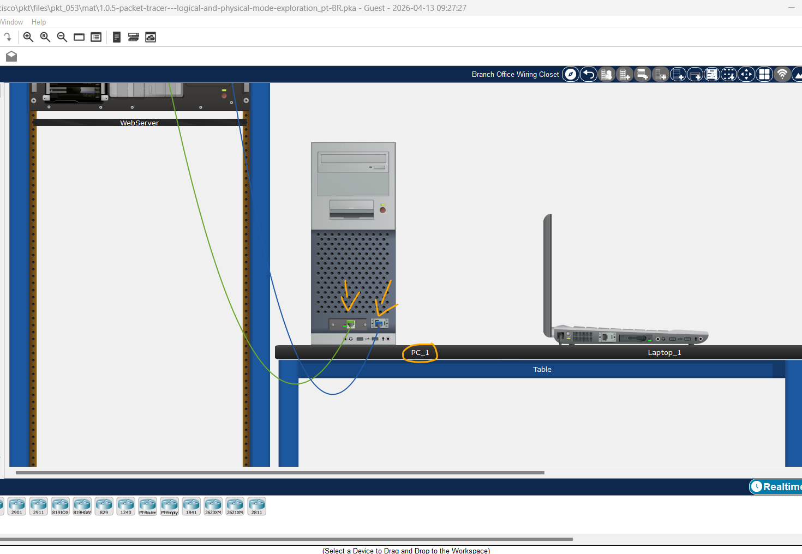
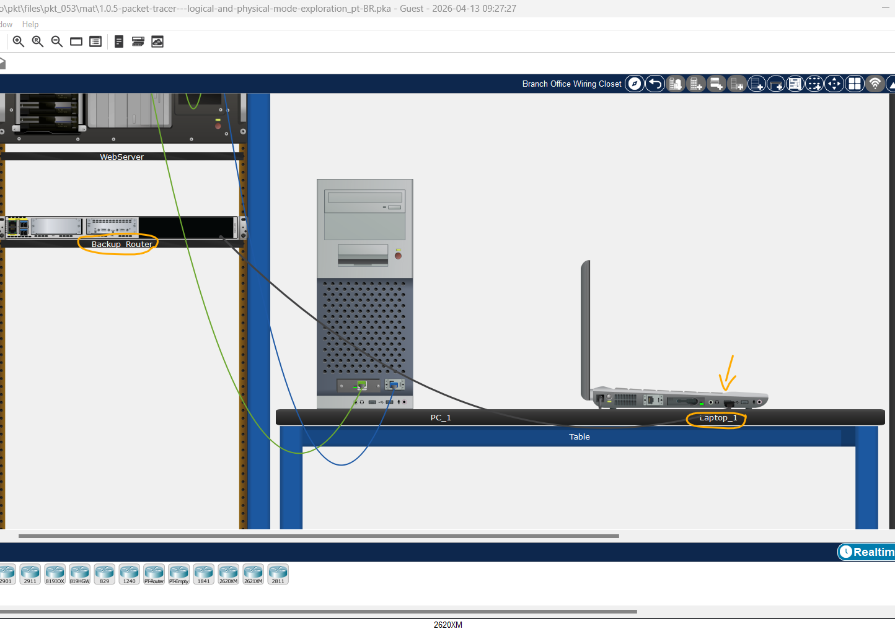
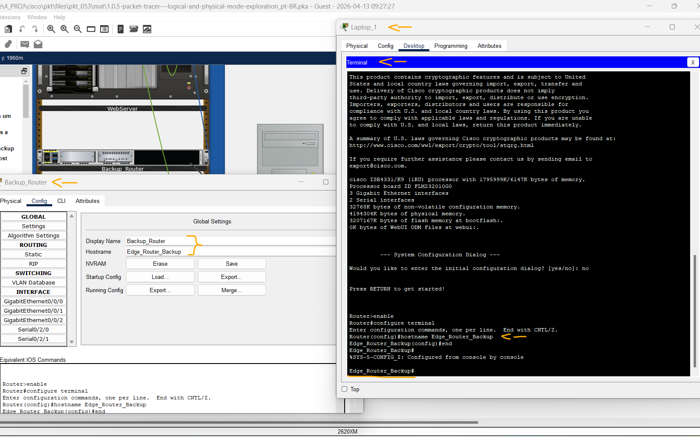

# Packet Tracer - Exploração dos modos lógico e físico   

### Cisco: <a href="../../../">cisco   </a>
### Cisco Networking Academy: cna   </a>
### Training Category: <a href="../../../pkt/">pkt</a>
### Software/Subject: network   </a>
### Course: <a href="./">pkt_053 (Packet Tracer - Exploração dos modos lógico e físico)   </a>

---

### Theme:
- Network

### Used Tools:
- Operating System (OS): 
  - Cisco Internetwork Operating System (Cisco IOS)   
  - Windows 11 
- Cloud Services:
  - Google Drive 
- Language:
  - HTML   
  - Markdown   
- Integrated Development Environment (IDE) and Text Editor:
  - Visual Studio Code (VS Code)   
- Versioning: 
  - Git   
- Repository:
  - GitHub   
- Network:
  - Cisco Packet Tracer   

---

<h3><a name="item00">Course Strcuture:</a></h3>

1. <a href="#item01">Parte 1: Investigar a barra de ferramentas inferior</a> 
2. <a href="#item02">Parte 2: Investigar dispositivos em um armário de fiação</a> 
3. <a href="#item03">Parte 3: Conecte dispositivos finais a dispositivos de rede</a> 
4. <a href="#item04">Parte 4: Instalar um roteador de backup</a> 
5. <a href="#item05">Parte 5: Configurar um nome de host</a> 
6. <a href="#item06">Parte 6: Explore o Resto da Rede</a> 

---

### Objective:
O objetivo desta atividade foi explorar o modo físico e obter uma visão geral do **Cisco Packet Tracer**, identificando diferentes dispositivos, realizando conexões com diversos tipos de cabos e acessando dispositivos intermediários para fins de configuração e gerenciamento.

### Folder Structure:
- [README.md](./README.md): Este documento de README, escrito em **Markdown**, com o conteúdo do laboratório.
- [0-aux](./0-aux/): Pasta auxiliar com imagens utilizadas na construção dos arquivos de README desse curso.

### Development:

<a name="item01"><h4>1. Parte 1: Investigar a barra de ferramentas inferior</h4></a>[Back to summary](#item00)

A imagem 01 mostra a topologia inicial.

<figure>
     
    <figcaption>Imagem 01.</figcaption>
</figure>
 

Clique nos locais para explorar a rede. Familiarize-se com as representações da rede nos modos Logical and Physical. No Physical mode, navegue para outras áreas, como Warrenton Data Center e Teleworker Home. As tecnologias usadas nesses locais são discutidas em maiores detalhes em cursos futuros.

A maioria dos dispositivos na Seward filial e no Warrenton data center já está implantada e configurada. Você pode explorar os dispositivos e as redes. Não é importante que você entenda tudo o que vê e faz nesta atividade. Sinta-se livre para explorar a rede por si mesmo. Dicas também aparecerão após um certo período. Você pode selecionar um nível de sugestões com a barra deslizante no canto inferior esquerdo. Responda às perguntas da melhor forma possível.

Você pode alternar entre esses modos a qualquer momento para comparar as diferenças clicando nos botões Logical (Shift-L) e Physical (Shift-P)

Por enquanto, veja o que você pode descobrir por conta própria. Não se preocupe em quebrar nada. Você sempre pode fechar o Packet Tracer e abrir uma nova cópia para começar a explorar novamente.

Quando terminar de explorar e responder a todas as perguntas, clique em Avançar para continuar.

- a. A barra de ferramentas de ícones no canto esquerdo inferior possui várias categorias de componentes de rede. Você deve ver as categorias que correspondem a Dispositivos de rede, Dispositivos finais e Componentes. A quarta categoria (com o ícone de raio) é Conexões e representa a mídia de rede suportada pelo Packet Tracer. As duas últimas categorias são Diversos e Conexão Multiusuário. Quais são as subcategorias para dispositivos de rede? 
- As subcategorias de Dispositivos de Rede no Packet Tracer são: roteadores, switches (comutadores), hubs, dispositivos sem fio, dispositivos de segurança e emulação WAN.
- b. No Physical Mode (Shift-P), quais são as cidades conectadas?
  - As cidades conectadas são Seward e Warrenton.
- c. No Physical Mode (Shift-P), qual é o nome do cabo submarino?
  - O cabo submarino utilizado é o Alaska United West (AU-West).
- d. No Logical Mode (Shift-L), quais são os dispositivos sem fio no Teleworker Home? (Dica: eles não estão conectados por uma linha preta sólida.)
  - Os dispositivos sem fio no Teleworker Homer são o Smartphone e o Home_Laptop.
- e. No Physical Mode (Shift-P), em qual instalação você pode entrar no SewardAlaskalocal?
  - No local SewardAlaska, é possível acessar a instalação Branch Office em Seward.
- f. Em quais locais você pode entrar na outra cidade?
  - Na cidade de Warrenton, é possível acessar as instalações Data Center e Teleworker.

<a name="item02"><h4>2. Parte 2: Investigar dispositivos em um armário de fiação</h4></a>[Back to summary](#item00)

- a. Se você foi explorar, volte para o Modo físico e Intercity agora. Na barra azul superior, clique em Físico e, em seguida, use os botões Painel de Navegação ou Voltar para navegar até Intercity.
- b. Clique em Seward e, em seguida, clique na filial.
- c. Clique no armário de fiação da filial. Observe que o armário de fiação tem um rack, um cabo Pegboard, uma mesa e uma prateleira. O rack contém dispositivos que podem ser montados em rack. Se você aumentar o zoom no rack (ferramenta de zoom ou Ctrl+roda de rolagem), poderá ver que os dispositivos estão aparafusados (montados) no rack. Abaixo do dispositivo de distribuição de energia, você encontrará um roteador. Os roteadores conectam redes diferentes.
- d. Abaixo do roteador estão dois switches. Esses switches fornecem conexões com fio para se conectar a outros dispositivos. Observe que os dispositivos têm um nome atribuído pelo administrador de rede. Quais dispositivos usam uma conexão com fio para se conectar para alternar ALS2?
  - Os dispositivos conectados por fio ao switch ALS2 são: o switch ALS1, utilizando duas conexões; o servidor web, com uma conexão; e um ponto de acesso no mesmo rack, cuja ligação pode dar a impressão de sair do armário de fiação para outro ambiente, mas está conectado logo abaixo do switch.
- e. Abaixo do Switches no Rack está um Access point sem fio chamado Access_Point. Os pontos de acesso sem fio usam uma conexão sem fio para se conectar a outros dispositivos. Mude para o modo lógico. Qual dispositivo está conectado ao Access_Point?
  - No modo lógico, o dispositivo conectado ao Access_Point é o Laptop_1, realizado por meio de uma conexão sem fio.
- f. Mude para o modo físico. Você deveria estar de volta ao armário de fiação da filial. Onde o dispositivo está conectado ao Access_Point fisicamente localizado?
  - No modo físico, o dispositivo conectado ao Access_Point, o Laptop_1, está localizado sobre a mesa ao lado do PC_1.

A imagem 02 exibe o armário de fiação no modo físico.

<figure>
     
    <figcaption>Imagem 02.</figcaption>
</figure>
 

<a name="item03"><h4>3. Parte 3: Conecte dispositivos finais a dispositivos de rede</h4></a>[Back to summary](#item00)

Nesta parte, você navegará até o Branch Office armário de fiação. Seward Você também conectará um PC a um switch usando um cabo Ethernet.

Os dispositivos podem ser conectados de várias maneiras. Para conectividade de rede, os dispositivos são normalmente conectados usando um cabo de cobre direto ou sem fio. Para conectividade de gerenciamento, os dispositivos são normalmente conectados usando um cabo de console ou cabo USB.

Nota: O Packet Tracer classificará o resto desta atividade. A qualquer momento, você pode clicar em Verificar resultados na parte inferior da janela Tarefas. Em seguida, clique em Itens de avaliação para ver quais itens você ainda não completou.

- a. Investigue o cabo Pegboard. Inclui dois cabos de console, dez cabos retos de cobre, quatro cabos de fibra, dois cabos coaxiais e dois cabos USB. Observe que as representações de cabo no modo físico são mais representativas de suas contrapartes do mundo real. Mude para o modo lógico. Observe que as representações do cabo são diferentes neste modo.
- b. Mude para o modo físico. Clique em um cabo reto direto de cobre do cabo Pegboard.
- c. Flutua o mouse sobre as portas em PC_1 até ver o pop-up FastEtherNet0. A outra porta RS232 é para conectar cabos de console.
- d. Com o cabo de cobre Straight-Through ainda selecionado, clique na porta FastEtherNet0 para conectar o cabo. A porta deve agora ser destacada em verde.
- e. Conecte a outra extremidade do cabo ao switch ALS2 clicando em uma porta Fast Ethernet vazia. O cabo deve agora estar pendurado entre PC_1 e a porta ALS2.
- f. PCs e laptops também podem ser conectados a dispositivos de rede usando um cabo de console ou um cabo USB. Esta conexão fornece acesso de gerenciamento. Clique um cabo do console do cabo Pegboard.
- g. Clique a porta RS232 em PC_1. A porta deve agora ser destacada em verde.
- h. Flutua o mouse sobre o Edge_Router e encontre a porta do Console. Você pode clicar com o botão direito do mouse > Inspecionar Frente para ampliar e facilitar a localização da porta.
- i. Clique a porta de console em Edge_Router para conectar o cabo do console. O cabo deve agora estar pendurado entre PC_1 e a porta de console no Edge_Router.

A imagem 03 mostra as conexões realizadas no PC_1.

<figure>
     
    <figcaption>Imagem 03.</figcaption>
</figure>
 

<a name="item04"><h4>4. Parte 4: Instalar um roteador de backup</h4></a>[Back to summary](#item00)

PCs e laptops também podem ser conectados a dispositivos de rede usando um cabo de console ou um cabo USB. Esta conexão fornece acesso de gerenciamento. O acesso de gerenciamento é usado para visualizar e alterar as configurações do dispositivo.

Nesta parte, você conectará um PC a um roteador usando um cabo de console.

Modelos mais recentes de dispositivos de rede podem ser acessados através de uma porta USB para configuração de gerenciamento. Isso é necessário porque laptops e PCs mais recentes normalmente não incluem uma porta RS232 para conexões de cabo de console.

- a. Investigue a prateleira. Isso inclui um inventário de dispositivos na filial de Seward que não estão instalados no momento.
- b. Clique e arraste o Backup_Router para um ponto vazio no rack.
- c. Alguns dispositivos não são ligados automaticamente quando instalados no Rack. Clique em Backup_Router > Inspecionar traseira. Encontre o botão liga/desliga e ligue o roteador.
- d. No cabo Pegboard, escolha um cabo USB. Retorne à vista traseira do Backup_Router e encontre a porta do console USB no extremo esquerdo. Clique na porta para conectar o cabo USB. A porta deve agora ser destacada em verde.
- e. Conecte a outra extremidade do cabo USB a qualquer uma das portas USB no Laptop_1. O cabo não balançará como os cabos fizeram para as conexões ao PC_1.

A imagem 04 evidencia a conexão via console USB estabelecida entre o Laptop_1 e o Backup_Router.

<figure>
     
    <figcaption>Imagem 04.</figcaption>
</figure>
 

<a name="item05"><h4>5. Parte 5: Configurar um nome de host</h4></a>[Back to summary](#item00)

Você está conectado Laptop_1 a Backup_Router via um cabo de console USB. Com o console USB conectado, você acessará a interface de linha de comando (CLI) do Backup_Router software de terminal e configurará um nome de host.

Cada computador, incluindo dispositivos de rede, como roteadores e switches, necessita de um sistema operacional para funcionar. Um sistema operacional de rede permite que o hardware do dispositivo funcione e fornece uma interface para interação dos usuários.

O sistema operacional de rede usado nos dispositivos Cisco é chamado Cisco Internetwork Operating System (IOS). Ela permite a criação de configurações que personalizam a operação de dispositivos de rede em diferentes ambientes de rede. A CLI pode ser acessada pela porta do console do dispositivo usando o software do terminal ou remotamente pelo Secure Shell (SSH). Os administradores de rede usam um computador para acessar o console do dispositivo para criar ou modificar a configuração do dispositivo.

Os administradores de rede normalmente atribuem um nome a dispositivos de rede. O nome do host é usado para identificar um dispositivo ao acessar o sistema operacional para configuração. Para fazer isso, você usará sua conexão de console com o Backup_Router. Depois que o nome do host tiver sido configurado, ele aparecerá como parte do prompt de comando do IOS.

Nesta parte, você configurará o nome do host em Backup_Router

- a. Clique Laptop_1 > Desktop na aba > Terminal.
- b. A configuração de terminal já está definida com a configuração de porta necessária. Clique em OK.
- c. Você está agora na linha de comando para Backup_Router e deve ver o seguinte.
  - `Would you like to enter the initial configuration dialog? [yes/no]: no`.
- d. Responda não à pergunta e pressione ENTER para obter o prompt de comando Router.
  - `no`.
- e. Digite os seguintes comandos para nomear o roteador Edge_Router_Backup. Observe que o hostname mudou do roteador para Edge_Router_Backup.
  - `enable` -> `configure terminal` -> `hostname Edge_Router_Backup` -> `end`.
- f. Feche a janela Laptop_1 e volte para o armário de fiação da filial.
- g. Observe que o nome de exibição para Backup_Router não foi alterado. Clique em Backup_Router > Config guia. Nos ajustes globais, observe que o rastreador de pacotes mantém dois nomes para o dispositivo: um nome de exibição e um hostname.

A imagem 05 confirma que o roteador de backup possui esses dois nomes atribuídos.

<figure>
     
    <figcaption>Imagem 05.</figcaption>
</figure>
 

<a name="item06"><h4>6. Parte 6: Explore o Resto da Rede</h4></a>[Back to summary](#item00)

Tire algum tempo para explorar o resto da rede. Familiarize-se com as representações da rede nos modos Lógico e Físico. No modo Físico, navegue para outras áreas, como o Data Center de Wellington e o Teleworker Home. As tecnologias usadas nesses locais são discutidas em mais detalhes nos cursos da Cisco Networking Academy. Por enquanto, veja o que você pode descobrir por conta própria. Não se preocupe em quebrar nada. Você sempre pode fechar o Packet Tracer e abrir uma nova cópia para começar a explorar novamente. 

Vamos refletir sobre o que você acabou de realizar.

- a. Além de Ethernet e cabos de console, quais são as outras maneiras de conectar dispositivos?
  - Além de cabos Ethernet e de console, os dispositivos também podem ser conectados por fibra óptica, cabos seriais, cabos USB e conexões sem fio.
- b. Qual é a diferença entre o rack de cabeamento, a tabela e a prateleira?
  - O rack de cabeamento organiza equipamentos de rede; a mesa representa a área de trabalho dos dispositivos finais; e a prateleira é usada para acomodar equipamentos ou dispositivos auxiliares no ambiente físico.
- c. Como o logical mode difere do physical mode?
  - O Logical Mode mostra a topologia e as conexões lógicas da rede, enquanto o Physical Mode apresenta a disposição física real dos dispositivos e do ambiente.