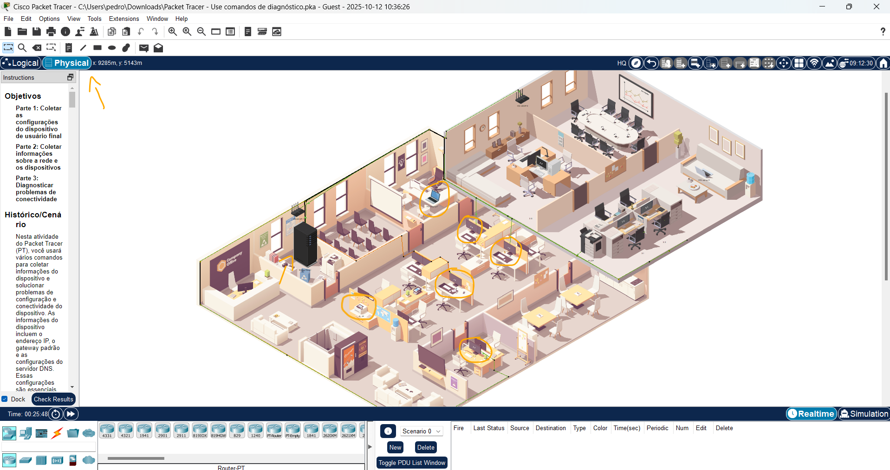
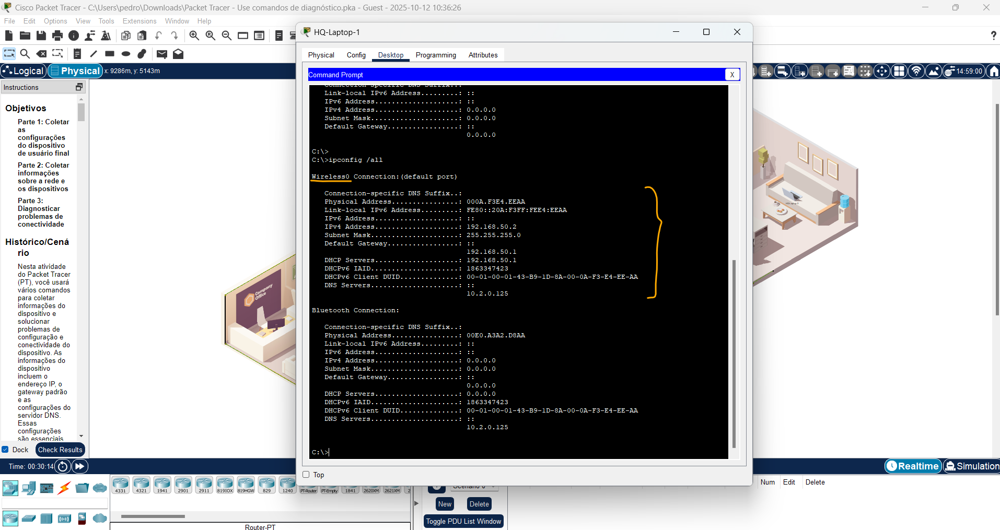
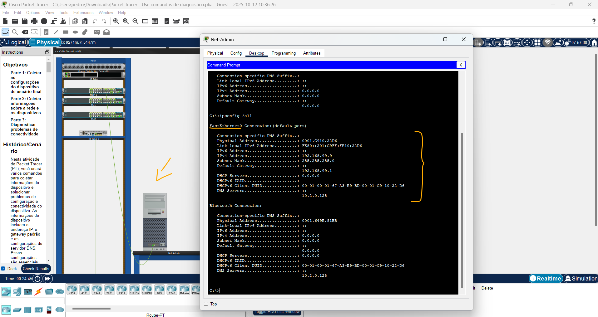
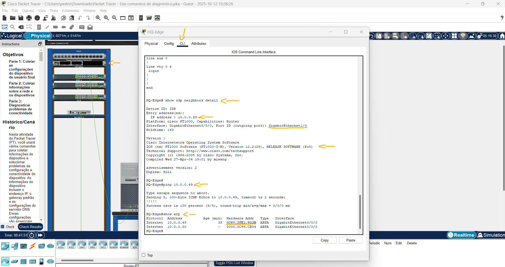
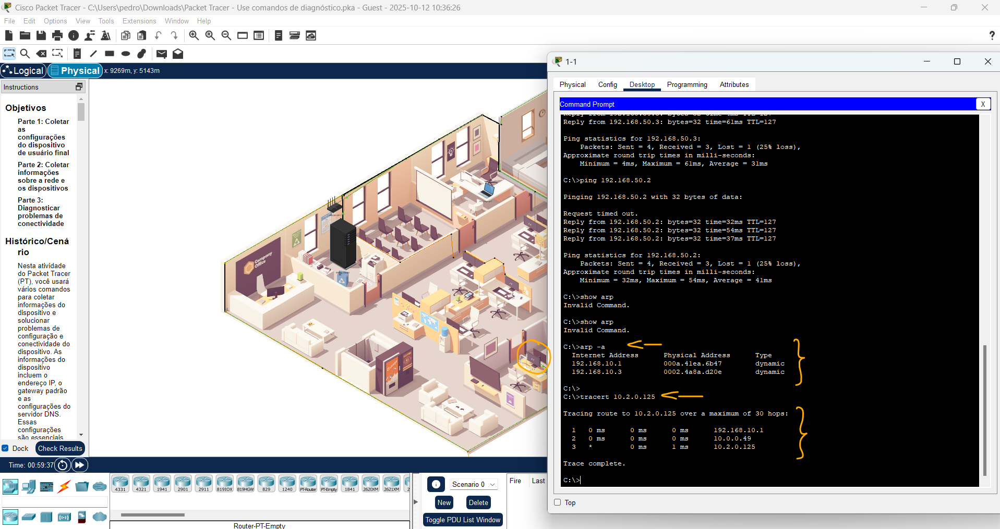
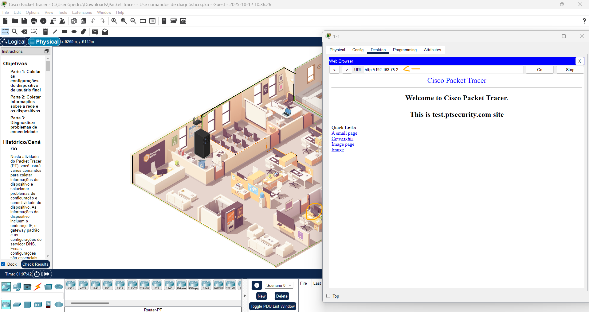
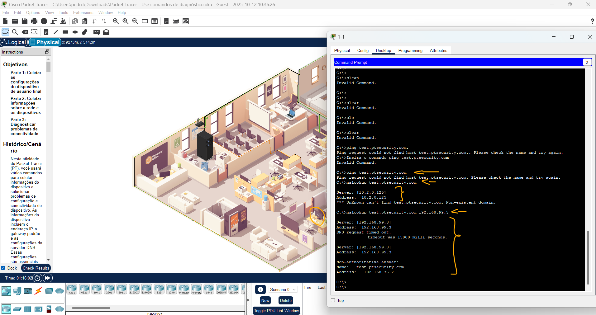
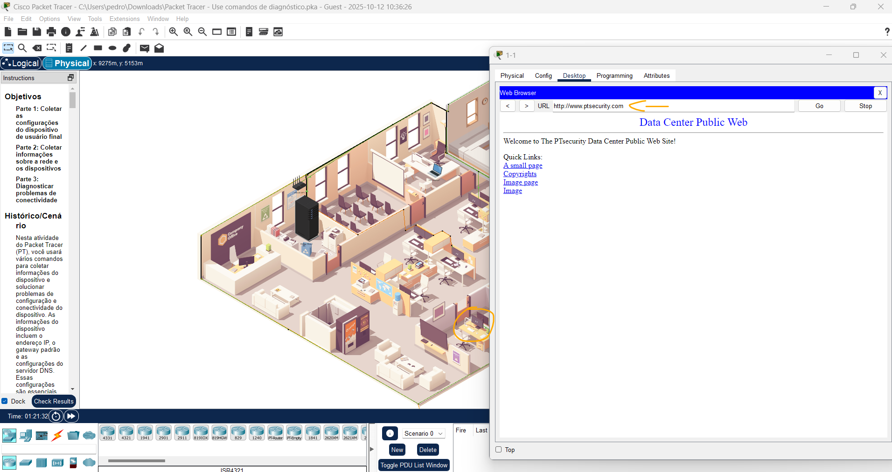
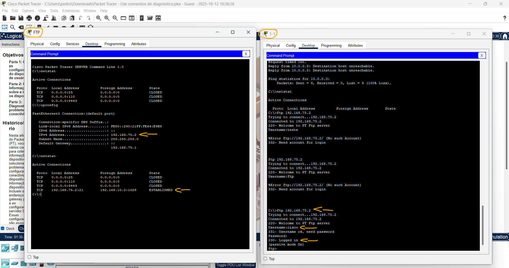
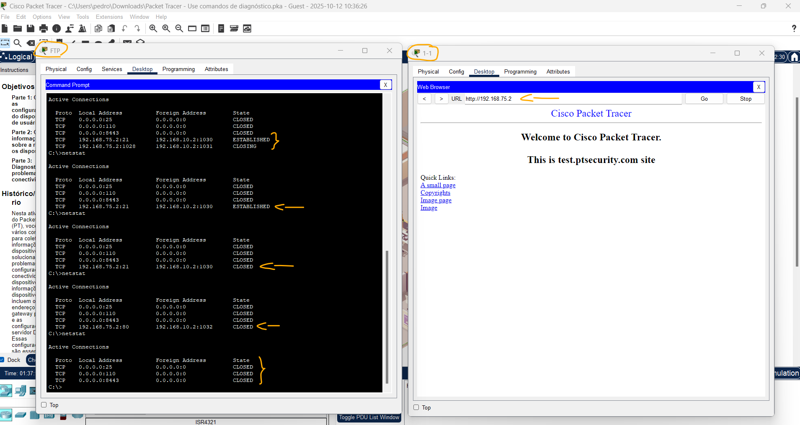

# Packet Tracer - Use comandos de diagnóstico   

### Cisco: <a href="../../../">cisco   </a>
### Cisco Networking Academy: cna   </a>
### Training Category: <a href="../../../pkt/">pkt</a>
### Software/Subject: network   </a>
### Course: <a href="./">pkt_054 (Packet Tracer - Use comandos de diagnóstico)   </a>

---

### Theme:
- Network

### Used Tools:
- Operating System (OS): 
  - Cisco Internetwork Operating System (Cisco IOS)   
  - Windows 11 
- Cloud Services:
  - Google Drive 
- Language:
  - HTML   
  - Markdown   
- Integrated Development Environment (IDE) and Text Editor:
  - Visual Studio Code (VS Code)   
- Versioning: 
  - Git   
- Repository:
  - GitHub   
- Network:
  - Cisco Packet Tracer 
  - ipconfig   
  - nslookup   
  - ping   
  - Trace Route (tracert)   

---

<h3><a name="item00">Course Strcuture:</a></h3>

1. <a href="#item01">Parte 1: Reúna as configurações do dispositivo de usuário final</a> 
  1.1 <a href="#item01.01">Etapa 1: Documente as configurações de endereço IP do HQ-Laptop-1.</a> 
  1.2 <a href="#item01.02">Etapa 2: Documente as configurações de endereço IP para Net-Admin.</a> 
2. <a href="#item02">Parte 2: Coletar informações sobre dispositivos de rede</a> 
  2.1 <a href="#item02.01">Etapa 1: Coletar informações de conexão de rede sobre o link entre a sede e o ISP.</a> 
  2.2 <a href="#item02.02">Etapa 2: Coletar informações de conexão de rede sobre os dispositivos em HQ.</a> 
3. <a href="#item03">Parte 3: Diagnosticar problemas de conectividade</a> 
  3.1 <a href="#item03.01">Etapa 1: testar uma URL para investigar um problema de conectividade.</a> 
  3.2 <a href="#item03.02">Etapa 2: Use o comando nslookup para verificar o serviço DNS.</a> 
  3.3 <a href="#item03.03">Etapa 3: Usar a saída do comando ping para diagnosticar problemas de conectividade.</a> 
  3.4 <a href="#item03.04">Etapa 4: Use o comando netstat para encontrar portas ativas e de escuta.</a> 

---

### Objective:
O objetivo desta atividade foi obter uma visão geral do **Cisco Packet Tracer**, identificando diferentes dispositivos, compreendendo como eles se comunicam, analisando a tabela ARP, a tabela de rotas e verificando o funcionamento de servidores DHCP, DNS e FTP.

### Folder Structure:
- [README.md](./README.md): Este documento de README, escrito em **Markdown**, com o conteúdo do laboratório.
- [0-aux](./0-aux/): Pasta auxiliar com imagens utilizadas na construção dos arquivos de README desse curso.

### Development:

<a name="item01"><h4>1. Parte 1: Reúna as configurações do dispositivo de usuário final</h4></a>[Back to summary](#item00)

A imagem 01 mostra a topologia inicial, indicando todos os dispositivos do primeiro andar.

<figure>
     
    <figcaption>Imagem 01.</figcaption>
</figure>
 

<a name="item01.01"><h4>1.1 Etapa 1: Documente as configurações de endereço IP do HQ-Laptop-1.</h4></a>[Back to summary](#item00)

- a. A atividade é aberta no cluster da sede. O armário de cabeamento é o chassi alto e preto no canto inferior esquerdo do primeiro andar. Localize todos os dispositivos no primeiro andar: PCs 1-1, 1-2, 1-3 e 1-4; impressora FL-1P; e HQ-Laptop-1.
- b. Clique na guia HQ-Laptop-1 > Desktop Prompt de comando.
- c. Inserir o comando ipconfig. 
  - `ipconfig`.
- c. Qual endereço IPv4 é exibido para a conexão Wireless0?
  - O endereço IPv4 exibido na conexão Wireless0 é 192.168.50.4.
- c. Se o endereço IPv4 estiver no intervalo 169.254.0.0/16, que método está sendo usado para atribuir endereços IPv4?
  - Isso indica que o dispositivo não conseguiu obter o endereçamento de um servidor DHCP. Portanto, o dispositivo atribuiu a si mesmo um pool de endereços 169.254.0.0/16 usado para endereçamento IP privado automático (APIPA).
- c. Por que o laptop recebeu um endereço IPv4 no intervalo de 169.254.0.0/16?
  - Porque ele não recebeu resposta do servidor DHCP a tempo.
- c. Se o endereço IPv4 estiver em 169.254.0.0/16, aguarde alguns segundos e repita o comando ipconfig.
- c. Quando o endereço IPv4 não está mais no intervalo 169.254.0.0/16, quais são as informações de endereçamento IP exibidas?
  - São exibidos IPv4, máscara de sub-rede, gateway padrão e endereços IPv6.
- c. Você vê um endereço de servidor de DNS? Explique.
  - Não. O comando ipconfig não mostra DNS; para isso, o comando necessário é o ipconfig /all.
- d. No prompt PC> digite o comando ipconfig /all.
  - `ipconfig /all`.
- d. Você vê um endereço de servidor de DNS? Definição
  - Sim, agora são mostradas as informações do servidor DNS.

A imagem 02 exibe as informações de endereçamento IP da interface Wireless0 do HQ-Laptop-1.

<figure>
     
    <figcaption>Imagem 02.</figcaption>
</figure>
 

<a name="item01.02"><h4>1.2 Etapa 2: Documente as configurações de endereço IP para Net-Admin.</h4></a>[Back to summary](#item00)

- a. Clique em Wiring Closet> Net-Admin> Desktop> Prompt de comando.
- b. No prompt PC> digite o comando ipconfig /all.
  - `ipconfig /all`.

A imagem 03 apresenta as informações de endereçamento IP do host Net-Admin no armário de fiação.

<figure>
     
    <figcaption>Imagem 03.</figcaption>
</figure>
 

<a name="item02"><h4>2. Parte 2: Coletar informações sobre dispositivos de rede</h4></a>[Back to summary](#item00)

<a name="item02.01"><h4>2.1 Etapa 1: Coletar informações de conexão de rede sobre o link entre a sede e o ISP.</h4></a>[Back to summary](#item00)

- a. No rack esquerdo do Wiring closet, clique em HQ-Edge > CLI.
- b. Pressione Enter para obter o prompt HQ-Edge > e, em seguida, insira o comando enable.
  - `enable`.
- c. Insira o comando show ip route | begin Gateway
  - `show ip route | begin Gateway`.
- c. Qual é o endereço do gateway de último recurso (ou gateway padrão)?
  - O gateway de último recurso é 0.0.0.0.
- c. Por que o endereço de próximo salto não é exibido?
  - Porque a rota padrão está diretamente conectada à interface GigabitEthernet0/0/0, então não há necessidade de mostrar um próximo salto específico.
- d. Digite o comando show running-config | begin ip route.
  - `show running-config | begin ip route`.
- d. Como a rota padrão é configurada?
  - A rota padrão é configurada com o comando ip route 0.0.0.0 0.0.0.0 GigabitEthernet0/0/0, apontando para a interface de saída.
- d. Ele usa o endereço do próximo salto?
  - Não. Ele utiliza a interface de saída (GigabitEthernet0/0/0) em vez do endereço IP do próximo salto.
- e. Escreva o comando show cdp neighbors detail no gateway.
  - `show cdp neighbors detail`.
- e. Qual é o endereço IPv4 do endereço do próximo salto (ISP)?
  - O endereço IPv4 do próximo salto (ISP) é 10.0.0.49.
- e. Qual porta do roteador ISP está conectada ao HQ-Edge?
  - A porta do roteador ISP conectada ao HQ-Edge é a GigabitEthernet1/0.
- e. Qual versão do IOS é usada no roteador ISP?
  - O roteador ISP utiliza o IOS versão 12.2(28).
- f. Insira o comando ping 10.0.0.49.
  - `ping 10.0.0.49`.
- g. Insira o comando show arp.
  - `show arp`.
- g. Qual é o endereço MAC da interface no roteador ISP conectado ao HQ-Edge?
  - O endereço MAC da interface do roteador ISP conectada ao HQ-Edge é 0060.2FE1.903B.
- h. Feche o HQ-Edge e saia do Wiring Closet.

A imagem 04 mostra o resultado dos últimos comandos executados no roteador HQ-Edge.

<figure>
     
    <figcaption>Imagem 04.</figcaption>
</figure>
 

<a name="item02.02"><h4>2.2 Etapa 2: Coletar informações de conexão de rede sobre os dispositivos em HQ.</h4></a>[Back to summary](#item00)

- a. De 1-1, 1-2, 1-3, 1-4, FL-1P e HQ-Laptop-1, use o comando ipconfig para encontrar seus endereços IPv4 e Gateway padrão.
  - `ipconfig`.
  - PC 1-1: IPv4: 192.168.10.2; Gateway Padrão: 192.168.10.1.
  - PC 1-2: IPv4: 192.168.10.3; Gateway Padrão: 192.168.10.1.
  - PC 1-3: IPv4: 192.168.20.4; Gateway Padrão: 192.168.20.1.
  - PC 1-4: IPv4: 192.168.20.3; Gateway Padrão: 192.168.20.1.
  - FL-1P: IPv4: 192.168.50.3; Gateway Padrão: 192.168.50.1 (Imagem 05).
  - HQ-Laptop-1: IPv4: 192.168.50.2; Gateway Padrão: 192.168.50.1.
- b. No PC 1-1, abra o prompt de comando e digite o comando arp -a.
  - `arp -a`.
- b. Que informações são exibidas?
  - Nenhuma informação, pois a tabela ARP estava vazia.
- c. Use o comando ping para pingar 1-2, 1-3, 1-4, FL-1P e HQ-Laptop-1.
  - PC1 - PC2: `ping 192.168.10.3`.
  - PC1 - PC3: `ping 192.168.20.4`.
  - PC1 - PC4: `ping 192.168.20.3`.
  - PC1 - FL-1P: `ping 192.168.50.3`.
  - PC1 - HQ-Laptop-1: `ping 192.168.50.2`.
- d. Insira o comando arp -a.
  - `arp -a`.
- d. Que informações são exibidas?
  - A tabela ARP passa a exibir duas entradas: uma do PC2 (192.168.10.3) e outra do gateway padrão (192.168.10.1).
- d. Por que as entradas na tabela ARP não contêm informações sobre dispositivos nas redes 192.168.20.0 e 192.168.50.0 enquanto o ping é bem-sucedido?
  - Porque as redes 192.168.20.0/24 e 192.168.50.0/24 estão em VLANs/sub-redes diferentes da 192.168.10.0/24. Assim, o PC consulta via ARP apenas o gateway padrão da sua VLAN, que faz o roteamento entre as sub-redes, permitindo o ping.
- e. Para encontrar a rota de um pacote para chegar ao servidor DNS, digite o comando tracert 10.2.0.125.
  - `tracert 10.2.0.125`.
- e. Que informações são exibidas?
  - É exibido o traçado da rota até o servidor DNS (10.2.0.125), mostrando os roteadores intermediários no caminho.
- e. Quantos roteadores, ou saltos, estão entre o PC 1-1 e o servidor DNS?
  - Há 2 saltos entre o PC 1-1 e o servidor DNS.

A imagem 05 mostra, no PC1-1, a tabela ARP populada e o resultado do comando tracert até o servidor DNS.

<figure>
     
    <figcaption>Imagem 05.</figcaption>
</figure>
 

<a name="item03"><h4>3. Parte 3: Diagnosticar problemas de conectividade</h4></a>[Back to summary](#item00)

Nesta parte, você usará uma variedade de técnicas e comandos de diagnóstico. Você usará o comando nslookup para consultar um servidor DNS e solucionar problemas de um banco de dados DNS. Você então diagnosticará por que um ping falha, mas o acesso à Web é bem-sucedido. Por fim, você usará o comando netstat para descobrir quais portas estão ouvindo no dispositivo de destino.

<a name="item03.01"><h4>3.1 Etapa 1: testar uma URL para investigar um problema de conectividade.</h4></a>[Back to summary](#item00)

- a. No PC 1-1 Feche o Prompt de Comando e clique em Navegador da Web.
- b. Insira a URL test.ptsecurity.com.
  - `test.ptsecurity.com`.
- b. A página da Web é exibida? Caso contrário, qual é a mensagem?
  - Não. A mensagem exibida é “Nome do host não resolvido”.
- c. Digite o endereço IP:192.168.75.2.
  - `192.168.75.2`.
- c. A página da Web é exibida?
  - Sim. A página da Web é exibida normalmente.
- c. Por que a página da Web é exibida usando o endereço IP, mas não o nome de domínio?
  - Porque o servidor DNS não conseguiu resolver o nome test.ptsecurity.com para um endereço IP. Ao usar o IP diretamente, essa etapa não é necessária.

A imagem 06 evidencia que a página da web é acessível apenas por endereço IP.

<figure>
     
    <figcaption>Imagem 06.</figcaption>
</figure>
 

<a name="item03.02"><h4>3.2 Etapa 2: Use o comando nslookup para verificar o serviço DNS.</h4></a>[Back to summary](#item00)

- a. Feche o Navegador da Web e clique em Prompt de Comando.
- b. Insira o comando ping test.ptsecurity.com.
  - `ping test.ptsecurity.com`.
- b. Qual mensagem foi exibida?
  - A mensagem exibida foi: “A solicitação de ping não pôde encontrar o host test.ptsecurity.com. Verifique o nome e tente novamente.”
- b. O que significa a mensagem?
  - Significa que o nome do host não foi resolvido pelo DNS, ou seja, não foi possível converter o domínio em um endereço IP.
- c. Insira o comando nslookup test.ptsecurity.com.
  - `nslookup test.ptsecurity.com`.
- c. Qual mensagem foi exibida?
  - A mensagem exibida foi: “UnKnown não conseguiu encontrar test.ptsecurity.com: Domínio inexistente.”
- c. Qual servidor é o servidor DNS padrão?
  - O servidor DNS padrão configurado no PC1-1 é 10.2.0.125.
- d. O comando nslookup oferece suporte ao uso de servidor DNS alternativo. Insira o nslookup /? para aprender as opções disponíveis para o comando.
  - `nslookup /?`.
- e. Insira o comando nslookup test.ptsecurity.com 192.168.99.3 e pressione Enter. Observação: o Packet Tracer pode levar vários segundos para convergir.
  - `nslookup test.ptsecurity.com 192.168.99.3`.
- e. Qual mensagem foi exibida?
  - Foi exibida uma resposta não autoritativa, informando o nome de domínio e o respectivo endereço IP.
- e. Na Etapa 2c, por que o nome de domínio não pode ser resolvido?
  - Porque o servidor DNS padrão (10.2.0.125) não possuía o registro do domínio, enquanto o servidor 192.168.99.3 tinha a entrada correta.

A imagem 07 demonstra que o servidor DNS padrão não possuía o registro necessário para resolver o domínio solicitado.

<figure>
     
    <figcaption>Imagem 07.</figcaption>
</figure>
 

<a name="item03.03"><h4>3.3 Etapa 3: Usar a saída do comando ping para diagnosticar problemas de conectividade.</h4></a>[Back to summary](#item00)

- a. Insira o comando ping mail.cybercloud.com.
  - `ping mail.cybercloud.com`
- b. Qual mensagem foi exibida?
  - Foi exibida a mensagem de que os 4 pacotes enviados foram perdidos.
- b. Que informações são indicadas pela mensagem?
  - A mensagem indica que o DNS resolveu o nome corretamente, mas o host não respondeu ao ping dentro do tempo limite.
- c. Insira o comando ping www.ptsecurity.com.
  - `ping www.ptsecurity.com`.
- c. Qual mensagem foi exibida?
  - Foi exibida a mensagem de que os 4 pacotes enviados foram perdidos.
- c. Que informações são indicadas pela mensagem?
  - A mensagem indica que o DNS resolveu o nome corretamente, mas o destino não respondeu ou estava inacessível, resultando em falha no ping.
- c. Feche o prompt de comando, abra o Navegador da Web e acesse www.ptsecurity.com.
  - `www.ptsecurity.com`.
- c. A página da Web é exibida?
  - Sim. A página da Web é exibida normalmente.
- c. O que se pode concluir?
  - Conclui-se que o site está acessível e o DNS funciona corretamente, mas o servidor bloqueia respostas ao ping (ICMP).

A imagem 08 evidencia o acesso ao site utilizando o nome de domínio.

<figure>
     
    <figcaption>Imagem 08.</figcaption>
</figure>
 

<a name="item03.04"><h4>3.4 Etapa 4: Use o comando netstat para encontrar portas ativas e de escuta.</h4></a>[Back to summary](#item00)

- a. Feche o navegador da Web e reabra o prompt de comando.
- b. Em HQ, clique em Wiring Closet
- c. No rack direito, clique em Servidor FTP> Desktop> Prompt de comando.
- d. Disponha as janelas de prompt de comando do PC 1-1 e do servidor FTP lado a lado.
- e. Na janela PC 1-1, digite o comando netstat.
  - `netstat`.
- e. Qual mensagen foi exibida? Ela mostra dados?
    - Foi exibida a tabela Active Connections, porém sem conexões ativas, mostrando apenas os campos Proto, Local Address, Foreign Address e State.
- f. No servidor FTP, insira o comando netstat.
  - `netstat`.
- f. Qual mensagen foi exibida? Ela mostra dados?
    - Sim. Foi exibida a tabela Active Connections com três conexões listadas.
- g. No servidor FTP, insira o comando ipconfig para determinar o endereço IP.
  - `ipconfig`.
- h. Do PC 1-1, inicie uma sessão FTP com o servidor FTP.
  - `ftp 192.168.75.2`.
- i. No servidor FTP, insira o comando netstat.
  - `netstat`.
- i. Qual mensagem foi exibida? Há alguma informação nova?
  - Sim. Uma nova conexão FTP do PC1-1 é exibida na tabela de conexões ativas.
- i. Qual porta é a porta de escuta e qual é o status da conexão?
  - A porta de escuta é a TCP 21, e o status da conexão é ESTABLISHED.
- j. Do PC 1-1, digite bob como o nome de usuário.
  - `bob`.
- k. No servidor FTP, insira o comando netstat.
  - `netstat`.
- k. As informações exibidas são alteradas?
  - Não. As informações permanecem inalteradas.
- l. No PC 1-1, digite cisco123 como a senha.
  - `cisco123`.
- m. No PC 1-1, digite o comando quit.
  - `quit`.
- n. No servidor FTP, insira o comando netstat.
  - `netstat`.
- n. As informações exibidas são alteradas? O que é indicado por essa nova entrada?
  - Sim. Após encerrar a sessão, o status da conexão é alterado para CLOSED.
- n. No PC 1-1, abra novamente a conexão e digite o comando put Sample2.txt e pressione Enter. Isso vai subir o arquivo Sample2.txt para o servidor de FTP
  - `ftp 192.168.75.2` -> `bob` -> `cisco123` -> `put Sample2.txt`.
- o. No servidor FTP, insira o comando netstat.
  - `netstat`.
- o. As informações exibidas são alteradas?
  - Sim. Além da conexão de controle já existente, surge uma segunda conexão temporária para a transferência do arquivo, que é encerrada logo após o envio.
- p. Aguarde alguns segundos e insira o comando netstat novamente.
  - `netstat`.
- p. As informações exibidas são alteradas?
  - Sim. Após alguns segundos, a conexão temporária de transferência é encerrada, permanecendo apenas a conexão principal do FTP.
- q. No PC 1-1, digite o comando quit.
  - `quit`.
- r. No servidor FTP, insira o comando netstat.
  - `nestat`.
- r. As informações exibidas são alteradas?
  - Sim. Após o comando quit, a conexão de controle FTP também é encerrada.
- s. Do PC 1-1, feche o prompt de comando e abra o Navegador da Web.
- t. Navegue até 192.168.75.2.
  - `192.168.75.2`.
- u. No servidor FTP, insira o comando netstat.
  - `netstat`.
- u. As informações exibidas são alteradas? O que essa nova entrada indica?
  - Sim. Surge uma nova conexão na porta 80, indicando que o acesso ao servidor está sendo feito via HTTP (navegador), e não mais por FTP.

As imagens 09 e 10 apresentam o estabelecimento das conexões entre o PC1-1 e o servidor FTP, com possível resumo do processo em comparação ao detalhado na Etapa 4.

<figure>
     
    <figcaption>Imagem 09.</figcaption>
</figure>
 

<figure>
     
    <figcaption>Imagem 10.</figcaption>
</figure>
 