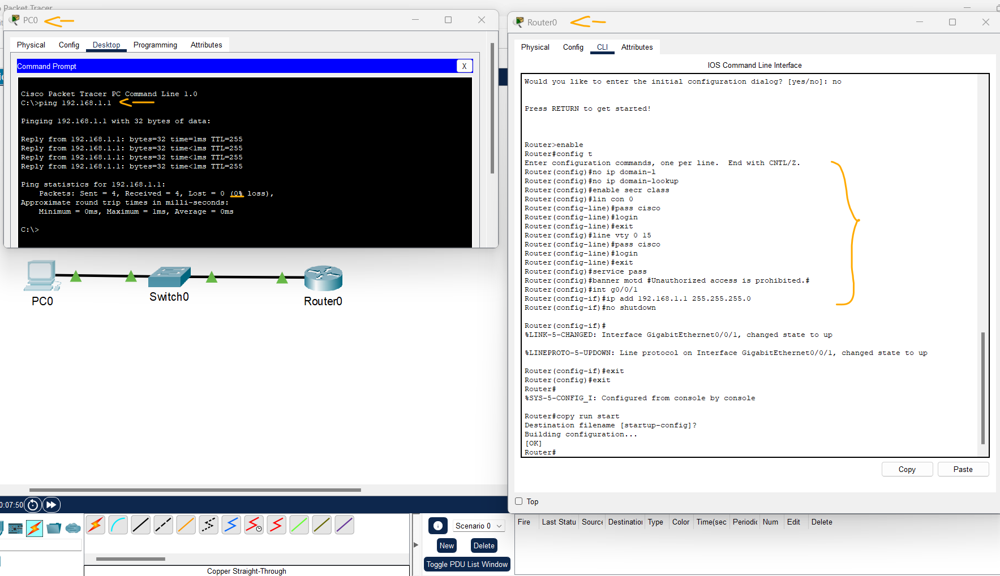
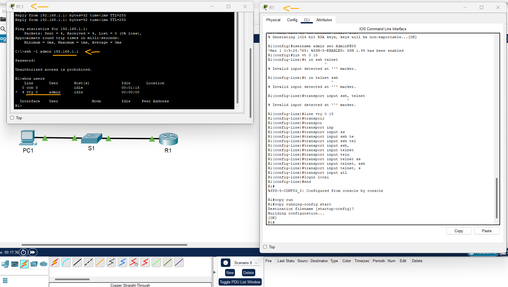
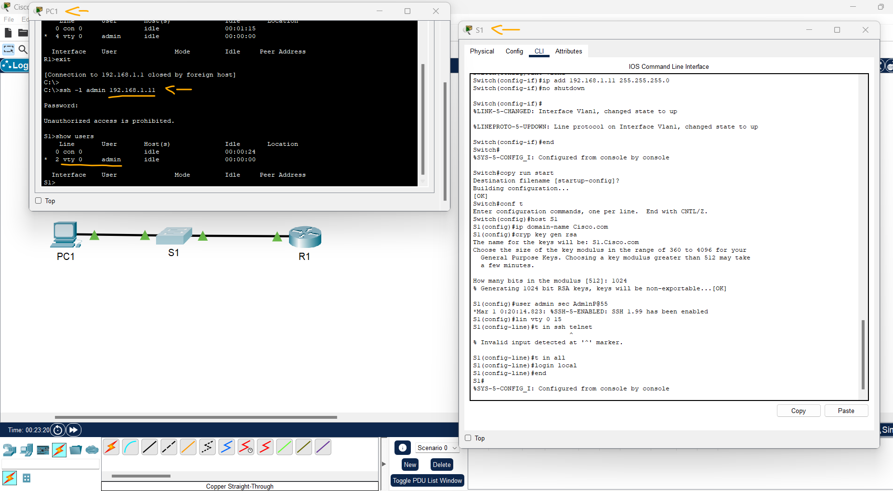
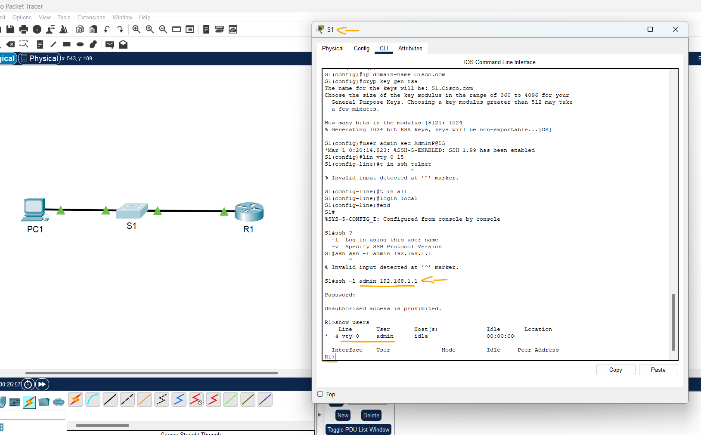

# Packet Tracer - Configurar dispositivos de rede com SSH   

### Cisco: <a href="../../../">cisco   </a>
### Cisco Networking Academy: cna   </a>
### Training Category: <a href="../../../pkt/">pkt</a>
### Software/Subject: network   </a>
### Course: <a href="./">pkt_055 (Packet Tracer - Configurar dispositivos de rede com SSH)   </a>

---

### Theme:
- Network

### Used Tools:
- Operating System (OS): 
  - Cisco Internetwork Operating System (Cisco IOS)   
  - Windows 11 
- Cloud Services:
  - Google Drive 
- Language:
  - HTML   
  - Markdown   
- Integrated Development Environment (IDE) and Text Editor:
  - Visual Studio Code (VS Code)   
- Versioning: 
  - Git   
- Repository:
  - GitHub   
- Network:
  - Cisco Packet Tracer   
  - OpenSSH   
  - ping   

---

<h3><a name="item00">Course Strcuture:</a></h3>

1. <a href="#item01">Parte 1: Implementar as Configurações Básicas dos Dispositivos</a> 
  1.1 <a href="#item01.01">Etapa 1: Instalar os cabos da rede conforme mostrado na topologia.</a> 
  1.2 <a href="#item01.02">Etapa 2: Inicializar e recarregar o roteador e o switch.</a> 
  1.3 <a href="#item01.03">Etapa 3: Configurar o roteador.</a> 
  1.4 <a href="#item01.04">Etapa 4: Configure o PC-A.</a> 
  1.5 <a href="#item01.05">Etapa 5: Verificar a conectividade de rede.</a> 
2. <a href="#item02">Parte 2: Configurar o Roteador para o Acesso SSH</a> 
  2.1 <a href="#item02.01">Etapa 1: Configurar a autenticação do dispositivo.</a> 
  2.2 <a href="#item02.02">Etapa 2: Configure o método de chave de criptografia.</a> 
  2.3 <a href="#item02.03">Etapa 3: Configure um nome de usuário no banco de dados local.</a> 
  2.4 <a href="#item02.04">Etapa 4: Habilitar o SSH nas linhas VTY.</a> 
  2.5 <a href="#item02.05">Etapa 5: Salve a configuração atual no arquivo de configuração inicial.</a> 
  2.6 <a href="#item02.06">Etapa 6: Estabelecer uma conexão SSH para o roteador.</a> 
3. <a href="#item03">Parte 3: Configurar o Switch para o Acesso SSH</a> 
  3.1 <a href="#item03.01">Etapa 1: Implementar as configurações básicas no switch.</a> 
  3.2 <a href="#item03.02">Etapa 2: Configurar o switch para a conectividade SSH.</a> 
  3.3 <a href="#item03.03">Etapa 3: Estabelecer uma conexão SSH com o switch.</a> 
4. <a href="#item04">Parte 4: SSH da CLI no Switch</a> 
  4.1 <a href="#item04.01">Etapa 1: Exibir os parâmetros disponíveis para o cliente SSH do Cisco IOS.</a> 
  4.2 <a href="#item04.02">Etapa 2: SSH para R1 de S1.</a> 
5. <a href="#item05">Perguntas para reflexão</a> 

---

### Objective:
O objetivo desta atividade foi compreender a configuração e a utilização do protocolo SSH para o acesso remoto seguro a dispositivos intermediários de rede, como roteadores e switches.

### Folder Structure:
- [README.md](./README.md): Este documento de README, escrito em **Markdown**, com o conteúdo do laboratório.
- [0-aux](./0-aux/): Pasta auxiliar com imagens utilizadas na construção dos arquivos de README desse curso.

### Development:

<a name="item01"><h4>1. Parte 1: Implementar as Configurações Básicas dos Dispositivos</h4></a>[Back to summary](#item00)

Na Parte 1, você vai configurar a topologia de rede e definir as configurações básicas, como os endereços IP das interfaces, o acesso a dispositivos e as senhas no roteador.

<a name="item01.01"><h4>1.1 Etapa 1: Instalar os cabos da rede conforme mostrado na topologia.</h4></a>[Back to summary](#item00)

- Selecionar os seguintes dispositivos: 1 PC, 1 switch 2960s e 1 roteador 4221.
- Conectar os dispositivos via cabo Ethernet nas suas respectivas interfaces.

<a name="item01.02"><h4>1.2 Etapa 2: Inicializar e recarregar o roteador e o switch.</h4></a>[Back to summary](#item00)

- Ligar os dispositivos.

<a name="item01.03"><h4>1.3 Etapa 3: Configurar o roteador.</h4></a>[Back to summary](#item00)

- a. Use o console para se conectar ao roteador e ative o modo EXEC privilegiado.
  - `enable`.
- b. Entre no modo de configuração.
  - `configure terminal`.
- c. Desative a pesquisa do DNS para evitar que o roteador tente converter comandos inseridos incorretamente como se fossem nomes de host. 
  - `no ip domain-lookup`.
- d. Atribua class como a senha criptografada do EXEC privilegiado.
  - `enable secret class`.
- e. Atribua cisco como a senha de console e habilite o login. 
  - `line console 0` -> `password cisco` -> `login` -> `exit`.
- f. Atribua cisco como a senha VTY e ative o login.
  - `line vty 0 15` -> `password cisco` -> `login` -> `exit`.
- g. Criptografe as senhas em texto simples.
  - `service password-encryption`.
- h. Crie um banner que avisará a qualquer pessoa que acessa o dispositivo que o acesso não autorizado é proibido.
  - `banner motd #Unauthorized access is prohibited.#`.
- i. Configure e ative a interface G0/0/1 no roteador usando as informações contidas na Tabela de Endereçamento.
  - `interface g0/0/1` -> `ip address 192.168.1.1 255.255.255.0` -> `no shutdown` -> `end`.
- j. Salve a configuração atual no arquivo de configuração inicial. 
  - `copy running-config startup-config`.

<a name="item01.04"><h4>1.4 Etapa 4: Configure o PC-A.</h4></a>[Back to summary](#item00)

- a. Configure o PC-A com um endereço IP e uma máscara de sub-rede. 
  - `192.168.1.3` -> `255.255.255.0`.
- b. Configure um gateway padrão para o PC-A.
  - `192.168.1.1`.

<a name="item01.05"><h4>1.5 Etapa 5: Verificar a conectividade de rede.</h4></a>[Back to summary](#item00)

- a. Faça ping em R1 do PC-A. Se o ping falhar, solucione os problemas da conexão.
  - `ping 192.168.1.1`.

A imagem 01 apresenta a configuração realizada no roteador, bem como a conectividade estabelecida com sucesso entre o PC e o dispositivo.

<figure>
     
    <figcaption>Imagem 01.</figcaption>
</figure>
 

<a name="item02"><h4>2. Parte 2: Configurar o Roteador para o Acesso SSH</h4></a>[Back to summary](#item00)

Usar o Telnet para conectar-se a um dispositivo de rede é um risco à segurança, porque todas as informações são transmitidas em um formato de texto não criptografado. O SSH criptografa os dados da sessão e fornece autenticação do dispositivo, que é o motivo de o SSH ser recomendado para conexões remotas. Na Parte 2, você configurará o roteador para aceitar conexões SSH nas linhas VTY.

<a name="item02.01"><h4>2.1 Etapa 1: Configurar a autenticação do dispositivo.</h4></a>[Back to summary](#item00)

O nome do dispositivo e o domínio são usados como a parte da chave criptografada quando gerada. Portanto, esses nomes devem ser inseridos antes da emissão do comando de crypto key.

- a. Configure o nome do dispositivo.
  - `enable` -> `class` -> `configure terminal` -> `hostname R1`.
- b. Configure o domínio do dispositivo.
  - `ip domain-name Cisco.com`.

<a name="item02.02"><h4>2.2 Etapa 2: Configure o método de chave de criptografia.</h4></a>[Back to summary](#item00)

- `crypto key generate rsa` -> `1024`.

<a name="item02.03"><h4>2.3 Etapa 3: Configure um nome de usuário no banco de dados local.</h4></a>[Back to summary](#item00)

- a. Configure um nome de usuário usando admin como nome de usuário e Adm1nP@55 como senha. 
  - `username admin secret Adm1nP@55`.

<a name="item02.04"><h4>2.4 Etapa 4: Habilitar o SSH nas linhas VTY.</h4></a>[Back to summary](#item00)

- a. Habilite Telnet e SSH nas linhas VTY de entrada usando o comando transport input.
  - `line vty 0 15` -> `transport input all`.
- b. Altere o método de login para usar o banco de dados local para a verificação de usuário.
  - `login local` -> `end`.

<a name="item02.05"><h4>2.5 Etapa 5: Salve a configuração atual no arquivo de configuração inicial.</h4></a>[Back to summary](#item00)

  - `copy running-config startup-config`.

<a name="item02.06"><h4>2.6 Etapa 6: Estabelecer uma conexão SSH para o roteador.</h4></a>[Back to summary](#item00)

- a. Inicie o Tera Term do PC-A.
- b. Estabeleça uma sessão SSH com o R1. Use o nome de usuário admin e a senha Adm1nP@55. Você deve conseguir estabelecer uma sessão SSH com R1. 
  - `ssh -l admin 192.168.1.1` -> `Adm1nP@55`.

A imagem 02 demonstra a conexão SSH estabelecida com sucesso entre o PC-A e o roteador R1, além das configurações necessárias realizadas no roteador para permitir esse acesso remoto.

<figure>
     
    <figcaption>Imagem 02.</figcaption>
</figure>
 

<a name="item03"><h4>3. Parte 3: Configurar o Switch para o Acesso SSH</h4></a>[Back to summary](#item00)

Na parte 3, você configurará o comutador para aceitar conexões SSH. Depois que o switch tiver sido configurado, estabeleça uma sessão SSH usando o Tera Term.

<a name="item03.01"><h4>3.1 Etapa 1: Implementar as configurações básicas no switch.</h4></a>[Back to summary](#item00)

- a. Use o console para se conectar ao switch e ative o modo EXEC privilegiado.
  - `enable`.
- b. Entre no modo de configuração.
  - `configure terminal`.
- c. Desative a pesquisa do DNS para evitar que o roteador tente converter comandos inseridos incorretamente como se fossem nomes de host.
  - `no ip domain-lookup`.
- d. Atribua class como a senha criptografada do EXEC privilegiado.
  - `enable secret class`.
- e. Atribua cisco como a senha de console e habilite o login.
  - `line console 0` -> `passwrod cisco` -> `login` -> `exit`.
- f. Atribua cisco como a senha VTY e ative o login.
  - `line vty 0 15` -> `password cisco` -> `login` -> `exit`.
- g. Criptografe as senhas de texto simples.
  - `service password-encryption`.
- h. Crie um banner que avisará a qualquer pessoa que acessa o dispositivo que o acesso não autorizado é proibido. 
  - `banner motd #Unauthorized access is prohibited.#`.
- i. Configure e ative a interface VLAN 1 no switch de acordo com a Tabela de Endereçamento.
  - `interface vlan1` -> `ip address 192.168.1.11 255.255.255.0` -> `no shutdown` -> `end`.
- j. Salve a configuração atual no arquivo de configuração inicial. 
  - `copy running-config startup-config`.
  
<a name="item03.02"><h4>3.2 Etapa 2: Configurar o switch para a conectividade SSH.</h4></a>[Back to summary](#item00)

Utilize os mesmos comandos usados para configurar o SSH no roteador na Parte 2 para configurar o SSH para o switch.

- a. Configure o nome do dispositivo conforme listado na Tabela de Endereçamento.
  - `enable` -> `class` -> `configure terminal` -> `hostname S1`.
- b. Configure o domínio do dispositivo.
  - `ip domain-name Cisco.com`.
- c. Configure o método de chave de criptografia.
  - `crypto key generate rsa` -> `1024`.
- d. Configure um nome de usuário no banco de dados local.
  - `username admin secret Adm1nP@55`.
- e. Habilite o Telnet e o SSH nas linhas VTY.
  - `line vty 0 15` -> `transport input ssh telnet`.
- f. Altere o método de login para usar o banco de dados local para a verificação de usuário.
  - `login local` -> `end`.

<a name="item03.03"><h4>3.3 Etapa 3: Estabelecer uma conexão SSH com o switch.</h4></a>[Back to summary](#item00)

- a. Inicie o Tera Term no PC-A, e o SSH na interface SVI de S1.
  - `ssh -l admin 192.168.1.11` -> `Adm1nP@55`.
- a. Você consegue estabelecer uma sessão SSH com o switch?
  - Sim, foi possível estabelecer a sessão SSH com o switch com sucesso, confirmando que as configurações de acesso remoto foram aplicadas corretamente.

A imagem 03 comprova que o switch foi devidamente configurado e o acesso SSH foi alcançado com sucesso.

<figure>
     
    <figcaption>Imagem 03.</figcaption>
</figure>
 

<a name="item04"><h4>4. Parte 4: SSH da CLI no Switch</h4></a>[Back to summary](#item00)

O cliente SSH é incorporado ao Cisco IOS e pode ser executado na CLI. Na Parte 4, você fará SSH para o roteador na CLI do switch.

<a name="item04.01"><h4>4.1 Etapa 1: Exibir os parâmetros disponíveis para o cliente SSH do Cisco IOS.</h4></a>[Back to summary](#item00)

- a. Use o ponto de interrogação(?)Para exibir as opções de parâmetros disponíveis com o comando ssh.
  - `ssh ?`.

<a name="item04.02"><h4>4.2 Etapa 2: SSH para R1 de S1.</h4></a>[Back to summary](#item00)

- a. Você deve usar a opção –l admin ao fazer o SSH para R1. Isso permite que você efetue login como usuário admin. Quando solicitado, digite Adm1nP@55 para a senha.
  - `ssh -l admin 192.168.1.1` -> `Adm1nP@55`.
- b. Você pode retornar ao S1 sem fechar a sessão SSH para R1 pressionando Ctrl+Shift+6. Solte as teclas Ctrl+Shift+6 e pressione x. O prompt do EXEC privilegiado do switch é exibido.
- c. Para retornar à sessão SSH em R1, pressione Enter em uma linha CLI em branco. Pode ser necessário pressionar Enter uma segunda vez para ver o prompt CLI do roteador.
- d. Para finalizar a sessão SSH em R1, digite exit no prompt do roteador.
  - `exit`.
- d. Que versões de SSH são compatíveis com a CLI?
  - A CLI é compatível com as versões SSH 1 e 2, sendo a versão 2 a mais recomendada por oferecer maior segurança.

A imagem 04 exibe o acesso remoto via SSH realizado a partir do switch para o roteador, confirmando a comunicação segura entre os dispositivos.

<figure>
     
    <figcaption>Imagem 04.</figcaption>
</figure>
 

<a name="item05"><h4>5. Perguntas para reflexão</h4></a>[Back to summary](#item00)

- a. Como você concederia acesso a um dispositivo de rede para vários usuários, cada um com seu próprio nome de usuário? 
  - O acesso pode ser concedido criando contas de usuário individuais no dispositivo de rede, de forma que cada pessoa utilize seu próprio nome de usuário e senha. Assim, é possível controlar as permissões de acesso, identificar quem realizou cada alteração e aumentar a segurança e a organização do gerenciamento da rede.