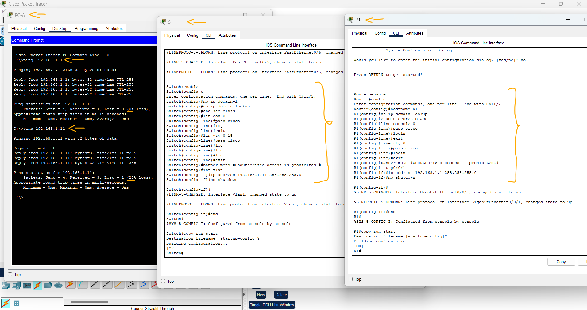
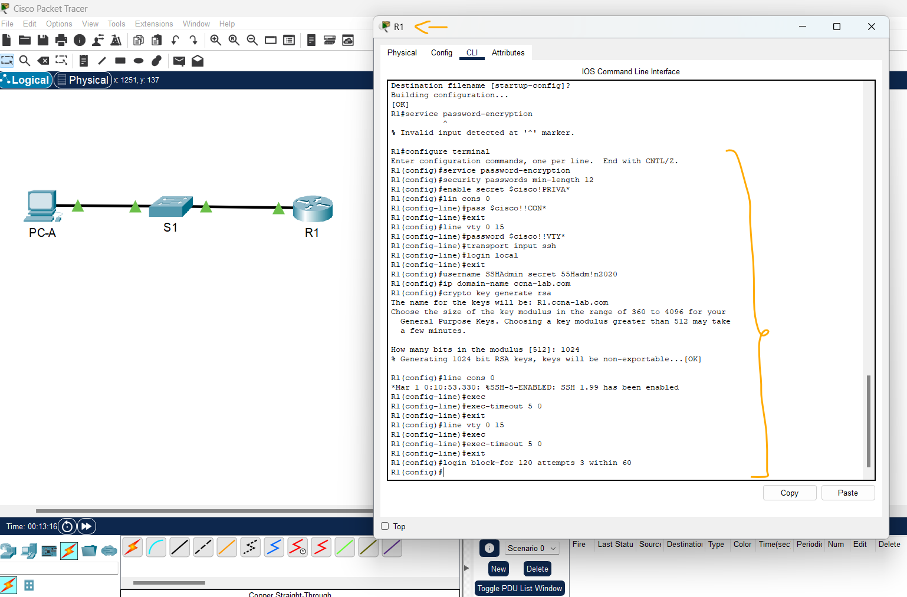
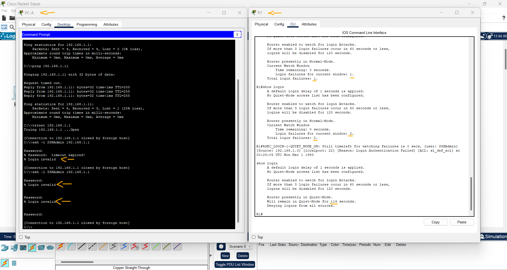
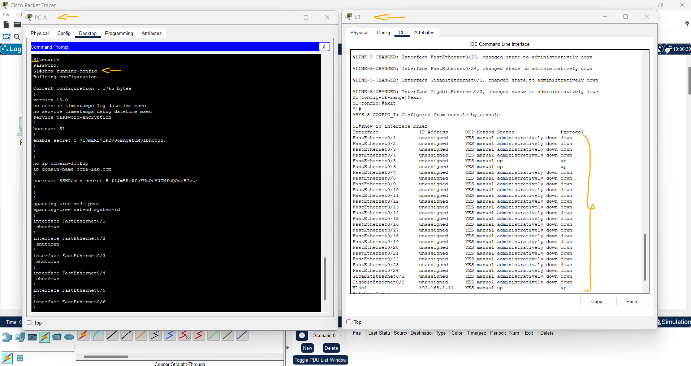

# Packet Tracer - Dispositivos de rede seguros   

### Cisco: <a href="../../../">cisco   </a>
### Cisco Networking Academy: cna   </a>
### Training Category: <a href="../../../pkt/">pkt</a>
### Software/Subject: network   </a>
### Course: <a href="./">pkt_056 (Packet Tracer - Dispositivos de rede seguros)   </a>

---

### Theme:
- Network

### Used Tools:
- Operating System (OS): 
  - Cisco Internetwork Operating System (Cisco IOS)   
  - Windows 11 
- Cloud Services:
  - Google Drive 
- Language:
  - HTML   
  - Markdown   
- Integrated Development Environment (IDE) and Text Editor:
  - Visual Studio Code (VS Code)   
- Versioning: 
  - Git   
- Repository:
  - GitHub   
- Network:
  - Cisco Packet Tracer 
  - OpenSSH   
  - ping   

---

<h3><a name="item00">Course Strcuture:</a></h3>

1. <a href="#item01">Parte 1: Implementar as Configurações Básicas dos Dispositivos</a> 
  1.1 <a href="#item01.01">Etapa 1: Instalar os cabos da rede conforme mostrado na topologia.</a> 
  1.2 <a href="#item01.02">Etapa 2: Inicializar e recarregar o roteador e o switch.</a> 
  1.3 <a href="#item01.03">Etapa 3: Configure o roteador e o switch.</a> 
  1.4 <a href="#item01.04">Etapa 4: Configure o PC-A.</a> 
  1.5 <a href="#item01.05">Etapa 5: Verificar a conectividade da rede.</a> 
2. <a href="#item02">Parte 2: Implementar as Medidas Básicas de Segurança no Roteador</a> 
  2.1 <a href="#item02.01">Etapa 1: Configure medidas de segurança.</a> 
3. <a href="#item03">Parte 3: Configure medidas de segurança.</a> 
  3.1 <a href="#item03.01">Etapa 1: Verificar se todas as portas não utilizadas estão desativadas.</a> 
  3.2 <a href="#item03.02">Etapa 2: Verificar se as medidas de segurança foram implementadas corretamente.</a> 
4. <a href="#item04">Parte 4: Implementar as Medidas Básicas de Segurança no Switch</a> 
  4.1 <a href="#item04.01">Etapa 1: Configure medidas de segurança.</a> 
  4.2 <a href="#item04.02">Etapa 2: Verificar se todas as portas não utilizadas estão desativadas.</a> 
  4.3 <a href="#item04.03">Etapa 3: Verificar se as medidas de segurança foram implementadas corretamente.</a> 
5. <a href="#item05">Perguntas para reflexão</a> 

---

### Objective:
O objetivo desta atividade foi implementar medidas básicas de segurança em dispositivos de rede e verificar o comportamento dessas configurações.

### Folder Structure:
- [README.md](./README.md): Este documento de README, escrito em **Markdown**, com o conteúdo do laboratório.
- [0-aux](./0-aux/): Pasta auxiliar com imagens utilizadas na construção dos arquivos de README desse curso.

### Development:

<a name="item01"><h4>1. Parte 1: Implementar as Configurações Básicas dos Dispositivos</h4></a>[Back to summary](#item00)

Na Parte 1, você vai configurar a topologia de rede e implementar as configurações básicas, como os endereços IP das interfaces, o acesso a dispositivos e as senhas nos dispositivos.

<a name="item01.01"><h4>1.1 Etapa 1: Instalar os cabos da rede conforme mostrado na topologia.</h4></a>[Back to summary](#item00)

- a. Conecte os dispositivos mostrados na topologia e instale os cabos, conforme necessário. 
  - Selecionar os seguintes dispositivos: 1 PC, 1 switch 2960s e 1 roteador 4221.
  - Conectar os dispositivos via cabo Ethernet nas suas respectivas interfaces.

<a name="item01.02"><h4>1.2 Etapa 2: Inicializar e recarregar o roteador e o switch.</h4></a>[Back to summary](#item00)

- Ligar os dispositivos.

<a name="item01.03"><h4>1.3 Etapa 3: Configure o roteador e o switch.</h4></a>[Back to summary](#item00)

- a. Use o console para se conectar ao dispositivo e habilite o modo EXEC privilegiado.
  - `enable`.
- b. Atribua o nome do dispositivo conforme a Tabela de Endereçamento.
  - Roteador: `configure terminal` -> `hostname R1`.
  - Switch: `configure terminal` -> `hostname S1`.
- c. Desative a pesquisa DNS para evitar que o roteador tente converter comandos inseridos incorretamente como se fossem nomes de host. 
  - `no ip domain-lookup`.
- d. Atribua class como a senha criptografada do EXEC privilegiado.
  - `enable secret class`.
- e. Atribua cisco como a senha de console e ative o login.
  - `line console 0` -> `password cisco` -> `login` -> `exit`.
- f. Atribua cisco como a senha de VTY e ative o login.
  - `line vty 0 15` -> `password cisco` -> `login` -> `exit`.
- g. Crie um banner para avisar às pessoas que o acesso não autorizado é proibido.
  - `banner motd #Unauthorized access is prohibited.#`.
- h. Configure e ative a interface G0/0/1 no roteador usando as informações contidas na Tabela de Endereçamento.
  - `interface g0/0/1` -> `ip address 192.168.1.1 255.255.255.0` -> `no shutdown` -> `end`.
- i. Configure a SVI padrão no switch com as informações de endereço IP contidas na Tabela de Endereçamento. 
  - `interface vlan1` -> `ip address 192.168.1.11 255.255.255.0` -> `no shutdown` -> `end`.
- j. Salve a configuração atual no arquivo de configuração inicial.
  - `copy running-config startup-config`.

<a name="item01.04"><h4>1.4 Etapa 4: Configure o PC-A.</h4></a>[Back to summary](#item00)

- a. Configure o PC-A com um endereço IP e uma máscara de sub-rede. 
  - `192.168.1.3` -> `255.255.255.0`.
- b. Configure um gateway padrão para o PC-A.
  - `192.168.1.1`.

<a name="item01.05"><h4>1.5 Etapa 5: Verificar a conectividade da rede.</h4></a>[Back to summary](#item00)

- a. Faça ping em R1 e S1 do PC-A. Se algum dos pings falhar, solucione o problema da conexão.
  - PC-A - R1: `ping 192.168.1.1`.
  - PC-A - S1: `ping 192.168.1.11`.

A imagem 01 apresenta a configuração realizada nos dispositivos de rede, bem como a conectividade estabelecida com sucesso entre o PC e esses dispositivos.

<figure>
     
    <figcaption>Imagem 01.</figcaption>
</figure>
 

<a name="item02"><h4>2. Parte 2: Implementar as Medidas Básicas de Segurança no Roteador</h4></a>[Back to summary](#item00)

<a name="item02.01"><h4>2.1 Etapa 1: Configure medidas de segurança.</h4></a>[Back to summary](#item00)

- a. Criptografe todas as senhas de texto não criptografado.
  - `cisco` -> `enable` -> `class` -> `configure terminal` -> `service password-encryption`.
- b. Configure o sistema para exigir uma senha mínima de 12 caracteres.
  - `security passwords min-length 12`.
- c. Altere as senhas (exec privilegiado, console e vty) para atender ao novo requisito de comprimento. Defina uma senha exec privilegiada para $cisco!PRIVA*
  - `enable secret $cisco!PRIVA*`.
- c. Defina a senha do console como $cisco!!CON*.
  - `line console 0` -> `password $cisco!!CON*` -> `exit`.
- c. Defina uma senha da linha vty para $cisco!!VTY*.
  - `line vty 0 15` -> `password $cisco!!VTY*`.
- d. Configurar o roteador para aceitar somente conexões SSH de locais remotos.
  - `transport input ssh` -> `login local` -> `exit`.
- d. Configure o nome do usuário SSHAdmin com uma senha criptografada pelo 55Hadm!n2020.
  - `username SSHAdmin secret 55Hadm!n2020`.
- d. O nome de domínio do roteador deve ser definido como ccna-lab.com.
  - `ip domain-name ccna-lab.com`.
- d. O módulo de chave deve ser 1024 bits.
  - `crypto key generate rsa` -> `1024`.
- e. Defina configurações de segurança e práticas recomendadas no console e nas linhas vty. Os usuários devem ser desconectados após 5 minutos de inatividade. 
  - `line console 0` -> `exec-timeout 5 0 ` -> `exit`.
  - `line vty 0 15` -> `exec-timeout 5 0 ` -> `exit`.
- e. O roteador não deve permitir logins por 2 minutos e 3 tentativas de login que ocorrem dentro de 1 minuto. 
  - `login block-for 120 attempts 3 within 60` -> `exit`.

A imagem 02 mostra as configurações de segurança aplicadas ao roteador.

<figure>
     
    <figcaption>Imagem 02.</figcaption>
</figure>
 

<a name="item03"><h4>3. Parte 3: Configure medidas de segurança.</h4></a>[Back to summary](#item00)

<a name="item03.01"><h4>3.1 Etapa 1: Verificar se todas as portas não utilizadas estão desativadas.</h4></a>[Back to summary](#item00)

- a. Por padrão, as portas do roteador são desativadas, mas é sempre prudente verificar se todas as portas não utilizadas estão em um estado “administratively down”. Isso pode ser verificado rapidamente emitindo o comando show ip interface brief. Todas as portas não utilizadas que não estão em um estado administrativamente inoperante devem ser desativadas usando o comando shutdown no modo de configuração de interface.
  - `cisco` -> `enable` -> `class` -> `show ip interface brief`.

<a name="item03.02"><h4>3.2 Etapa 2: Verificar se as medidas de segurança foram implementadas corretamente.</h4></a>[Back to summary](#item00)

- a. Use Tera Term no PC-A para telnet para R1.
  - `telnet 192.168.1.1`.
- a. O R1 aceita a conexão Telnet? Explique.
  - Não. O R1 não aceita a conexão Telnet porque as linhas VTY foram configuradas para permitir exclusivamente acesso via SSH, bloqueando tentativas de conexão por Telnet.
- b. Use Tera Term no PC-A para SSH para R1.
  - `ssh -l SSHAdmin 192.168.1.1`.
- b. O R1 aceita a conexão SSH?
  - Sim, o R1 aceita a conexão SSH, desde que seja informada a senha correta associada ao usuário especificado, permitindo assim a autenticação e o acesso ao dispositivo.
- c. Digite errado intencionalmente as informações de usuário e senha para ver se o acesso de login é bloqueado após duas tentativas. O que aconteceu após o login falhar pela segunda vez? 
  - Após a segunda falha no login, o acesso ainda não é bloqueado imediatamente. O bloqueio ocorre por 2 minutos caso sejam registradas três tentativas de login malsucedidas dentro do período de 1 minuto.
- d. De sua sessão de console no roteador, emita o comando login para examinar o status de login. No exemplo abaixo, o comando show login foi emitido no período de bloqueio de login de 120 segundos e mostra que o roteador está no Modo silencioso. O roteador não aceitará nenhuma tentativa de login por mais 111 segundos.
  - `show login`.
- e. Após os 120 segundos, SSH para R1 novamente e efetue login usando o nome de usuário SSHadmin e 55HAdm!N2020 para a senha.
  - `ssh -l SSHAdmin 192.168.1.1` -> `55Hadm!n2020`.
- e. Após você fazer o login com êxito, o que foi exibido?
  - Após o login bem-sucedido, foi exibido o prompt do modo EXEC do usuário, indicando que o acesso remoto SSH via VTY foi realizado com sucesso.
- f. Entre no modo EXEC privilegiado e use $cisco!PRIVA* para a senha.
  - `enable` -> `$cisco!PRIVA*`.
- f. Se você digitar incorretamente essa senha, será desconectado da sua sessão SSH após três tentativas falhas dentro de 60 segundos? Explique.
  - Não, a sessão não é desconectada. O bloqueio por tentativas falhas está relacionado apenas ao login SSH/Telnet nas VTYs, não à autenticação para acesso ao modo EXEC privilegiado.
- g. Emita o comando show running-config no prompt do EXEC privilegiado para visualizar as configurações de segurança aplicadas.
  - `show running-config`.

A Imagem 03 exibe o comportamento do sistema quando a tentativa de login atinge três falhas.

<figure>
     
    <figcaption>Imagem 03.</figcaption>
</figure>
 

<a name="item04"><h4>4. Parte 4: Implementar as Medidas Básicas de Segurança no Switch</h4></a>[Back to summary](#item00)

<a name="item04.01"><h4>4.1 Etapa 1: Configure medidas de segurança.</h4></a>[Back to summary](#item00)

- a. Criptografe todas as senhas de texto não criptografado.
  - `cisco` -> `enable` -> `class` -> `configure terminal` -> `service password-encryption`.
- b. Configure o sistema para exigir uma senha mínima de 12 caracteres.
  - `security passwords min-length 12`. (Não funciona no switch 2960).
- c. Altere as senhas (exec privilegiado, console e vty) para atender ao novo requisito de comprimento. Defina uma senha exec privilegiada para $cisco!PRIVA*.
  - `enable secret $cisco!PRIVA*`.
- c. Defina a senha do console como $cisco!!CON*.
  - `line console 0` -> `password $cisco!!CON*` -> `exit`.
- c. Defina uma senha da linha vty para $cisco!!VTY*.
  - `line vty 0 15` -> `password $cisco!!VTY*`.
- d. Configure ou alterne para aceitar somente conexões SSH de locais remotos.
  - `transport input ssh` -> `login local` -> `exit`.
- d. Configure o nome do usuário SSHAdmin com uma senha criptografada pelo 55Hadm!n2020.
  - `username SSHAdmin secret 55Hadm!n2020`.
- d. O nome de domínio do switch deve ser definido como ccna-lab.com.
  - `ip domain-name ccna-lab.com`.
- d. O módulo de chave deve ser 1024 bits.
  - `crypto key generate rsa` -> `1024`.
- e. Defina configurações de segurança e práticas recomendadas no console e nas linhas vty. Os usuários devem ser desconectados após 5 minutos de inatividade. 
  - `line console 0` -> `exec-timeout 5 0 ` -> `exit`.
  - `line vty 0 15` -> `exec-timeout 5 0 ` -> `exit`.
- e. O switch não deve permitir logins por 2 minutos e 3 tentativas de login que ocorrem dentro de 1 minuto. 
  - `login block-for 120 attempts 3 within 60` (Não funciona no switch 2960) -> `exit`.

<a name="item04.02"><h4>4.2 Etapa 2: Verificar se todas as portas não utilizadas estão desativadas.</h4></a>[Back to summary](#item00)

Por padrão, as portas do switch são habilitadas. Desative todas as portas que não estejam em uso no switch.

- a. Você pode verificar o status da porta do switch usando o comando show ip interface brief.
  - `show ip interface brief`.
- b. Use o comando interface range para desligar várias interfaces de uma vez.
  - `configure terminal` -> `interface range f0/1-4, f0/7-24, g0/1-2` -> `shutdown` -> `end`.
- c. Verifique se todas as interfaces inativas foram administrativamente desligadas.
  - `show ip interface brief`.

<a name="item04.03"><h4>4.3 Etapa 3: Verificar se as medidas de segurança foram implementadas corretamente.</h4></a>[Back to summary](#item00)

- a. Verifique se o Telnet foi desativado no switch.
  - `telnet 192.168.1.11`.
- b. Use SSH no switch e digite errado intencionalmente as informações de usuário e senha para ver se o acesso de login está bloqueado.
  - `ssh -l SSHAdmin 192.168.1.11` -> `teste1`.
- c. Após os 30 segundos, SSH para S1 novamente e efetue login usando o nome de usuário SSHadmin e 55Hadm!n2020 para a senha. 
  - `ssh -l SSHAdmin 192.168.1.11` -> `55Hadm!n2020`.
- c. O banner foi exibido após o login com êxito?
  - Sim. Após o login bem-sucedido, o banner foi exibido antes do prompt do modo EXEC do usuário, logo após a autenticação.
- d. Entre no modo EXEC privilegiado usando $cisco!PRIVA* como a senha.
  - `enable` -> `$cisco!PRIVA*`.
- e. Emita o comando show running-config no prompt do EXEC privilegiado para visualizar as configurações de segurança aplicadas.
  - `show running-config`.

A imagem 04 ilustra o acesso remoto via SSH do PC ao switch, juntamente com a visualização das configurações de inicialização do dispositivo.

<figure>
     
    <figcaption>Imagem 04.</figcaption>
</figure>
 

<a name="item05"><h4>5. Perguntas para reflexão</h4></a>[Back to summary](#item00)

- a. O comando password cisco foi inserido para o console e as linhas VTY em sua configuração básica na parte 1. Quando essa senha é usada depois que as medidas de segurança de práticas recomendadas foram aplicadas?
  - As senhas configuradas anteriormente para o console e para as linhas VTY continuam válidas e podem ser utilizadas normalmente, desde que não sejam alteradas. As políticas de segurança aplicadas posteriormente não modificam senhas já existentes, atuando apenas sobre novas configurações ou alterações.
- b. As senhas pré-configuradas são menores que 10 caracteres afetadas pelo comando de senhas de segurança comprimento mínimo 12?
  - Não. Embora sejam inferiores ao comprimento mínimo definido, as senhas pré-configuradas não são afetadas, pois foram estabelecidas antes da aplicação da política. A exigência de comprimento mínimo passa a valer apenas para novas senhas ou para a modificação das já existentes.