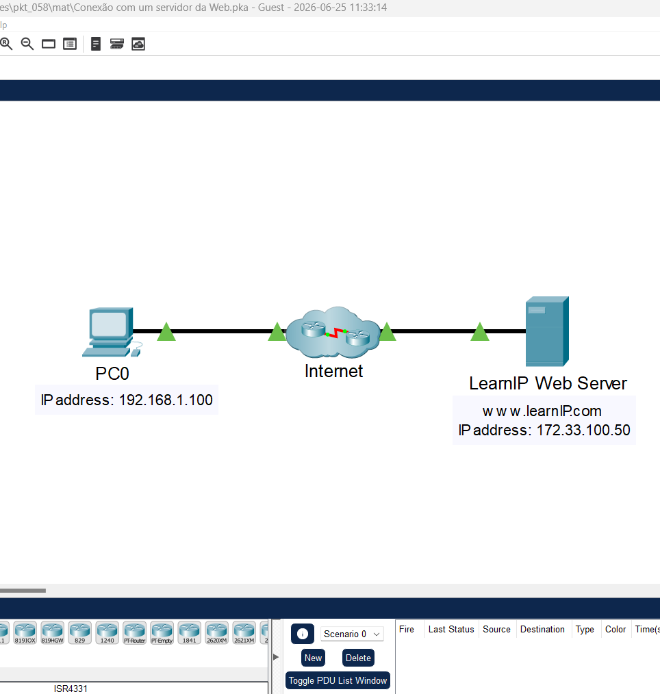
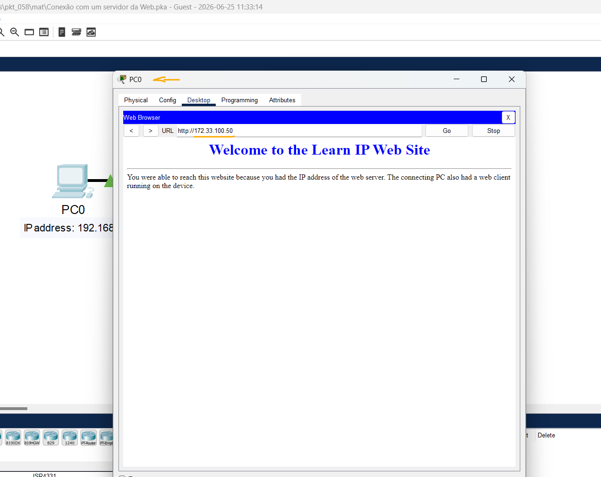

# Packet Tracer - Conectar-se a um servidor Web   

### Cisco: <a href="../../../">cisco   </a>
### Cisco Networking Academy: cna   </a>
### Training Category: <a href="../../../pkt/">pkt</a>
### Software/Subject: network   </a>
### Course: <a href="./">pkt_058 (Packet Tracer - Conectar-se a um servidor Web)   </a>

---

### Theme:
- Network

### Used Tools:
- Operating System (OS): 
  - Windows 11 
- Cloud Services:
  - Google Drive 
- Language:
  - HTML   
  - Markdown   
- Integrated Development Environment (IDE) and Text Editor:
  - Visual Studio Code (VS Code)   
- Versioning: 
  - Git   
- Repository:
  - GitHub   
- Network:
  - Cisco Packet Tracer   
  - ping   
  
---

<h3><a name="item00">Course Strcuture:</a></h3>

1. <a href="#item01">Parte 1: Verificar a conectividade ao servidor da Web</a> 
2. <a href="#item02">Parte 2: Conecte-se ao servidor da Web através do cliente da Web.</a> 

---

### Objective:
O objetivo desta atividade foi demonstrar como verificar a conectividade com um servidor web na Internet utilizando tanto a interface de linha de comando, por meio do comando ping, quanto a interface gráfica, por meio de um navegador web.

### Folder Structure:
- [README.md](./README.md): Este documento de README, escrito em **Markdown**, com o conteúdo do laboratório.
- [0-aux](./0-aux/): Pasta auxiliar com imagens utilizadas na construção dos arquivos de README desse curso.

### Development:

<a name="item01"><h4>1. Parte 1: Verificar a conectividade ao servidor da Web</h4></a>[Back to summary](#item00)

A imagem 01 mostra a topologia inicial.

<figure>
     
    <figcaption>Imagem 01.</figcaption>
</figure>
 

- a. Abra a janela do prompt de comando do host de origem. Selecione PC0.
- b. Selecione a guia Desktop > Command Prompt.
- c. Verificar a conectividade ao servidor da Web. No prompt de comando, pingue o endereço IP do servidor web digitando ping 172.33.100.50.
  - `ping 172.33.100.50`.
- c. Uma resposta verifica a conectividade do cliente com o servidor web de destino. A resposta pode atingir o tempo limite enquanto os dispositivos carregam e o ARP é executado.
- d. Feche somente a janela do prompt de comando ao selecionar o x na janela do prompt de comando. Certifique-se de deixar a janela de configurações do PC0 aberta.

<a name="item02"><h4>2. Parte 2: Conecte-se ao servidor da Web através do cliente da Web.</h4></a>[Back to summary](#item00)

- a. Na guia Desktop no PC0, escolha Web Browser.
- b. Insira 172.33.100.50 na URL e clique em Go. O cliente Web será conectado ao servidor Web através do endereço IP e abrirá a página da Web. Quais mensagens você viu após a página Web ter sido carregada?
  - Welcome to the Learn IP Web Site.

A imagem 02 exibe a página da web do servidor acessado.

<figure>
     
    <figcaption>Imagem 02.</figcaption>
</figure>
 