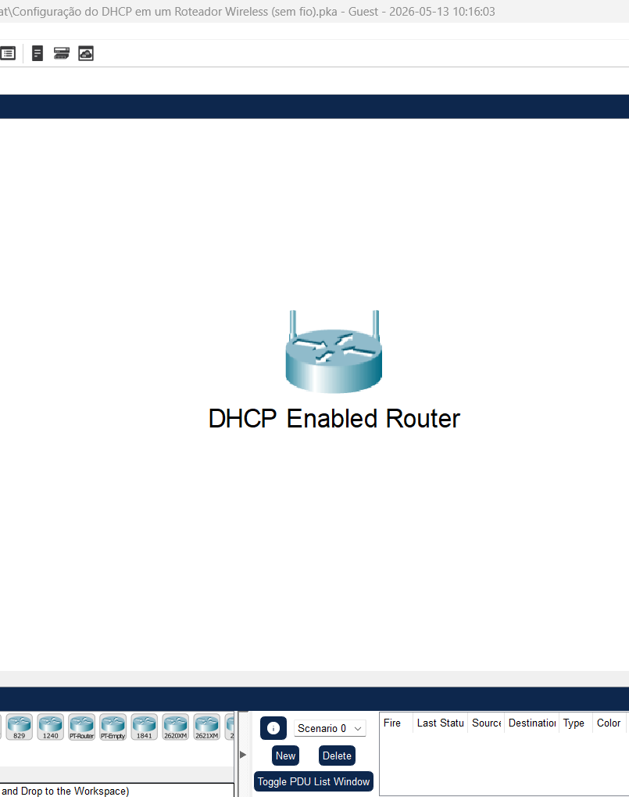
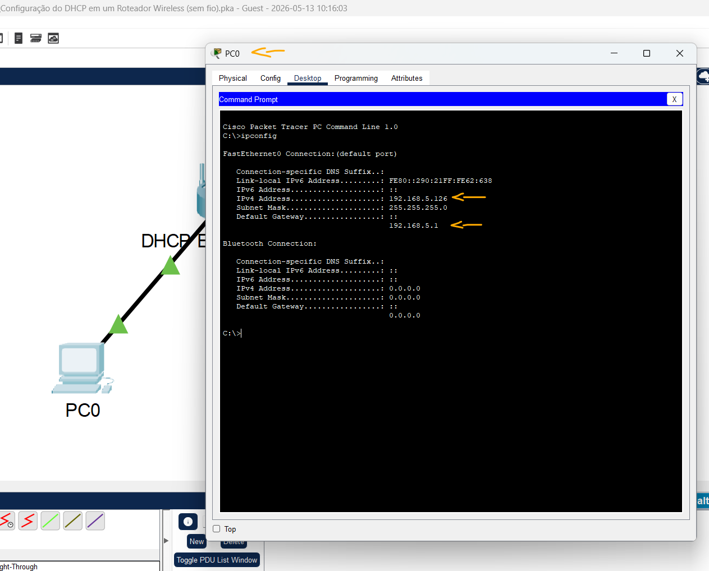
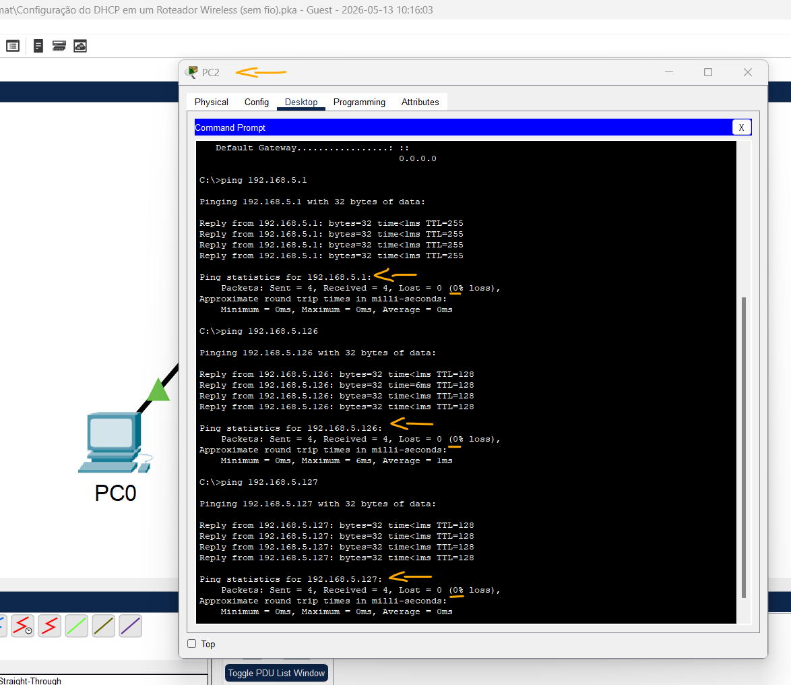

# Packet Tracer – Configuração do DHCP em um Roteador Wireless (sem fio)   

### Cisco: <a href="../../../">cisco   </a>
### Cisco Networking Academy: cna   </a>
### Training Category: <a href="../../../pkt/">pkt</a>
### Software/Subject: network   </a>
### Course: <a href="./">pkt_059 (Packet Tracer – Configuração do DHCP em um Roteador Wireless (sem fio))   </a>

---

### Theme:
- Network

### Used Tools:
- Operating System (OS): 
  - Cisco Internetwork Operating System (Cisco IOS)   
  - Windows 11 
- Cloud Services:
  - Google Drive 
- Language:
  - HTML   
  - Markdown   
- Integrated Development Environment (IDE) and Text Editor:
  - Visual Studio Code (VS Code)   
- Versioning: 
  - Git   
- Repository:
  - GitHub   
- Network:
  - Cisco Packet Tracer   
  - ipconfig   
  - ping   

---

<h3><a name="item00">Course Strcuture:</a></h3>

1. <a href="#item01">Parte 1: Configurar a topologia de rede</a> 
2. <a href="#item02">Parte 2: Observar as configurações DHCP padrão</a> 
3. <a href="#item03">Parte 3: Altere os endereços IP padrão do roteador sem fio.</a> 
4. <a href="#item04">Parte 4: Altere o intervalo de endereços DHCP padrão.</a> 
5. <a href="#item05">Parte 5: Ative o DHCP nos outros PCs.</a> 
6. <a href="#item06">Parte 6: Verifique a conectividade</a> 

---

### Objective:
O objetivo desta atividade foi conectar e configurar três hosts em uma rede local utilizando um roteador sem fio, realizando a configuração do serviço DHCP para uma faixa específica de endereços IP e configurando os dispositivos para obterem automaticamente suas informações de rede por meio desse serviço.

### Folder Structure:
- [README.md](./README.md): Este documento de README, escrito em **Markdown**, com o conteúdo do laboratório.
- [0-aux](./0-aux/): Pasta auxiliar com imagens utilizadas na construção dos arquivos de README desse curso.

### Development:

<a name="item01"><h4>1. Parte 1: Configurar a topologia de rede</h4></a>[Back to summary](#item00)

A imagem 01 mostra a topologia inicial.

<figure>
     
    <figcaption>Imagem 01.</figcaption>
</figure>
 

- a. Adicione três PCs genéricos.
- b. Conecte cada PC a uma porta Ethernet a um roteador sem fio com cabos diretos.

<a name="item02"><h4>2. Parte 2: Observar as configurações DHCP padrão</h4></a>[Back to summary](#item00)

- a. Após as luzes amarelas ficarem verdes, clique em PC0. Clique na guia Desktop. Selecione IP Configuration. Selecione DHCP para receber um endereço IP do roteador habilitado para DHCP. Anote o endereço IP do gateway padrão.
  - `192.168.0.1`
- b. Feche a janela IP Configuration.
- c. Abra um Navegador Web.
- d. Digite o endereço IP do gateway padrão registrado anteriormente no campo URL. Quando solicitado, insira o nome de usuário admin e a senha admin.
- e. Role pela página Configuração Básica para visualizar as configurações padrão, incluindo o endereço IP padrão do roteador sem fio.
- f. Observe que o DHCP está ativado, o endereço inicial da faixa DHCP e a faixa dos endereços disponíveis aos clientes.

<a name="item03"><h4>3. Parte 3: Altere os endereços IP padrão do roteador sem fio.</h4></a>[Back to summary](#item00)

- a. Na seção Configurações do IP do Roteador, altere o endereço IP para: 192.168.5.1.
- b. Vá até o final da página e clique em Save Settings (Salvar Configurações).
- c. Se tudo for feito corretamente, a página Web exibirá uma mensagem de erro. Feche o navegador Web.
- d. Clique em IP Configuration para renovar o endereço IP atribuído. Clique em Static (Estático). Clique em DHCP para receber novas informações de endereço IP do roteador sem fio.
- e. Abra o Navegador Web, digite o endereço IP 192.168.5.1 no campo URL. Quando solicitado, insira o nome de usuário admin e a senha admin.

<a name="item04"><h4>4. Parte 4: Altere o intervalo de endereços DHCP padrão.</h4></a>[Back to summary](#item00)

- a. Observe que o endereço IP inicial do servidor DHCP é atualizado para a mesma rede do IP do roteador.
- b. Altere o endereço IP inicial de 192.168.5.100 para 192.168.5.126.
- c. Altere o Número Máximo de Usuários para 75.
- d. Vá até o final da página e clique em Save Settings (Salvar Configurações). Feche o Navegador Web.
- e. Clique em IP Configuration para renovar o endereço IP atribuído. Clique em  Static (Estático). Clique em DHCP para receber novas informações de endereço IP do roteador sem fio.
- f. Selecione Command Prompt. Insira ipconfig. Anote o endereço IP do PC0:
  - `192.168.5.126`.

A imagem 02 mostra que o PC0 recebeu o endereço IP 192.168.5.126, correspondente ao primeiro endereço disponível no pool DHCP configurado no roteador.

<figure>
     
    <figcaption>Imagem 02.</figcaption>
</figure>
 

<a name="item05"><h4>5. Parte 5: Ative o DHCP nos outros PCs.</h4></a>[Back to summary](#item00)

- a. Clique em PC1.
- b. Selecione a guia Desktop.
- c. Selecione Configuração de IP.
- d. Clique em DHCP. Anote o endereço IP do PC1:
  - `192.168.5.127`.
- e. Feche a janela de configuração de
- f. Ative o DHCP no PC2 seguindo as etapas para o PC1.
  - `192.168.5.128`.

<a name="item06"><h4>6. Parte 6: Verifique a conectividade</h4></a>[Back to summary](#item00)

- a. Clique no PC2 e selecione a guia Desktop.
- b. Selecione Command Prompt.
- c. Digite ipconfig no prompt para visualizar a configuração de IP.
- d. No prompt, digite ping 192.168.5.1 para pingar o roteador wireless.
  - `ping 192.168.5.1`.
- e. Execute o comando ping 192.168.5.126 para fazer ping em PC0.
  - `ping 192.168.5.126`.
- f. No prompt, digite ping 192.168.5.127 para fazer ping em PC1.
  - `ping 192.168.5.127`.
- g. Os pings para todos os dispositivos devem ser bem-sucedidos.

A imagem 03 comprova a conectividade entre todos os hosts da rede e o gateway padrão, evidenciando o correto funcionamento da comunicação local.

<figure>
     
    <figcaption>Imagem 03.</figcaption>
</figure>
 