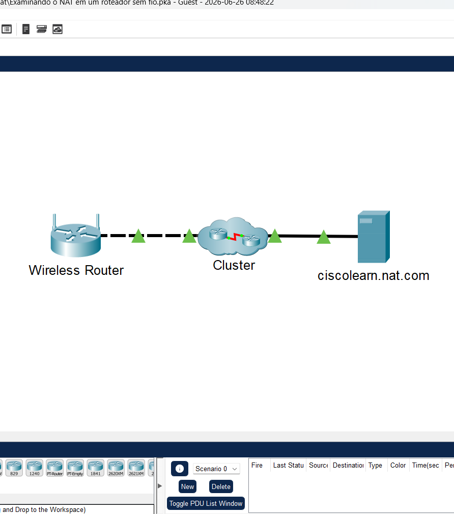
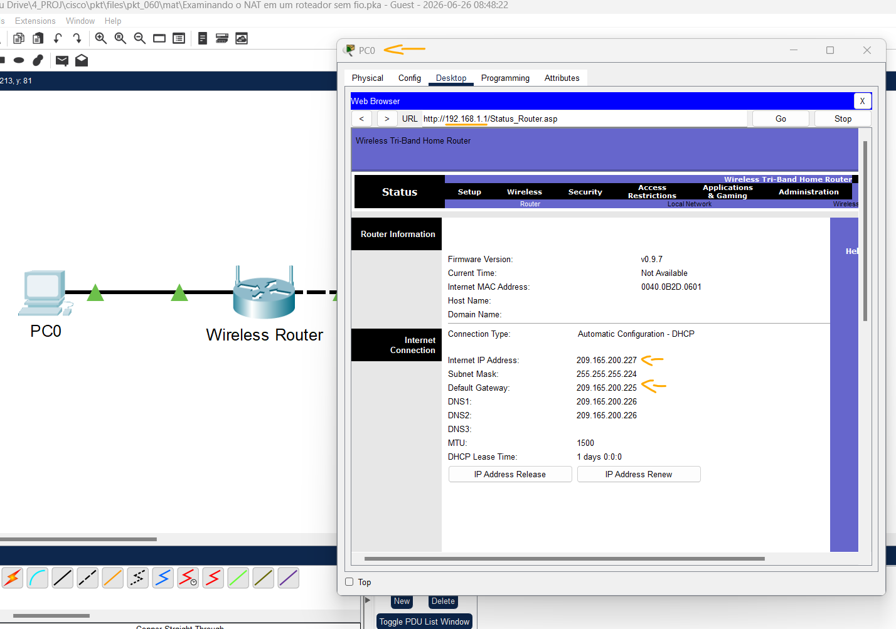
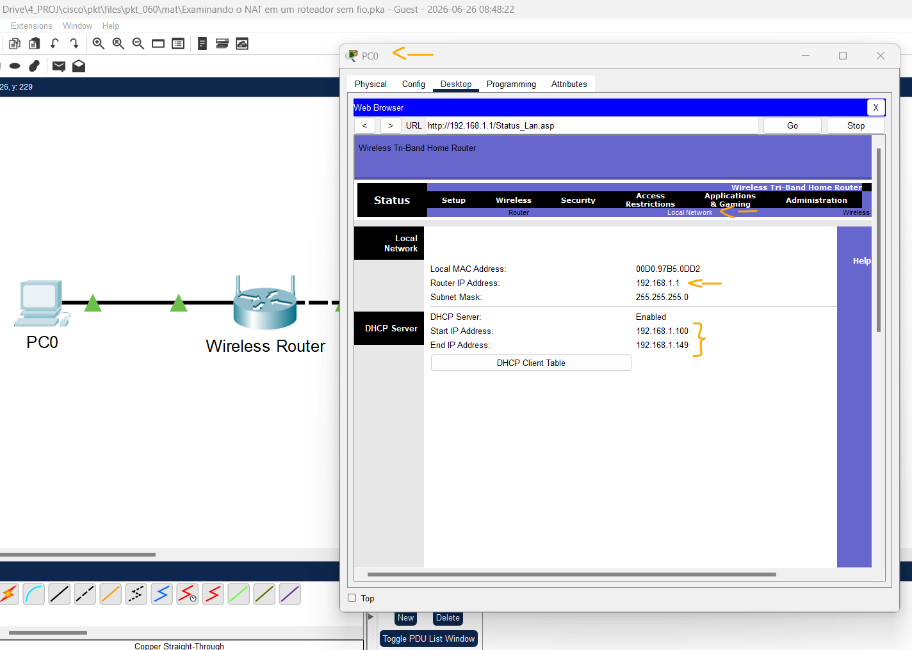
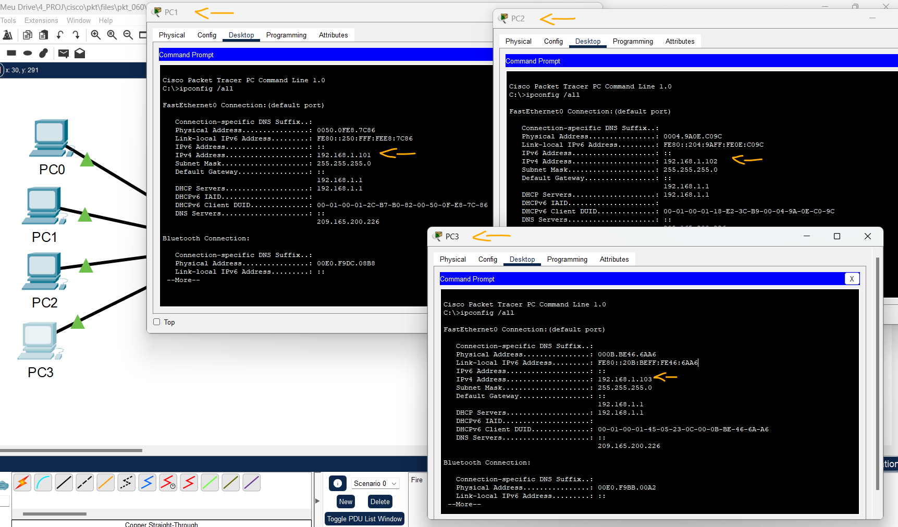

# Packet Tracer – Examinando o NAT em um roteador sem fio (wireless router)   

### Cisco: <a href="../../../">cisco   </a>
### Cisco Networking Academy: cna   </a>
### Training Category: <a href="../../../pkt/">pkt</a>
### Software/Subject: network   </a>
### Course: <a href="./">pkt_060 (Packet Tracer – Examinando o NAT em um roteador sem fio (wireless router))   </a>

---

### Theme:
- Network

### Used Tools:
- Operating System (OS): 
  - Windows 11 
- Cloud Services:
  - Google Drive 
- Language:
  - HTML   
  - Markdown   
- Integrated Development Environment (IDE) and Text Editor:
  - Visual Studio Code (VS Code)   
- Versioning: 
  - Git   
- Repository:
  - GitHub   
- Network:
  - Cisco Packet Tracer   

---

<h3><a name="item00">Course Strcuture:</a></h3>

1. <a href="#item01">Parte 1: Examine a configuração para acessar a rede externa.</a> 
2. <a href="#item02">Parte 2: Examine as configurações para acessar a rede externa.</a> 
3. <a href="#item03">Parte 3: Conecte 3 PCs ao roteador sem fio.</a> 
4. <a href="#item04">Parte 4: Visualize a tradução NAT no roteador sem fio.</a> 
5. <a href="#item05">Parte 5: Visualize as informações de cabeçalho dos pacotes que trafegaram através da rede.</a> 

---

### Objective:
O objetivo desta atividade foi verificar o funcionamento do NAT (Network Address Translation) em um roteador sem fio, observando a conversão de endereços IP privados em um endereço IP público durante a comunicação entre a rede local e a Internet. Para isso, quatro hosts foram configurados para obter automaticamente seus endereços IP por meio do serviço DHCP do roteador.

### Folder Structure:
- [README.md](./README.md): Este documento de README, escrito em **Markdown**, com o conteúdo do laboratório.
- [0-aux](./0-aux/): Pasta auxiliar com imagens utilizadas na construção dos arquivos de README desse curso.

### Development:

<a name="item01"><h4>1. Parte 1: Examine a configuração para acessar a rede externa.</h4></a>[Back to summary](#item00)

A imagem 01 mostra a topologia inicial.

<figure>
     
    <figcaption>Imagem 01.</figcaption>
</figure>
 

- a. Adicione 1 PC e conecte-o ao roteador wireless com um cabo direto. Aguarde que todas as luzes dos links fiquem verdes antes de passar para a próxima etapa ou clique em Fast Forward.
- b. No PC, clique em Desktop. Selecione IP Configuration. Clique em DHCP para permitir que cada dispositivo receba um endereço IP através do DHCP no roteador sem fio.
- c. Anote o endereço IP do gateway padrão. Feche a janela IP Configuration ao terminar.
  - `192.168.1.1`.
- d. Navegue até o web browser e insira o endereço IP do gateway padrão no campo URL. Entre com username admin e password admin quando solicitado.
- e. Clique na opção do menu Status no canto superior direito. Quando essa opção estiver selecionada, a página do sub-menu Router é exibida.
- f. Role a página do roteador para baixo para ver a opção Internet connection. O endereço IP atribuído aqui é o atribuído pelo ISP. Se não houver nenhum endereço IP (0.0.0.0 é exibido), feche a janela, aguarde alguns segundos e tente novamente. O roteador sem fio está no processo de obtenção de endereço IP do servidor DHCP do ISP.
- f. O endereço visto aqui é o endereço atribuído à porta Internet no roteador wireless. Ele é um endereço público ou privado?
  - Este é um endereço público.

A imagem 02 exibe o endereço público atribuído pelo ISP ao roteador sem fio.

<figure>
     
    <figcaption>Imagem 02.</figcaption>
</figure>
 

<a name="item02"><h4>2. Parte 2: Examine as configurações para acessar a rede externa.</h4></a>[Back to summary](#item00)

- a. Clique em Local Network na barra do sub-menu Status.
- b. Role para baixo e examine as informações da Rede Local. Este é o endereço atribuído para a rede interna.
- c. Role mais para baixo e examine as informações do servidor DHCP e a faixa dos endereços IP que podem ser atribuídos para conectar hosts. Esses endereços são públicos ou privados?
  - Esses são endereços privados.
- d. Feche a janela de configuração do roteador sem fio.

A imagem 03 apresenta o endereço IP privado configurado no roteador, bem como a faixa de endereços IP disponibilizada pelo servidor DHCP integrado para atribuição automática aos dispositivos da rede.

<figure>
     
    <figcaption>Imagem 03.</figcaption>
</figure>
 

<a name="item03"><h4>3. Parte 3: Conecte 3 PCs ao roteador sem fio.</h4></a>[Back to summary](#item00)

- a. Adicione mais 3 PCs e conecte-os ao roteador wireless com cabos diretos. Aguarde que todas as luzes dos links fiquem verdes antes de passar para a próxima etapa ou clique em Fast Forward.
- b. Em cada PC, clique em Desktop. Selecione IP Configuration. Clique em DHCP para permitir que cada dispositivo receba um endereço IP através do DHCP no roteador sem fio. Feche a janela IP Configuration ao terminar.
- c. Clique em Command Prompt para verificar a configuração IP de cada dispositivo usando o comando ipconfig /all. Observação: esses dispositivos receberão um endereço privado. Endereços privados não conseguem cruzar a Internet, portanto, a tradução NAT deve ocorrer.
  - `ipconfig /all`.

A imagem 04 evidencia que os outros três hosts obteram IP via DHCP do roteador.

<figure>
     
    <figcaption>Imagem 04.</figcaption>
</figure>
 

<a name="item04"><h4>4. Parte 4: Visualize a tradução NAT no roteador sem fio.</h4></a>[Back to summary](#item00)

- a. Entre no Modo de Simulação ao clicar na guia Simulation no canto inferior direito. O botão Simulation está localizada ao lado do botão Realtime e possui um símbolo de cronômetro.
- b. Visualize o tráfego ao criar uma PDU complexa no Simulation mode.
  - 1. A partir do Simulation Panel, clique Show All/None para alterar eventos visualizáveis para nenhum. Agora, clique em Edit Filters, e na guia Misc, marque as caixas TCP e HTTP. Feche a janela quando terminar.
  - 2. Adicione uma PDU Complexa clicando no envelope aberto localizado no menu superior.
  - 3. Clique em um dos PCs para especificá-lo como a origem.
- c. Especifique as configurações de PDU complexa ao alterar o seguinte na janela de PDU complexa:
  - 1. Em PDU Settings > Select Application deve estar setado para: HTTP.
  - 2. Clique no servidor ciscolearn.nat.com para especificá-lo como o dispositivo de destino.
  - 3. Em Source Port, insira 1000.
  - 4. Em Simulation Settings, selecione Periodic. Defina 120 segundos como o Interval.
  - 5. Clique Create PDU na janela Create Complex PDU.
- d. Clique duas vezes em simulation panel para destacá-lo da janela PT. Isso permite mover o painel de simulação para visualizar toda a topologia da rede.
- e. Observe o fluxo de tráfego clicando em Play no simulation panel. Acelere a animação movendo o controle deslizante de reprodução para a direita. Observação: clique em View Previous Events quando a mensagem de Buffer cheio for exibida.

<a name="item05"><h4>5. Parte 5: Visualize as informações de cabeçalho dos pacotes que trafegaram através da rede.</h4></a>[Back to summary](#item00)

- a. Examine os cabeçalhos dos pacotes enviados entre um PC e o servidor da Web.
  - 1. No Painel de Simulação, clique duas vezes na terceira linha de baixo na lista de eventos. Essa ação exibirá um envelope na área de trabalho representando essa linha.
  - 2. Clique no envelope na janela da área de trabalho para visualizar as informações do pacote e do cabeçalho.
- b. Clique na guia Detalhes da PDU de Entrada (Inbound). Examine as informações de endereço IP de origem (SRC) e o endereço IP de destino do pacote.
- c. Clique na guia Detalhes da PDU de Saída (Outbound). Examine as informações de endereço IP de origem (SRC) e o endereço IP de destino do pacote. Observe a alteração no endereço IP SRC.
- d. Clique em outras linhas de evento para visualizar os cabeçalhos durante o processo.
- e. Quando terminar, clique em Check Results para verificar seu trabalho.

A imagem 05 demonstra o funcionamento do NAT, evidenciando a conversão do endereço IP privado em um endereço IP público quando o pacote é encaminhado do roteador para a rede externa.

<figure>
     
    <figcaption>Imagem 04.</figcaption>
</figure>
 