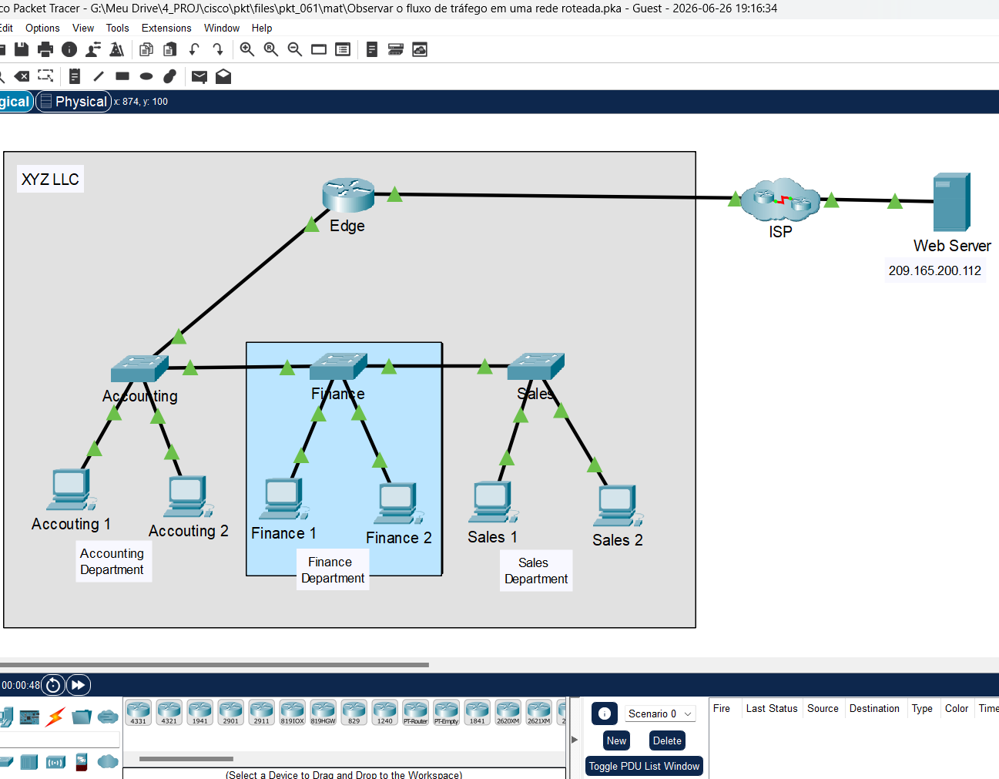
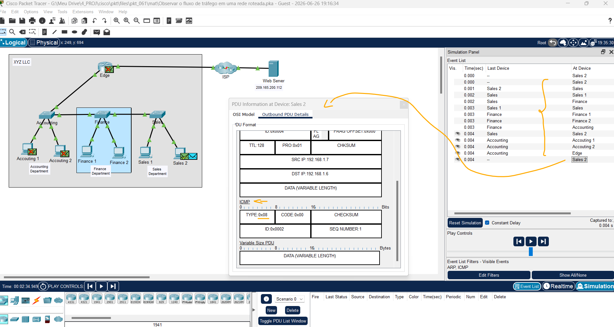
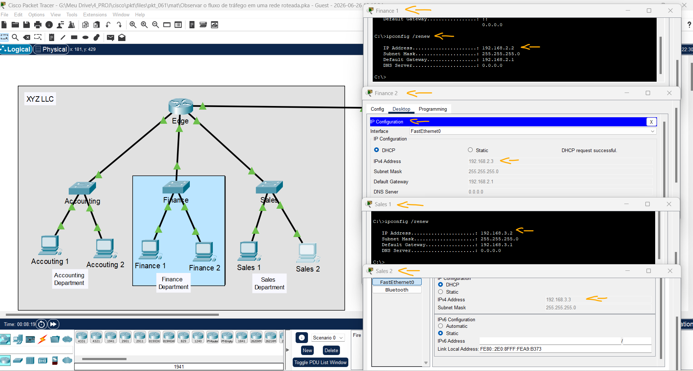
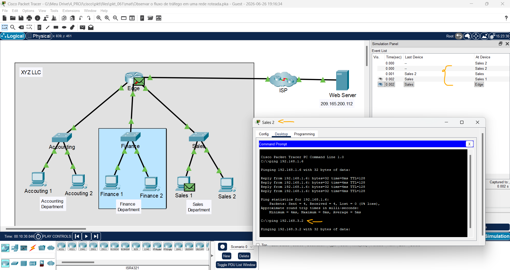

# Packet Tracer - Observar o fluxo de tráfego em uma rede roteada   

### Cisco: <a href="../../../">cisco   </a>
### Cisco Networking Academy: cna   </a>
### Training Category: <a href="../../../pkt/">pkt</a>
### Software/Subject: network   </a>
### Course: <a href="./">pkt_061 (Packet Tracer - Observar o fluxo de tráfego em uma rede roteada)   </a>

---

### Theme:
- Network

### Used Tools:
- Operating System (OS): 
  - Windows 11 
- Cloud Services:
  - Google Drive 
- Language:
  - HTML   
  - Markdown   
- Integrated Development Environment (IDE) and Text Editor:
  - Visual Studio Code (VS Code)   
- Versioning: 
  - Git   
- Repository:
  - GitHub   
- Network:
  - Cisco Packet Tracer   
  - ipconfig   
  - ping   

---

<h3><a name="item00">Course Strcuture:</a></h3>

1. <a href="#item01">Parte 1: Observar o fluxo de tráfego em uma LAN não roteada</a> 
  1.1 <a href="#item01.01">Etapa 1: Limpe o cache do ARP do host Sales 1.</a> 
  1.2 <a href="#item01.02">Etapa 2: Observe o fluxo de tráfego na rede.</a> 
2. <a href="#item02">Parte 2: Reconfigurar a Rede para Roteamento entre LANs</a> 
  2.1 <a href="#item02.01">Etapa 1: Alterar as conexões dos dispositivos.</a> 
  2.2 <a href="#item02.02">Etapa 2: Configure os hosts com endereços nas novas LANs.</a> 
3. <a href="#item03">Parte 3: Observar o fluxo de tráfego na Rede Roteada</a> 
  3.1 <a href="#item03.01">Etapa 1: Ping Sales 1 a partir de Sales 2</a> 
  3.2 <a href="#item03.02">Etapa 2: Pingue outros hosts.</a> 

---

### Objective:
O objetivo desta atividade foi analisar o funcionamento das transmissões em broadcast em uma rede local e demonstrar como a segmentação da rede em sub-redes melhora sua eficiência, dividindo um único domínio de broadcast em três domínios menores.

### Folder Structure:
- [README.md](./README.md): Este documento de README, escrito em **Markdown**, com o conteúdo do laboratório.
- [0-aux](./0-aux/): Pasta auxiliar com imagens utilizadas na construção dos arquivos de README desse curso.

### Development:

<a name="item01"><h4>1. Parte 1: Observar o fluxo de tráfego em uma LAN não roteada</h4></a>[Back to summary](#item00)

A imagem 01 mostra a topologia inicial.

<figure>
     
    <figcaption>Imagem 01.</figcaption>
</figure>
 

A rede XYZ consiste em cerca de 150 dispositivos conectados a uma LAN. A LAN é configurada em uma única rede IPv4. Hosts em diferentes departamentos são conectados a switches que são conectados ao roteador Edge (roteador de borda). O roteador apenas roteia o tráfego entre a LAN e a internet, representada pela nuvem ISP. Como apenas uma rede IP é usada na LAN, todos os departamentos estão na mesma rede.

A topologia do Packet Tracer está simplificada. Ele mostra apenas alguns dos departamentos e hots. Considere que o comportamento que você irá demonstrar está acontecendo em uma escala muito maior do que o que é mostrado na rede PT.

Nesta parte, você usará o modo de simulação do Packet Tracer para observar como o tráfego flui através de LANs não roteadas.

<a name="item01.01"><h4>1.1 Etapa 1: Limpe o cache do ARP do host Sales 1.</h4></a>[Back to summary](#item00)

- a. Passe o mouse sobre o host Sales 1 para ver seu endereço IP. Tome nota disso.
  - `192.168.1.6`.
- a. Clique em Sales 1 > guia Desktop> Command Prompt e insira o comando arp -a. Não deverá haver endereços MAC no cache ARP. Se houver entradas no cache ARP, use o comando arp -d para excluí-las.
  - `arp -a` -> `arp -d`.

<a name="item01.02"><h4>1.2 Etapa 2: Observe o fluxo de tráfego na rede.</h4></a>[Back to summary](#item00)

- a. Clique no botão Simulation mode no canto inferior direito da janela do PT para alternar do modo em Realtime (Tempo Real) para o modo Simulation (Simulação).
- b. Abra o Command Prompt para o Sales 2 e, em seguida, insira o comando ping seguido pelo endereço IP de Sales 1.
  - `ping 192.168.1.6`.
- c. Use o botão Capture then Forward (o triângulo apontando para a direita com uma barra vertical anexada) nos Play Controls do Simulation Panel para que o comando ping comece a ser executado. Você verá um ícone de envelope colorido ao lado de Sales 2. Isso representa uma PDU. Clique no botão Capture then Forward para mover a PDU para o primeiro dispositivo do caminho rumo ao dispositivo de destino. Clique no envelope da PDU para inspecionar o conteúdo.
- c. Quais são os endereços MAC e IP de origem e destino do quadro e do pacote?
  - Endereço MAC de Origem: 00E0.8FA9.B373 (Sales 2).
  - Endereço MAC de Destino: FFFF.FFFF.FFFF (broadcast).
  - Endereço IP de Origem: 192.168.1.7 (Sales 2).
  - Endereço IP de Destino: 192.168.1.6 (Sales 1).
- c. Por que o endereço MAC de destino é o endereço de broadcast?
  - Porque o host de origem ainda não conhece o endereço MAC correspondente ao endereço IP de destino. Assim, ele envia uma solicitação ARP em broadcast para descobrir o endereço MAC do dispositivo de destino.
- d. Avance as PDUs pela rede até que uma nova PDU (cor diferente) seja criada em Sales 2. Quais hosts e outros tipos de dispositivos precisam processar os pacotes de solicitação ARP?
  - Todos os hosts da rede local processam a solicitação ARP. Apenas o Sales 1 responde, enquanto os switches apenas encaminham o quadro em broadcast.
- d. Qual é o impacto disso na eficiência de operação da rede, do modo que está configurada atualmente?
  - Com muitos hosts na mesma rede, aumenta a quantidade de transmissões em broadcast, como as solicitações ARP, o que pode gerar maior tráfego e reduzir a eficiência da rede.
- e. Uma nova PDU com uma cor diferente apareceu em Sales 2. Clique na nova PDU e inspecione seu conteúdo. Veja o Outbound PDU Details. Que tipo de PDU é essa?
  - Trata-se de uma PDU ICMP do tipo Echo Request (Solicitação de Eco), gerada pelo comando ping enviado pelo host Sales 2 em direção ao host de destino.
- f. Volte ao modo Realtime.

A imagem 02 exibe a criação da PDU ICMP, bem como, o processo ARP realizado.

<figure>
     
    <figcaption>Imagem 02.</figcaption>
</figure>
 

<a name="item02"><h4>2. Parte 2: Reconfigurar a Rede para Roteamento entre LANs</h4></a>[Back to summary](#item00)

Nesta parte, você demonstrará os benefícios do roteamento entre redes de departamentos. Primeiro, você irá cabear cada switch da rede para conectar-se diretamente a uma interface do roteador. Em seguida, você reconfigurará os hosts para receber endereços em duas novas redes IPv4 criadas pelo roteador.

<a name="item02.01"><h4>2.1 Etapa 1: Alterar as conexões dos dispositivos.</h4></a>[Back to summary](#item00)

Os três switches são conectados entre si com cabos diretos de cobre (straight through).

- a. Para o cabo que conecta o switch Accounting ao switch Finance, clique no triângulo verde mais próximo do switch Accounting.
- b. Arraste essa extremidade do cabo para o roteador Edge e conecte o cabo à porta GigabitEthernet 1/0.
- c. Repita esta etapa para o link entre Finance e Sales. Conecte à porta GigabitEthernet disponível.

<a name="item02.02"><h4>2.2 Etapa 2: Configure os hosts com endereços nas novas LANs.</h4></a>[Back to summary](#item00)

Cada interface do roteador Edge foi previamente configurada para colocar cada departamento em sua própria rede IPv4. Os hosts receberão do roteador seus novos endereços IP. No entanto, levará algum tempo para que os hosts nas redes Finance e Sales recebam seus novos endereços IP. (Os hosts na rede Accounting permanecerão em 192.168.1.0/24.)

- a. Para acelerar o processo de obtenção de novos endereços IP, abra um Command Prompt em cada um dos quatro dispositivos nas redes Finance e Sales.
- b. Digite o comando ipconfig /renew. Isso forçará o host a solicitar um novo endereço IP ao servidor DHCP que está sendo executado no roteador Edge. Você deverá ver a confirmação do novo endereçamento IP.
  - `ipconfig /renew`.
- b. Qual rede IPv4 está atribuída à rede Finance?
  - `192.168.2.1/24`.
- b. Qual rede IPv4 está atribuída à rede Sales?
  - `192.168.3.1/24`.

A imagem 03 mostra que os dois hosts das novas redes obtiveram seus respectivos endereços IP. A renovação do endereçamento foi realizada de três formas distintas: pela interface de linha de comando (CLI), utilizando o comando `ipconfig /renew`; pela aba IP Configuration; e pela aba Config, alternando a configuração de endereçamento de estático para automático (DHCP).

<figure>
     
    <figcaption>Imagem 03.</figcaption>
</figure>
 

<a name="item03"><h4>3. Parte 3: Observar o fluxo de tráfego na Rede Roteada</h4></a>[Back to summary](#item00)

Nesta parte, você observará como o tráfego agora flui através de uma rede roteada.

<a name="item03.01"><h4>3.1 Etapa 1: Ping Sales 1 a partir de Sales 2</h4></a>[Back to summary](#item00)

- a. Retorne ao Command Prompt de Sales 2 e verifique se o cache ARP está vazio. Se não estiver, exclua todas as entradas.
- b. Mude para o modo Simulation.
- c. Ping Sales 1 a partir de Sales 2.
  - `ping 192.168.3.2`.
- d. Use o botão Capture then Forward para que as PDUs percorram a rede. Observe como a mensagem de solicitação ARP flui pela rede desta vez. Quais dispositivos recebem os broadcasts ARP desta vez?
  - O switch encaminha a solicitação ARP em broadcast para todas as portas da rede local. O roteador recebe a PDU, mas não encaminha broadcasts para outras redes, enquanto o host Sales 1 recebe a solicitação e a processa por ser o destinatário.

<a name="item03.02"><h4>3.2 Etapa 2: Pingue outros hosts.</h4></a>[Back to summary](#item00)

- a. Repita esta demonstração pingando outros hosts e o internet server. Observe o fluxo das PDUs de ARP request. Qual é o benefício em usar várias redes IPv4, ou sub-redes, em uma empresa?
  - O principal benefício é dividir a rede em domínios de broadcast menores, reduzindo o tráfego de broadcasts e melhorando o desempenho da rede.

Observação: a topologia de rede usada na atividade é apenas para fins de demonstração. Embora seja possível que uma rede corporativa real possa usar um roteador dessa maneira, existem topologias mais adequadas para atingir esses resultados. Você aprenderá sobre outras abordagens de design em cursos de rede posteriores.

A imagem 04 ilustra a solicitação ARP sendo propagada apenas dentro de um domínio de broadcast menor, resultado da segmentação da rede em sub-redes.

<figure>
     
    <figcaption>Imagem 04.</figcaption>
</figure>
 