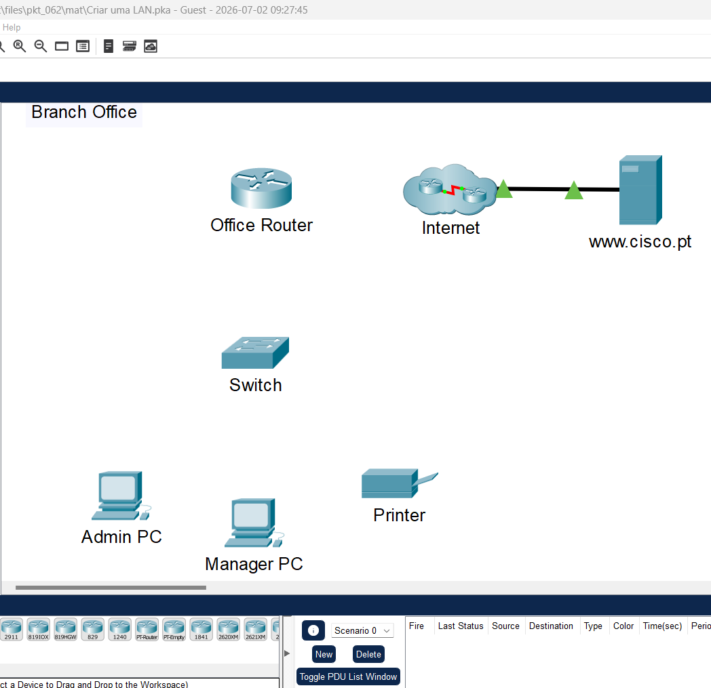
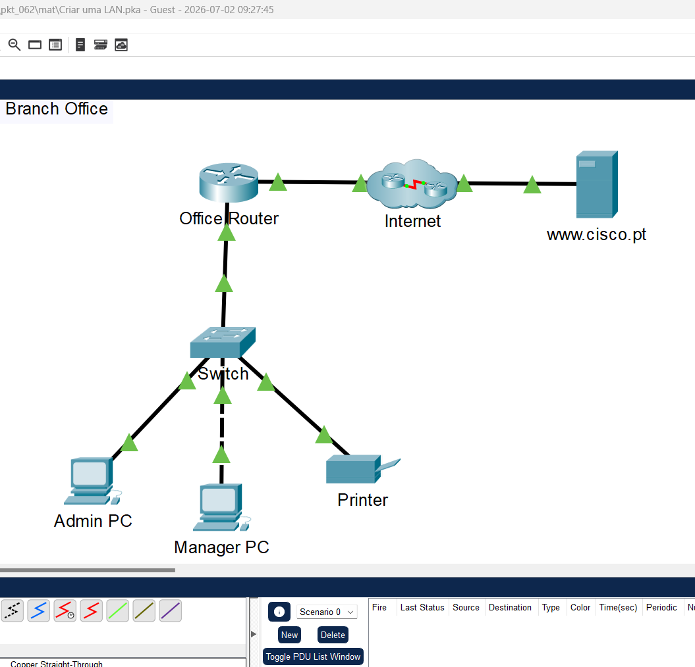
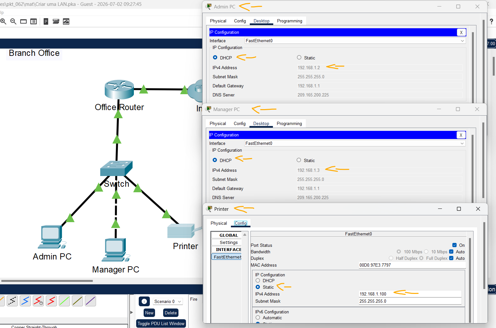
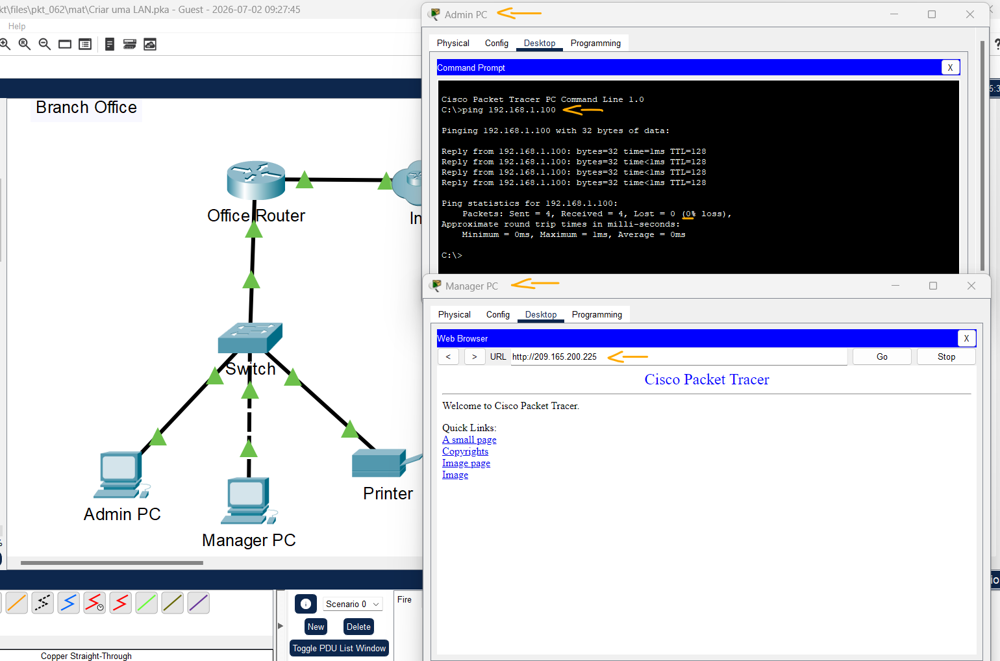
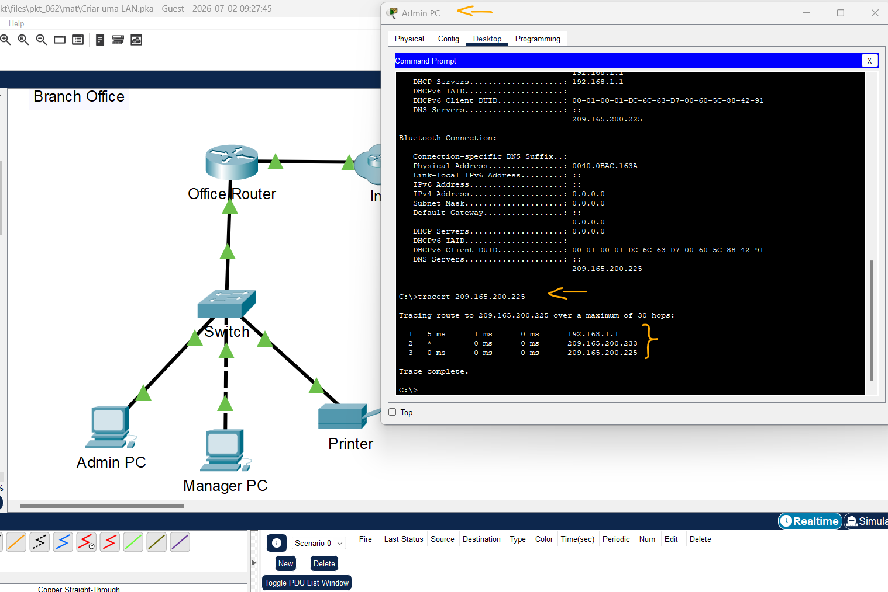

# Packet Tracer - Packet Tracer - Criando uma LAN   

### Cisco: <a href="../../../">cisco   </a>
### Cisco Networking Academy: cna   </a>
### Training Category: <a href="../../../pkt/">pkt</a>
### Software/Subject: network   </a>
### Course: <a href="./">pkt_062 (Packet Tracer - Packet Tracer - Criando uma LAN)   </a>

---

### Theme:
- Network

### Used Tools:
- Operating System (OS): 
  - Windows 11 
- Cloud Services:
  - Google Drive 
- Language:
  - HTML   
  - Markdown   
- Integrated Development Environment (IDE) and Text Editor:
  - Visual Studio Code (VS Code)   
- Versioning: 
  - Git   
- Repository:
  - GitHub   
- Network:
  - Cisco Packet Tracer   
  - ping   
  - traceroute   
  - Trace Route (tracert)   

---

<h3><a name="item00">Course Strcuture:</a></h3>

1. <a href="#item01">Parte 1: Conectar dispositivos de rede e hosts</a> 
  1.1 <a href="#item01.01">Etapa 1: Ligue os dispositivos finais e o Office Router.</a> 
  1.2 <a href="#item01.02">Etapa 2: Conecte os dispositivos finais.</a> 
2. <a href="#item02">Parte 2: Configurar dispositivos com endereçamento IPv4</a> 
  2.1 <a href="#item02.01">Etapa 1: Configure os hosts com as informações de endereçamento.</a> 
  2.2 <a href="#item02.02">Etapa 2: Em S1, use o comando traceroute para Externo.</a> 
3. <a href="#item03">Parte 3: Verificar a configuração do dispositivo final e a conectividade</a> 
  3.1 <a href="#item03.01">Etapa 1: Verifique a conectividade entre os dois PCs.</a> 
  3.2 <a href="#item03.02">Etapa 2: Verifique a conectividade com a internet.</a> 
4. <a href="#item04">Parte 4: Use os comandos de rede para exibir informações de host</a> 
  4.1 <a href="#item04.01">Etapa 1: Use o comando ipconfig.</a> 
  4.2 <a href="#item04.02">Etapa 2: Use o comando tracert</a> 
5. <a href="#item05">Reflexão</a> 

---

### Objective:
O objetivo desta atividade foi construir uma pequena Rede Local (LAN), conectando os dispositivos finais aos dispositivos de rede, configurando o endereçamento IPv4 e verificando a conectividade por meio de testes de comunicação.

### Folder Structure:
- [README.md](./README.md): Este documento de README, escrito em **Markdown**, com o conteúdo do laboratório.
- [0-aux](./0-aux/): Pasta auxiliar com imagens utilizadas na construção dos arquivos de README desse curso.

### Development:

<a name="item01"><h4>1. Parte 1: Conectar dispositivos de rede e hosts</h4></a>[Back to summary](#item00)

A imagem 01 mostra a topologia inicial.

<figure>
     
    <figcaption>Imagem 01.</figcaption>
</figure>
 

<a name="item01.01"><h4>1.1 Etapa 1: Ligue os dispositivos finais e o Office Router.</h4></a>[Back to summary](#item00)

- a. Clique em cada dispositivo e abra a guia Physical. Nota: Não há chave de alimentação no modelo de switch usado nesta atividade.
- b. Localize o botão liga / desliga de cada dispositivo na janela de exibição de dispositivos físicos.
- c. Clique no botão liga / desliga para ligar o dispositivo. Você deverá ver uma luz verde perto do botão liga/desliga indicando que o dispositivo está ligado.

#### Tabela 1 — Planejamento de Endereçamento IPv4

| Dispositivo   | Interface | Endereço de IPv4   | Máscara de Sub-Rede  | Gateway Padrão     |
|:-------------:|:---------:|:------------------:|:--------------------:|:------------------:|
| Admin PC      | NIC       | DHCP (192.168.1.2) | DHCP (255.255.255.0) | DHCP (192.168.1.1) |
| Manager PC    | NIC       | DHCP (192.168.1.3) | DHCP (255.255.255.0) | DHCP (192.168.1.1) |
| Printer       | NIC       | 192.168.1.100      | 255.255.255.0        | N/D                |
| www.cisco.pt  | NIC       | 209.165.200.225    | 255.255.255.248      | 209.165.200.230    |

<a name="item01.02"><h4>1.2 Etapa 2: Conecte os dispositivos finais.</h4></a>[Back to summary](#item00)

Use a tabela e as instruções para conectar os dispositivos de rede e hosts para criar a rede física. Nota: Na tabela, as interfaces designadas com G são interfaces GigabitEthernet. As interfaces designadas com F são interfaces FastEthernet.

#### Tabela 2 — Conexões de Dispositivos e Interfaces

| Dispositivo   | Interface/Porta | Conectado ao Dispositivo | Conexão Interface/Porta |
|:-------------:|:---------------:|:------------------------:|:-----------------------:|
| Office Router | G0/0            | ISP1                     | G0/0                    |
| Office Router | G0/1            | Switch                   | G0/1                    |
| Admin PC      | NIC (F/0)       | Switch                   | F0/1                    |
| Manager PC    | NIC (F/0)       | Switch                   | F0/2                    |
| Printer       | NIC (F/0)       | Switch                   | F0/24                   |

- a. Conecte os dispositivos de rede de acordo com as informações na Tabela de conexões usando cabos Ethernet copper straight-through. Para a conexão da Internet com o Office Router, selecione o dispositivo e a porta nos menus suspensos que aparecem quando você clica na nuvem com a ferramenta de conexões selecionada.
- b. Conecte os dois PCs e a impressora ao switch do escritório de acordo com as informações na tabela de conexões. Use cabos copper straight-through (diretos)
- c. Você verá luzes de link verdes em todas as conexões após um breve intervalo de tempo.

A imagem 02 exibe todas as conexões estabelecidas.

<figure>
     
    <figcaption>Imagem 02.</figcaption>
</figure>
 

<a name="item02"><h4>2. Parte 2: Configurar dispositivos com endereçamento IPv4</h4></a>[Back to summary](#item00)

<a name="item02.01"><h4>2.1 Etapa 1: Configure os hosts com as informações de endereçamento.</h4></a>[Back to summary](#item00)

- a. Os PCs Admin e Manager devem receber as informações de endereçamento IP via DHCP. O Office Router foi configurado para fornecer endereços IP aos hosts na LAN da filial. Clique nos PCs e vá para as guias Desktop em cada PC. Abra o aplicativo IP Configuration e configure os PCs para receberem seus endereços IP dinamicamente.
- b. Impressoras e servidores geralmente são configurados manualmente com endereçamento porque outros dispositivos na rede são configurados para acessá-los usando endereços IP. A configuração manual com um endereço estático garantirá que os endereços IP desses dispositivos não sejam alterados.
  - Clique na impressora e abra a guia Config.
  - Clique na interface FastEthernet0 no painel esquerdo.
  - Insira as informações de endereçamento da tabela de endereçamento.
- c. Como os dois computadores estão na mesma rede, seus endereços IPv4 serão semelhantes, suas máscaras de sub-rede e gateways padrão serão idênticos. Por que você acha que os endereços IPv4 são diferentes, mas as máscaras de sub-rede e os gateways padrão são os mesmos?
  - Porque cada dispositivo da rede precisa ter um endereço IPv4 único para ser identificado. Já a máscara de sub-rede e o gateway padrão são iguais porque os dois computadores pertencem à mesma rede e utilizam o mesmo roteador para acessar outras redes.
- c. A impressora não requer um gateway padrão porque só será acessada por hosts na rede local. No entanto, se você precisar configurá-la com um gateway padrão, qual valor a impressora usará? Como você pode determinar isso dos outros dispositivos na rede?
  - O gateway padrão da impressora será o mesmo utilizado pelos demais dispositivos da rede, ou seja, 192.168.1.1, pois todos pertencem à mesma sub-rede. Esse valor pode ser identificado verificando a configuração de rede de qualquer computador conectado à mesma rede.

A imagem 03 comprova que todos dispositivos finais foram corretamente endereçados.

<figure>
     
    <figcaption>Imagem 03.</figcaption>
</figure>
 

<a name="item03"><h4>3. Parte 3: Verificar a configuração do dispositivo final e a conectividade</h4></a>[Back to summary](#item00)

<a name="item03.01"><h4>3.1 Etapa 1: Verifique a conectividade entre os dois PCs.</h4></a>[Back to summary](#item00)

- a. Acesse os desktops dos PCs e verifique a configuração de endereçamento IP. Você deverá ver que os PCs receberam endereços IP dinamicamente na rede 192.168.1.0 255.255.255.0. Você também deverá ver que eles receberam endereços para configurar o Gateway padrão e o servidor DNS.
- b. No prompt de comando do Admin PC, pingue o endereço IP da impressora. Repita este processo para o Manager PC. Você deverá ver pings bem-sucedidos para cada um. Isso verifica se os PCs e a impressora estão ligados e conectados e endereçados corretamente.
  - `ping 192.168.1.100`.

<a name="item03.02"><h4>3.2 Etapa 2: Verifique a conectividade com a internet.</h4></a>[Back to summary](#item00)

- a. No Desktop dos PCs, abra o navegador Web. Digite o endereço IP do servidor de internet para exibir a página web. Repita o processo, mas conecte usando a URL do servidor.
  - `209.165.200.225` -> `www.cisco.pt`.
- a. Se você pode conectar pelo endereço IP, mas não pela URL, qual você acha que é a causa desse problema?
  - A causa mais provável é um problema na resolução de nomes (DNS). Como é possível acessar pelo endereço IP, mas não pela URL, o servidor DNS pode estar indisponível ou configurado incorretamente.

A imagem 04 mostra o servidor web sendo acessado por meio do endereço IP e o teste de conectividade realizado com êxito entre o Admin PC e a impressora.

<figure>
     
    <figcaption>Imagem 04.</figcaption>
</figure>
 

<a name="item04"><h4>4. Parte 4: Use os comandos de rede para exibir informações de host</h4></a>[Back to summary](#item00)

Os comandos de rede disponíveis no prompt de comando em PCs são muito semelhantes aos disponíveis no Windows. Nesta parte da atividade, você usará ipconfig e tracert conhecer melhor a LAN.

<a name="item04.01"><h4>4.1 Etapa 1: Use o comando ipconfig.</h4></a>[Back to summary](#item00)

- a. O comando ipconfig exibe detalhes sobre o endereçamento configurado em um host.
  - `ipconfig`.
- a. Abra um prompt de comando em um dos PCs e digite o comando ipconfig e anote as informações retornadas. Agora digite o comando ipconfig /all. Quais informações adicionais são exibidas?
  - `ipconfig`: Exibe informações básicas da configuração de rede, como endereço IPv4, máscara de sub-rede, gateway padrão e endereço IPv6 (quando disponível).
  - `ipconfig /all`: Além das informações anteriores, exibe detalhes completos da configuração da interface, como endereço físico (MAC), status do DHCP, servidores DNS, nome do host, descrição da placa de rede e outras informações da conexão.

<a name="item04.02"><h4>4.2 Etapa 2: Use o comando tracert</h4></a>[Back to summary](#item00)

O comando tracert usa o ICMP para retornar informações sobre os roteadores que são passadas à medida que os pacotes vão do PC de origem para o destino.

- a. Rastreie o caminho para um destino remoto abrindo um dos PCs e digitando tracert seguido da URL do servidor web.
  - `tracert 209.165.200.225`.
- a. Quantos roteadores são atravessados no caminho para o destino? Como esses roteadores são identificados?
  - São atravessados dois roteadores. Eles são identificados pelos endereços IP de suas interfaces, exibidos em cada salto do comando tracert.
- a. Onde está localizado o segundo roteador?
  - O segundo roteador está localizado na Internet, sendo responsável por encaminhar o tráfego até a rede de destino.

A imagem 05 exibe o caminho percorrido pelos pacotes até o servidor web, indicando os roteadores atravessados durante o trajeto.

<figure>
     
    <figcaption>Imagem 05.</figcaption>
</figure>
 

<a name="item05"><h4>5. Reflexão</h4></a>[Back to summary](#item00)

- a. Considere um pequeno escritório que tenha uma LAN semelhante à que você criou aqui. Qual é o maior desafio das instalações ao configurar a rede em um novo local?
  - O maior desafio está na implementação da infraestrutura de cabeamento físico. É necessário planejar e instalar pontos de rede em locais estratégicos para atender todos os dispositivos do escritório, garantindo praticidade e facilidade de acesso. Além disso, todos esses pontos precisam ser interligados ao local central onde ficarão o switch e o roteador, respeitando normas de cabeamento estruturado e limitações de distância. Um planejamento inadequado ou uma instalação mal executada pode comprometer o desempenho, a confiabilidade e a expansão futura da rede.