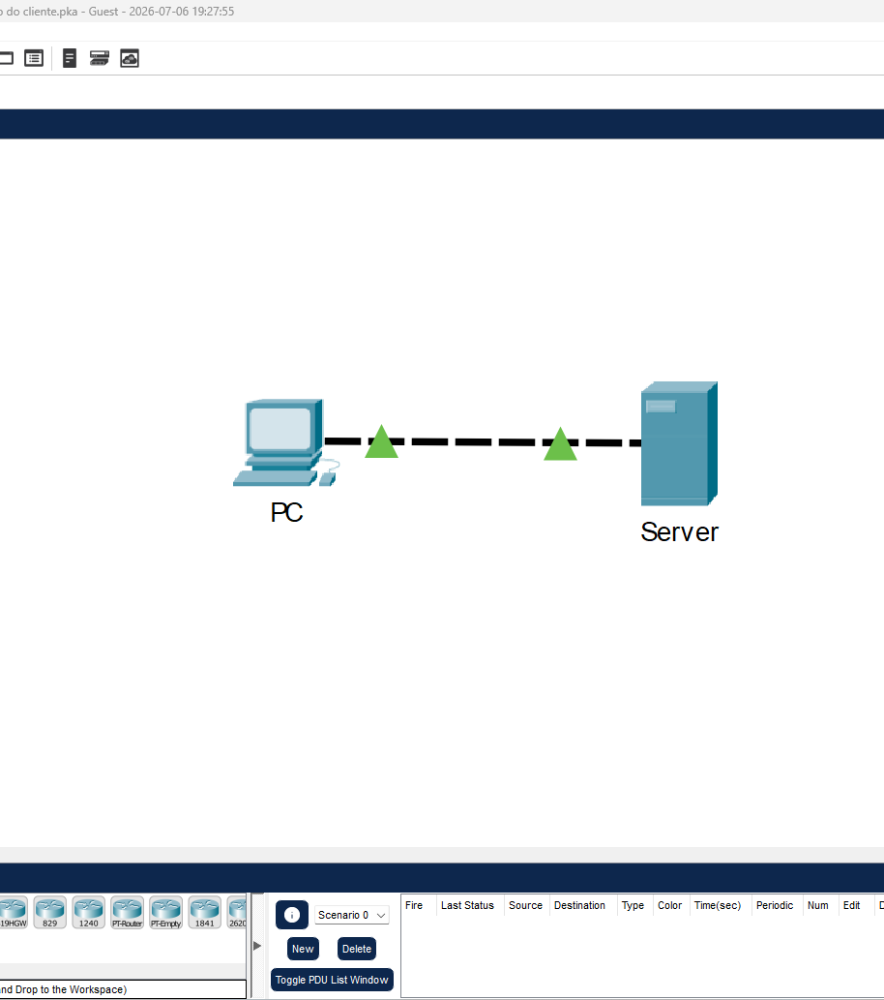
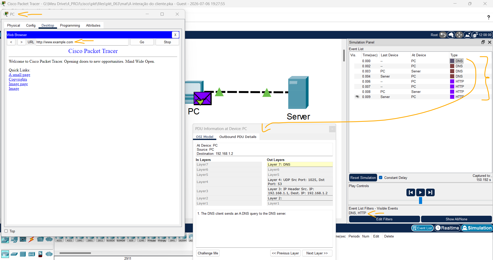

# Packet Tracer - A interação do cliente   

### Cisco: <a href="../../../">cisco   </a>
### Cisco Networking Academy: cna   </a>
### Training Category: <a href="../../../pkt/">pkt</a>
### Software/Subject: network   </a>
### Course: <a href="./">pkt_063 (Packet Tracer - A interação do cliente)   </a>

---

### Theme:
- Network

### Used Tools:
- Operating System (OS): 
  - Cisco Internetwork Operating System (Cisco IOS)   
  - Windows 11 
- Cloud Services:
  - Google Drive 
- Language:
  - HTML   
  - Markdown   
- Integrated Development Environment (IDE) and Text Editor:
  - Visual Studio Code (VS Code)   
- Versioning: 
  - Git   
- Repository:
  - GitHub   
- Network:
  - Cisco Packet Tracer   

---

<h3><a name="item00">Course Strcuture:</a></h3>

1. <a href="#item01">Parte 1: Entre no modo de simulação.</a> 
2. <a href="#item02">Parte 2: Investigar dispositivos em um armário de fiação</a> 
3. <a href="#item03">Parte 3: Conecte dispositivos finais a dispositivos de rede</a> 
4. <a href="#item04">Parte 4: Instalar um roteador de backup</a> 
5. <a href="#item05">Parte 5: Configurar um nome de host</a> 
6. <a href="#item06">Parte 6: Explore o Resto da Rede</a> 

---

### Objective:
O objetivo desta atividade foi explorar o modo físico e obter uma visão geral do **Cisco Packet Tracer**, identificando diferentes dispositivos, realizando conexões com diversos tipos de cabos e acessando dispositivos intermediários para fins de configuração e gerenciamento.

### Folder Structure:
- [README.md](./README.md): Este documento de README, escrito em **Markdown**, com o conteúdo do laboratório.
- [0-aux](./0-aux/): Pasta auxiliar com imagens utilizadas na construção dos arquivos de README desse curso.

### Development:

<a name="item01"><h4>1. Parte 1: Entre no modo de simulação.</h4></a>[Back to summary](#item00)

A imagem 01 mostra a topologia inicial.

<figure>
     
    <figcaption>Imagem 01.</figcaption>
</figure>
 

<a name="item02"><h4>2. Parte 2: Investigar dispositivos em um armário de fiação</h4></a>[Back to summary](#item00)

A imagem 02 exibe o armário de fiação no modo físico.

<figure>
     
    <figcaption>Imagem 02.</figcaption>
</figure>
 

<a name="item03"><h4>3. Parte 3: Conecte dispositivos finais a dispositivos de rede</h4></a>[Back to summary](#item00)

A imagem 03 mostra as conexões realizadas no PC_1.

<figure>
     
    <figcaption>Imagem 03.</figcaption>
</figure>
 

<a name="item04"><h4>4. Parte 4: Instalar um roteador de backup</h4></a>[Back to summary](#item00)

A imagem 04 evidencia a conexão via console USB estabelecida entre o Laptop_1 e o Backup_Router.

<figure>
     
    <figcaption>Imagem 04.</figcaption>
</figure>
 

<a name="item05"><h4>5. Parte 5: Configurar um nome de host</h4></a>[Back to summary](#item00)

A imagem 05 confirma que o roteador de backup possui esses dois nomes atribuídos.

<figure>
     
    <figcaption>Imagem 05.</figcaption>
</figure>
 

<a name="item06"><h4>6. Parte 6: Explore o Resto da Rede</h4></a>[Back to summary](#item00)

