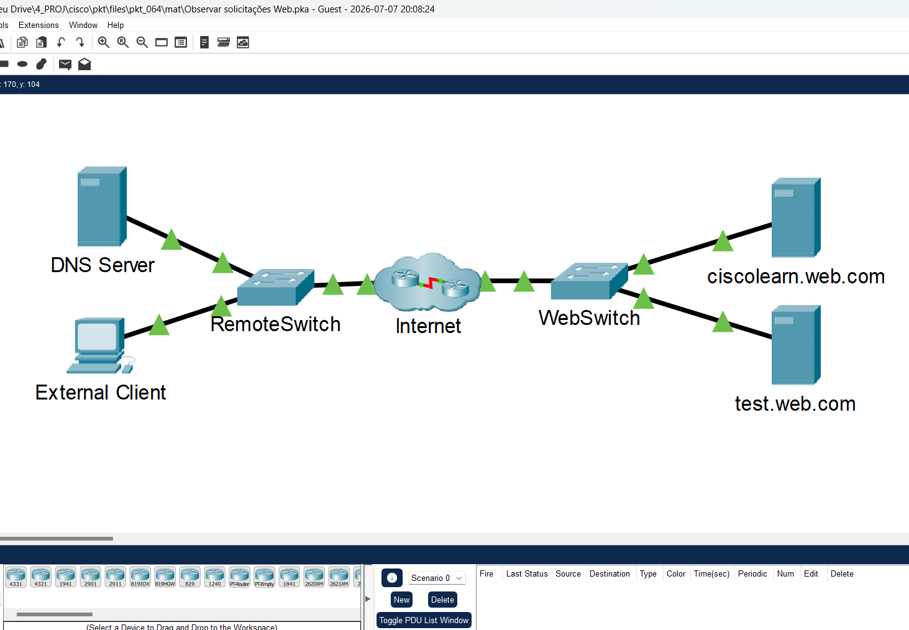
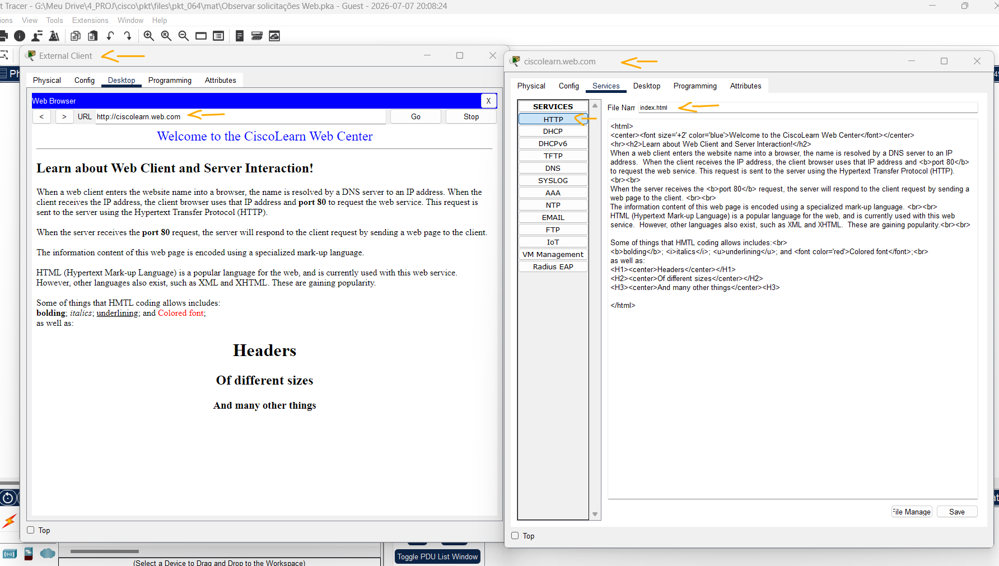
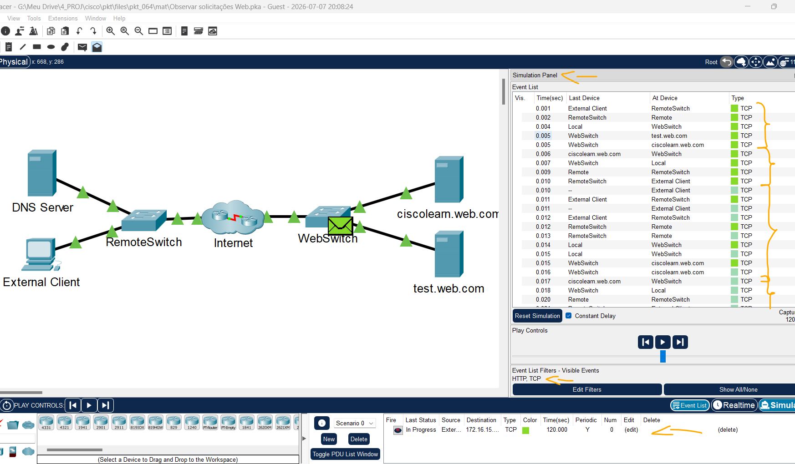

# Packet Tracer - Observando solicitações Web   

### Cisco: <a href="../../../">cisco   </a>
### Cisco Networking Academy: cna   </a>
### Training Category: <a href="../../../pkt/">pkt</a>
### Software/Subject: network   </a>
### Course: <a href="./">pkt_064 (Packet Tracer - Observando solicitações Web)   </a>

---

### Theme:
- Network

### Used Tools:
- Operating System (OS): 
  - Windows 11 
- Cloud Services:
  - Google Drive 
- Language:
  - HTML   
  - Markdown   
- Integrated Development Environment (IDE) and Text Editor:
  - Visual Studio Code (VS Code)   
- Versioning: 
  - Git   
- Repository:
  - GitHub   
- Network:
  - Cisco Packet Tracer   
  - ping   

---

<h3><a name="item00">Course Strcuture:</a></h3>

1. <a href="#item01">Parte 1: Verificar a conectividade com o servidor Web.</a> 
2. <a href="#item02">Parte 2: Conecte-se ao servidor Web.</a> 
3. <a href="#item03">Parte 3: Visualize o código HTML.</a> 
4. <a href="#item04">Parte 4: Observe o tráfego entre o cliente e o servidor Web.</a> 

---

### Objective:
Esta atividade teve como objetivo compreender o funcionamento do modelo cliente-servidor por meio do acesso, a partir de um computador cliente, a um site hospedado em um servidor web, analisando o estabelecimento da conexão TCP, a troca de informações durante a comunicação e o encerramento da sessão.

### Folder Structure:
- [README.md](./README.md): Este documento de README, escrito em **Markdown**, com o conteúdo do laboratório.
- [0-aux](./0-aux/): Pasta auxiliar com imagens utilizadas na construção dos arquivos de README desse curso.

### Development:

<a name="item01"><h4>1. Parte 1: Verificar a conectividade com o servidor Web.</h4></a>[Back to summary](#item00)

A imagem 01 mostra a topologia inicial.

<figure>
     
    <figcaption>Imagem 01.</figcaption>
</figure>
 

- a. Clique em External Client e accesse o Command Prompt da guia Desktop.
- b. Use o comando ping para alcançar a URL ciscolearn.web.com. Observe que o endereço IP está incluído na saída do ping. O endereço é obtido por meio do servidor DNS que 
resolve o nome do domínio ciscolearn.web.com. Todo o tráfego enaminhado em uma rede usa as informações do endereço IP de origem e destino.
  - `ping ciscolearn.web.com`.
- c. Feche a janela do Prompt de Comando, mas deixe a janela do desktop do External Client aberta.

<a name="item02"><h4>2. Parte 2: Conecte-se ao servidor Web.</h4></a>[Back to summary](#item00)

- a. Na janela Desktop, acesse o Web Browser.
- b. Em URL, digite ciscolearn.web.com. Certifique-se de ler a página da Web exibida. Deixe esta página aberta.
  - `ciscolearn.web.com`.
- c. Minimize a janela do External Client, mas não a feche.

<a name="item03"><h4>3. Parte 3: Visualize o código HTML.</h4></a>[Back to summary](#item00)

- a. Na topologia lógica, clique no servidor ciscolearn.web.com.
- b. Clique na guia Services> guia HTTP. Depois, ao lado do arquivo index.html, clique em (edit).
- c. Compare o código de marcação HTML no servidor que cria a página de exibição do navegador Web no External Client. Isso poderá exigir que você maximize novamente a janela External Client se ela foi reduzida quando você abriu a janela do servidor.
- d. Feche as janelas do servidor Web e do External Client.

A imagem 02 apresenta duas janelas lado a lado: uma exibindo a página inicial (homepage) hospedada no servidor web e a outra mostrando o código-fonte HTML do arquivo index.html, responsável por gerar essa página.

<figure>
     
    <figcaption>Imagem 02.</figcaption>
</figure>
 

<a name="item04"><h4>4. Parte 4: Observe o tráfego entre o cliente e o servidor Web.</h4></a>[Back to summary](#item00)

- a. Entre no Modo de Simulação clicando na guia Simulation no canto inferior direito.
- b. Clique duas vezes no Simulation Panel para destacá-lo da janela PT. Isso permite que você mova o Simulation Panel para visualizar toda a topologia de rede.
- c. Visualize o tráfego ao criar uma PDU complexa no Modo de Simulação.
  - Em Simulation Panel, selecione Edit Filters.
  - Clique na guia Misc para verificar se apenas as caixas de TCP e HTTP estão selecionadas.
  - Adicione uma PDU complexa ao clicar no envelope aberto localizado acima do ícone do Modo de Simulação.
  - Clique em External Client para especificá-lo como a origem. A janela Create Complex PDU será exibida.
- d. Especifique as configurações de Complex PDU ao alterar o seguinte na janela de PDU Complexa:
  - Em PDU Settings, Select Application deve estar setado para HTTP.
  - Clique no servidor ciscolearn.web.com para especificá-lo como o dispositivo de destino. Observe que o endereço IP do servidor web será exibido na caixa de destino na janela da PDU complexa
  - Em Starting Source Port, insira 1000.
  - Em Simulation Settings, selecione Periodic Interval e digite 120 seconds.
- e. Crie a PDU ao clicar na caixa Create PDU na janela Create Complex PDU.
  - Observe o fluxo de tráfego clicando em Play no simulation panel. Acelere a animação com o controle deslizante. Quando a janela Buffer Full aparecer, clique em View Previous Events para fechar a janela.
  - Percorra a Lista de Eventos. Observe o número de pacotes que trafegaram da origem para o destino. HTTP é um protocolo TCP, o que exige o estabelecimento da conexão e o reconhecimento do recebimento de pacotes, aumentando consideravelmente o volume da sobrecarga de tráfego.

A imagem 03 ilustra o tráfego entre o cliente e o servidor web, evidenciando o estabelecimento da conexão TCP por meio do handshake de três vias (Three-Way Handshake) e o processo de encerramento da conexão utilizando os segmentos FIN e ACK.

<figure>
     
    <figcaption>Imagem 03.</figcaption>
</figure>
 