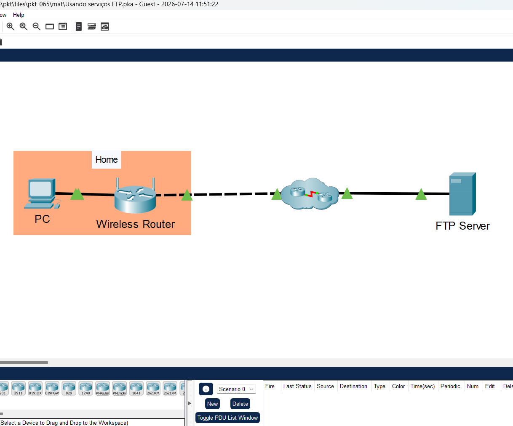
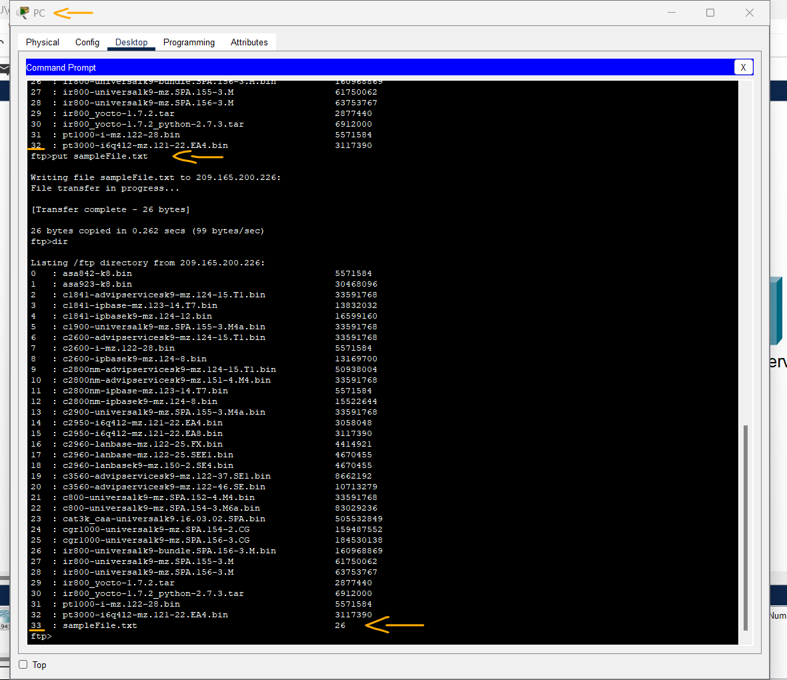
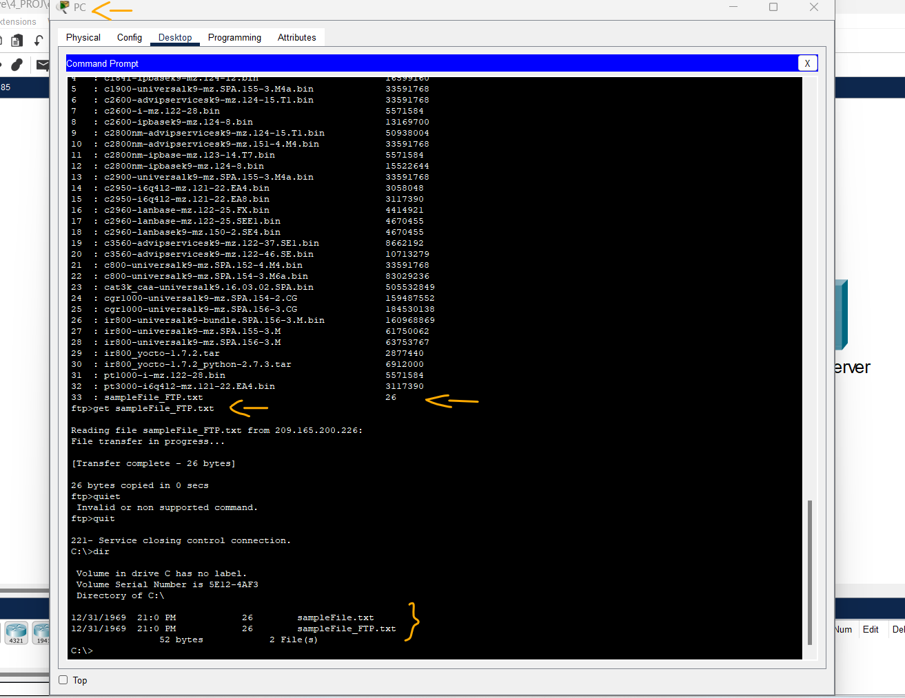
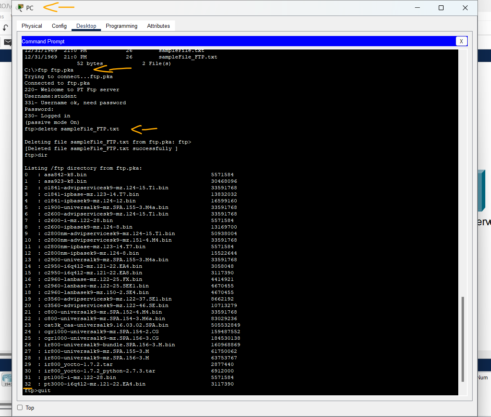

# Packet Tracer - Usando serviços FTP   

### Cisco: <a href="../../../">cisco   </a>
### Cisco Networking Academy: cna   </a>
### Training Category: <a href="../../../pkt/">pkt</a>
### Software/Subject: network   </a>
### Course: <a href="./">pkt_065 (Packet Tracer - Usando serviços FTP)   </a>

---

### Theme:
- Network

### Used Tools:
- Operating System (OS): 
  - Windows 11 
- Cloud Services:
  - Google Drive 
- Language:
  - HTML   
  - Markdown   
- Integrated Development Environment (IDE) and Text Editor:
  - Visual Studio Code (VS Code)   
- Versioning: 
  - Git   
- Repository:
  - GitHub   
- Network:
  - Cisco Packet Tracer   
  - ftp   

---

<h3><a name="item00">Course Strcuture:</a></h3>

1. <a href="#item01">Parte 1: Carregamento (upload) de um arquivo para um servidor FTP.</a> 
  1.1 <a href="#item01.01">Etapa 1: Localize o arquivo.</a> 
  1.2 <a href="#item01.02">Etapa 2: Conecte o servidor FTP.</a> 
  1.3 <a href="#item01.03">Etapa 3: Carregamento (upload) de um arquivo para um servidor FTP.</a> 
2. <a href="#item02">Parte 2: Baixar (download de) um arquivo de um servidor FTP.</a> 
  2.1 <a href="#item02.01">Etapa 1: Renomeie o arquivo no servidor FTP.</a> 
  2.2 <a href="#item02.02">Etapa 2: Baixe o arquivo do servidor FTP.</a> 
  2.3 <a href="#item02.03">Etapa 3: Excluindo o arquivo do servidor FTP.</a> 

---

### Objective:
O objetivo desta atividade foi apresentar o funcionamento de um servidor de arquivos, demonstrando como acessá-lo remotamente e realizar as principais operações de gerenciamento de arquivos, incluindo upload, listagem, download e exclusão de arquivos.

### Folder Structure:
- [README.md](./README.md): Este documento de README, escrito em **Markdown**, com o conteúdo do laboratório.
- [0-aux](./0-aux/): Pasta auxiliar com imagens utilizadas na construção dos arquivos de README desse curso.

### Development:

<a name="item01"><h4>1. Parte 1: Carregamento (upload) de um arquivo para um servidor FTP.</h4></a>[Back to summary](#item00)

A imagem 01 mostra a topologia inicial.

<figure>
     
    <figcaption>Imagem 01.</figcaption>
</figure>
 

Nesta parte, você localizará o arquivo sampleFile.txt e o carregará em um servidor FTP.

<a name="item01.01"><h4>1.1 Etapa 1: Localize o arquivo.</h4></a>[Back to summary](#item00)

- a. Clique em PC-A
- b. Clique em Desktop.
- c. Clique em Command Prompt.
- d. No prompt, clique em ? para listar os comandos disponíveis.
  - `?`.
- e. Insira dir para ver os arquivos no PC. Observe que há um arquivo sampleFile.txt no diretório C:.
  - `dir`.

<a name="item01.02"><h4>1.2 Etapa 2: Conecte o servidor FTP.</h4></a>[Back to summary](#item00)

- a. Efetue FTP para o servidor FTP em 209.165.200.226 ou ftp.pka.
  - `ftp 209.165.200.226` -> `ftp ftp.pka`.
- b. Entre com username student e password class para obter accesso.
  - `student` -> `class`.

<a name="item01.03"><h4>1.3 Etapa 3: Carregamento (upload) de um arquivo para um servidor FTP.</h4></a>[Back to summary](#item00)

- a. Digite ? para ver os comandos disponíveis no cliente ftp.
  - `?`.
- b. Insira dir para ver os arquivos disponíveis no servidor.
  - `dir`.
- c. Digite put sampleFile.txt para enviar o arquivo para o servidor.
  - `put sampleFile.txt`.
- d. Use o comando dir novamente para listar o conteúdo do servidor FTP e verificar se o arquivo foi carregado para o servidor FTP.
  - `dir`.

A imagem 02 comprova que o arquivo de teste foi transferido com sucesso do PC para o servidor de arquivos. 

<figure>
     
    <figcaption>Imagem 02.</figcaption>
</figure>
 

<a name="item02"><h4>2. Parte 2: Baixar (download de) um arquivo de um servidor FTP.</h4></a>[Back to summary](#item00)

Você também pode baixar um arquivo de um servidor FTP. Nesta parte, você vai renomear o arquivo sampleFile.txt e baixá-lo do servidor FTP.

<a name="item02.01"><h4>2.1 Etapa 1: Renomeie o arquivo no servidor FTP.</h4></a>[Back to summary](#item00)

- a. No prompt ftp>, renomeie o arquivo sampleFile.txt para sampleFile_FTP.txt.
  - `rename sampleFile.txt sampleFile_FTP.txt`.
- b. No prompt ftp>, digite dir para verificar se o arquivo foi renomeado.
  - `dir`.

<a name="item02.02"><h4>2.2 Etapa 2: Baixe o arquivo do servidor FTP.</h4></a>[Back to summary](#item00)

- a. Insira o comando get exampleFile_FTP.txt para recuperar o arquivo do servidor.
  - `get sampleFile_FTP.txt`.
- b. Digite quit para sair do cliente FTP quando terminar.
  `quit`.
- c. Exiba o conteúdo do diretório no PC novamente para ver o arquivo de imagem do servidor FTP.
  - `dir`.

A imagem 03 mostra que o arquivo renomeado também foi baixado do servidor para o PC.

<figure>
     
    <figcaption>Imagem 03.</figcaption>
</figure>
 

<a name="item02.03"><h4>2.3 Etapa 3: Excluindo o arquivo do servidor FTP.</h4></a>[Back to summary](#item00)

- a. Faça login no servidor FTP novamente para excluir o arquivo sampleFile_FTP.txt.
  - `ftp ftp.pka` -> `student` -> `class`.
- b. Insira o comando para excluir o arquivo sampleFile_FTP.txt do servidor. Qual comando você usou para remover o arquivo do servidor FTP?
  - `delete sampleFile_FTP.txt`.
- c. Digite quit para sair do cliente FTP quando terminar.
  - `quit`.

A imagem 04 evidencia que o arquivo foi excluído com sucesso do servidor de arquivos por meio do acesso remoto realizado a partir do PC.

<figure>
     
    <figcaption>Imagem 04.</figcaption>
</figure>
 