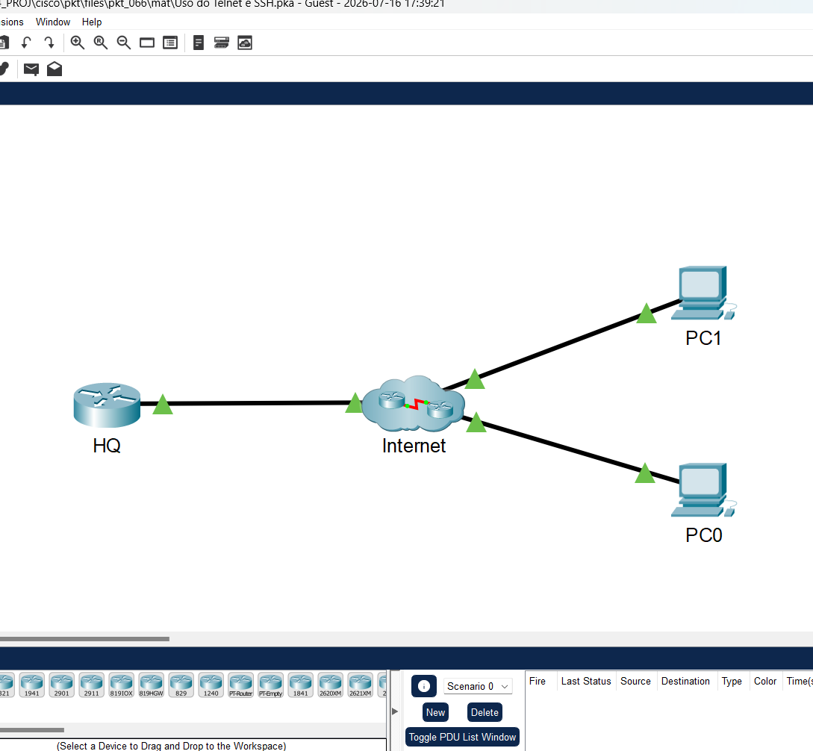
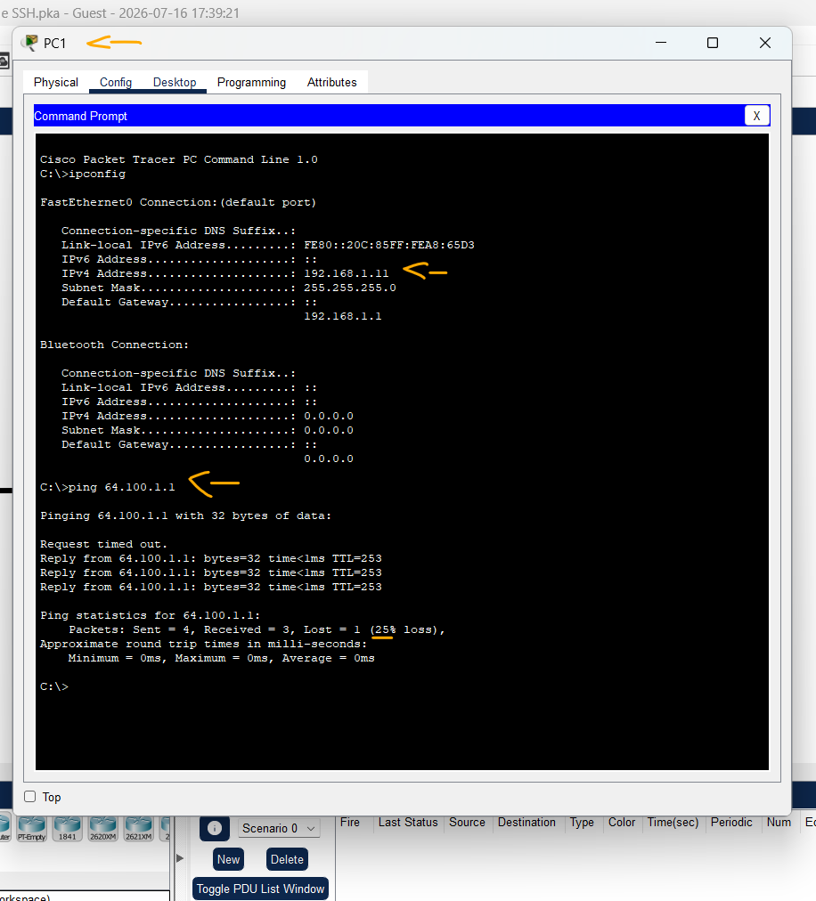
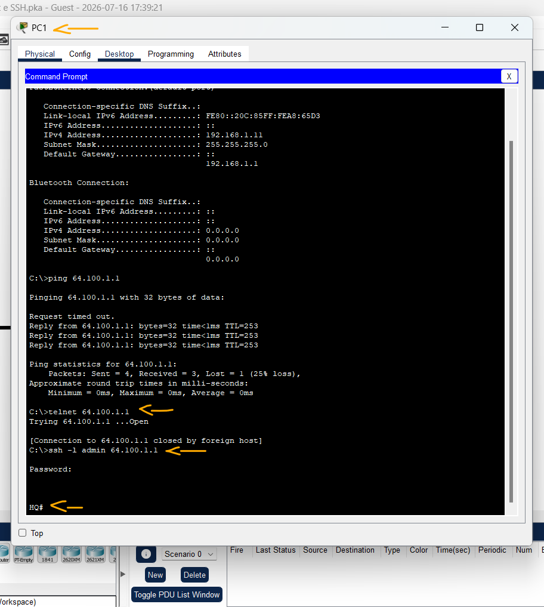

# Packet Tracer- Uso do Telnet e SSH   

### Cisco: <a href="../../../">cisco   </a>
### Cisco Networking Academy: cna   </a>
### Training Category: <a href="../../../pkt/">pkt</a>
### Software/Subject: network   </a>
### Course: <a href="./">pkt_066 (Packet Tracer- Uso do Telnet e SSH)   </a>

---

### Theme:
- Network

### Used Tools:
- Operating System (OS): 
  - Windows 11 
- Cloud Services:
  - Google Drive 
- Language:
  - HTML   
  - Markdown   
- Integrated Development Environment (IDE) and Text Editor:
  - Visual Studio Code (VS Code)   
- Versioning: 
  - Git   
- Repository:
  - GitHub   
- Network:
  - Cisco Packet Tracer   
  - OpenSSH   
  - Telnet   

---

<h3><a name="item00">Course Strcuture:</a></h3>

1. <a href="#item01">Parte 1: Verificar a conectividade</a> 
  1.1 <a href="#item01.01">Etapa 1: Verifique o endereço IP em um PC.</a> 
  1.2 <a href="#item01.02">Etapa 2: Verificar a conectividade com HQ.</a> 
2. <a href="#item02">Parte 2: Acessar um dispositivo remoto</a> 
  2.1 <a href="#item02.01">Etapa 1: Telnet para HQ.</a> 
  2.2 <a href="#item02.02">Etapa 2: SSH para HQ.</a> 

---

### Objective
O objetivo desta atividade foi demonstrar como acessar remotamente um roteador por meio dos protocolos Telnet e SSH, comparando suas funcionalidades e destacando as diferenças entre eles, especialmente em relação à segurança.

### Folder Structure:
- [README.md](./README.md): Este documento de README, escrito em **Markdown**, com o conteúdo do laboratório.
- [0-aux](./0-aux/): Pasta auxiliar com imagens utilizadas na construção dos arquivos de README desse curso.

### Development:

<a name="item01"><h4>1. Parte 1: Verificar a conectividade</h4></a>[Back to summary](#item00)

A imagem 01 mostra a topologia inicial.

<figure>
     
    <figcaption>Imagem 01.</figcaption>
</figure>
 

Nesta parte, você verificará se o PC tem endereçamento IP e pode pingar o roteador remoto.

<a name="item01.01"><h4>1.1 Etapa 1: Verifique o endereço IP em um PC.</h4></a>[Back to summary](#item00)

- a. Em um PC, clique em Desktop. Clique em Command Prompt.
- b. No prompt, verifique se o PC possui um endereço IP do DHCP. Qual comando você usou para verificar se o endereço IP foi obtido por DHCP?
  - `ipconfig`.

<a name="item01.02"><h4>1.2 Etapa 2: Verificar a conectividade com HQ.</h4></a>[Back to summary](#item00)

- a. Verifique se você consegue pingar o roteador HQ usando o endereço IP listado na tabela de endereçamento.
  - `ping 64.100.1.1`.

A imagem 02 demonstra que o teste de conectividade realizado por meio do comando ping foi bem-sucedido, confirmando a comunicação entre o PC1 e o roteador.

<figure>
     
    <figcaption>Imagem 02.</figcaption>
</figure>
 

<a name="item02"><h4>2. Parte 2: Acessar um dispositivo remoto</h4></a>[Back to summary](#item00)

Nesta parte, você tentará estabelecer uma conexão remota usando Telnet e SSH.

<a name="item02.01"><h4>2.1 Etapa 1: Telnet para HQ.</h4></a>[Back to summary](#item00)

- a. No prompt, digite o comando telnet 64.100.1.1.
  - `telnet 64.100.1.1`.
- a. Deu certo? Qual foi a saída?
  - Não. O comando realizou uma tentativa de conexão com o roteador, porém a sessão foi encerrada sem que o acesso fosse estabelecido. Isso indica que o serviço Telnet não está habilitado ou que o acesso por esse protocolo está bloqueado, o que é uma prática recomendada, já que o Telnet transmite os dados em texto puro, sem criptografia, tornando a comunicação vulnerável a interceptações.

<a name="item02.02"><h4>2.2 Etapa 2: SSH para HQ.</h4></a>[Back to summary](#item00)

- a. O roteador está configurado corretamente para não permitir acesso não seguro ao Telnet. Você tem que usar o SSH. No prompt, digite o comando ssh -l admin 64.100.1.1. Entre com a senha class quando solicitado.
  - `ssh -l admin 64.100.1.1` -> `class`.
- a. Qual o prompt após acessar o roteador com sucesso via SSH?
  - Com o protocolo SSH, o acesso remoto ao roteador foi estabelecido com sucesso. Após a autenticação, foi exibido o prompt *HQ#*, indicando que a conexão foi realizada corretamente e que o usuário possui acesso ao modo EXEC privilegiado do roteador.

A imagem 03 apresenta as tentativas de conexão utilizando os protocolos Telnet e SSH, evidenciando que apenas o SSH foi capaz de estabelecer uma conexão remota com o roteador.

<figure>
     
    <figcaption>Imagem 03.</figcaption>
</figure>
 