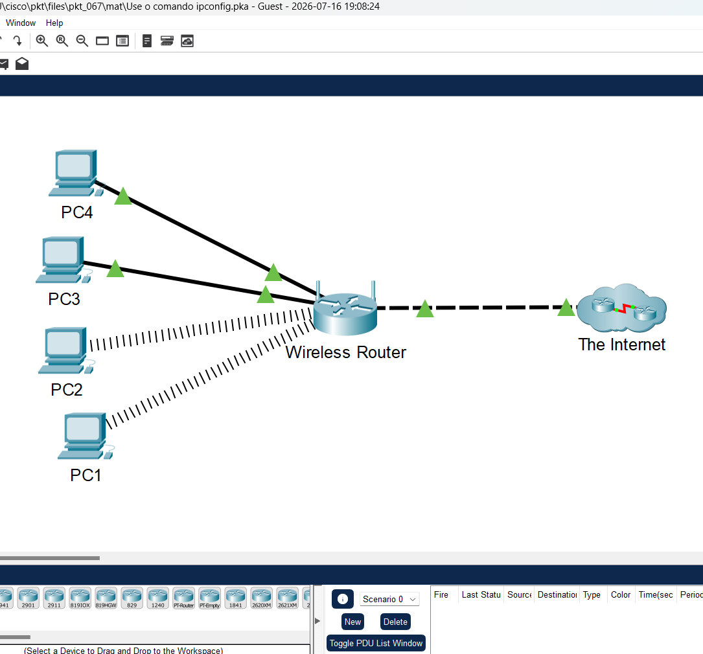
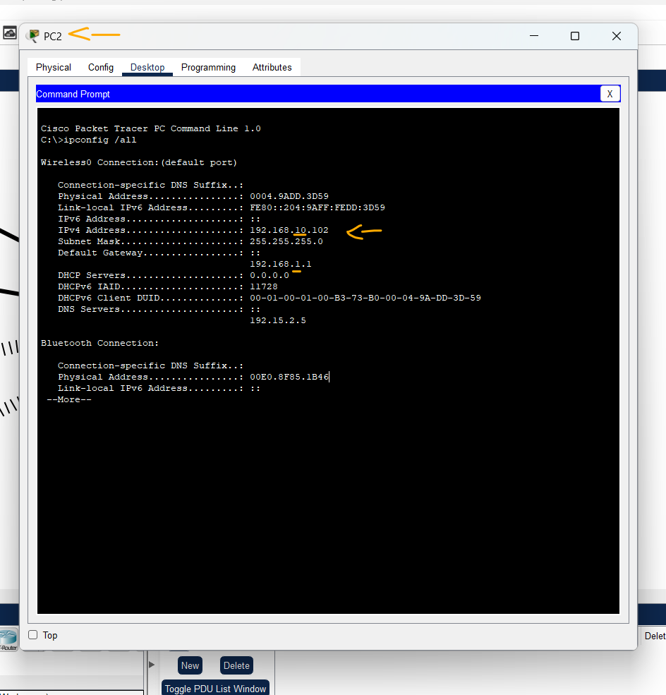
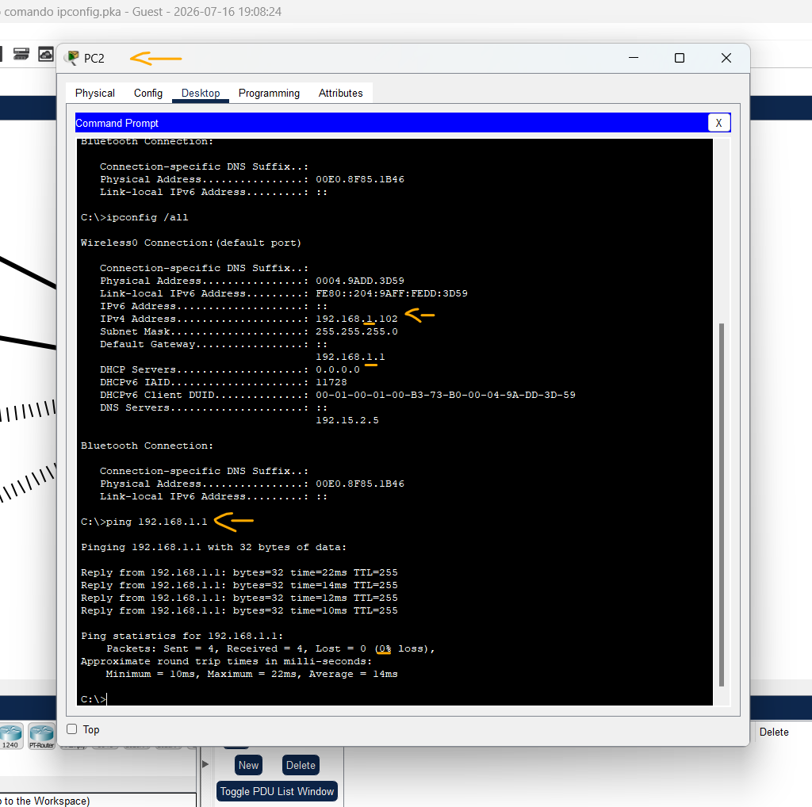

# Packet Tracer - Usando o comando ipconfig   

### Cisco: <a href="../../../">cisco   </a>
### Cisco Networking Academy: cna   </a>
### Training Category: <a href="../../../pkt/">pkt</a>
### Software/Subject: network   </a>
### Course: <a href="./">pkt_067 (Packet Tracer - Usando o comando ipconfig)   </a>

---

### Theme:
- Network

### Used Tools:
- Operating System (OS): 
  - Windows 11 
- Cloud Services:
  - Google Drive 
- Language:
  - HTML   
  - Markdown   
- Integrated Development Environment (IDE) and Text Editor:
  - Visual Studio Code (VS Code)   
- Versioning: 
  - Git   
- Repository:
  - GitHub   
- Network:
  - Cisco Packet Tracer   
  - ipconfig   

---

<h3><a name="item00">Course Strcuture:</a></h3>

1. <a href="#item01">Parte 1: Verificar configurações</a> 
2. <a href="#item02">Parte 2: Corrija as configurações incorretas</a> 

---

### Objective
Esta atividade teve como objetivo utilizar a ferramenta **ipconfig** para verificar as configurações de endereçamento IP dos computadores da rede, identificar o dispositivo com configuração incorreta e corrigir o endereço IP para restabelecer sua conectividade com a rede local.

### Folder Structure:
- [README.md](./README.md): Este documento de README, escrito em **Markdown**, com o conteúdo do laboratório.
- [0-aux](./0-aux/): Pasta auxiliar com imagens utilizadas na construção dos arquivos de README desse curso.

### Development:

<a name="item01"><h4>1. Parte 1: Verificar configurações</h4></a>[Back to summary](#item00)

A imagem 01 mostra a topologia inicial.

<figure>
     
    <figcaption>Imagem 01.</figcaption>
</figure>
 

- a. Acesse o prompt de comando em cada PC e digite o comando ipconfig /all no prompt.
  - `ipconfig /all`.
- b. Verifique a configuração do endereço IP, da máscara de sub-rede e do gateway padrão para cada PC. Anote essa configuração de IP de cada PC para ajudar a identificar PCs que estão configurados de forma incorreta.

#### Tabela 1 — Endereçamento IPv4

| Dispositivo | Interface | Endereço IP    | Máscara de Sub-Rede | Gateway Padrão |
|:-----------:|:---------:|:--------------:|:-------------------:|:--------------:|
| PC1         | NIC       | 192.168.1.101  | 255.255.255.0       | 192.168.1.1    |
| PC2         | NIC       | 192.168.10.102 | 255.255.255.0       | 192.168.1.1    |
| PC3         | NIC       | 192.168.1.103  | 255.255.255.0       | 192.168.1.1    |
| PC4         | NIC       | 192.168.1.104  | 255.255.255.0       | 192.168.1.1    |

A imagem 02 evidencia que o endereço IP configurado no PC2 não pertencia à mesma sub-rede da rede local, impedindo o estabelecimento da comunicação.

<figure>
     
    <figcaption>Imagem 02.</figcaption>
</figure>
 

<a name="item02"><h4>2. Parte 2: Corrija as configurações incorretas</h4></a>[Back to summary](#item00)

- a. Selecione o PC que está configurado incorretamente.
- b. Clique na guia Desktop > guia IP Configuration (Configuração de IP) para corrigir a configuração incorreta.

A imagem 03 demonstra que o endereçamento IP do PC2 foi corrigido, passando a ser compatível com a rede configurada.

<figure>
     
    <figcaption>Imagem 03.</figcaption>
</figure>
 