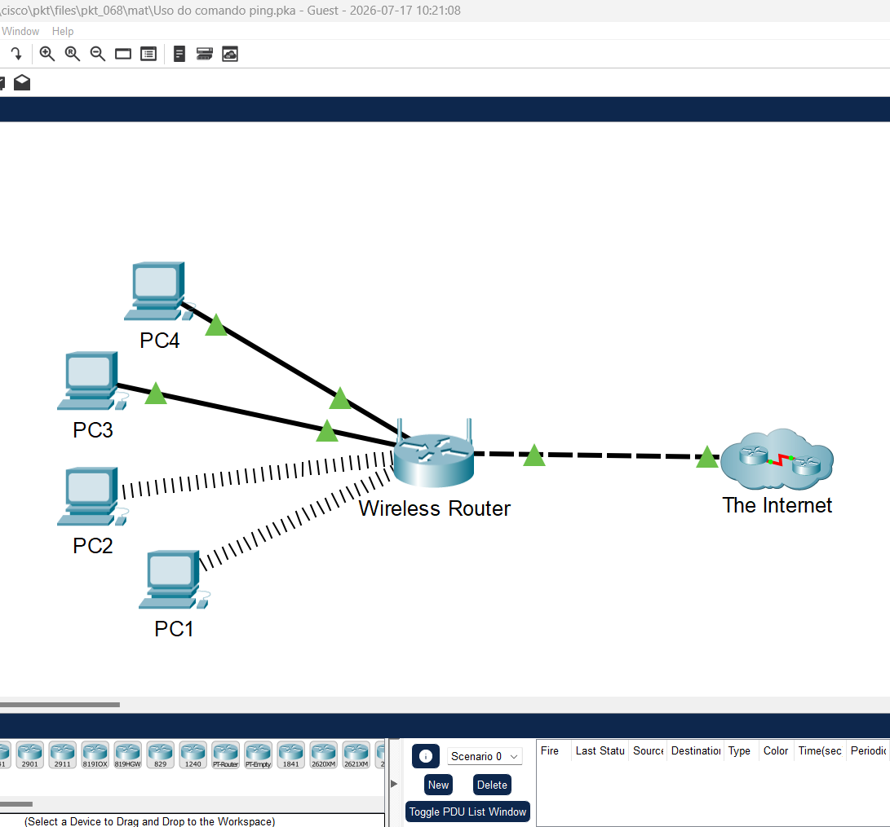
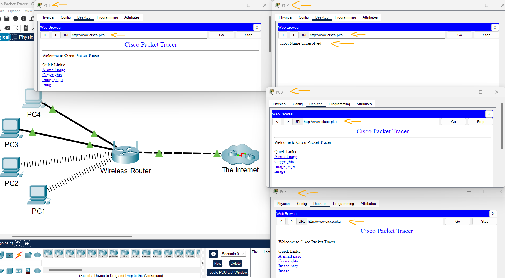
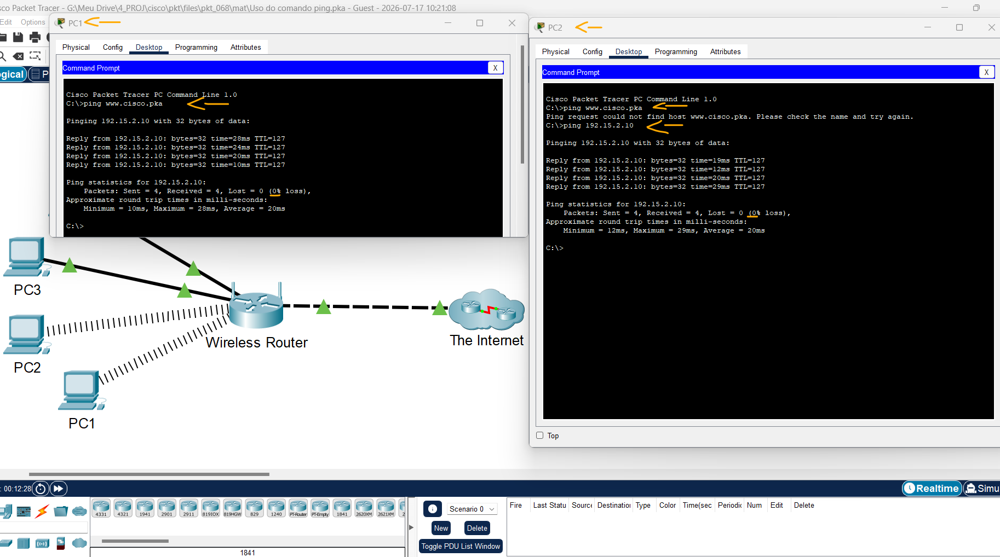
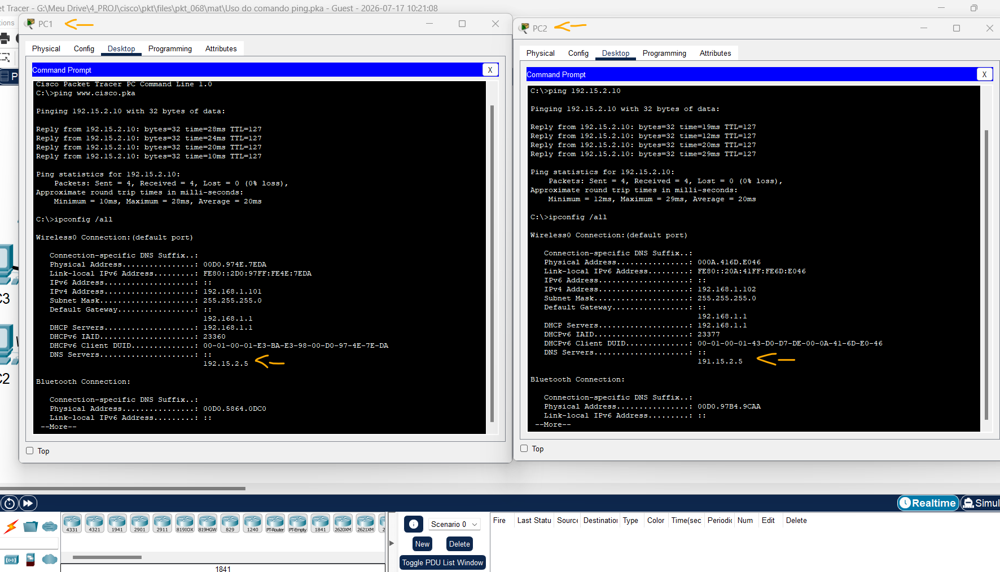
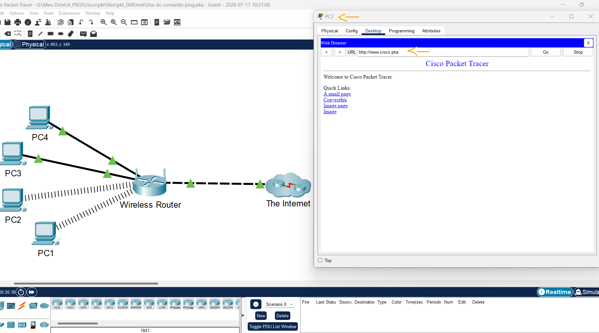

# Packet Tracer – Uso do comando ping   

### Cisco: <a href="../../../">cisco   </a>
### Cisco Networking Academy: cna   </a>
### Training Category: <a href="../../../pkt/">pkt</a>
### Software/Subject: network   </a>
### Course: <a href="./">pkt_068 (Packet Tracer – Uso do comando ping)   </a>

---

### Theme:
- Network

### Used Tools:
- Operating System (OS): 
  - Windows 11 
- Cloud Services:
  - Google Drive 
- Language:
  - HTML   
  - Markdown   
- Integrated Development Environment (IDE) and Text Editor:
  - Visual Studio Code (VS Code)   
- Versioning: 
  - Git   
- Repository:
  - GitHub   
- Network:
  - Cisco Packet Tracer   
  - ping   
  - ipconfig   

---

<h3><a name="item00">Course Strcuture:</a></h3>

1. <a href="#item01">Parte 1: Verifique a conectividade.</a> 
2. <a href="#item02">Parte 2: Faça ping no servidor Web a partir do PC com problemas de conectividade.</a> 
3. <a href="#item03">Parte 3: Faça ping no servidor Web a partir dos PCs configurados corretamente.</a> 
4. <a href="#item04">Parte 4: Pingue o endereço IP do servidor web a partir de PCs com problemas de conectividade.</a> 
5. <a href="#item05">Parte 5: Compare as informações de servidor DNS nos PCs.</a> 
6. <a href="#item06">Parte 6: Faça as alterações de configuração necessárias nos PCs.</a> 

---

### Objective:
O objetivo desta atividade foi utilizar a ferramenta **ping** para identificar quais computadores da rede não conseguiam se comunicar com o servidor por meio do nome de domínio. Em seguida, foi verificada a conectividade utilizando o endereço IP do servidor, a fim de determinar se a falha estava relacionada à resolução de nomes (DNS).

### Folder Structure:
- [README.md](./README.md): Este documento de README, escrito em **Markdown**, com o conteúdo do laboratório.
- [0-aux](./0-aux/): Pasta auxiliar com imagens utilizadas na construção dos arquivos de README desse curso.

### Development:

<a name="item01"><h4>1. Parte 1: Verifique a conectividade.</h4></a>[Back to summary](#item00)

A imagem 01 mostra a topologia inicial.

<figure>
     
    <figcaption>Imagem 01.</figcaption>
</figure>
 

- a. Acesse a guia Desktop > Web Browser de cada PC e digite a URL www.cisco.pka. Identifique os PCs que estão sem conexão com o servidor Web. Observação: todos os dispositivos precisam de tempo para concluir o processo de boot. Aguarde até um minuto para receber uma resposta da Web.
  - `www.cisco.pka`.
- a. Quais PCs estão sem conexão com o servidor Web?
  - O único PC que está sem conexão com o servidor web é o PC2.

A imagem 02 evidencia que apenas o PC2 não conseguiu acessar o servidor web, enquanto os demais computadores estabeleceram a conexão com sucesso.

<figure>
     
    <figcaption>Imagem 02.</figcaption>
</figure>
 

<a name="item02"><h4>2. Parte 2: Faça ping no servidor Web a partir do PC com problemas de conectividade.</h4></a>[Back to summary](#item00)

- a. No PC, acesse o Command Prompt na guia Desktop.
- b. No prompt, digite ping www.cisco.pka.
  - `ping www.cisco.pka`.
- b. O ping retornou alguma resposta? Qual é o endereço IP exibido na resposta, se houver?
  - Não. Nenhum endereço IP foi exibido, pois o nome de domínio não pôde ser resolvido devido a um problema na configuração do DNS.

<a name="item03"><h4>3. Parte 3: Faça ping no servidor Web a partir dos PCs configurados corretamente.</h4></a>[Back to summary](#item00)

- a. No PC, acesse o Command Prompt na guia Desktop.
- b. No prompt, digite ping www.cisco.pka.
  - `ping www.cisco.pka`.
- b. O ping retornou uma resposta? Qual é o endereço IP retornado, se houver?
  - Sim. O endereço de IP retornado foi 192.15.2.10, que correspondia ao endereço do servidor web www.cisco.pka.

<a name="item04"><h4>4. Parte 4: Pingue o endereço IP do servidor web a partir de PCs com problemas de conectividade.</h4></a>[Back to summary](#item00)

- a. No PC, acesse o Command Prompt na guia Desktop.
- b. Tente acessar o endereço IP do servidor web com o comando ping.
  - `ping 192.15.2.10`.
- b. O ping retornou uma resposta? 
  - Sim. O ping retornou resposta, evidenciando que a conectividade com o servidor estava funcionando e que o problema estava na resolução de nomes (DNS).

A imagem 03 mostra que o PC2 conseguia pingar pelo endereço de IP do servidor, mas não conseguia pelo nome de domínio.

<figure>
     
    <figcaption>Imagem 03.</figcaption>
</figure>
 

<a name="item05"><h4>5. Parte 5: Compare as informações de servidor DNS nos PCs.</h4></a>[Back to summary](#item00)

- a. Acesse o Command Prompt dos PCs sem problemas.
- b. Usando o comando ipconfig /all, examine a configuração do servidor DNS nos PCs sem problemas.
  - `ipconfig /all`.
- c. Acesse o Command Prompt dos PCs com problemas de conectividade.
- d. Usando o comando ipconfig /all, examine a configuração de servidor DNS nos PCs com configurações incorretas.
  - `ipconfig /all`.
- d. As duas configurações são compatíveis?
  - Não. O endereço IP configurado para o servidor DNS no PC2 era 191.15.2.5, enquanto o endereço correto, utilizado pelos demais computadores da rede, era 192.15.2.5.

A imagem 04 exibe essa diferença no endereçamento de IP do servidor DNS nos PCs.

<figure>
     
    <figcaption>Imagem 04.</figcaption>
</figure>
 

<a name="item06"><h4>6. Parte 6: Faça as alterações de configuração necessárias nos PCs.</h4></a>[Back to summary](#item00)

- a. Navegue até a guia Desktop dos PCs com problemas, faça as alterações de configuração necessárias em IP Configuration.
  - DNS Server: `192.15.2.5`.
- b. Use o Web Browser da guia Desktop para se conectar a www.cisco.pka e verificar se as alterações de configuração resolveram o problema.
  - `www.cisco.pka`.

A imagem 05 mostra que, após a correção do endereço IP do servidor DNS no PC2, o computador passou a resolver corretamente o nome de domínio e a acessar o servidor web com sucesso.

<figure>
     
    <figcaption>Imagem 05.</figcaption>
</figure>
 