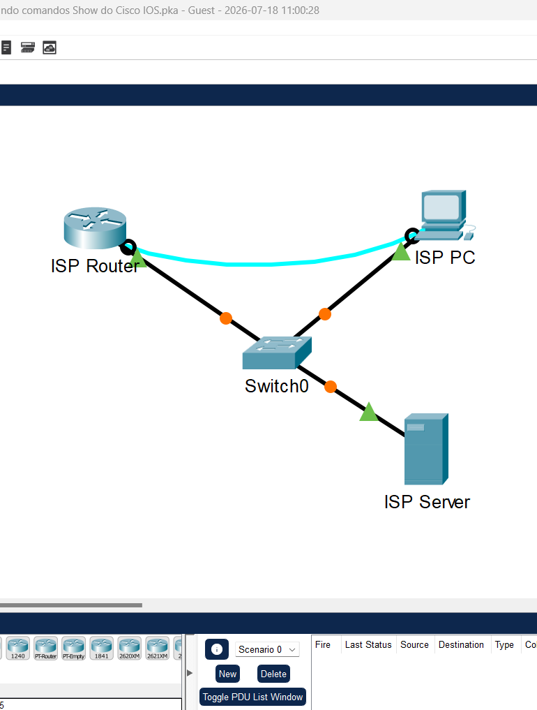
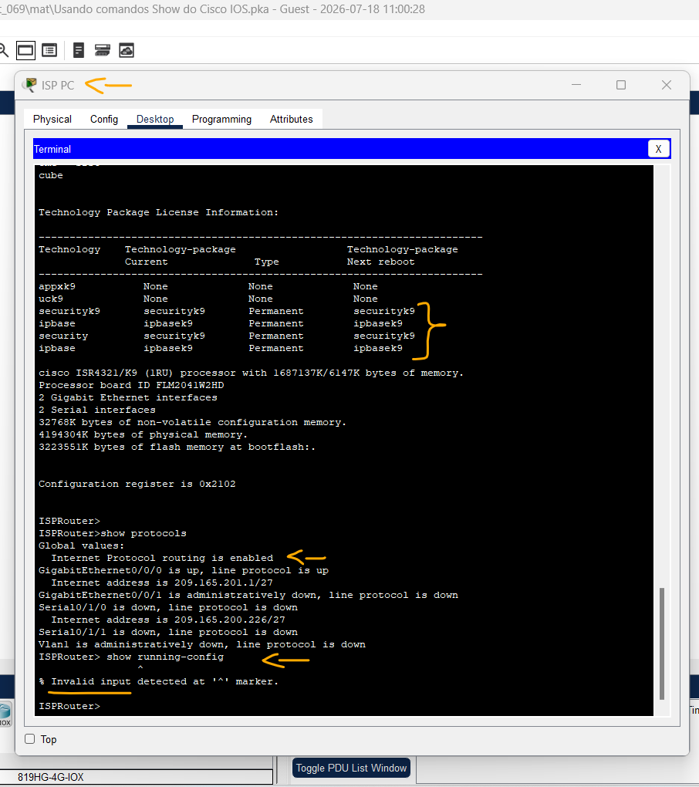
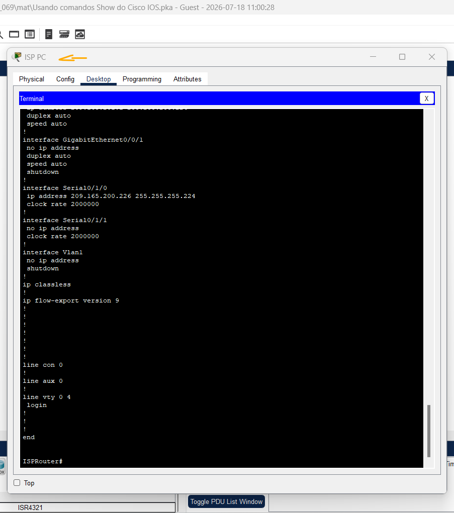

# Packet Tracer - Usando comandos Show do Cisco IOS   

### Cisco: <a href="../../../">cisco   </a>
### Cisco Networking Academy: cna   </a>
### Training Category: <a href="../../../pkt/">pkt</a>
### Software/Subject: network   </a>
### Course: <a href="./">pkt_069 (Packet Tracer - Usando comandos Show do Cisco IOS)   </a>

---

### Theme:
- Network

### Used Tools:
- Operating System (OS): 
  - Cisco Internetwork Operating System (Cisco IOS)   
  - Windows 11 
- Cloud Services:
  - Google Drive 
- Language:
  - HTML   
  - Markdown   
- Integrated Development Environment (IDE) and Text Editor:
  - Visual Studio Code (VS Code)   
- Versioning: 
  - Git   
- Repository:
  - GitHub   
- Network:
  - Cisco Packet Tracer   

---

<h3><a name="item00">Course Strcuture:</a></h3>

1. <a href="#item01">Parte 1: Conectar ao roteador Cisco 4321 ISP.</a> 
2. <a href="#item02">Parte 2: Explore os comandos show.</a> 
  2.1 <a href="#item02.01">Etapa 1: Explore os comandos show no modo User EXEC.</a> 
  2.2 <a href="#item02.02">Etapa 2: Explore os comandos show no modo EXEC privilegiado.</a> 

---

### Objective:
O objetivo desta atividade foi explorar o comando show do **Cisco IOS**, analisando suas principais opções nos modos EXEC do usuário e EXEC privilegiado, bem como as informações de monitoramento e configuração fornecidas por esse comando.

### Folder Structure:
- [README.md](./README.md): Este documento de README, escrito em **Markdown**, com o conteúdo do laboratório.
- [0-aux](./0-aux/): Pasta auxiliar com imagens utilizadas na construção dos arquivos de README desse curso.

### Development:

<a name="item01"><h4>1. Parte 1: Conectar ao roteador Cisco 4321 ISP.</h4></a>[Back to summary](#item00)

A imagem 01 mostra a topologia inicial.

<figure>
     
    <figcaption>Imagem 01.</figcaption>
</figure>
 

Nesta parte, você usará o software de emulação de terminal no ISP PC para se conectar ao roteador Cisco 4321.

- a. Clique em PC ISP.
- b. Clique na guia Desktop. Selecione Terminal. Revise a configuração do terminal e clique em OK para continuar.
- c. O prompt ISPRouter > indica que você está no modo EXEC do usuário. Pressione a tecla Enter se o prompt não tiver sido exibido.

<a name="item02"><h4>2. Parte 2: Explore os comandos show.</h4></a>[Back to summary](#item00)

Use as informações disponibilizadas por esses comandos show para responder às perguntas a seguir.

<a name="item02.01"><h4>2.1 Etapa 1: Explore os comandos show no modo User EXEC.</h4></a>[Back to summary](#item00)

- a. Digite show ? no prompt.
  - `show ?`.
- a. Liste mais alguns comandos show que estão disponíveis no modo EXEC do usuário.
  - Os comandos show disponíveis no modo EXEC do usuário são: arp, cdp, class-map, clock, controllers, crypto, dot11, flash, frame-relay, history, hosts, interfaces, ip, ipv6, lldp, policy-map, pppoe, privilege, protocols, queue, queueing, sessions, ssh, tcp, terminal, users, version, vlan-switch e vtp.
- b. Digite show arp no prompt.
  - `show arp`.
- b. Registre o endereço MAC e o endereço IP listados.
  - O único registro listado associa o endereço lógico (IP) 209.165.201.1 ao respectivo endereço físico (MAC) 0001.96CD.2501.
- c. Digite show flash no prompt.
  - `show flash`.
- c. Registre a imagem do IOS listada:
  - A imagem do IOS é o arquivo binário *isr4300-universalk9.03.16.05.S.155-3.S5-ext.SPA.bin*.
- d. Digite show ip route no prompt.
  - `show ip route`.
- d. Quantas rotas estão listadas na tabela?
  - Duas rotas: uma rota conectada (**C**) e uma rota local (**L**), ambas pertencentes à mesma rede.
- e. Digite show interfaces no prompt.
  - `show interfaces`.
- e. Qual interface está up e funcionando?
  - Apenas a interface GigabitEthernet0/0/0 está ativa e operacional (up/up).
- f. Insira show ip interface no prompt.
  - `show ip interface`.
- f. De acordo com a saída show ip interface, qual interface está conectada?
  - Apenas a interface GigabitEthernet0/0/0 está conectada.
- g. Digite show version no prompt.
  - `show version`.
- g. Qual pacote de tecnologia está ativo no roteador?
  - Os pacotes de tecnologia ativos no roteador são ipbasek9 e securityk9.
- h. Insira show protocols no prompt.
  - `show protocols`.
- h. Quais protocolos estão ativos no roteador?
  - Apenas o protocolo IP (Internet Protocol) está ativo no roteador.
- i. Digite show running-config no prompt.
  - `show running-config`.
- Qual é a saída?
  - Foi exibida uma mensagem de comando inválido, pois o comando show running-config só pode ser executado no modo EXEC privilegiado.

A imagem 02 exibe a saída correspondente aos três últimos comandos executados no roteador.

<figure>
     
    <figcaption>Imagem 02.</figcaption>
</figure>
 

<a name="item02.02"><h4>2.2 Etapa 2: Explore os comandos show no modo EXEC privilegiado.</h4></a>[Back to summary](#item00)

- a. Digite enable no prompt para entrar no modo EXEC privilegiado.
  - `enable` -> `show ?`.
- a. Liste mais alguns comandos show neste modo.
  - Além dos comandos disponíveis no modo EXEC do usuário, o modo EXEC privilegiado disponibiliza comandos adicionais, como: aaa, access-lists, debugging, dhcp, file, flow, license, line, logging, login, mac-address-table, ntp, parser, processes, running-config, secure, snmp, spanning-tree, standby, startup-config, storm-control, tech-support, zone e zone-pair.
- b. Digite show running-config no prompt.
  - `show running-config`.
- b. Qual é a saída?
  - A saída apresenta o conteúdo do arquivo de configuração em execução (running-config), contendo as configurações atualmente ativas no dispositivo.

A imagem 03 mostra a parte final do arquivo de configuração em execução (running-config) do roteador.

<figure>
     
    <figcaption>Imagem 03.</figcaption>
</figure>
 