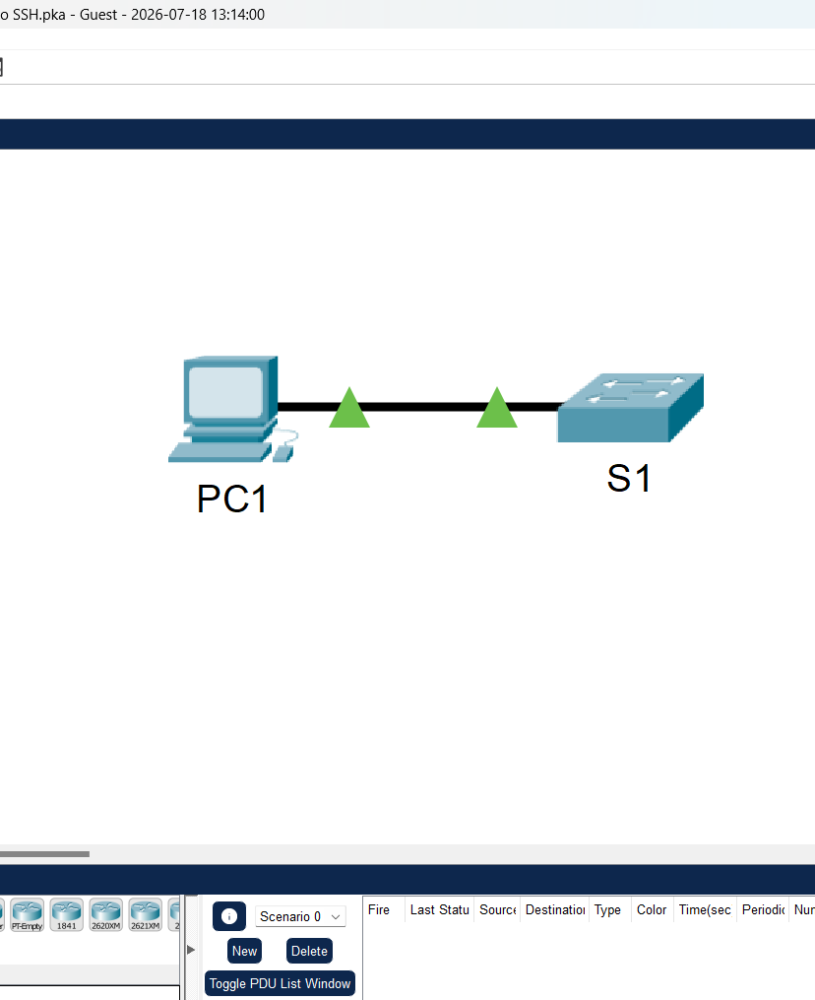
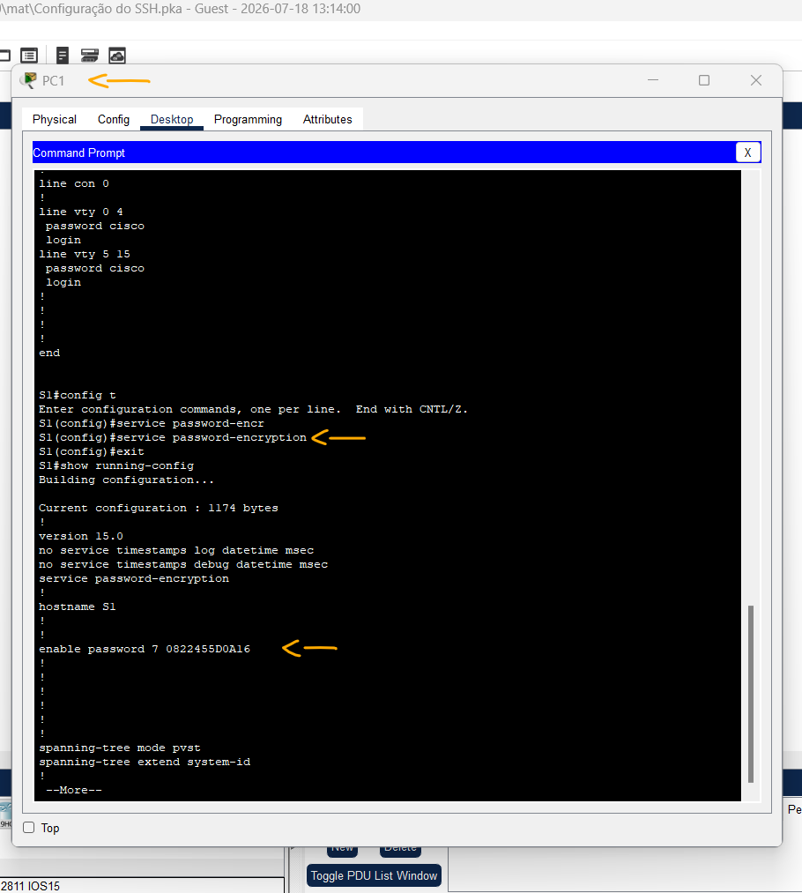
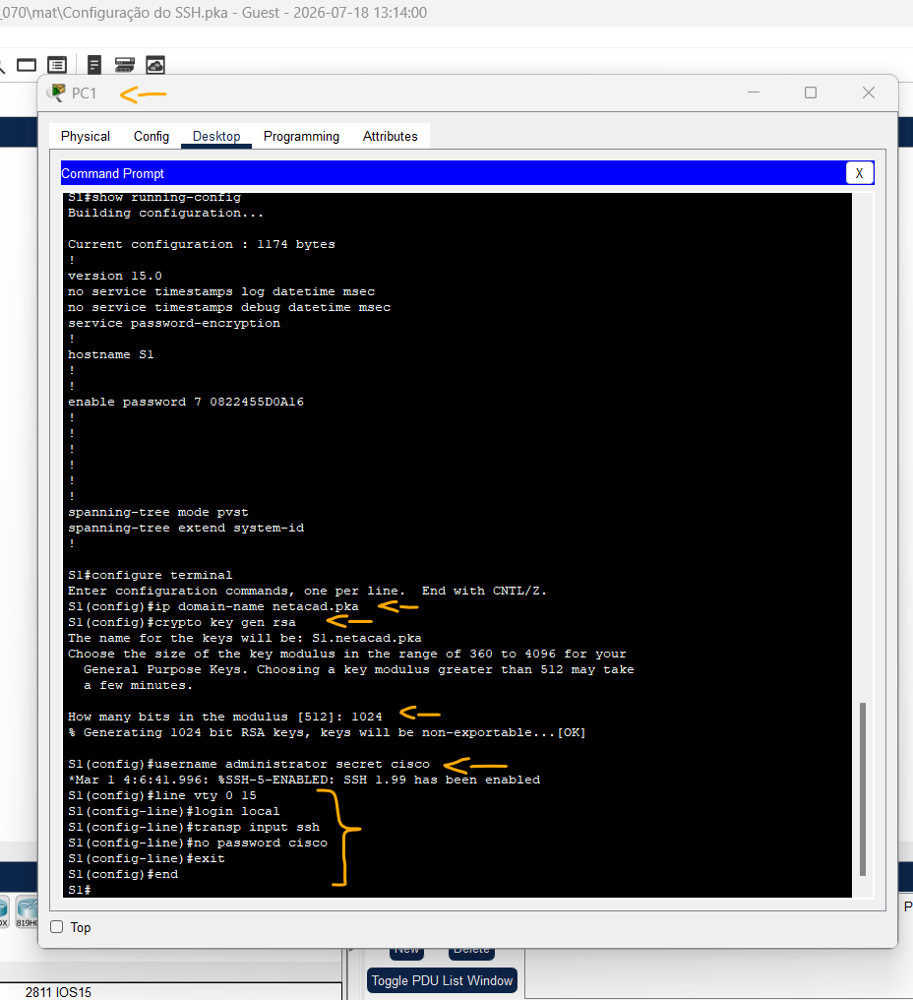
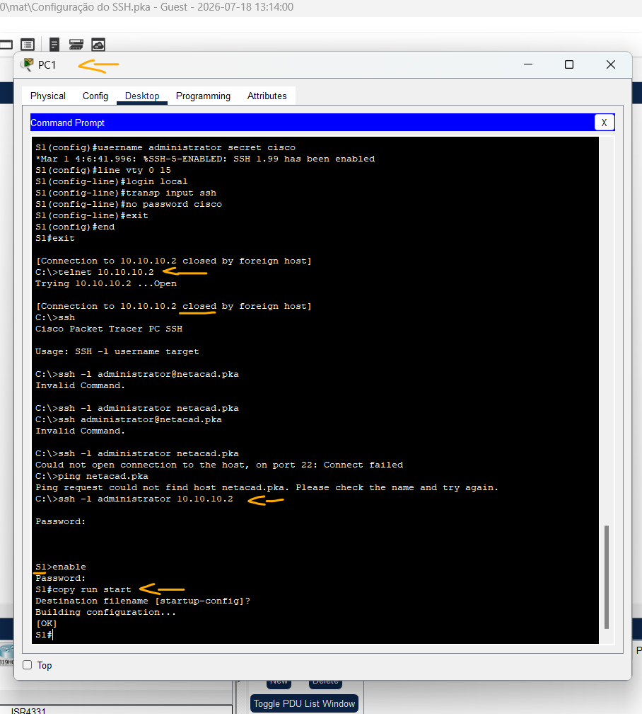

# Packet Tracer – Configurar o SSH   

### Cisco: <a href="../../../">cisco   </a>
### Cisco Networking Academy: cna   </a>
### Training Category: <a href="../../../pkt/">pkt</a>
### Software/Subject: network   </a>
### Course: <a href="./">pkt_070 (Packet Tracer – Configurar o SSH)   </a>

---

### Theme:
- Network

### Used Tools:
- Operating System (OS): 
  - Cisco Internetwork Operating System (Cisco IOS)   
  - Windows 11 
- Cloud Services:
  - Google Drive 
- Language:
  - HTML   
  - Markdown   
- Integrated Development Environment (IDE) and Text Editor:
  - Visual Studio Code (VS Code)   
- Versioning: 
  - Git   
- Repository:
  - GitHub   
- Network:
  - Cisco Packet Tracer   
  - OpenSSH   
  - Telnet   

---

<h3><a name="item00">Course Strcuture:</a></h3>

1. <a href="#item01">Parte 1: Proteger senhas</a> 
2. <a href="#item02">Parte 2: Criptografar comunicações</a> 
  2.1 <a href="#item02.01">Etapa 1: Defina o nome de domínio IP e gere chaves de segurança.</a> 
  2.2 <a href="#item02.02">Etapa 2: Crie um usuário do SSH e reconfigure as linhas de VTY para somente acesso SSH.</a> 
3. <a href="#item03">Parte 3: Verificar a implementação SSH</a> 

---

### Objective:
Esta atividade teve como objetivo configurar o acesso remoto seguro ao switch, substituindo o protocolo Telnet pelo SSH, incluindo a criação de usuário e senha para autenticação e a restrição das linhas VTY para permitir apenas conexões SSH.

### Folder Structure:
- [README.md](./README.md): Este documento de README, escrito em **Markdown**, com o conteúdo do laboratório.
- [0-aux](./0-aux/): Pasta auxiliar com imagens utilizadas na construção dos arquivos de README desse curso.

### Development:

<a name="item01"><h4>1. Parte 1: Proteger senhas</h4></a>[Back to summary](#item00)

A imagem 01 mostra a topologia inicial.

<figure>
     
    <figcaption>Imagem 01.</figcaption>
</figure>
 

- a. Usando o prompt de comando em PC1, execute Telnet para S1. A senha do EXEC do usuário e do EXEC privilegiado é cisco.
  - `telnet 10.10.10.2` -> `cisco` -> `enable` -> `cisco`.
- b. Salve a configuração atual de forma que todos os erros que você cometa possam ser revertidos ligando e desligando S1.
  - `copy running-config startup-config`.
- c. Exiba a configuração atual e observe que as senhas estão em texto claro.
  - `show running-config`.
- d. No modo de configuração global, digite o comando que criptografa as senhas em texto simples:
  - `config terminal` -> `service password-encryption` -> `exit`.
- e. Verifique se as senhas estão criptografadas.
  - `show running-config`.

A imagem 02 apresenta o arquivo de configuração em execução (running-config), evidenciando que as senhas anteriormente exibidas em texto claro foram criptografadas.

<figure>
     
    <figcaption>Imagem 02.</figcaption>
</figure>
 

<a name="item02"><h4>2. Parte 2: Criptografar comunicações</h4></a>[Back to summary](#item00)

<a name="item02.01"><h4>2.1 Etapa 1: Defina o nome de domínio IP e gere chaves de segurança.</h4></a>[Back to summary](#item00)

Geralmente não é seguro usar o Telnet, pois os dados são transferidos em texto simples. Portanto, use SSH sempre que estiver disponível.

- a. Configure o nome de domínio como netacad.pka.
  - `configure terminal` -> `ip domain-name netacad.pka`.
- b. As chaves seguras são necessárias para criptografar os dados. Gere as chaves RSA usando um comprimento de chave de 1024.
  - `crypto key generate rsa` -> `1024`.

<a name="item02.02"><h4>2.2 Etapa 2: Crie um usuário do SSH e reconfigure as linhas de VTY para somente acesso SSH.</h4></a>[Back to summary](#item00)

- a. Crie um usuário administrator com a senha cisco.
  - `username administrator secret cisco`.
- b. Configure as linhas VTY para verificar o banco de dados de nome de usuário local para ver se há credenciais de login e para permitir acesso remoto apenas para SSH. Remova a senha da linha vty existente.
  - `line vty 0 15` -> `login local` -> `transport input ssh` -> `no password cisco` -> `end`.

A imagem 03 mostra que as linhas VTY do switch foram configuradas para permitir acesso remoto exclusivamente via SSH, incluindo a criação de usuário e senha de autenticação, a configuração do nome de domínio e a geração das chaves criptográficas necessárias.

<figure>
     
    <figcaption>Imagem 03.</figcaption>
</figure>
 

<a name="item03"><h4>3. Parte 3: Verificar a implementação SSH</h4></a>[Back to summary](#item00)

- a. Saia da sessão Telnet e tente fazer logon em usar o Telnet. A tentativa deverá falhar.
  - `exit` -> `telnet 10.10.10.2`.
- b. Tente fazer login usando o SSH. Digite ssh e pressione Enter sem nenhum parâmetro para revelar as instruções de uso de comando. Dica: a opção -l é a letra “L”, não o número 1.
  - `ssh` -> `ssh -l administrator 10.10.10.2`.
- c. Após o login com êxito, entre no modo EXEC privilegiado e salve as configurações. Se você não conseguir acessar S1, desligue e ligue S1 e comece novamente na Parte 1.
  - `enable` -> `cisco` -> `copy running-config startup-config`.

A imagem 04 comprova que o acesso remoto ao switch não é mais permitido via Telnet, sendo aceitas apenas conexões SSH utilizando as credenciais do usuário configurado no dispositivo.

<figure>
     
    <figcaption>Imagem 04.</figcaption>
</figure>
 