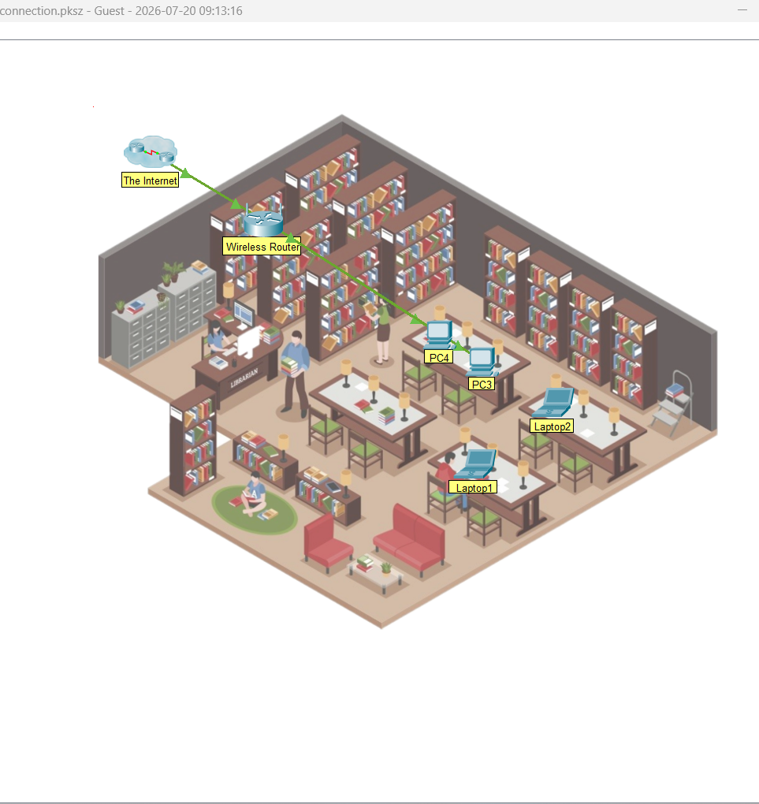
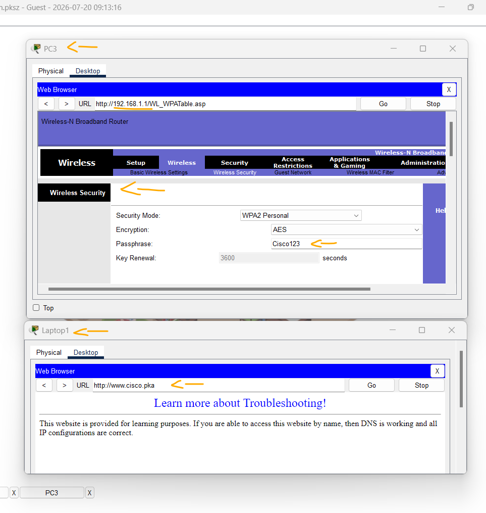

# Packet Tracer - Solucionar problemas de uma Conexão Wireless   

### Cisco: <a href="../../../">cisco   </a>
### Cisco Networking Academy: cna   </a>
### Training Category: <a href="../../../pkt/">pkt</a>
### Software/Subject: network   </a>
### Course: <a href="./">pkt_071 (Packet Tracer - Solucionar problemas de uma Conexão Wireless)   </a>

---

### Theme:
- Network

### Used Tools:
- Operating System (OS): 
  - Windows 11 
- Cloud Services:
  - Google Drive 
- Language:
  - HTML   
  - Markdown   
- Integrated Development Environment (IDE) and Text Editor:
  - Visual Studio Code (VS Code)   
- Versioning: 
  - Git   
- Repository:
  - GitHub   
- Network:
  - Cisco Packet Tracer   
  - ipconfig   
  - ping   

---

<h3><a name="item00">Course Strcuture:</a></h3>

1. <a href="#item01">Identifique falhas em uma rede sem fio.</a> 
2. <a href="#item02">Corrija dispositivos mal configurados em uma rede sem fio.</a> 
3. <a href="#item03">Vamos refletir sobre o que você acabou de realizar.</a> 

---

### Objective:
Esta atividade teve como objetivo realizar o troubleshooting de uma rede sem fio, identificando a causa da falha de conectividade e aplicando as correções necessárias para restabelecer a comunicação.

### Folder Structure:
- [README.md](./README.md): Este documento de README, escrito em **Markdown**, com o conteúdo do laboratório.
- [0-aux](./0-aux/): Pasta auxiliar com imagens utilizadas na construção dos arquivos de README desse curso.

### Development:

<a name="item01"><h4>1. Identifique falhas em uma rede sem fio.</h4></a>[Back to summary](#item00)

A imagem 01 mostra a topologia inicial.

<figure>
     
    <figcaption>Imagem 01.</figcaption>
</figure>
 

- a. Antes de corrigir o problema, você precisa entender quais dispositivos são afetados. Isso é útil para determinar se um único computador tem uma falha ou se toda a rede ou partes da rede são afetadas. Uma boa maneira de testar a conectividade com a Internet é verificar se os hosts podem acessar um site, por exemplo www.cisco.pka.
  - `www.cisco.pka`.

<a name="item02"><h4>2. Corrija dispositivos mal configurados em uma rede sem fio.</h4></a>[Back to summary](#item00)

- a. Agora vá em frente e comece a corrigir os problemas no Laptop1.
- b. Conecte-se Laptop1 à rede sem fio. 
  - PC3 -> Acessar o Gateway pela Web (192.168.1.1) -> Usar as credenciais padrão (admin/admin) -> Verificar a senha da rede Wi-Fi Academy (Cisco123) -> Conectar o Laptop1 a rede.
- c. Verificar Laptop1 a conectividade com www.cisco.pka
  - `www.cisco.pka`.

A imagem 02 mostra a senha da rede Wi-Fi Academy obtida pelo PC3 por meio da interface web de configuração do roteador, além de comprovar que o Laptop1 passou a acessar o site após a conexão à rede.

<figure>
     
    <figcaption>Imagem 02.</figcaption>
</figure>
 

<a name="item03"><h4>3. Vamos refletir sobre o que você acabou de realizar.</h4></a>[Back to summary](#item00)

- Quais métodos você usou para determinar qual PC tinha problemas de conectividade?
  - Tentei acessar o site pelo navegador para identificar qual dispositivo apresentava falha de conectividade. Como alternativa, também seria possível utilizar o comando ping para verificar a comunicação com o servidor.
- Como você descobriu o endereço IP do roteador sem fio?
  - Utilizei o comando ipconfig em um dos PCs para identificar o endereço do Gateway Padrão, correspondente ao IP do roteador sem fio.
- Qual é a diferença entre usar o comando ping e o comando tracert? O que você prefere?
  - O comando ping verifica se há conectividade entre a origem e o destino, enquanto o tracert identifica o caminho percorrido pelos pacotes, exibindo cada salto da rota. Ambos são úteis, mas costumo utilizar o ping como primeira ferramenta de diagnóstico.
- Por que é importante alterar o nome de usuário e a senha padrão para acesso administrativo a um roteador sem fio?
  - Para impedir que usuários não autorizados acessem a interface de administração do roteador, alterem suas configurações ou obtenham informações sensíveis, como a senha da rede sem fio.
- Como você se sente sobre o processo de solução de problemas de uma rede sem fio como resultado da conclusão desta atividade?
  - A atividade demonstrou que, seguindo um processo organizado de diagnóstico, é possível identificar e corrigir problemas comuns de conectividade em redes sem fio de forma relativamente simples.
- O que você aprendeu sobre seu próprio processo de solução de problemas durante esta atividade?
  - Aprendi a seguir uma sequência lógica de testes, verificando a conectividade, as configurações de rede e os parâmetros do roteador até identificar a causa do problema.