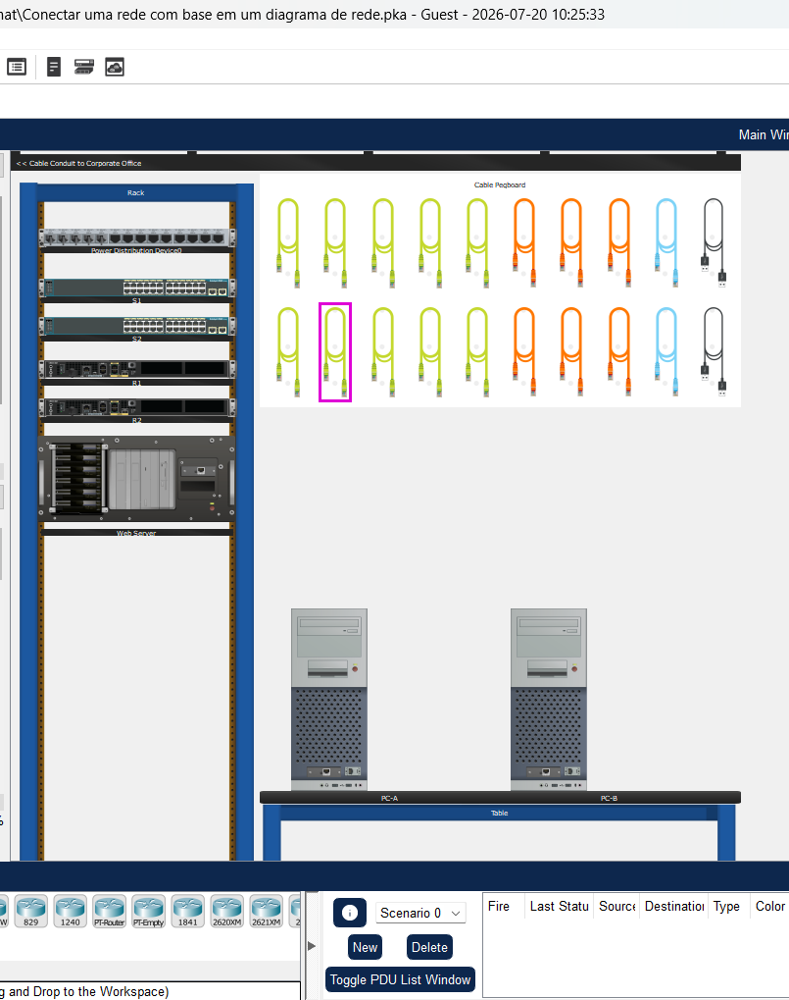
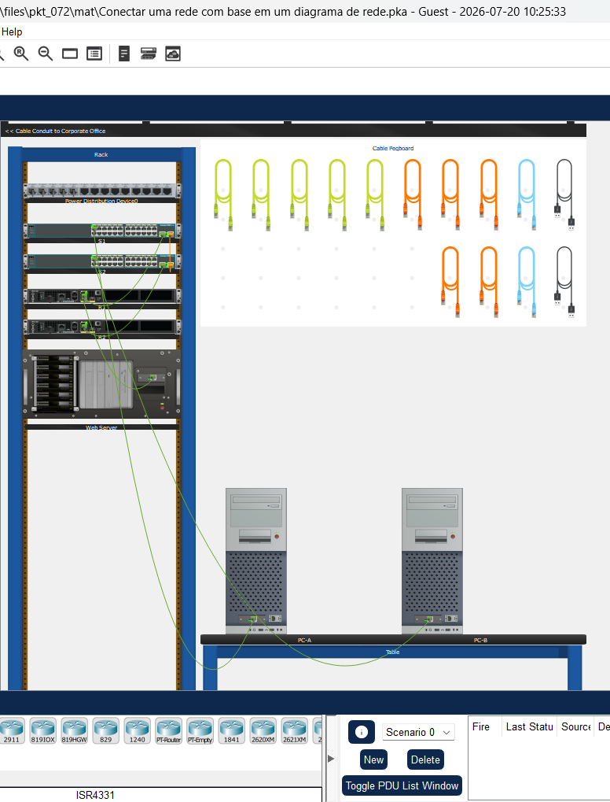

# Packet Tracer - Conectar uma rede com base em um diagrama de rede   

### Cisco: <a href="../../../">cisco   </a>
### Cisco Networking Academy: cna   </a>
### Training Category: <a href="../../../pkt/">pkt</a>
### Software/Subject: network   </a>
### Course: <a href="./">pkt_072 (Packet Tracer - Conectar uma rede com base em um diagrama de rede)   </a>

---

### Theme:
- Network

### Used Tools:
- Operating System (OS): 
  - Windows 11 
- Cloud Services:
  - Google Drive 
- Language:
  - HTML   
  - Markdown   
- Integrated Development Environment (IDE) and Text Editor:
  - Visual Studio Code (VS Code)   
- Versioning: 
  - Git   
- Repository:
  - GitHub   
- Network:
  - Cisco Packet Tracer   

---

<h3><a name="item00">Course Strcuture:</a></h3>

1. <a href="#item01">Parte 1: Revise o Diagrama Lógico de Rede.</a> 
2. <a href="#item02">Parte 2: Conecte os dispositivos físicos.</a> 
  2.1 <a href="#item02.01">Etapa 1: Determine o tipo de cabo.</a> 
  2.2 <a href="#item02.02">Etapa 2: Conecte os dispositivos.</a> 

---

### Objective:
O objetivo desta atividade foi realizar o cabeamento físico da rede, conectando as interfaces dos dispositivos com os cabos apropriados, de acordo com a topologia especificada.

### Folder Structure:
- [README.md](./README.md): Este documento de README, escrito em **Markdown**, com o conteúdo do laboratório.
- [0-aux](./0-aux/): Pasta auxiliar com imagens utilizadas na construção dos arquivos de README desse curso.

### Development:

<a name="item01"><h4>1. Parte 1: Revise o Diagrama Lógico de Rede.</h4></a>[Back to summary](#item00)

A imagem 01 mostra a topologia inicial.

<figure>
     
    <figcaption>Imagem 01.</figcaption>
</figure>
 

Revise o diagrama de rede e registre como os dispositivos estão conectados na Tabela de Dispositivos abaixo.

#### Tabela 1 — Topologia Física dos Dispositivos

| Nome do Dispositivo |   Tipo de Dispositivo   | Interface Local | Dispositivo e Porta Conectados |
|:-------------------:|:-----------------------:|:---------------:|:------------------------------:|
| R1                  | Router / Cisco 4321     | G0/0/0          | Servidor Web Ethernet NIC      |
| R1                  | Router / Cisco 4321     | G0/0/1          | S1 G0/1                        |
| S1                  | Switch / Catalyst 2960  | G0/1            | R1 G0/0/1                      |
| S1                  | Switch / Catalyst 2960  | G0/2            | S2 G0/2                        |
| S1                  | Switch / Catalyst 2960  | F0/1            | PC-A Ethernet NIC              |
| S2                  | Switch / Catalyst 2960  | G0/1            | R2 G0/0/1                      |
| S2                  | Switch / Catalyst 2960  | G0/2            | S1 G0/2                        |
| S2                  | Switch / Catalyst 2960  | F0/1            | PC-B Ethernet NIC              |
| R2                  | Router / Cisco 4321     | G0/0/1          | S2 G0/1                        |
| Servidor Web        | Servidor                | Ethernet        | R1 G0/0/0                      |
| PC-A                | PC                      | Ethernet        | S1 F0/1                        |
| PC-B                | PC                      | Ethernet        | S2 F0/1                        |

<a name="item02"><h4>2. Parte 2: Conecte os dispositivos físicos.</h4></a>[Back to summary](#item00)

Agora que você determinou como os dispositivos estão interconectados, pode usar as informações do diagrama de rede para conectar os dispositivos no rack dentro do armário de fiação (wiring closet). No Modo Físico no Packet Tracer, você pode praticar a conexão dos dispositivos no rack no armário de fiação.

<a name="item02.01"><h4>2.1 Etapa 1: Determine o tipo de cabo.</h4></a>[Back to summary](#item00)

- a. No diagrama de rede, você determinou que os dispositivos estão conectados via cabos Ethernet do diagrama de rede. Na placa de fixação de cabos no armário de fiação principal, existem alguns tipos diferentes de cabos. Qual é a cor dos cabos diretos Ethernet no Packet Tracer?
  - Os cabos Ethernet diretos (Copper Straight-Through), utilizados para conectar dispositivos de tipos diferentes, são representados pela cor verde. Já os cabos Ethernet cruzados (Copper Cross-Over), utilizados para conectar dispositivos do mesmo tipo, são representados pela cor laranja.

<a name="item02.02"><h4>2.2 Etapa 2: Conecte os dispositivos.</h4></a>[Back to summary](#item00)

Usando os cabos Ethernet, conecte os dispositivos no armário de fiação de acordo com o diagrama de rede.

- a. Para conectar o roteador R1 ao servidor Web, selecione um cabo Ethernet da placa peg. O Web Server é o dispositivo grande na parte inferior do rack de equipamentos.
- b. Clique na porta Web Server FastEthernet0 para conectar o cabo Ethernet.
- c. Clique em GigabitEthernet0/0/1 em R1 para concluir a conexão. Você pode ampliar o dispositivo clicando com o botão direito do mouse no dispositivo > selecione Inspecionar frontal. Clique na lupa para ampliar a frente do dispositivo. Você pode verificar se a conexão está ativa quando as luzes do LED da porta estiverem piscando em verde.
- d. Repita o procedimento para todas as outras conexões para concluir a conexão da rede. Observe que os PCs estão localizados na Mesa.

A imagem 02 evidencia todos os dispositivos devidamente interconectados por meio de seus respectivos cabos de rede.

<figure>
     
    <figcaption>Imagem 02.</figcaption>
</figure>
 