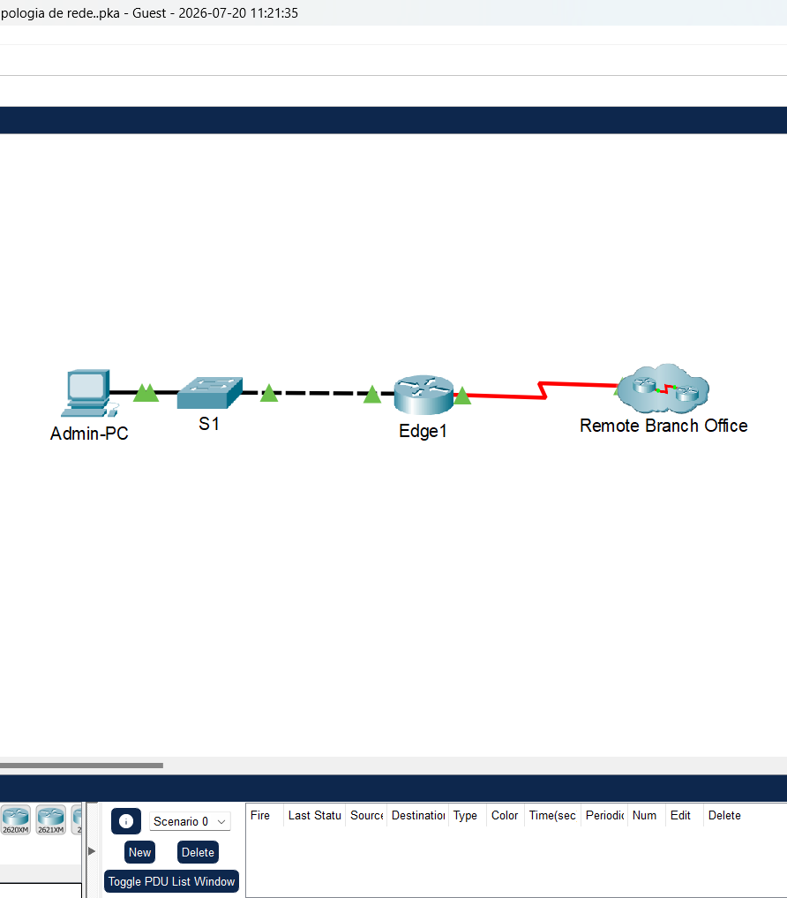
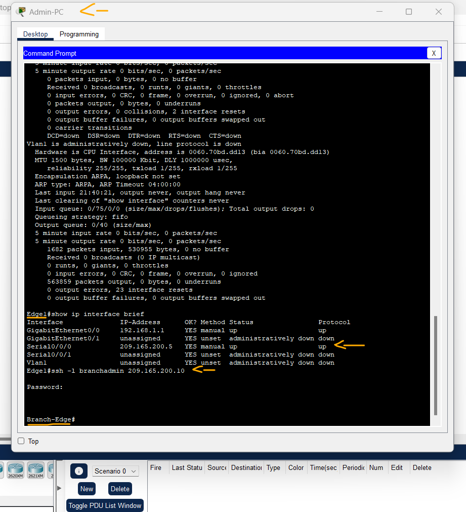
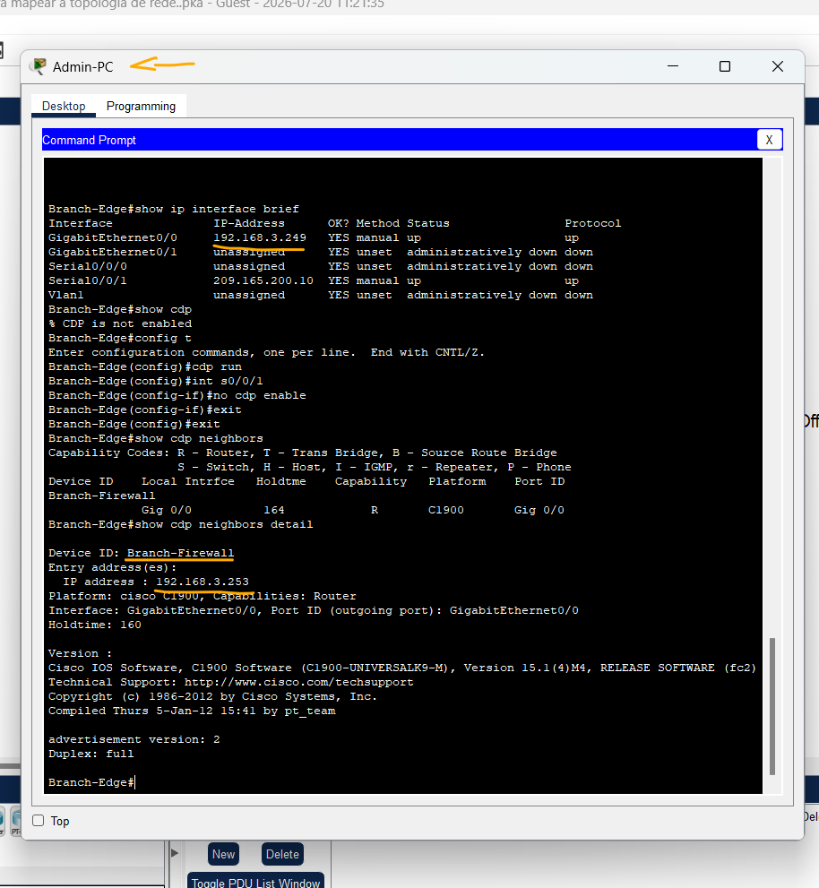
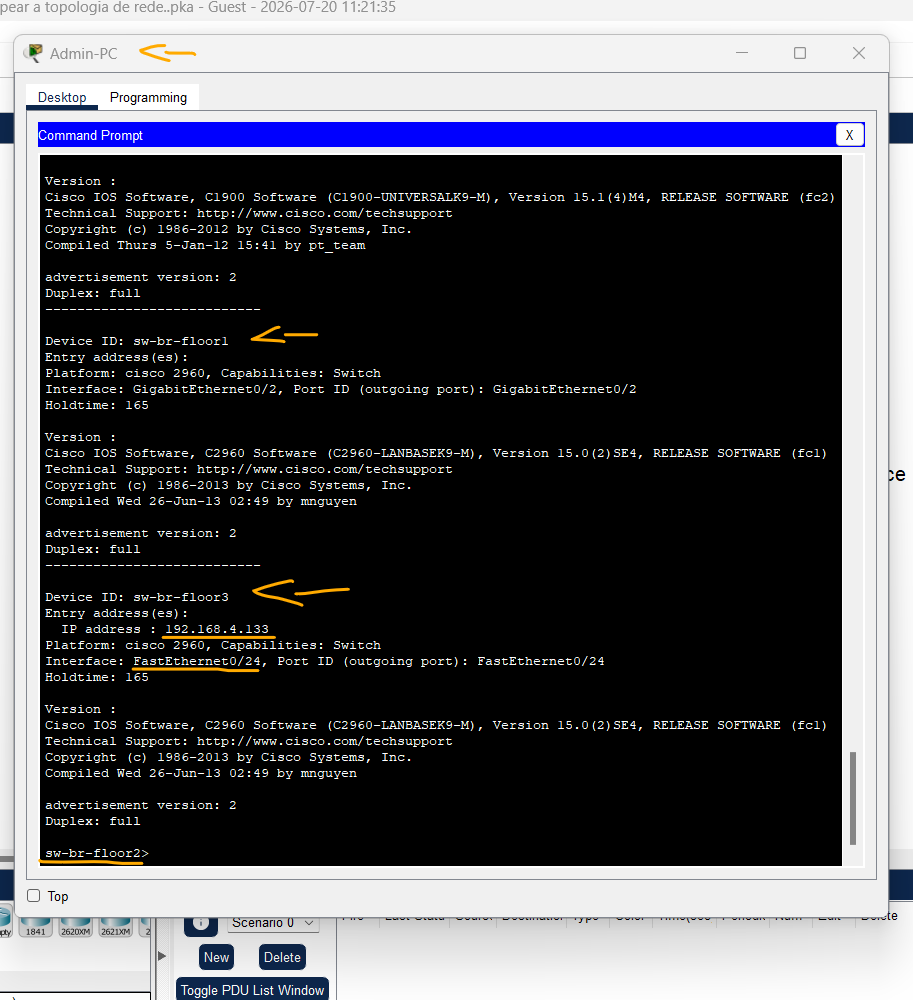

# Packet Tracer - Use o CDP para Mapear uma Rede   

### Cisco: <a href="../../../">cisco   </a>
### Cisco Networking Academy: cna   </a>
### Training Category: <a href="../../../pkt/">pkt</a>
### Software/Subject: network   </a>
### Course: <a href="./">pkt_073 (Packet Tracer - Use o CDP para Mapear uma Rede)   </a>

---

### Theme:
- Network

### Used Tools:
- Operating System (OS): 
  - Cisco Internetwork Operating System (Cisco IOS)   
  - Windows 11 
- Cloud Services:
  - Google Drive 
- Language:
  - HTML   
  - Markdown   
- Integrated Development Environment (IDE) and Text Editor:
  - Visual Studio Code (VS Code)   
- Versioning: 
  - Git   
- Repository:
  - GitHub   
- Network:
  - Cisco Packet Tracer   
  - OpenSSH   

---

<h3><a name="item00">Course Strcuture:</a></h3>

1. <a href="#item01">Parte 1: Uso do SSH para Acessar Remotamente Dispositivos de Rede</a> 
2. <a href="#item02">Parte 2: usar o CDP para descobrir dispositivos vizinhos</a> 

---

### Objective:
Esta atividade teve como objetivo explorar o uso do protocolo CDP para a descoberta de dispositivos vizinhos e o mapeamento de uma rede remota, utilizando também o SSH para acesso remoto aos equipamentos identificados.

### Folder Structure:
- [README.md](./README.md): Este documento de README, escrito em **Markdown**, com o conteúdo do laboratório.
- [0-aux](./0-aux/): Pasta auxiliar com imagens utilizadas na construção dos arquivos de README desse curso.

### Development:

<a name="item01"><h4>1. Parte 1: Uso do SSH para Acessar Remotamente Dispositivos de Rede</h4></a>[Back to summary](#item00)

A imagem 01 mostra a topologia inicial.

<figure>
     
    <figcaption>Imagem 01.</figcaption>
</figure>
 

Na parte 1, use o PC do administrador para acessar remotamente o roteador de gateway Edge1. Em seguida, no roteador Edge1, você usará SSH para a Filial remota.

- a. No Admin-PC, abra um prompt de comando.
- b. Acesse via SSH o roteador gateway em 192.168.1.1 usando o nome de usuário admin01 e a senha S3cre7P@55. Nota: Observe que você é colocado diretamente no modo EXEC privilegiado. Isso acontece porque a conta do usuário admin01 está definida com o nível de privilégio 15.
  - `ssh -l admin01 192.168.1.1` -> `S3cre7P@55`.
- c. Use os comandos show ip interface brief e show interfaces para documentar as interfaces físicas, endereços IP e máscara de sub-rede do roteador Edge1 na Tabela de endereçamento.
  - `show ip interface brief` -> `show interfaces`.
- d. No Edge1, use o SSH para acessar a Filial Remota em 209.165.200.10 com o nome de usuário branchadmin e a mesma senha acima.
  - `ssh -l branchadmin 209.165.200.10` -> `S3cre7P@55`.
- d. Após conectar-se à Filial Remota, que parte das informações anteriormente ausentes agora podem ser adicionadas à Tabela de Endereçamento acima?
  - Após o acesso via SSH, foi possível identificar o nome do roteador da filial remota (Branch-Edge), complementando as informações que estavam ausentes na Tabela de Endereçamento.

A imagem 02 mostra o acesso via SSH, a partir do Admin-PC, ao roteador local (Edge1). Em seguida, a conexão serial com o roteador da filial foi identificada e um novo acesso via SSH permitiu descobrir seu nome (Branch-Edge).

<figure>
     
    <figcaption>Imagem 02.</figcaption>
</figure>
 

<a name="item02"><h4>2. Parte 2: usar o CDP para descobrir dispositivos vizinhos</h4></a>[Back to summary](#item00)

Você agora está conectado remotamente ao roteador Branch-Edge. Usando o CDP, comece a procurar dispositivos de rede conectados.

- a. Emita os comandos show ip interface brief e show interfaces para documentar as interfaces de rede, os endereços IP e as máscaras de sub-rede do roteador Branch-Edge. Adicione as informações ausentes na Tabela de endereçamento para mapear a rede.
  - `show ip interface brief` -> `show interfaces`.
- b. A prática recomendada de segurança é executar CDP somente quando necessário, por isso o CDP pode precisar ser ativado. Use um comando show cdp para exibir seu status.
  - `show cdp`.
- c. Você precisa ativar o CDP, mas é aconselhável difundir informações de CDP somente para dispositivos de rede interna, e não para redes externas. Para fazer isso, ative o protocolo CDP e desative o CDP na interface S0/0/1.
  - `configure terminal` -> `cdp run` -> `interface s0/0/1` -> `no cdp enable` -> `end`.
- d. Emita um comando show cdp neighbors para localizar qualquer dispositivo de rede vizinho. Observação: O CDP mostrará apenas dispositivos Cisco conectados que também estão executando o CDP.
  - `show cdp neighbors`.
- Há um dispositivo de rede vizinho? Que tipo de dispositivo é esse? Qual é o seu nome? Em que interface ele é conectado? O endereço IP do dispositivo é listado? Registre as informações na Tabela de endereçamento. Observação: pode levar algum tempo para que as atualizações de CDP sejam recebidas. Se você não vir nenhuma saída do comando, pressione o botão Fast Forward Time várias vezes.
  - Sim. O dispositivo vizinho é um roteador denominado Branch-Firewall, conectado à interface GigabitEthernet0/0. O endereço IP do dispositivo não é exibido na saída do comando show cdp neighbors.
- e. Para localizar o endereço IP do dispositivo vizinho, use o comando show cdp neighbors detail e registre o endereço IP.
  - `show cdp neighbors detail`.
- e. Além do endereço IP do dispositivo vizinho, que outra informação potencialmente confidencial está listada?
  - Além do endereço IP, o comando exibe informações detalhadas do dispositivo, incluindo a versão do Cisco IOS e a plataforma utilizada, informações que podem ser exploradas por um invasor para identificar possíveis vulnerabilidades.
- f. Agora que você conhece o endereço IP do dispositivo vizinho, conecte-o via SSH para descobrir outros dispositivos que podem ser vizinhos/ Observação: Para conectar-se via SSH, use o mesmo nome de usuário e senha da Filial Remota.
  - `ssh -l branchadmin 192.168.3.253` -> `S3cre7P@55`.
- f. Qual é o endereço IP do dispositivo vizinho?
  - O endereço IP do dispositivo vizinho é 192.168.3.253, identificado por meio do comando show cdp neighbors detail.
- f. Após a conexão bem-sucedida com o SSH, o que o prompt de comando mostra?
  - Após a conexão via SSH, o prompt de comando exibe o hostname do dispositivo remoto, identificando-o como Branch-Firewall.
- g. Você está conectado remotamente ao próximo vizinho. Use os comandos show cdp neighbors e show cdp neighbors detail para descobrir outros dispositivos vizinhos conectados.
  - `show cdp neighbors` -> `show cdp neighbors detail`.
- g. Quais tipos de dispositivos de rede são vizinhos deste dispositivo? Registre qualquer dispositivo recém-descoberto na Tabela de endereçamento. Inclua seu nome de host, interface e endereço IP.
  - Os dispositivos vizinhos são o roteador Branch-Edge e o switch SW-Br-Floor2. O switch SW-Br-Floor2 foi o dispositivo recém-descoberto, conectado à interface GigabitEthernet0/1 e com endereço IP 192.168.4.132.
- h. Continue descobrindo novos dispositivos de rede usando SSH e os comandos show CDP. Por fim, você chegará ao final da rede e não haverá mais dispositivos a serem descobertos.
  - `ssh -l branchadmin 192.168.4.132` -> `S3cre7P@55` -> `show cdp neighbors` -> `show cdp neighbors detail`. 
- h. Qual é o nome do switch que não tem um endereço IP na rede?
  - O switch que não tem uma interface virtual (SVI) é o sw-br-floor1.
- i. Desenhe uma topologia da rede da Filial remota usando as informações colhidas usando CDP.

As imagens 03 e 04 apresentam o processo de descoberta dos dispositivos vizinhos na rede da filial utilizando o CDP, seguido do acesso remoto via SSH aos equipamentos identificados para ampliar o mapeamento da rede.

<figure>
     
    <figcaption>Imagem 03.</figcaption>
</figure>
 

<figure>
     
    <figcaption>Imagem 04.</figcaption>
</figure>
 

#### Tabela — Endereçamento e Conexões dos Dispositivos

|  Dispositivo   | Interface |  Endereço IP  | Máscara de Sub-rede | Interface Local e Vizinho Conectado |
|:--------------:|:---------:|:-------------:|:-------------------:|:-----------------------------------:|
| Edge1          | G0/0      | 192.168.1.1   | 255.255.255.0       | G0/1 – S1                           |
| Edge1          | S0/0/0    | 209.165.200.5 | 255.255.255.240     | S0/0/0 – ISP                        |
| Branch-Edge    | S0/0/1    | 209.165.200.10| 255.255.255.240     | S0/0/1 – ISP                        |
| Branch-Edge    | G0/0      | 192.168.3.249 | 255.255.255.248     | G0/0 – Branch-Firewall              |
| Branch-Firewall| G0/0      | 192.168.3.253 | 255.255.255.248     | G0/0 – Branch-Edge                  |
| Branch-Firewall| G0/1      | 192.168.4.129 | 255.255.255.128     | G0/1 – sw-br-floor2                 |
| sw-br-floor1   | G0/1      | N/D           | N/D                 | G0/1 – sw-br-floor3                 |
| sw-br-floor1   | G0/2      | N/D           | N/D                 | G0/2 – sw-br-floor2                 |
| sw-br-floor2   | G0/1      | N/D           | N/D                 | G0/1 – Branch-Firewall              |
| sw-br-floor2   | G0/2      | N/D           | N/D                 | G0/2 – sw-br-floor1                 |
| sw-br-floor2   | F0/24     | N/D           | N/D                 | F0/24 – sw-br-floor3                |
| sw-br-floor2   | SVI       | 192.168.4.132 | 255.255.255.128     | N/D                                 |
| sw-br-floor3   | G0/1      | N/D           | N/D                 | G0/1 – sw-br-floor1                 |
| sw-br-floor3   | F0/24     | N/D           | N/D                 | F0/24 – sw-br-floor2                |
| sw-br-floor3   | SVI       | 192.168.4.133 | 255.255.255.128     | N/D                                 |

