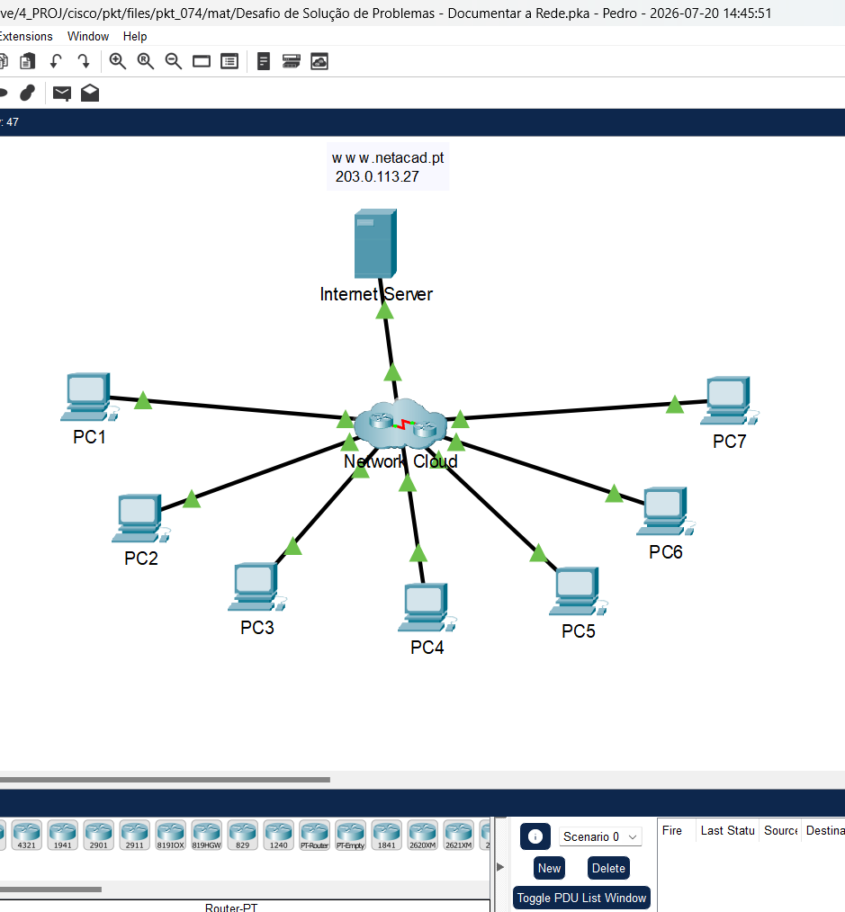
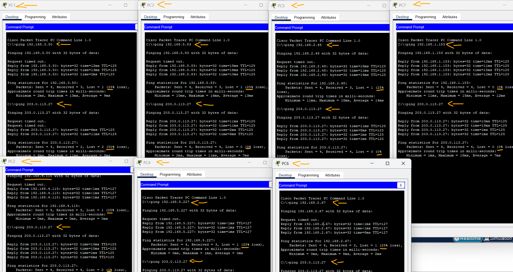
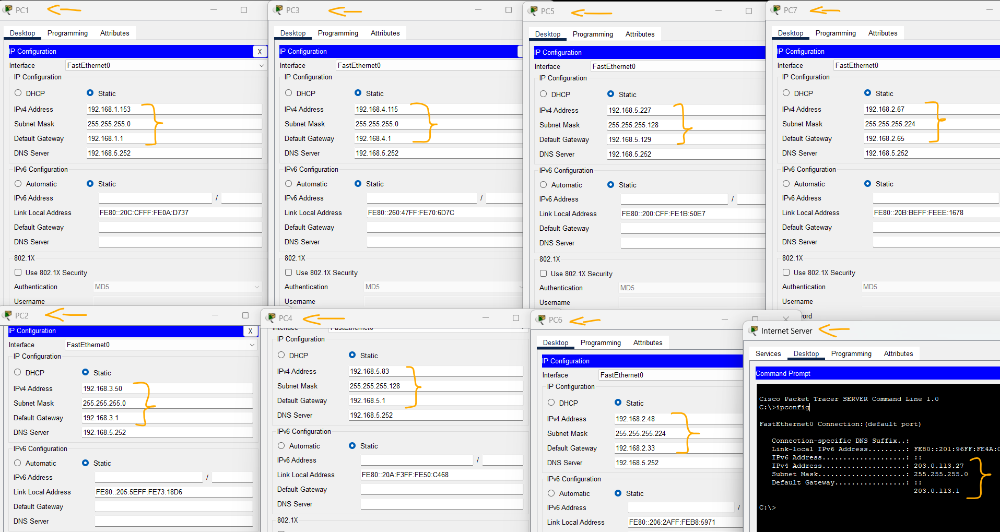
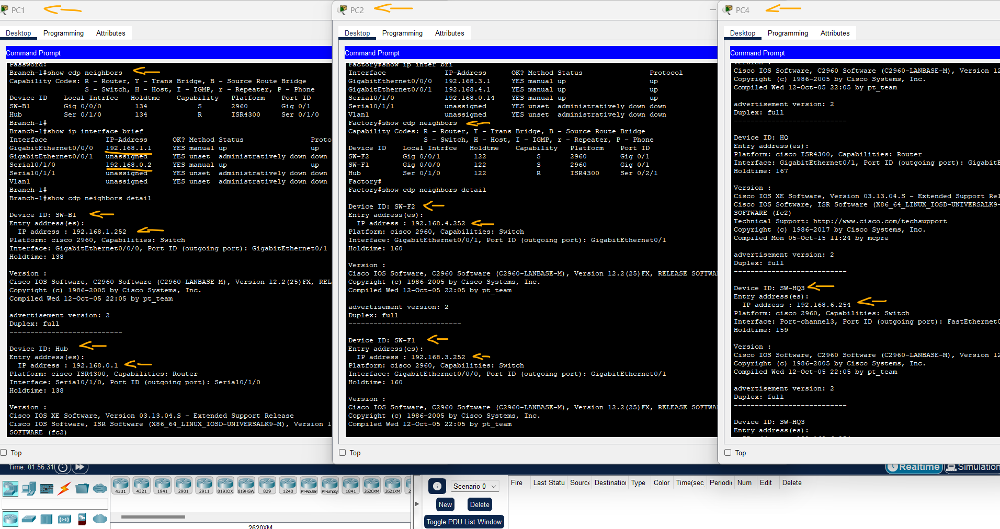

# Packet Tracer - Desafio de solução de problemas: Documentar a rede   

### Cisco: <a href="../../../">cisco   </a>
### Cisco Networking Academy: cna   </a>
### Training Category: <a href="../../../pkt/">pkt</a>
### Software/Subject: network   </a>
### Course: <a href="./">pkt_074 (Packet Tracer - Desafio de solução de problemas: Documentar a rede)   </a>

---

### Theme:
- Network

### Used Tools:
- Operating System (OS): 
  - Cisco Internetwork Operating System (Cisco IOS)   
  - Windows 11 
- Cloud Services:
  - Google Drive 
- Language:
  - HTML   
  - Markdown   
- Integrated Development Environment (IDE) and Text Editor:
  - Visual Studio Code (VS Code)   
- Versioning: 
  - Git   
- Repository:
  - GitHub   
- Network:
  - Cisco Packet Tracer   
  - Telnet   
  - ping   

---

<h3><a name="item00">Course Strcuture:</a></h3>

1. <a href="#item01">Parte 1: Testar Conectividade</a> 
2. <a href="#item02">Parte 2: Descobrir as informações sobre a configuração do computador</a> 
3. <a href="#item03">Parte 3: Descubra informações sobre os dispositivos gateway padrão</a> 
4. <a href="#item04">Parte 4: Reconstruir a Topologia de Rede</a> 
  4.1 <a href="#item04.01">Etapa 1: Acesse tabelas de roteamento em cada dispositivo de gateway.</a> 
  4.2 <a href="#item04.02">Etapa 2: Descobrir dispositivos que não sejam de gateway.</a> 
5. <a href="#item05">Parte 5: Explore ainda mais as configurações e interconexões do dispositivo</a> 
  5.1 <a href="#item05.01">Etapa 1: Acesse as configurações do dispositivo.</a> 
  5.2 <a href="#item05.02">Etapa 2: Exibir Informações do Vizinho.</a> 
  5.3 <a href="#item05.03">Etapa 3: Conecte-se a outros dispositivos.</a> 
6. <a href="#item06">Reflexão</a> 

---

### Objective:
O objetivo desta atividade foi realizar o mapeamento de diversas redes por meio do acesso aos gateways padrão dos hosts, utilizando o Telnet para acesso remoto aos dispositivos e o protocolo CDP para a descoberta de vizinhos, permitindo identificar todos os equipamentos da topologia e elaborar sua documentação.

### Folder Structure:
- [README.md](./README.md): Este documento de README, escrito em **Markdown**, com o conteúdo do laboratório.
- [0-aux](./0-aux/): Pasta auxiliar com imagens utilizadas na construção dos arquivos de README desse curso.

### Development:

Esta atividade do Packet Tracer faz parte de uma sequência composta por duas atividades. Nesta primeira, foi realizado o mapeamento dos dispositivos presentes em todas as redes e elaborada a tabela de endereçamento IP. Na atividade seguinte, [pkt_075](../pkt_075/), essa documentação será utilizada para identificar e solucionar problemas de rede encontrados.

<a name="item01"><h4>1. Parte 1: Testar Conectividade</h4></a>[Back to summary](#item00)

A imagem 01 mostra a topologia inicial.

<figure>
     
    <figcaption>Imagem 01.</figcaption>
</figure>
 

- a. Faça ping entre os PCs e o servidor de Internet para testar a rede. Todos os PCs devem poder executar ping um no outro e no servidor da Internet.

#### Tabela 1 — Teste de Conectividade

| Ordem | Origem   | Destino |         Comando        | Status  | Servidor |
|:-----:|:--------:|:-------:|:----------------------:|:-------:|:--------:|
| 1     | PC1      | PC2     | `ping 192.168.3.50`    | Sucesso | Sucesso  | 
| 2     | PC2      | PC3     | `ping 192.168.4.115`   | Sucesso | Sucesso  |
| 3     | PC3      | PC4     | `ping 192.168.5.83`    | Sucesso | Sucesso  |
| 4     | PC4      | PC5     | `ping 192.168.5.227`   | Sucesso | Sucesso  |
| 5     | PC5      | PC6     | `ping 192.168.2.48`    | Sucesso | Sucesso  |
| 6     | PC6      | PC7     | `ping 192.168.2.67`    | Sucesso | Sucesso  |
| 7     | PC7      | PC8     | `ping 192.168.1.153`   | Sucesso | Sucesso  |
| 8     | Servidor | -       | `ping 203.0.113.27`    | Sucesso | -        |

A imagem 02 exibe os testes de conectividade realizados entre os dispositivos, comprovando que todos estavam se comunicando corretamente.

<figure>
     
    <figcaption>Imagem 02.</figcaption>
</figure>
 

<a name="item02"><h4>2. Parte 2: Descobrir as informações sobre a configuração do computador</h4></a>[Back to summary](#item00)

- a. Vá para o prompt de comando de cada PC e exiba as configurações de IP. Registre essas informações na tabela de documentação.

#### Tabela 2 — Endereçamento IPv4

| Dispositivo       | Interface | Endereço IP   | Máscara de Sub-Rede | Gateway Padrão |
|:-----------------:|:---------:|:-------------:|:-------------------:|:--------------:|
| PC1               | NIC       | 192.168.1.153 | 255.255.255.0       | 192.168.1.1    |
| PC2               | NIC       | 192.168.3.50  | 255.255.255.0       | 192.168.3.1    |
| PC3               | NIC       | 192.168.4.115 | 255.255.255.0       | 192.168.4.1    |
| PC4               | NIC       | 192.168.5.83  | 255.255.255.128     | 192.168.5.1    |
| PC5               | NIC       | 192.168.5.227 | 255.255.255.128     | 192.168.5.129  |
| PC6               | NIC       | 192.168.2.48  | 255.255.255.224     | 192.168.2.33   |
| PC7               | NIC       | 192.168.2.67  | 255.255.255.224     | 192.168.2.65   |
| Internet Servidor | NIC       | 203.0.113.27  | 255.255.255.0       | 203.0.113.1    |

A imagem 03 mostra as configurações de endereçamento IP de todos os dispositivos finais da rede, incluindo os hosts e o servidor.

<figure>
     
    <figcaption>Imagem 03.</figcaption>
</figure>
 

<a name="item03"><h4>3. Parte 3: Descubra informações sobre os dispositivos gateway padrão</h4></a>[Back to summary](#item00)

- a. Conecte-se a cada dispositivo de gateway padrão usando o protocolo Telnet e registre informações sobre as interfaces que estão em uso na tabela. A senha do VTY é cisco e a senha EXEC privilegiada é class.
  - `telnet IP` -> `cisco` -> `enable` -> `class`.

#### Tabela 3 — Teste de Acesso Remoto

| Ordem | Host      |         Comando        | Gateway    | Interface |
|:-----:|:---------:|:----------------------:|:----------:|:---------:|
| 1     | PC1       | `telnet 192.168.1.1`   | Branch-1   | G0/0/0    |
| 2     | PC2       | `telnet 192.168.3.1`   | Factory    | G0/0/0    |
| 3     | PC3       | `telnet 192.168.4.1`   | Factory    | G0/0/1    |
| 4     | PC4       | `telnet 192.168.5.1`   | HQ         | G0/0/0.5  |
| 5     | PC5       | `telnet 192.168.5.129` | HQ         | G0/0/0.10 |
| 6     | PC6       | `telnet 192.168.2.33`  | Branch-2   | G0/0/0.32 |
| 7     | PC7       | `telnet 192.168.2.65`  | Branch-2   | G0/0/0.64 |
| 8     | Servidor  | `telnet 203.0.113.1`   | ISP        | G0/0/1    |
| 9     | HQ        | `telnet 192.168.6.252` | SW-HQ1     | VLAN1     |

<a name="item04"><h4>4. Parte 4: Reconstruir a Topologia de Rede</h4></a>[Back to summary](#item00)

Nesta parte da atividade, você continuará gravando informações sobre os dispositivos na rede na Tabela de Endereçamento. Além disso, você começará a diagramar a topologia de rede com base no que você pode descobrir sobre as interconexões do dispositivo.

<a name="item04.01"><h4>4.1 Etapa 1: Acesse tabelas de roteamento em cada dispositivo de gateway.</h4></a>[Back to summary](#item00)

- a. Use as tabelas de roteamento em cada roteador para saber mais sobre a rede. Faça anotações de suas descobertas.
  - `show ip route`.

<a name="item04.02"><h4>4.2 Etapa 2: Descobrir dispositivos que não sejam de gateway.</h4></a>[Back to summary](#item00)

- a. Use um protocolo de descoberta de rede para documentar dispositivos vizinhos. Registre suas descobertas na tabela de endereçamento. Neste ponto, você também deve ser capaz de começar a documentar interconexões de dispositivos.
  - `show cdp neighbors`.

<a name="item05"><h4>5. Parte 5: Explore ainda mais as configurações e interconexões do dispositivo</h4></a>[Back to summary](#item00)

<a name="item05.01"><h4>5.1 Etapa 1: Acesse as configurações do dispositivo.</h4></a>[Back to summary](#item00)

- a. Conecte-se aos outros dispositivos na rede. Reúna informações sobre as configurações do dispositivo.

<a name="item05.02"><h4>5.2 Etapa 2: Exibir Informações do Vizinho.</h4></a>[Back to summary](#item00)

- a. Use protocolos de descoberta para aumentar seu conhecimento sobre os dispositivos e topologias de rede.

<a name="item05.03"><h4>5.3 Etapa 3: Conecte-se a outros dispositivos.</h4></a>[Back to summary](#item00)

- a. Exibir informações de configuração para os outros dispositivos na rede. Registre suas descobertas na tabela de dispositivos.
- b. Agora você deve saber sobre todos os dispositivos e configurações de interface na rede. Todas as linhas da tabela devem conter informações do dispositivo. Use suas informações para reconstruir o máximo possível da topologia de rede.

A imagem 05 mostra parte do processo de mapeamento da rede por meio do protocolo CDP e do acesso remoto via Telnet. Como a topologia é composta por 34 dispositivos distribuídos em diferentes redes, a imagem apresenta apenas uma parte desse processo.

<figure>
     
    <figcaption>Imagem 04.</figcaption>
</figure>
 

#### Tabela 4 — Endereçamento IPv4

| Ord |   Dispositivo      | Interface |      Rede        | Endereço IP   | Máscara de Sub-Rede | Gateway Padrão |
|:---:|:------------------:|:---------:|:----------------:|:-------------:|:-------------------:|:--------------:|
| 1   | PC1                | NIC       | 192.168.1.0/24   | 192.168.1.153 | 255.255.255.0       | 192.168.1.1    |
| 2   | Branch-1           | G0/0/0    | 192.168.1.0/24   | 192.168.1.1   | 255.255.255.0       | -              |
| 3   | Branch-1           | S0/1/0    | 192.168.0.0/30   | 192.168.0.2   | 255.255.255.252     | -              |
| 4   | SW-B1              | VLAN1     | 192.168.1.0/24   | 192.168.1.252 | 255.255.255.0       | 192.168.1.1    |
| 5   | Hub                | S0/1/0    | 192.168.0.0/30   | 192.168.0.1   | 255.255.255.252     | -              |
| 6   | PC2                | NIC       | 192.168.3.0/24   | 192.168.3.50  | 255.255.255.0       | 192.168.3.1    |
| 7   | PC3                | NIC       | 192.168.4.0/24   | 192.168.4.115 | 255.255.255.0       | 192.168.4.1    |
| 8   | Factory            | G0/0/0    | 192.168.3.0/24   | 192.168.3.1   | 255.255.255.0       | -              |
| 9   | Factory            | G0/0/1    | 192.168.4.0/24   | 192.168.4.1   | 255.255.255.0       | -              |
| 10  | Factory            | S0/1/0    | 192.168.0.12/30  | 192.168.0.14  | 255.255.255.252     | -              |
| 11  | SW-F1              | VLAN1     | 192.168.3.0/24   | 192.168.3.252 | 255.255.255.0       | 192.168.3.1    |
| 12  | SW-F2              | VLAN1     | 192.168.4.0/24   | 192.168.4.252 | 255.255.255.0       | 192.168.4.1    |
| 13  | Hub                | S0/2/1    | 192.168.0.12/30  | 192.168.0.13  | 255.255.255.252     | -              |
| 14  | PC4                | NIC       | 192.168.5.0/25   | 192.168.5.83  | 255.255.255.128     | 192.168.5.1    |
| 15  | PC5                | NIC       | 192.168.5.128/25 | 192.168.5.227 | 255.255.255.128     | 192.168.5.129  |
| 16  | HQ                 | G0/0/0.5  | 192.168.5.0/25   | 192.168.5.1   | 255.255.255.128     | -              |
| 17  | HQ                 | G0/0/0.10 | 192.168.5.128/25 | 192.168.5.129 | 255.255.255.128     | -              |
| 18  | HQ                 | G0/0/0.1  | 192.168.6.0/24   | 192.168.6.1   | 255.255.255.0       | -              |
| 19  | HQ                 | S0/1/0    | 192.168.0.8/30   | 192.168.0.10  | 255.255.255.252     | -              |
| 20  | SW-HQ1             | VLAN1     | 192.168.6.0/24   | 192.168.6.252 | 255.255.255.0       | 192.168.6.1    |
| 21  | SW-HQ2             | VLAN1     | 192.168.6.0/24   | 192.168.6.253 | 255.255.255.0       | 192.168.6.1    |
| 22  | SW-HQ3             | VLAN1     | 192.168.6.0/24   | 192.168.6.254 | 255.255.255.0       | 192.168.6.1    |
| 23  | Hub                | S0/2/0    | 192.168.0.8/30   | 192.168.0.9   | 255.255.255.252     | -              |
| 24  | PC6                | NIC       | 192.168.2.32/27  | 192.168.2.48  | 255.255.255.224     | 192.168.2.33   |
| 25  | PC7                | NIC       | 192.168.2.64/27  | 192.168.2.67  | 255.255.255.224     | 192.168.2.65   |
| 26  | Branch-2           | G0/0/0.32 | 192.168.2.32/27  | 192.168.2.33  | 255.255.255.224     | -              |
| 27  | Branch-2           | G0/0/0.64 | 192.168.2.64/27  | 192.168.2.65  | 255.255.255.224     | -              |
| 28  | Branch-2           | G0/0/0.1  | 192.168.2.0/27   | 192.168.2.1   | 255.255.255.224     | -              |
| 29  | Branch-2           | S0/1/0    | 192.168.0.4/30   | 192.168.0.6   | 255.255.255.252     | -              |
| 30  | SW-B2              | VLAN1     | 192.168.2.0/27   | 192.168.2.17  | 255.255.255.224     | 192.168.2.1    |
| 31  | Hub                | S0/1/1    | 192.168.0.4/30   | 192.168.0.5   | 255.255.255.252     | -              |
| 32  | ISP                | G0/0/1    | 203.0.113.0/24   | 203.0.113.1   | 255.255.255.0       | -              |
| 33  | ISP                | G0/0/0    | 192.0.2.0/30     | 192.0.2.2     | 255.255.255.252     | -              |
| 34  | Hub                | G0/0/0    | 192.0.2.0/30     | 192.0.2.1     | 255.255.255.252     | -              |

<a name="item06"><h4>6. Reflexão</h4></a>[Back to summary](#item00)

- a. Quais ferramentas ou comandos você achou mais úteis para documentar a rede?
  - Sem dúvida, o comando show cdp neighbors detail foi o mais útil, pois além de identificar os dispositivos vizinhos, exibe seus respectivos endereços IP, facilitando o mapeamento da rede. Outro comando bastante útil foi o show ip route, que permitiu identificar as redes configuradas, suas segmentações e as respectivas máscaras de sub-rede.
- b. A segurança é uma preocupação nesta rede. Quais são as duas medidas que podem ser tomadas para tornar a rede mais segura?
  - A primeira medida é desabilitar o Telnet e utilizar apenas o SSH para acesso remoto, pois o SSH criptografa a comunicação, tornando-a muito mais segura. A segunda medida é restringir ou desabilitar o CDP nas interfaces voltadas para redes externas, como a conexão com o ISP, uma vez que esse protocolo divulga informações sobre a topologia da rede e os dispositivos conectados, informações que podem ser exploradas por um invasor.
- c. Você pode ter notado que algumas das práticas usadas para configurar os dispositivos de rede estão desatualizadas, ineficientes ou não seguras. Faça uma lista de quantas recomendações você tem sobre como os dispositivos devem ser reconfigurados para seguir as melhores práticas. Faça uma pesquisa na Internet para obter recomendações, se desejar.
  - Algumas recomendações para adequar os dispositivos às melhores práticas de segurança são: substituir o Telnet pelo SSH para acesso remoto; utilizar senhas fortes e criptografadas; desabilitar o protocolo CDP nas interfaces conectadas a redes não confiáveis; configurar banners de aviso para acesso não autorizado; implementar listas de controle de acesso (ACLs) para restringir o gerenciamento remoto; desabilitar interfaces não utilizadas; manter o sistema operacional (Cisco IOS) atualizado; e realizar backups periódicos das configurações dos dispositivos.