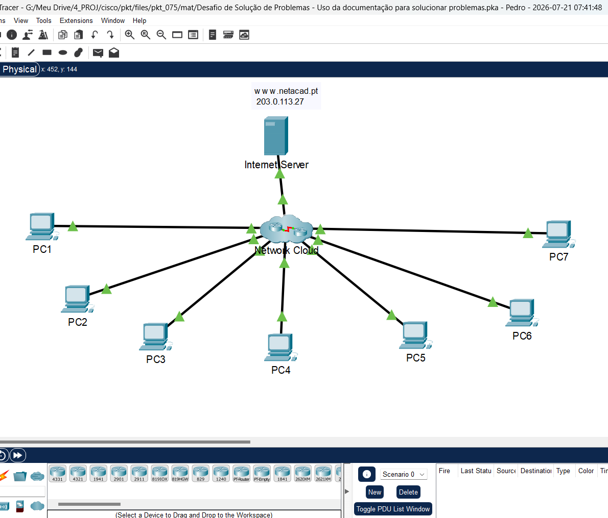
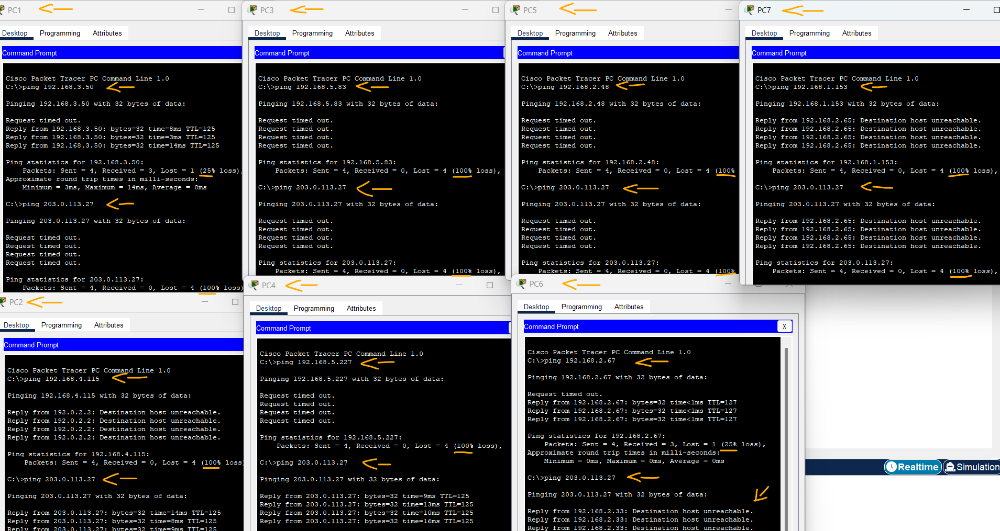
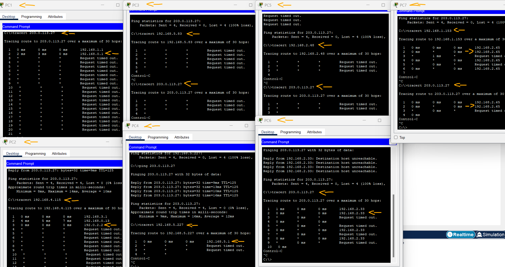
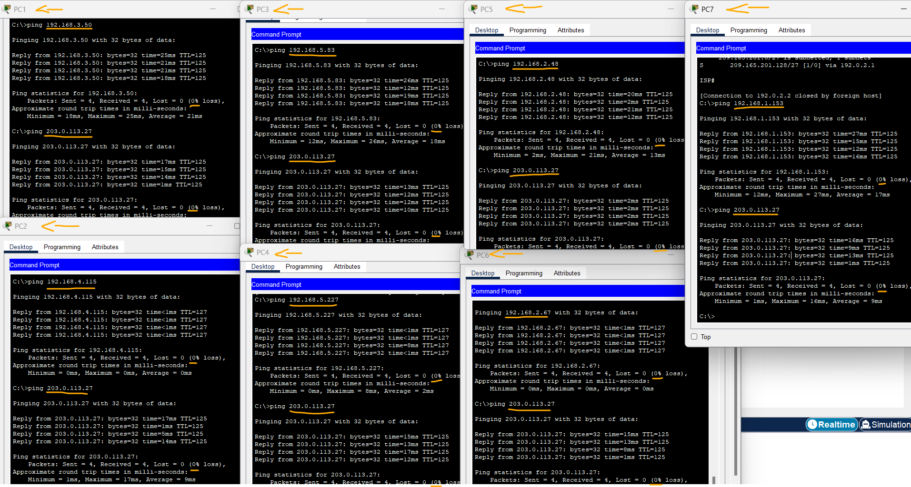

# Packet Tracer - Desafio de solução de problemas: Use a documentação para resolver problemas   

### Cisco: <a href="../../../">cisco   </a>
### Cisco Networking Academy: cna   </a>
### Training Category: <a href="../../../pkt/">pkt</a>
### Software/Subject: network   </a>
### Course: <a href="./">pkt_075 (Packet Tracer - Desafio de solução de problemas: Use a documentação para resolver problemas)   </a>

---

### Theme:
- Network

### Used Tools:
- Operating System (OS): 
  - Cisco Internetwork Operating System (Cisco IOS)   
  - Windows 11 
- Cloud Services:
  - Google Drive 
- Language:
  - HTML   
  - Markdown   
- Integrated Development Environment (IDE) and Text Editor:
  - Visual Studio Code (VS Code)   
- Versioning: 
  - Git   
- Repository:
  - GitHub   
- Network:
  - Cisco Packet Tracer   
  - Telnet   
  - ping   
  - Trace Route (tracert)   

---

<h3><a name="item00">Course Strcuture:</a></h3>

1. <a href="#item01">Parte 1: Avalie a conectividade</a> 
2. <a href="#item02">Parte 2: Acessar dispositivos de rede</a> 
3. <a href="#item03">Parte 3: Reparar a rede</a> 
4. <a href="#item04">Parte 4: Documentar os problemas</a> 

---

### Objective:
O objetivo dessa atividade foi utilizar a documentação da rede como apoio ao processo de troubleshooting em diferentes dispositivos distribuídos por múltiplas sub-redes. Durante a atividade, todos os problemas foram identificados, analisados, registrados e corrigidos, documentando-se também as soluções adotadas e o procedimento realizado para a resolução de cada falha.

### Folder Structure:
- [README.md](./README.md): Este documento de README, escrito em **Markdown**, com o conteúdo do laboratório.
- [0-aux](./0-aux/): Pasta auxiliar com imagens utilizadas na construção dos arquivos de README desse curso.

### Development:

Esta atividade do Packet Tracer faz parte de uma sequência composta por duas atividades. Na primeira, [pkt_074](../pkt_074/), foi realizado o mapeamento dos dispositivos presentes em todas as redes e elaborada a tabela de endereçamento IP. Nesta atividade, essa documentação foi utilizada para identificar e solucionar problemas de rede encontrados.

<a name="item01"><h4>1. Parte 1: Avalie a conectividade</h4></a>[Back to summary](#item00)

A imagem 01 mostra a topologia inicial.

<figure>
     
    <figcaption>Imagem 01.</figcaption>
</figure>
 

- a. Todos os hosts devem poder executar ping um ao outro e ao servidor da Internet. Determine se esse requisito é atendido. Caso contrário, identifique quais hosts e redes devem ser investigados mais detalhadamente.

#### Tabela 1 — Teste de Conectividade

| Ordem | Origem   | Destino |         Comando        | Status      | Servidor    |
|:-----:|:--------:|:-------:|:----------------------:|:-----------:|:-----------:|
| 1     | PC1      | PC2     | `ping 192.168.3.50`    | Sucesso     | Inacessível | 
| 2     | PC2      | PC3     | `ping 192.168.4.115`   | Inacessível | Sucesso     |
| 3     | PC3      | PC4     | `ping 192.168.5.83`    | Inacessível | Inacessível |
| 4     | PC4      | PC5     | `ping 192.168.5.227`   | Inacessível | Sucesso     |
| 5     | PC5      | PC6     | `ping 192.168.2.48`    | Inacessível | Inacessível |
| 6     | PC6      | PC7     | `ping 192.168.2.67`    | Sucesso     | Inacessível |
| 7     | PC7      | PC8     | `ping 192.168.1.153`   | Inacessível | Inacessível |
| 8     | Servidor | -       | `ping 203.0.113.27`    | -           | -           |

A imagem 02 exibe os testes de conectividade realizados entre todos os dispositivos, identificando quais estavam acessíveis e quais apresentavam falhas de comunicação.

<figure>
     
    <figcaption>Imagem 02.</figcaption>
</figure>
 

<a name="item02"><h4>2. Parte 2: Acessar dispositivos de rede</h4></a>[Back to summary](#item00)

- a. A partir dos hosts que têm problemas de comunicação, use as ferramentas ICMP para determinar onde na rede esses problemas podem estar localizados. Nos PCs host, acesse dispositivos na rede e exiba configurações e status operacional.

#### Tabela 2 — Identificação dos Pontos de Falha

| Ordem | Origem   | Destino  |           Comando         | Salto | Endereço IP   | Dispositivo       | Interface |      Rede        |
|:-----:|:--------:|:--------:|:-------------------------:|:-----:|:-------------:|:-----------------:|:---------:|:----------------:|
| 1     | PC1      | Servidor | `tracert 203.0.113.27`    | 2º    | 192.168.0.1   | Hub               | S0/1/0    | 192.168.0.0/30   |
| 2     | PC2      | PC3      | `tracert 192.168.4.115`   | 3º    | 192.0.2.2     | ISP               | G0/0/0    | 192.0.2.0/30     |
| 3.1   | PC3      | PC4      | `tracert 192.168.5.83`    | 0º    | 192.168.4.115 | PC3               | NIC       | 192.168.4.0/24   |
| 3.2   | PC3      | Servidor | `tracert 203.0.113.27`    | 0º    | 192.168.4.115 | PC3               | NIC       | 192.168.4.0/24   |
| 4     | PC4      | PC5      | `tracert 192.168.5.227`   | 1º    | 192.168.5.1   | HQ                | G0/0/0.5  | 192.168.5.0/25   |
| 5.1   | PC5      | PC6      | `tracert 192.168.2.48`    | 0º    | 192.168.5.227 | PC5               | NIC       | 192.168.5.128/25 |
| 5.2   | PC5      | Servidor | `tracert 203.0.113.27`    | 0º    | 192.168.5.227 | PC5               | NIC       | 192.168.5.128/25 |
| 6     | PC6      | Servidor | `tracert 203.0.113.27`    | 2º    | 192.168.2.33  | Branch-2          | G0/0/0.32 | 192.168.2.32/27  |
| 7.1   | PC7      | PC8      | `tracert 192.168.1.153`   | 2º    | 192.168.2.65  | Branch-2          | G0/0/0.64 | 192.168.2.64/27  |
| 7.2   | PC7      | Servidor | `tracert 203.0.113.27`    | 2º    | 192.168.2.65  | Branch-2          | G0/0/0.64 | 192.168.2.64/27  |

A imagem 03 mostra o rastreamento de rota para os dispositivos inacessíveis, permitindo identificar em qual salto ocorria o problema de conectividade.

<figure>
     
    <figcaption>Imagem 03.</figcaption>
</figure>
 

<a name="item03"><h4>3. Parte 3: Reparar a rede</h4></a>[Back to summary](#item00)

- a. Depois de localizar os problemas, reconfigure os dispositivos para reparar o problema de conectividade. Use sua documentação da atividade anterior para ajudá-lo.

- PC1:
  - Acessar o router Branch-1: `telnet 192.168.1.1` -> `cisco` -> `enable` -> `class`.
  - Acessar o router Hub: `telnet 192.168.0.1` -> `cisco` -> `enable` -> `class`.
  - onferir configuração do NAT: `show ip nat statistics`.
  - Adicionar a interface ao NAT: `configure terminal` -> `interface s0/1/0` -> `ip nat inside` -> `exit`.
  - Situação: O PC1 conseguia se comunicar com seu gateway e com os dispositivos da rede interna, porém não conseguia acessar o servidor da Internet.
  - Identificação do Problema: Ao verificar a configuração do NAT no roteador Hub, foi identificado que apenas três das quatro interfaces seriais conectadas aos roteadores das redes internas estavam configuradas como interfaces internas do NAT. A interface Serial0/1/0, responsável pela conexão com o roteador Branch-1 e pela rede 192.168.1.0/24 onde o PC1 estava localizado, não estava cadastrada no NAT, impedindo que o tráfego dessa rede fosse traduzido para o endereço público antes de sair para a Internet.
  - Solução: A interface Serial0/1/0 do roteador Hub foi adicionada à configuração do NAT, permitindo que os pacotes originados na rede do PC1 fossem corretamente traduzidos e encaminhados ao servidor da Internet.
- PC2: 
  - Identificação do Problema: Após a análise, foi identificado que o problema inicialmente atribuído ao PC2 estava relacionado, na verdade, ao PC3. O PC2 estava configurado corretamente e conseguia se comunicar com os demais PCs corrigidos e com o servidor, não sendo necessária nenhuma alteração em sua configuração.
- PC3:
  - Acessar o router Factory pelo PC2, já que compartilham interfaces nesse roteador: `telnet 192.168.3.1` -> `cisco` -> `enable` -> `class`.
  - Verificar o status da interface G0/0/1 que corresponde ao IP (192.168.4.1): `show ip interface brief`.
  - Ativar a interface: `configure terminal` -> `interface g0/0/1` -> `no shutdown` -> `end`.
  - Conferir a configuração do OSPF no roteador Factory: `show running-config | section router ospf`.
  - Adicionar a rede ao processo OSPF: `configure terminal` -> `router ospf 10` -> `network 192.168.4.0 0.0.0.255 area 0` -> `end`.
  - Acessar o router Hub pelo PC2 ou Gateway: `telnet 192.168.0.13` -> `cisco` -> `enable` -> `class`.
  - Conferir tabela de rotas: `show ip route`.
  - Conferir a configuração do OSPF no roteador Hub: `show ip ospf interface brief` -> `show running-config | section router ospf`.
  - Situação: O PC3 não conseguia se comunicar com nenhum dispositivo da rede, incluindo seu próprio gateway, apesar de possuir as configurações de endereçamento IP corretas (192.168.4.115/24 e gateway 192.168.4.1).
  - Identificação do Problema: Foram identificados dois problemas. A interface do roteador responsável pelo gateway da rede 192.168.4.0/24 estava desativada, impedindo a comunicação local entre o PC3 e seu gateway. Além disso, a rede 192.168.4.0/24 não estava sendo anunciada pelo protocolo OSPF, fazendo com que o roteador Hub não aprendesse a rota dessa rede e não conseguisse encaminhar corretamente o tráfego destinado ao PC3.
  - Solução: A interface do gateway da rede 192.168.4.0/24 foi ativada, restabelecendo a comunicação local entre o PC3 e seu roteador. Em seguida, a rede 192.168.4.0/24 foi adicionada à configuração do OSPF no roteador responsável pela rede, permitindo que o Hub aprendesse essa rota dinamicamente e encaminhasse corretamente os pacotes destinados ao PC3. Após essas correções, a comunicação do PC3 com os demais dispositivos e com o servidor de Internet foi restabelecida.
- PC4:
  - Identificação do Problema: Após a análise, foi identificado que o problema inicialmente atribuído ao PC4 estava relacionado, na verdade, ao PC5. O PC4 estava configurado corretamente e conseguia se comunicar com os demais PCs corrigidos e com o servidor, não sendo necessária nenhuma alteração em sua configuração.
- PC5:
  - Corrigir o gateway padrão do PC5: `192.168.5.129`.
  - Situação: O PC5 não conseguia se comunicar com o servidor, com outros dispositivos da rede e nem mesmo com seu próprio gateway padrão.
  - Identificação do Problema: Foi identificado que o gateway padrão configurado no PC5 estava incorreto (0.0.0.0), impedindo que o equipamento encaminhasse tráfego para fora da sua rede local.
  - Solução: O gateway padrão do PC5 foi corrigido para 192.168.5.129, correspondente à interface do roteador HQ responsável pela rede 192.168.5.128/25. Após a correção, o PC5 voltou a encaminhar corretamente o tráfego para outras redes.
- PC6 e PC7: 
  - Acessar o router Branch-2: `telnet 192.168.2.33` -> `cisco` -> `enable` -> `class`.
  - Conferir tabela de rotas: `show ip route`.
  - Conferir a tabela de vizinhos: `show cdp neighbors` -> `show cdp neighbors detail`.
  - Corrigir o endereçamento IP da interface: `configure terminal` -> `interface s0/1/0` -> `ip address 192.168.0.6 255.255.255.252` -> `end`.
  - Situação: O PC6 e o PC7 conseguiam se comunicar com outros dispositivos da rede interna, porém não conseguiam alcançar o servidor externo.
  - Identificação do Problema: Durante a análise do enlace entre o roteador Branch-2 e o Hub, foi identificado que o endereço IP configurado na interface Serial0/1/0 do Branch-2 estava incorreto e não pertencia à mesma rede da interface Serial0/1/1 do Hub. Apesar de o enlace físico estar ativo e os roteadores estarem conectados, o endereçamento incompatível impedia a comunicação entre os equipamentos e o correto funcionamento do roteamento.
  - Solução: Foi corrigido o endereço IP da interface Serial0/1/0 do Branch-2, configurando-o para pertencer à mesma rede do enlace serial do Hub.

A imagem 04 evidencia que, após todas as correções realizadas, a conectividade da rede foi restaurada. Todos os dispositivos conseguiram estabelecer comunicação entre si e acessar o servidor da Internet, validando a resolução dos problemas identificados.

<figure>
     
    <figcaption>Imagem 04.</figcaption>
</figure>
 

<a name="item04"><h4>4. Parte 4: Documentar os problemas</h4></a>[Back to summary](#item00)

- a. Registre seus problemas na tabela abaixo.

#### Tabela 3 — Resumo das Correções Realizadas

| Nº Problema | Dispositivo | Problema | Solução |
|:-----------:|:-----------:|:---------|:--------|
| 1 | PC1 | Não acessava o servidor da Internet devido à falha na configuração do NAT. | Configurada a interface responsável pela comunicação da rede do PC1 com o NAT do Hub. |
| 3 | PC3 | Não conseguia comunicação devido à interface do gateway desativada e ausência de anúncio da rede no OSPF. | Ativada a interface do gateway e incluída a rede no processo de roteamento dinâmico. |
| 5 | PC5 | Não conseguia comunicação com outros dispositivos devido ao gateway padrão incorreto. | Corrigido o endereço do gateway padrão configurado no computador. |
| 6 | PC6 | Não acessava o servidor devido ao erro de endereçamento no enlace entre roteadores. | Corrigido o endereço IP da interface serial do Branch-2, restabelecendo a comunicação com o Hub. |
| 7 | PC7 | Não conseguia acessar redes externas devido ao problema no enlace do Branch-2. | A correção realizada no enlace do Branch-2 restabeleceu a conectividade da rede. |

