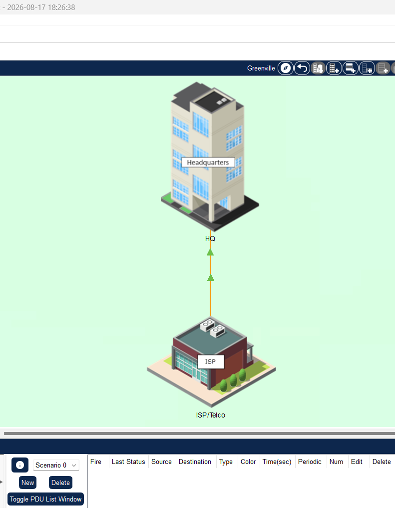
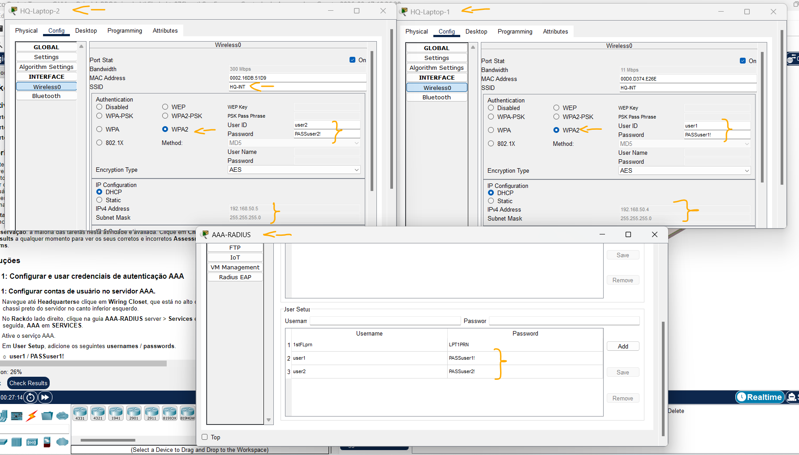
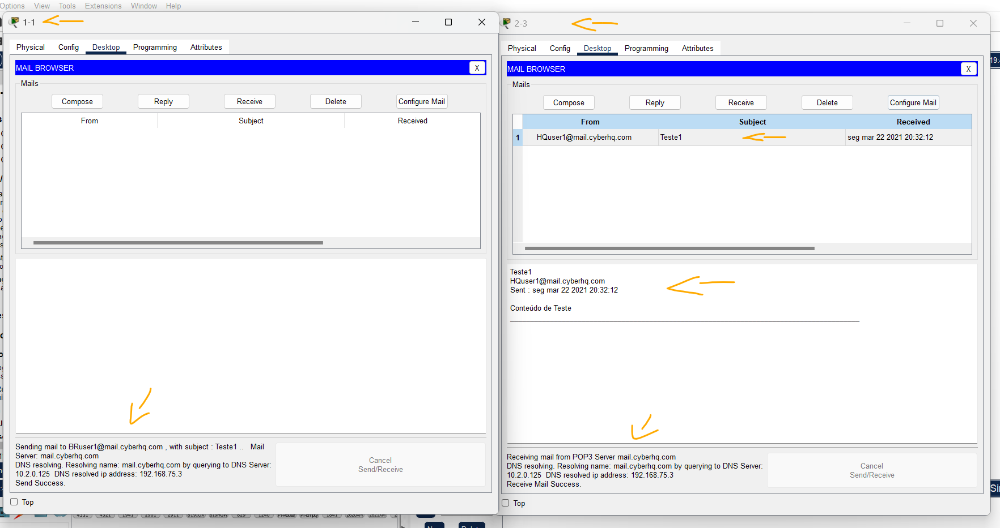
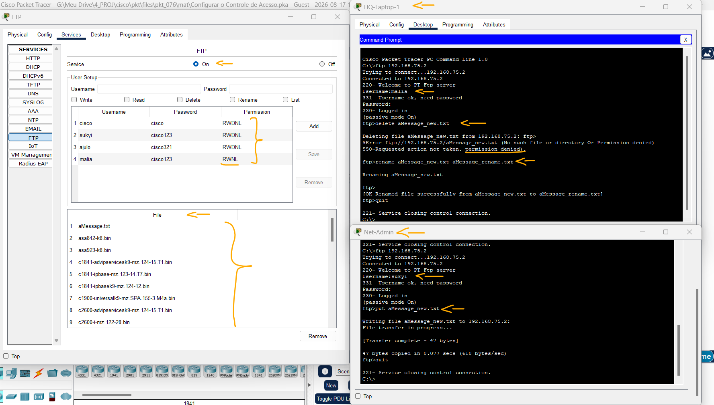

# Packet Tracer - Configure o Controle de Acesso   

### Cisco: <a href="../../../">cisco   </a>
### Cisco Networking Academy: cna   </a>
### Training Category: <a href="../../../pkt/">pkt</a>
### Software/Subject: network   </a>
### Course: <a href="./">pkt_076 (Packet Tracer - Configure o Controle de Acesso)   </a>

---

### Theme:
- Network

### Used Tools:
- Operating System (OS): 
  - Windows 11 
- Cloud Services:
  - Google Drive 
- Language:
  - HTML   
  - Markdown   
- Integrated Development Environment (IDE) and Text Editor:
  - Visual Studio Code (VS Code)   
- Versioning: 
  - Git   
- Repository:
  - GitHub   
- Network:
  - Cisco Packet Tracer   
  - ipconfig   
  - ping   

---

<h3><a name="item00">Course Strcuture:</a></h3>

1. <a href="#item01">Parte 1: Configurar e usar credenciais de autenticação AAA</a> 
  1.1 <a href="#item01.01">Etapa 1: Configurar contas de usuário no servidor AAA.</a> 
  1.2 <a href="#item01.02">Etapa 2: Configure a autenticação wireless no HQ-Laptop-1.</a> 
  1.3 <a href="#item01.03">Etapa 3: Configure a autenticação wireless no HQ-Laptop-2.</a> 
2. <a href="#item02">Parte 2: Configurar e Verificar Serviços de E-mail</a> 
  2.1 <a href="#item02.01">Etapa 1: Ativar os serviços de e-mail e configurar contas de usuário de e-mail.</a> 
  2.2 <a href="#item02.02">Etapa 2: Configure os clientes de e-mail</a> 
  2.3 <a href="#item02.03">Etapa 3: Enviar um e-mail como Suk-Yi.</a> 
3. <a href="#item03">Parte 3: Configurar e usar serviços de FTP</a> 
  3.1 <a href="#item03.01">Etapa 1: Ative o serviço FTP.</a> 
  3.2 <a href="#item03.02">Etapa 2: Criar as contas de usuário de FTP.</a> 
  3.3 <a href="#item03.03">Etapa 3: Transferir arquivos entre o Net-Admin e o servidor FTP.</a> 
  3.4 <a href="#item03.04">Etapa 4: Verificar se os privilégios de usuário do FTP estão funcionando conforme configurado.</a> 

---

### Objective:
O objetivo desta atividade foi analisar o funcionamento das transmissões em broadcast em uma rede local e demonstrar como a segmentação da rede em sub-redes melhora sua eficiência, dividindo um único domínio de broadcast em três domínios menores.

### Folder Structure:
- [README.md](./README.md): Este documento de README, escrito em **Markdown**, com o conteúdo do laboratório.
- [0-aux](./0-aux/): Pasta auxiliar com imagens utilizadas na construção dos arquivos de README desse curso.

### Development:

<a name="item01"><h4>1. Parte 1: Configurar e usar credenciais de autenticação AAA</h4></a>[Back to summary](#item00)

A imagem 01 mostra a topologia inicial.

<figure>
     
    <figcaption>Imagem 01.</figcaption>
</figure>
 

<a name="item01.01"><h4>1.1 Etapa 1: Configurar contas de usuário no servidor AAA.</h4></a>[Back to summary](#item00)

<a name="item01.02"><h4>1.2 Etapa 2: Configure a autenticação wireless no HQ-Laptop-1.</h4></a>[Back to summary](#item00)

A imagem 02 exibe a criação da PDU ICMP, bem como, o processo ARP realizado.

<figure>
     
    <figcaption>Imagem 02.</figcaption>
</figure>
 

<a name="item01.03"><h4>1.3 Etapa 3: Configure a autenticação wireless no HQ-Laptop-2.</h4></a>[Back to summary](#item00)

<a name="item02"><h4>2. Parte 2: Configurar e Verificar Serviços de E-mail</h4></a>[Back to summary](#item00)

<a name="item02.01"><h4>2.1 Etapa 1: Ativar os serviços de e-mail e configurar contas de usuário de e-mail.</h4></a>[Back to summary](#item00)

<a name="item02.02"><h4>2.2 Etapa 2: Configure os clientes de e-mail</h4></a>[Back to summary](#item00)

A imagem 03 mostra que os dois hosts das novas redes obtiveram seus respectivos endereços IP. A renovação do endereçamento foi realizada de três formas distintas: pela interface de linha de comando (CLI), utilizando o comando `ipconfig /renew`; pela aba IP Configuration; e pela aba Config, alternando a configuração de endereçamento de estático para automático (DHCP).

<figure>
     
    <figcaption>Imagem 03.</figcaption>
</figure>
 

<a name="item02.03"><h4>2.3 Etapa 3: Enviar um e-mail como Suk-Yi.</h4></a>[Back to summary](#item00)

<a name="item03"><h4>3. Parte 3: Configurar e usar serviços de FTP</h4></a>[Back to summary](#item00)

<a name="item03.01"><h4>3.1 Etapa 1: Ative o serviço FTP.</h4></a>[Back to summary](#item00)

<a name="item03.02"><h4>3.2 Etapa 2: Criar as contas de usuário de FTP.</h4></a>[Back to summary](#item00)

<a name="item03.03"><h4>3.3 Etapa 3: Transferir arquivos entre o Net-Admin e o servidor FTP.</h4></a>[Back to summary](#item00)

<a name="item03.04"><h4>3.4 Etapa 4: Verificar se os privilégios de usuário do FTP estão funcionando conforme configurado.</h4></a>[Back to summary](#item00)

A imagem 04 ilustra a solicitação ARP sendo propagada apenas dentro de um domínio de broadcast menor, resultado da segmentação da rede em sub-redes.

<figure>
     
    <figcaption>Imagem 04.</figcaption>
</figure>
 